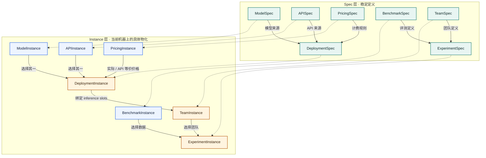

# LycheeMAS Eval 交接手册

> 最后更新：2026-08-16
> 适用范围：LycheeMAS v0.2 的 benchmark、Eval Studio、AutoGen runtime、评分与观测链路
> 阅读目标：让接手者理解当前系统，准备数据，装配并运行实验，分析结果，以及新增 benchmark

本文只描述**当前有效实现**。已经完成的迁移计划、逐轮调试记录和废弃方案不再保留在正文中；需要追溯时使用
Git 历史。代码与命令行 `--help` 是字段和参数的最终事实来源。

---

## 1. 先建立全局认识

### 1.1 Eval 的职责

LycheeMAS Eval 是一套通用评测基础设施，负责：

1. 注册 benchmark、模型、API 和价格规则；
2. 准备 Raw 数据、生成 Prepared 数据并校验完整性；
3. 定义 TeamSpec、部署模型并把角色绑定到 DeploymentInstance；
4. 运行 AutoGen 多智能体推理；
5. 持续记录 GroupChat、模型调用、工具执行和服务指标；
6. 使用 benchmark 自己的评分逻辑离线评分；
7. 汇总质量、token、延迟、工具和成本指标。

Eval **不是某一个研究项目的方法实现**。具体论文的策略、实验矩阵和结果解释应放在各自研究目录；LycheeMAS
只保留可复用的 Team、Deployment、Benchmark、Experiment 和观测能力。

### 1.2 当前能力快照

| 能力 | 当前状态 |
|---|---|
| Benchmark | 16 个 Benchmark 实现，23 个 runnable task |
| 推理后端 | Local HF；OpenAI-compatible API；本地 vLLM 通过同一 API client 接入 |
| AutoGen Team | `RoundRobinGroupChat`、`SelectorGroupChat`、`MagenticOneGroupChat` |
| 工具 | 文件浏览、网页浏览、代码生成、Docker 代码执行、benchmark 自定义工具 |
| 通信消融 | `none`、`nl_only`、`latent_only`、`both` |
| 数据 | Raw / Prepared 分层、来源注册、manifest、Raw 到 Prepared 恢复 |
| 运行 | 单次启动、持久队列、并发 case、重复采样、失败重试、断点续跑 |
| 观测 | console、GroupChat、spans、prediction、vLLM 指标、运行状态 |
| 评分 | 推理与评分解耦；benchmark-owned scorer；外部 evaluator |
| 成本 | API token 成本、本地 GPU 时间成本、API 等价成本 |

### 1.3 当前边界

以下限制必须在实验报告中如实说明：

- `latent_only/both` 需要 Local HF hidden-state 路径；API 和 vLLM 目前只支持文本/tool-call 推理。
- Local HF 单进程固定 `case_concurrency=1`；API/vLLM 可以并发。
- HLE 需要 judge 模型；SWE-bench Verified 需要官方 Docker harness；二者不能退化成普通 exact match。
- GAIA 的 WebSurfer 结果受网络、代理、Playwright 和目标网站状态影响。
- `Network=offline` 目前不是严格的宿主机、浏览器和 Docker 网络隔离证明。
- 模型 client 不支持 token/chunk streaming；终端的 start/done 是调用级日志。
- Local HF 不报告跨请求 prompt-cache 命中；provider 未返回 reasoning/answer token 时才用 tokenizer 补充观测。
- 自动成本只覆盖模型推理；CPU、RAM、存储、网络、付费搜索和 provider 特有费用不在自动金额内。

---

## 2. 系统如何工作

### 2.1 一条完整链路

```text
Benchmark 实现注册
  -> BenchmarkSpec
  -> BenchmarkInstance（Raw / Prepared / manifest）

ModelSpec 或 APISpec
  -> ModelInstance 或 APIInstance
  -> DeploymentSpec + PricingSpec
  -> DeploymentInstance

TeamSpec
  -> 角色 inference slots
  + DeploymentInstance bindings
  -> TeamInstance

ExperimentSpec（引用 BenchmarkSpec + TeamSpec）
  + BenchmarkInstance + TeamInstance
  -> ExperimentInstance
  -> launch plan / config snapshot
  -> run_mas.py 推理
  -> predictions.jsonl
  -> analyze_benchmark_run.py 评分
  -> outputs.jsonl + metrics.json
```

Eval Studio 是这条链路的可视化控制面。它调用同一套 Python registry、runner 和 scorer，不维护第二套评测逻辑。

### 2.2 推理和评分已经解耦

`scripts/run_mas.py` 只做推理：

- 读取 Prepared 数据；
- 构造 Team 和 runtime；
- 运行每个 `(case_id, k_index)`；
- 持续写日志和 spans；
- 写不含 gold/score 的 `predictions.jsonl`。

`scripts/analyze_benchmark_run.py --score-predictions` 做评分：

- 按 run 配置重新加载 gold；
- 调用所属 `Benchmark.score()` 或外部 evaluator；
- 写 `outputs.jsonl` 和 `metrics.json`。

因此推理中断后仍可检查轨迹；评分器更新后也可以在不重新推理的情况下 `--rescore`。

### 2.3 控制面和数据面

| 层 | 主要内容 | 典型目录 |
|---|---|---|
| 控制面 | Spec、Instance、队列、launch plan、健康状态 | `configs/eval_studio/`、`runs/eval_studio/` |
| 数据面 | benchmark 数据、模型、workspace、推理与评分结果 | `data/benchmarks/`、`models/`、`runs/benchmarks/` |

不要把 `runs/` 当配置注册表，也不要把一次运行的 endpoint、PID 或结果状态写进 Spec。

---

## 3. Spec 与 Instance 对象模型

### 3.1 最重要的规则

**Spec 描述稳定定义；Instance 描述一次具体物化。**

- Spec 可以引用另一个 Spec，但不能绑定某个具体 Instance。
- Instance 在实例化时选择上游 Instance，并保存上游 Spec 指纹。
- `registered` 只说明文件存在；`available/ready/running` 才说明当前可用。
- 上游 Spec 的行为字段改变后，旧 Instance 会因指纹不匹配而失效。
- 每次运行把使用到的 Spec 和 Instance 复制到 `config_snapshot/`，之后修改全局注册表不会改变旧 run。

### 3.2 七类核心对象

| 领域 | Spec | Instance | Instance 保存的具体事实 |
|---|---|---|---|
| Benchmark | `BenchmarkSpec` | `BenchmarkInstance` | Prepared 路径、Raw 来源、manifest、可运行 task、完整性状态 |
| 模型 | `ModelSpec` | `ModelInstance` | 本地模型路径、获取方式、完整性和可用状态 |
| API | `APISpec` | `APIInstance` | endpoint、model id、认证方式、凭据来源和请求限制 |
| 价格 | `PricingSpec` | `PricingInstance` | 被实例化的价格版本和指纹 |
| 部署 | `DeploymentSpec` | `DeploymentInstance` | source instance、运行后端、endpoint/PID、健康状态、价格实例 |
| 团队 | `TeamSpec` | `TeamInstance` | 每个 inference slot 到 DeploymentInstance 的绑定及生成覆盖项 |
| 实验 | `ExperimentSpec` | `ExperimentInstance` | BenchmarkInstance、TeamInstance、队列/启动状态和 run 目录 |

### 3.3 依赖方向



图中实线箭头 `A → B` 表示下游 `B` 依赖上游 `A`；虚线表示一个 Spec 被物化为对应 Instance。
`TeamSpec` 只定义 participants、GroupChat 和 inference slots，因此不直接引用 `DeploymentSpec`；
具体的 `DeploymentInstance` 在实例化 `TeamInstance` 时才绑定。

`ExperimentSpec` 只引用 `BenchmarkSpec` 和 `TeamSpec`；具体数据和后端由 `ExperimentInstance` 选择。这保证同一实验设计
可以复用在不同数据副本和不同部署上。

### 3.4 配置目录

```text
configs/eval_studio/
├── benchmarks/{specs,instances}/
├── models/{specs,instances}/
├── apis/{specs,instances}/
├── pricing/{specs,instances}/
├── deployments/{specs,instances}/
├── teams/{specs,instances}/
└── experiments/{specs,instances}/
```

`specs/` 可以提交通用、可复用定义。`instances/` 通常与具体机器、路径、凭据来源和运行状态有关，提交前必须逐项检查。
研究专属 ExperimentSpec/TeamInstance 也不应作为通用 Eval 功能提交。

---

## 4. Benchmark 统一合同

### 4.1 `Benchmark` 类负责什么

每个 benchmark 模块注册一个 `Benchmark` 对象。公共合同位于
`src/lychee_mas/eval/benchmarks/base.py`。

| 方法或属性 | 职责 |
|---|---|
| `prepare(target, force, source)` | 获取 Raw 数据，转换为 Prepared，并写完整性信息 |
| `load(task, n)` | 返回统一的 `BenchmarkCase` 记录 |
| `score(prediction, case, record)` | 使用该 benchmark 的 scorer 评一条 prediction |
| `aggregate(samples, metrics)` | 增加 benchmark 专属 run 聚合指标 |
| `materialize_case(...)` | 把附件、仓库或任务状态放入隔离 workspace |
| `create_tools(...)` | 创建 benchmark 自己的工具，例如 WorkBench 工具 |
| `collect_prediction(...)` | 从消息、文件或 patch 中收集最终 prediction |
| `prepare_evaluation(...)` | 运行 HLE judge、SWE-bench harness 等批量外部 evaluator |
| `descriptor()` | 向 Studio 暴露 sources、tasks、scorer、sandbox 和能力合同 |

来源声明也位于各 benchmark 模块，不再维护独立 `source_catalog.py/json`。标准来源顺序为
ModelScope、HuggingFace、GitHub，之后才是 `other_defaults()` 和 direct-file fallback。

### 4.2 `BenchmarkCase` 统一格式

```python
{
    "task": "gaia_validation",
    "kind": "gaia",
    "question": "...",
    "gold": "...",
    "context": None,
    "metadata": {"benchmark_id": "gaia", "case_id": "..."},
}
```

| 字段 | 用途 |
|---|---|
| `task` | 选择 loader、默认 extractor 和 runnable task |
| `kind` | 选择 scorer；同一 benchmark 可以有多个评分口径 |
| `question` | 输入给 Team 的主任务 |
| `gold` | 只供离线评分使用，不进入 agent workspace |
| `context` | 长对话、附件说明或其它补充上下文；无内容时写 `None` |
| `metadata` | case id、level、附件、来源和 benchmark id；新 loader 应始终提供 |

`task` 和 `kind` 不合并：一个 task 描述“加载哪组 case”，kind 描述“怎么评分”。多个 task 可以共享同一种 scorer。

### 4.3 四类容易混淆的名字

| 名称 | 回答的问题 | 使用位置 |
|---|---|---|
| Benchmark source / Spec ID | 这是哪个外部 benchmark？ | Studio、registry |
| Prepare target | 要准备哪份数据或哪个子集？ | `prepare_benchmarks.py --tasks` |
| Runnable task | 要让 `run_mas.py` 跑哪组 case？ | ExperimentSpec、`--task` |
| Kind / scorer | prediction 按什么规则评分？ | `BenchmarkCase.kind`、分析器 |

用下面的命令查看实时映射，不要手工猜名字：

```bash
python scripts/prepare_benchmarks.py --list-benchmark-sources
python scripts/prepare_benchmarks.py --list-prepare-targets
python scripts/prepare_benchmarks.py --list-runnable-tasks
python scripts/prepare_benchmarks.py --list-benchmark-structure
python scripts/prepare_benchmarks.py --list-download-sources
```

### 4.4 当前注册表

| BenchmarkSpec | Full prepare target | Runnable task | Kind / scorer |
|---|---|---|---|
| `gsm8k` | `gsm8k` | `gsm8k` | `exact` |
| `aime_2024` | `aime_2024` | `aime_2024` | `aime` |
| `arc_easy` | `arc_easy` | `arc_easy` | `mc` |
| `openbookqa` | `openbookqa` | `openbookqa` | `mc` |
| `medqa` | `medqa` | `medqa` | `mc` |
| `locomo10` | `locomo10` | `locomo10` | `f1` |
| `human_eval` | `human_eval` | `human_eval` | `human_eval` |
| `gaia` | `gaia` | `gaia_validation`、`gaia_validation_level_1/2/3` | `gaia` |
| `aftraj` | `aftraj` | `aftraj_audit`、`aftraj_audit_test` | `mas_audit` |
| `agent_collab` | `agent_collab` | `agent_collab_idr/rtd/cpr/clc` | 四种 MAS 协作 scorer |
| `mast_data` | `mast_data` | `mast_failure` | `mas_failure_taxonomy` |
| `open_agent_traces` | `open_agent_traces` | `open_agent_traces` | `mas_deviation` |
| `bbeh` | `bbeh` | `bbeh` | `bbeh` |
| `hle` | `hle` | `hle` | `hle` |
| `swe_bench_verified` | `swe_bench_verified` | `swe_bench_verified` | `swe_bench_verified` |
| `workbench` | `workbench` | `workbench` | `workbench` |

GAIA 的 `gaia` target 只表示准备全量资源；公开可运行 task 是 validation 及其三个 level。AgentCollabBench 的四个
task 必须分开报告，因为它们分别测 instruction decay、tracer durability、consensus pollution 和 context leakage。

### 4.5 Benchmark 和 Team 解耦

Benchmark 不选择 Team。`benchmark_requirements.py` 只给出非强制的能力要求和建议 RoleProfile；真正使用哪个
TeamSpec 由 ExperimentSpec 决定。

这意味着：

- GAIA 通常配 Magentic-One Team，但可以有别的合法 TeamSpec 对照；
- HLE 的 scorer 不依赖某个固定 Team；
- 同一 TeamSpec 可以跑多个兼容 benchmark；
- 改 Team 不应修改 loader 或 scorer。

---

## 5. 环境与 Eval Studio

### 5.1 默认环境

仓库默认环境以 README 为准：conda 提供 Python/CUDA 工具链，仓库 `.venv` 管理项目依赖。

```bash
conda activate LycheeMAS
source .venv/bin/activate
uv pip install -e ".[benchmark,studio]"
python -m playwright install chromium
```

已有服务器可以使用其它已验证 Python，但必须在 Environment 页面或 ExperimentSpec 中明确保存解释器路径。环境检测只检查
Python、核心 import、benchmark registry、scorer 和 runtime 依赖；它不要求本机恰好已经下载 GSM8K 或其它数据。

### 5.2 启动 Studio

```bash
./serve_eval_studio.sh build
./serve_eval_studio.sh -H 127.0.0.1 -p 8010
```

前端需要 Node.js `^20.19` 或 `>=22.12`。可以通过 `LYCHEE_NODE_HOME` 指定兼容 Node。远程服务器建议只监听
`127.0.0.1`，在本机建立 SSH 隧道：

```bash
ssh -N -L 18010:127.0.0.1:8010 user@server -p PORT
```

随后访问 `http://127.0.0.1:18010/`。若本机端口被占用，更换左侧 `18010`；若 SSH Host 配置了
`ClearAllForwardings yes`，增加 `-o ClearAllForwardings=no`。

### 5.3 页面顺序

```text
运行环境
  -> 资源中心（Benchmark / Model / API）
  -> 成本管理
  -> 部署管理
  -> 团队管理
  -> 实验管理
  -> 运行记录
```

推荐按这个顺序操作。下游下拉框只显示已实例化且通过相应校验的上游对象。

---

## 6. 数据准备

### 6.1 三个根目录

| 根目录 | 默认值 | 含义 |
|---|---|---|
| `LYCHEE_BENCHMARK_RAW_ROOT` | `data/benchmarks/raw` | 按 provider/source 保存上游原始文件 |
| `LYCHEE_BENCHMARK_PREPARED_ROOT` | `data/benchmarks/prepared` | 统一转换后的 loader-ready 数据 |
| `LYCHEE_BENCHMARK_RUNS_ROOT` | `runs/benchmarks` | 推理、评分和配置快照 |

Raw 保存来源事实；Prepared 保存当前 loader 能直接读取的结构。运行 benchmark 时优先从 Prepared 读取。对于无需复杂转换的
数据，Prepared 仍应是显式副本或规范化输出，不使用 symlink。

外部本地数据由 `BenchmarkInstance.raw_path/prepared_path` 直接记录，外部模型同理由
`ModelInstance.path` 直接记录。两者都不再维护独立的 `references.json`：Instance 本身就是唯一事实来源，
`managed=false` 表示注销 Instance 时保留真实文件。`provenance` 只保存来源审计信息，不参与路径解析。

运行时总是把所选 `BenchmarkInstance.prepared_path` 注入 loader；本地 Raw 转换只把本次
`raw_path` 作为 prepare 子进程参数传入，不创建第二份持久化引用记录。因此不会出现 Instance 已删除、
但另一张引用表仍让 Catalog 误判数据存在的状态漂移。

### 6.2 常用准备命令

准备一个 benchmark：

```bash
python scripts/prepare_benchmarks.py \
  --tasks gaia \
  --source auto
```

准备所有 benchmark 的 canonical/full target：

```bash
python scripts/prepare_benchmarks.py \
  --all-full-benchmarks \
  --source auto
```

显式指定根目录：

```bash
python scripts/prepare_benchmarks.py \
  --raw-root data/benchmarks/raw \
  --prepared-root data/benchmarks/prepared \
  --tasks gsm8k,gaia \
  --source auto
```

Raw 已存在、Prepared 被删除时，只做转换：

```bash
python scripts/prepare_benchmarks.py \
  --tasks gaia \
  --conversion-only
```

验证已有 manifest：

```bash
python scripts/prepare_benchmarks.py \
  --tasks gaia \
  --verify-manifests
```

### 6.3 来源选择

`--source auto` 按 benchmark 自己注册且验证过的顺序选择来源。也可以强制：

```text
--source modelscope
--source huggingface
--source github
```

不同发布者可能有不同 schema、split 或文件集合，因此每个 provider/source 必须由对应 benchmark 模块完成转换和 ready
检查；不能只把一个新的 repo id 填进列表就认为兼容。

下载通常复用 provider cache，支持 provider 自身的断点续传。`--force` 表示重新获取；它不应是修复 Prepared 缺失的首选，
Raw 完整时应使用 conversion-only。

### 6.4 完整性和 manifest

prepare 完成后会验证 loader 所需文件和最小 schema，并写 manifest。两种 hash 模式：

| 模式 | 代价 | 用途 |
|---|---|---|
| `full` | 遍历文件并计算 SHA-256 | 正式归档、强完整性验证 |
| `metadata` | 只记录路径、大小和 mtime | 大数据的快速日常检查 |

完整性检查证明“本地数据可被当前 loader 使用”，不自动证明第三方镜像与论文原版逐字一致。正式发布应额外固定 revision
和必要的上游 checksum。

### 6.5 Benchmark Docker 镜像

prepare 同时管理 benchmark-owned runtime resource：

- HumanEval：代码执行沙盒；
- GAIA：AgBench 对齐的 base + GAIA requirements 镜像；
- SWE-bench Verified：官方 harness/image 在评分阶段使用。

```bash
# 选中的 benchmark 需要时自动构建
python scripts/prepare_benchmarks.py --tasks gaia --docker-images auto

# 构建所有已注册 benchmark 镜像
python scripts/prepare_benchmarks.py --tasks gaia --docker-images always

# 只准备数据
python scripts/prepare_benchmarks.py --tasks gaia --docker-images never
```

构建会比较 image profile、schema version 和 source fingerprint；一致时复用，不一致时重建。需要网络时使用显式 Docker
build proxy 参数，不把个人代理写入仓库配置。

---

## 7. Deployment、Team 与 Experiment

### 7.1 Deployment

| 后端 | 适用场景 | 关键事实 |
|---|---|---|
| Local HF | hidden-state、latent/CDM 消融、单卡直接推理 | 一个进程一个模型实例；case concurrency 为 1 |
| 本地 vLLM | 高吞吐文本、视觉和 tool-call 推理 | 由 DeploymentSpec 管理 TP/DP、`max_num_seqs`、context 和 endpoint |
| 云 API | 无本地 GPU 或使用闭源模型 | 受 provider quota、rate limit、token 账单和返回字段影响 |

DeploymentSpec 定义如何部署；DeploymentInstance 是已启动或可在 run 时使用的具体服务。实例化时会做最小调用探测，验证
endpoint、认证和基础响应。Role Binding 必须选择 DeploymentInstance，不是 DeploymentSpec。

本地 vLLM 的三层并发不要混用：

| 参数 | 控制层级 |
|---|---|
| `case_concurrency` | runner 同时推进多少个 case |
| client `max_concurrency` | 单个实验进程允许多少个在途请求 |
| vLLM `max_num_seqs` | 每个 vLLM replica 同时调度多少条 sequence |

是否继续增加并发应看 queue、TTFT、TPOT、KV cache、preemption、浏览器/工具错误和端到端吞吐，不能只看 GPU 利用率。

### 7.2 TeamSpec

TeamSpec 描述团队逻辑，不包含具体模型部署：

```text
participants
group_chat
termination
model_context / controller_model_context
inference_slots
extensions
```

当前支持三种 AutoGen GroupChat：

| 类型 | 下一角色如何确定 | Controller |
|---|---|---|
| `round_robin` | 按 participant 顺序轮询 | 无独立模型 controller |
| `selector` | Python `selector_func`，或模型从候选 participant 中选择 | 模型选择时有 `Selector` slot |
| `magentic_one` | AutoGen Magentic-One ledger 规划和复盘 | 有 `Orchestrator` slot |

Selector 和 Orchestrator 不是普通 participant，但都是真实模型调用者，因此作为 controller inference slot 与其它角色一样绑定
DeploymentInstance，也可以设置自己的生成覆盖项。

`context_visibility=shared` 使用 AutoGen GroupChat 共享历史。`topology_filtered` 是 LycheeMAS 的显式扩展，通过 AutoGen
`MessageFilterAgent` 按 source policy 过滤可见消息；它不是默认行为。

### 7.3 TeamInstance

TeamInstance 只做一件事：把 TeamSpec 的每个 inference slot 绑定到具体 DeploymentInstance。

每条 binding 可以覆盖：

- thinking mode 和 thinking budget；
- `max_new_tokens`；
- temperature、top-p、top-k、min-p；
- presence/repetition penalty；
- 历史 reasoning 是否保留。

未覆盖的字段使用 DeploymentSpec/ExperimentSpec 的有效默认值。最终解析后的配置必须出现在 run 的 config snapshot 和
`model_call_start` span 中。

### 7.4 ExperimentSpec 与 ExperimentInstance

ExperimentSpec 描述可复用实验配方：

- BenchmarkSpec、runnable task、case 范围和 scoring profile；
- TeamSpec；
- runtime、network 和 environment 策略。

ExperimentInstance 再选择 BenchmarkInstance 和 TeamInstance，并保存队列、launcher、launch id 与 run dir。

默认 run 目录结构：

```text
<runs_root>/<benchmark_spec_id>/<task>/<team_spec_id>/<method>/<experiment_spec_id>/<UTC_timestamp>
```

也可以在实例化时设置精确 `run_dir`。不要把 model id 放在路径的固定层级，因为同一个 TeamInstance 可以绑定多个模型。

### 7.5 关键运行参数

| 参数 | 层级 | 含义 |
|---|---|---|
| `cases` / `--n` | run | 选多少个 case；`all` 或 `0` 表示全量 |
| `start_index` | run | 从 loader 的第几个 case 开始，0-based |
| `samples` | case | 每个 case 独立生成 K 个 prediction；用于 pass@K/best-of-K |
| `seed` | prediction | 与 case id、k index 派生稳定 prediction seed |
| `case_concurrency` | run | 同时执行多少个 `(case_id,k_index)` 工作单元 |
| `max_case_retries` | prediction | runtime 异常后的额外整轨迹重试次数 |
| `on_case_error` | run | 全部 retry 失败后继续，或 fail-fast |
| `max_rounds` | team 默认 | RoundRobin 未显式设置 max turns 时，默认上限为 participant 数 × rounds；Selector/Magentic-One 默认 20 turns |
| `max_turns` | case / GroupChat | 每个 case 最大发言步数，可以提前终止 |
| `max_model_calls_per_case` | case | 整个 prediction 允许的真实模型调用硬上限；retry 共享剩余额度；可不限制 |
| `max_new_tokens` | model call | 单次调用最多输出多少 token，不代表一定生成到上限 |
| `max_input_tokens` | model call | 单次调用最多保留多少输入 token |
| `code_timeout` | tool call | 单次代码执行超时 |

`samples` 与 `max_case_retries` 不同：前者是需要保留和评分的独立 prediction；后者只是同一 prediction 遇到运行异常后的恢复。

### 7.6 Token 和采样

长度预算按下面的约束共同决定：

```text
context_window
  >= effective_input_tokens
   + effective_max_output_tokens
   + safety_margin_tokens
```

`min_output_reserve_tokens` 为总输出留底，`min_thinking_reserve_tokens` 为 reasoning 留底，
`min_final_reserve_tokens` 为最终答案留底，`max_thinking_budget_tokens` 只在 provider 原生支持时作为 reasoning 硬上限。
输入过长时按完整消息边界裁剪；不会切半条 tool call 或多模态消息。

采样字段 `do_sample/temperature/top_p/top_k/min_p` 必须按模型官方建议和实验协议显式冻结。`samples>1` 通常应开启
sampling；固定 `seed` 只保证在相同软件、硬件、调度和采样实现下尽可能复现，不保证跨 provider 位级一致。

### 7.7 四种通信 method

| method | NL 消息 | latent prefix | 适用范围 |
|---|---:|---:|---|
| `none` | 否 | 否 | 无 CDM 注入基线 |
| `nl_only` | 是 | 否 | 只传自然语言记忆 |
| `latent_only` | 否 | 是 | 只传 latent；当前需要 Local HF |
| `both` | 是 | 是 | 两通道同时开启；当前需要 Local HF |

method 是整个 run 的路由消融策略；每条边实际注入什么仍由 RoutingContext、router 和可用能力决定。

### 7.8 Smoke 的定义

Smoke 只减少 case 数量。正式 scorer、TeamSpec、工具、prompt、Docker、采样和运行参数都应与正式实验一致。为了调试而关闭
工具、换 scorer 或缩短生成上限的结果应标为 debug，不应称作正式 smoke。

---

## 8. 运行与续跑

### 8.1 推荐：从 Studio 运行

1. 检测环境；
2. 实例化 Benchmark、Pricing、Deployment 和 Team；
3. 创建 ExperimentSpec；
4. 实例化 ExperimentInstance；
5. 选择立即运行或加入队列；
6. 在实例卡片和运行记录查看持久化进度；
7. 推理结束后执行评分分析。

队列状态保存在 Instance 和 launch 目录，不依赖浏览器页面持续打开。关闭网页后重新进入，Studio 会读取
`job.json`、`run_status.json` 和进程状态恢复显示。

### 8.2 CLI 运行

Studio 会生成完整命令和 resolved runtime config。手工运行时优先使用这个快照：

```bash
python scripts/run_mas.py \
  --config path/to/runtime_config.yaml \
  --task gaia_validation \
  --n 10 \
  --run-dir runs/benchmarks/manual/gaia-smoke
```

本地 vLLM 在 CLI 中仍走 `backend=api`，由 deployment config 提供 endpoint 和能力；不要另写一套 vLLM runner。

查看参数的唯一完整列表：

```bash
python scripts/run_mas.py --help
python scripts/analyze_benchmark_run.py --help
```

### 8.3 断点续跑

```bash
python scripts/run_mas.py \
  --config path/to/runtime_config.yaml \
  --run-dir runs/benchmarks/manual/gaia-smoke \
  --resume
```

续跑行为：

- 已成功的 `(case_id,k_index)` 跳过；
- error 或缺失 prediction 重跑；
- `console_log.txt`、`spans.jsonl`、`group_chat.jsonl` 追加；
- span/event 序号从旧文件最大值继续；
- `run_status.json` 刷新当前累计状态；
- 旧 error prediction 会备份或从有效集合中移除，避免重复计分。

只改代码后直接 `--resume` 可能混合两种实现。正式实验应保留 git SHA/config snapshot，并在行为变化后新建 run。

### 8.4 停止与清理

从 Studio 停止 ExperimentInstance 时必须终止 launcher 进程组，并更新持久化状态。删除 Instance 文件不是停止进程的替代品。
工具 workspace 可能包含 Docker 以 root 写出的文件；代码已尽量使用宿主用户 UID。若历史目录仍无法删除，应先确认没有运行中
容器，再处理文件归属，不能用广泛的 `sudo rm -rf` 清理整个 `runs/`。

---

## 9. 运行产物与观测

### 9.1 文件生命周期

| 文件 | 何时写 | 作用 |
|---|---|---|
| `config.yaml` | run 启动时 | runner 实际解析后的配置 |
| `config_snapshot/` | Studio launch 前 | 本次使用的所有 Spec/Instance 不可变副本 |
| `console_log.txt` | 运行中持续追加 | 终端 stdout/stderr 镜像 |
| `run_status.json` | 启动及每个 prediction 后原子更新 | 总数、成功、错误、缺失、当前状态和累计墙钟 |
| `spans.jsonl` | 运行中逐事件追加 | case、模型、工具、runtime、网络和 executor 诊断 |
| `group_chat.jsonl` | AutoGen stream 期间追加 | 角色消息、工具事件和 GroupChat start/end/error |
| `predictions.jsonl` | 每个 prediction 完成或失败后追加 | inference-only 结果，不含 gold/score |
| `vllm_metrics.jsonl` | 启用采集时周期写入 | 服务级 queue、KV cache、preemption 和吞吐时间线 |
| `outputs.jsonl` | 离线评分后 | prediction + gold + score + score details |
| `metrics.json` | 离线评分后 | run 聚合质量、效率、工具和成本指标 |

`launch_dir` 位于 `runs/eval_studio/launches/<launch_id>`，保存 launcher 自己的 `job.json`、`launch.log` 和
`runtime_config.yaml`；`run_dir` 保存实验数据。二者用途不同。

### 9.2 `spans.jsonl`

主要 span 类型：

| 类型 | 说明 |
|---|---|
| `run_start/run_end` | run 边界和 resolved 参数 |
| `case_start/case_end/case_error` | case 级墙钟、消息、模型调用和工具汇总 |
| `case_attempt_start/case_attempt_error` | retry 级边界 |
| `model_call_start` | role、turn、输入 token 预算、generation 参数和部署 id |
| `model_call_end` | provider payload、输出、usage、queue/TTFT/generation/wall timing |
| `model_call_error` | provider/runtime 模型调用异常 |
| `tool_request/tool_execution/tool_agent_error` | 工具请求、真实执行和 agent 层错误 |
| `runtime_start/runtime_end/runtime_error` | AutoGen runtime 边界 |
| `executor_start/executor_end` | Docker/local executor 生命周期 |
| `resume_start/case_skip` | 断点续跑行为 |

`trace_detail_level` 两种模式只在 `model_call_start` 有一个差别：

- `compact`：不复制三层完整输入消息；
- `full`：额外保存 `autogen_model_messages`、`role_visible_messages`、`backend_messages`。

其它 span、provider response、输出、token、延迟和错误字段一致。两种模式都保存真实内容，不改成 hash/reference。
GroupChat 始终单独保存在 `group_chat.jsonl`。

### 9.3 模型输入输出口径

一次模型调用的输入会经过：

```text
AutoGen serializable message objects
  -> role 可见性 / MessageFilterAgent
  -> CDM memory 与 latent 注入
  -> backend messages
  -> provider payload 或 Local HF chat template
  -> token IDs / tensor input
```

API/vLLM 的 `provider_response_payload` 保存 provider 原始响应；Local HF 构造同形的规范化 payload，标注其来源。
框架再从 payload 构造 AutoGen `CreateResult`。不做私有 JSON 修复，也不改写模型最终文本。

reasoning 和最终回答分别记录为 provider reasoning content 与 content。provider 只返回总 token 时，backend 可以预热 tokenizer
后补充 reasoning/answer token 观测，但必须标明统计来源，不能冒充 provider usage。

### 9.4 `group_chat.jsonl`

这是“Team 实际发生了什么”的事实来源：

- participant 和 controller 的 source；
- AutoGen message/event type；
- 文本、多模态和 tool-call content；
- model usage；
- GroupChat start/end/error。

Magentic-One Orchestrator 的 ledger 是 controller 内部结构化规划调用，不会作为普通 participant 发言逐条发布；它仍能在
model spans 中看到。不要用 GroupChat 行数推断模型调用总数。

---

## 10. 评分、指标与成本

### 10.1 评分命令

```bash
python scripts/analyze_benchmark_run.py \
  runs/benchmarks/path/to/run \
  --score-predictions
```

重新评分已有 outputs：

```bash
python scripts/analyze_benchmark_run.py \
  runs/benchmarks/path/to/run \
  --rescore \
  --rewrite-outputs
```

外部 evaluator 的模型、endpoint、worker 和 timeout 使用分析器对应参数或环境变量配置。`--external-evaluator=skip` 只适合
检查预测文件，不可作为 HLE/SWE-bench 正式成绩。

### 10.2 指标层级

| 层级 | 典型字段 | 含义 |
|---|---|---|
| Model call | input/cached/reasoning/answer tokens，queue、TTFT、generation、wall time | 一次模型请求 |
| Tool call | request、execution、agent error、latency、exit code | 一次工具交互 |
| Prediction | score、model calls、messages、tokens、case wall time | 一个 `(case_id,k_index)` |
| Case | pass@K/best-of-K、每 case 均值 | 合并同一 case 的 K 个 prediction |
| Run | accuracy/mean score、总量、均值、错误与成本 | 整个 ExperimentInstance |

`metrics.json` 的推荐字段：

| 字段 | 中文口径 |
|---|---|
| `num_predictions` | prediction 数量，等于 case 数乘每题采样数（扣除缺失） |
| `num_distinct_cases` | 不重复 case 数 |
| `mean_score` | scorer 返回分数的 prediction 均值 |
| `accuracy` | 仅二值 scorer 有值；正确 prediction 比例 |
| `pass_at_k` | 二值 scorer 且 K>1 时的 case 级 pass@K |
| `mean_input_text_tokens_per_case` | 每个 case 所有模型调用输入 token 之和的均值 |
| `mean_output_text_tokens_per_case` | 每个 case 所有模型调用输出 token 之和的均值 |
| `mean_model_latency_s_per_call` | 每次模型生成阶段耗时均值 |
| `mean_case_wall_time_s` | 每个 case 端到端墙钟均值，含模型、工具、排队和框架 |
| `mean_model_calls_per_case` | 每个 case 模型调用次数均值 |
| `mean_tool_calls_per_case` | 每个 case 有 typed result 的工具调用均值 |
| `mean_tool_errors_per_case` | 每个 case 工具错误均值 |

平均值必须写清分母。`total_case_wall_time_s` 在并发 run 中包含相互重叠的 case 区间，不能当作 run 真实墙钟，也不能直接
用于 GPU 计费。

### 10.3 Benchmark-owned scorer

| Benchmark | 正式评分原则 |
|---|---|
| GSM8K | 最终数字标准化匹配 |
| AIME 2024 | 数学答案解析与等价比较；缺正式依赖时失败，不做 smoke fallback |
| ARC/OpenBookQA/MedQA | 选项标准化后 multiple-choice accuracy |
| LoCoMo10 | 文本 F1 |
| HumanEval | 沙盒执行测试；报告 pass@K |
| GAIA | 官方短答案规范化；默认开启非干预污染审计 |
| BBEH | 任务专属确定性 evaluator |
| HLE | 官方结构化 judge |
| SWE-bench Verified | 官方 Docker harness 判断 resolved |
| WorkBench | 工具执行后的最终 state scorer |
| 严格 MAS 数据集 | 各自 taxonomy、F1 或规则 scorer |

不要为了统一接口把这些 scorer 全部改成 exact match。

### 10.4 成本

`metrics.json.costing` 包含：

| 字段 | 含义 |
|---|---|
| `actual_cost` | API 按 token；本地 HF/vLLM 按实际 run 墙钟 × 分配 GPU 数 × GPU 小时价格 |
| `api_equivalent_cost` | 本地部署按同模型参考 API 价格和真实 token 计算的对标金额 |
| `comparison` | 币种一致且 usage 完整时的差额、节省额和成本比率 |
| `failed_model_calls_without_usage` | provider 失败且没有完整 usage 的调用数 |

失败请求缺 usage 时，token 金额标为 lower bound；GPU 时间成本仍覆盖等待时间。共享 vLLM 被多个实验同时使用时，不能把每个
run 的四卡墙钟成本直接相加，否则会重复计费；真实基础设施成本应按 DeploymentInstance 服务存活区间计一次。

### 10.5 GAIA 污染审计

默认审计只观察，不改题、不改 prompt、不拦截浏览：

- workspace 使用随机 opaque id；
- 附件名不暴露原始 case UUID；
- 记录 URL、query、文件访问和历史 runs 访问；
- 标记 exact UUID、答案页和高风险路径命中。

官方公开 validation 仍可能在网页中出现答案。报告 GAIA 结果时应同时给出 contamination audit 统计，不能静默删除命中 case。

---

## 11. 特殊 Benchmark 运行说明

### 11.1 HumanEval

- loader 提供 prompt、entry point 和测试；
- Coder 生成实现，ComputerTerminal 在隔离容器中执行；
- prediction 收集代码实现；
- scorer 在沙盒运行测试并计算 pass@K；
- gold tests 不进入 agent workspace。

### 11.2 GAIA

- validation 共 165 题，可按 Level 1/2/3 loader 运行；
- Magentic-One Team 通常包含 Orchestrator、FileSurfer、WebSurfer、Coder 和 ComputerTerminal；
- case workspace 只包含该题可见附件；
- 网页、文件、多模态和代码工具属于正式流程，不能在 smoke 中关闭；
- 沙盒按 AgBench GAIA requirements 构建，不因某一道题临时永久扩充镜像；
- 最终使用 GAIA 短答案 scorer，并保留网络和污染诊断。

### 11.3 BBEH 与 HLE

BBEH 使用各 task 的确定性 evaluator。HLE 可能包含图片，TeamInstance 必须绑定 vision-capable DeploymentInstance；评分时使用
官方结构化 judge。没有 HLE 授权数据或 judge 配置时应明确失败。

### 11.4 SWE-bench Verified

生成阶段只把 issue 和 base commit 工作区给 agent，不暴露 `patch/test_patch/FAIL_TO_PASS/PASS_TO_PASS`。评分阶段使用官方
Docker harness。生成沙盒通过不等于 resolved；最终以 harness 为准。

### 11.5 WorkBench

WorkBench 的工具修改 case-local workplace state，prediction 来自执行后的最终状态。它需要 native tool calls；把模型文本直接
做 exact match 不构成 WorkBench 评测。

---

## 12. 如何新增一个 Benchmark

### 12.1 实现步骤

1. 在 `src/lychee_mas/eval/benchmarks/<benchmark>.py` 定义 sources、prepare、load、score 和必要扩展；
2. 注册一个 `Benchmark`；
3. 在 `benchmarks/__init__.py` 导入模块，使 registry 可见；
4. 添加最小 `configs/eval_studio/benchmarks/specs/<id>.json`；
5. 在 `benchmark_requirements.py` 声明非强制能力要求和建议 Team；
6. 若需要专用 Team，单独添加 TeamSpec，不在 Benchmark 中绑定；
7. 增加 loader/scorer/prepare/descriptor 测试；
8. 运行 prepare、少量正式 smoke、离线评分和断点续跑验证；
9. 更新本手册的注册表和特殊运行说明。

### 12.2 最小 BenchmarkSpec

```json
{
  "schema_version": 4,
  "id": "my_benchmark",
  "name": "My Benchmark",
  "category": "reasoning"
}
```

Studio 显示的 sources、prepare targets、runnable tasks、scoring profiles、sandbox 和 network defaults 来自代码中的
`Benchmark.descriptor()`，不是在 JSON 里复制一遍。JSON 只保留注册身份。

### 12.3 Loader 要求

- 返回 `task/kind/question/gold/context/metadata`；
- 稳定 case id，不能依赖当前列表位置作为唯一身份；
- gold 和私有 evaluator 信息不能写进 question、workspace 或 agent-visible metadata；
- `n` 只裁剪返回数量，不改变样本内容；
- 外部附件路径必须在 materialize 阶段复制到 case 隔离 workspace；
- 多模态无法被当前 backend 表达时明确报错，不静默转成文本。

### 12.4 Scorer 要求

- 优先复用 benchmark 官方 evaluator；
- 返回至少一个数值 `score`，附带可解释 `score_details`；
- scorer 失败与 prediction 错误分开记录；
- 需要批量 judge/harness 时实现 `prepare_evaluation()`；
- 需要专属聚合时实现 `aggregate()`；
- smoke 与 full 使用同一个 scorer。

### 12.5 测试清单

```bash
python scripts/prepare_benchmarks.py --list-benchmark-structure
python scripts/prepare_benchmarks.py --tasks my_benchmark --source auto
PYTHONPATH=src pytest -q tests/test_eval_benchmark_extensions.py
ruff check src/lychee_mas/eval scripts/prepare_benchmarks.py scripts/analyze_benchmark_run.py
```

至少覆盖：注册、prepare ready check、Prepared 恢复、case schema、scorer 正反例、缺依赖错误、外部 evaluator 参数和
Studio descriptor。

---

## 13. 常见故障定位

| 现象 | 先检查 | 正确处理 |
|---|---|---|
| `not_downloaded` 但显示旧路径 | BenchmarkInstance 状态和路径是否仍存在 | 重新扫描或解除失效 Instance；不存在的路径不能显示为可用 |
| Raw 有、Prepared 无 | Raw manifest、provider/source、converter | 使用 `--conversion-only`，不要重新下载 |
| provider lock 长时间等待 | 同用户是否有下载进程、cache lock owner | 确认进程后等待或清理真正 stale lock；不要并发准备同一 source |
| Docker 尝试从公网 pull 本地镜像 | image tag/fingerprint、prepare 是否完成 | 用 prepare 构建并验证正确 tag，不靠临时改名 |
| `CodeExecutorAgent` approval warning | 是否在可信隔离容器内自动评测 | 正式无人值守 benchmark 可接受，但必须使用受控镜像和 workspace |
| `ffmpeg` warning | benchmark 是否真的包含音频 | GAIA 音频题需安装/提供 ffmpeg；纯文本题只是能力警告 |
| WebSurfer 超时 | 代理健康、DNS、Playwright、目标站、浏览器日志 | 分开归因 network/browser/site，不盲目增加模型 timeout |
| API `auth_required` | APIInstance 的 credential source/env | 配置环境变量或受控密钥输入；密钥不写入 Spec、日志或 git |
| Deployment `unreachable/starting` | health probe、PID、endpoint 和冷启动 | `starting` 可等待；`unreachable` 要看 launch log，不能当 running |
| Experiment 卡片不更新 | `job.json`、`run_status.json`、launcher PID | 重新扫描持久状态；不要只依赖前端内存 |
| 大量 `APITimeoutError` | queue、TTFT、generation speed、requested tokens | 使用自适应 request timeout，并检查服务饱和；不能只无限增大 timeout |
| 结果分数为空 | 是否只完成推理、有没有 outputs/metrics | 运行 `analyze_benchmark_run.py --score-predictions` |
| run 中途停止 | predictions 和 run_status 是否存在 | 使用同一 `run_dir --resume` |

排错顺序建议：

```text
run_status.json
  -> console_log.txt
  -> spans.jsonl
  -> group_chat.jsonl
  -> provider/launcher/Docker log
  -> predictions.jsonl
  -> outputs.jsonl / metrics.json
```

先确认错误发生在哪一层，再调整参数。模型答错、工具失败、网络失败、scorer 失败和基础设施失败不能混成一个“准确率低”。

---

## 14. 接手与发布检查

### 14.1 关键文件

| 位置 | 作用 |
|---|---|
| `src/lychee_mas/eval/benchmarks/base.py` | Benchmark 公共合同 |
| `src/lychee_mas/eval/benchmarks/registry.py` | Benchmark 注册表 |
| `src/lychee_mas/eval/benchmarks/*.py` | 各 benchmark 实现 |
| `src/lychee_mas/eval/studio/specs.py` | Spec/Instance 数据合同 |
| `src/lychee_mas/eval/studio/` | Studio registry、生命周期、队列和 API |
| `src/lychee_mas/runtime/backends/autogen_runtime.py` | AutoGen Team 和工具运行时 |
| `src/lychee_mas/runtime/backends/autogen_injection_client.py` | ModelClient、CDM 注入和调用观测 |
| `src/lychee_mas/runtime/token_budget.py` | context/output/thinking 预算 |
| `src/lychee_mas/runtime/spans.py` | span 写入合同 |
| `scripts/prepare_benchmarks.py` | 数据、manifest 和 Docker 准备入口 |
| `scripts/run_mas.py` | 正式推理入口 |
| `scripts/analyze_benchmark_run.py` | 评分与分析入口 |
| `scripts/serve_eval_studio.py` | Studio 服务入口 |
| `configs/eval_studio/` | 当前 Spec/Instance registry |

### 14.2 最小验收

```bash
# 1. 注册与数据结构
python scripts/prepare_benchmarks.py --list-benchmark-structure

# 2. 测试与静态检查
make selfcheck
make test
make lint

# 3. 文档
DISABLE_MKDOCS_2_WARNING=true mkdocs build --strict

# 4. Studio
./serve_eval_studio.sh build
./serve_eval_studio.sh -H 127.0.0.1 -p 8010
```

真实发布前还应选择至少：

- 一个纯文本 benchmark；
- 一个 Docker 代码 benchmark；
- 一个网页/文件工具 benchmark；
- 一个本地或 API DeploymentInstance；
- 一次中断后 resume；
- 一次离线 rescore；
- 一次成本快照检查。

### 14.3 提交边界

提交前检查：

- 不提交 API key、SSH key、代理订阅或个人凭据；
- 不提交 `data/`、`models/`、`runs/`、workspace、provider cache；
- 不提交个人研究的结果报告和专属实验矩阵；
- Spec 中不用个人绝对路径作为公共默认值；
- 新字段有 schema 校验、迁移策略或明确拒绝旧版本；
- 新 benchmark 使用官方 scorer，不因 smoke 引入降级；
- `make test`、`make lint`、`mkdocs build --strict` 通过。

---

## 15. 术语速查

| 术语 | 简短定义 |
|---|---|
| Benchmark | 可执行的 `prepare/load/score/aggregate` Python 实现 |
| BenchmarkSpec | Benchmark 在 Studio 中的最小注册身份 |
| BenchmarkInstance | 一份可用的本地 benchmark 数据物化 |
| TeamSpec | participant、GroupChat、context、termination 和 inference slots 的逻辑定义 |
| TeamInstance | TeamSpec 的每个推理 slot 到具体 DeploymentInstance 的绑定 |
| DeploymentSpec | 如何运行某个 ModelSpec/APISpec 的稳定部署定义 |
| DeploymentInstance | 已物化并经过健康检查的模型服务或本地 runtime |
| ExperimentSpec | BenchmarkSpec + TeamSpec + runtime/network/environment 的实验配方 |
| ExperimentInstance | 绑定具体数据和团队、可排队运行的一次实验 |
| Prediction | 一个 case 的第 k 次独立生成结果 |
| Attempt | 同一 prediction 因 runtime 异常触发的一次重试 |
| Span | 一次 case/model/tool/runtime 生命周期事件 |
| GroupChat | AutoGen participant/controller 之间的消息调度与 transcript |
| Smoke | 与正式协议相同、只减少 case 数的测试 |

遇到文档和代码不一致时，以以下顺序判断：公共 dataclass/validator、benchmark registry、CLI `--help`、测试，最后才是本手册。
