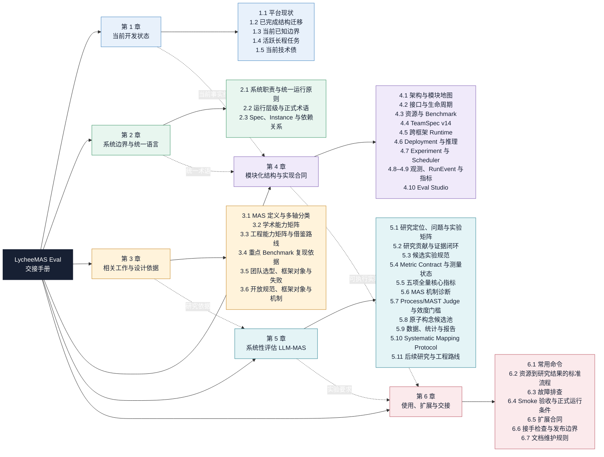

# LycheeMAS Eval 交接手册

> 最后更新：2026-08-29
>
> 工作目录：仓库根目录。本文中的 `configs/`、`data/`、`models/`、`runs/` 均为相对仓库根目录的路径。
>
> 目标：让接手者从系统边界、研究依据、模块合同、运行流程到论文实验形成一条连续路径。`EVAL_HANDOFF.md` 与 `eval_handoff/` 下的六章正文共同组成唯一维护中的 Eval 手册；一次性调试流水和过期运行快照不进入当前合同。

## 阅读导航

| 读者当前问题 | 建议阅读 |
|---|---|
| 现在做到哪里、有哪些长程任务和技术债 | [第 1 章：当前开发状态](eval_handoff/01-current-status.md) |
| Eval 到底评什么、Run/Trial/Event 等词是什么意思 | [第 2 章：系统边界与统一语言](eval_handoff/02-system-boundary.md) |
| 为什么选择这些 benchmark、团队形态和指标 | [第 3 章：相关工作与设计依据](eval_handoff/03-related-work.md)、[第 5 章：研究方案](eval_handoff/05-research-plan.md) |
| Spec/Instance、Team、Runtime、Scheduler、EventLog 如何实现 | 先进入[第 4 章索引](eval_handoff/04-implementation-contracts.md)，再按模块阅读；团队字段以 [TeamSpec v14](eval_handoff/04-team-spec-v14-contract.md) 为唯一权威合同 |
| 怎样启动、准备数据、运行、续测、排错和扩展 | [第 6 章：使用、扩展与交接](eval_handoff/06-operations-and-handoff.md) |

## 分章入口

| 章节 | 主要回答的问题 | 正文 |
|---|---|---|
| 1. 当前开发状态 | 当前完成了什么、已知边界是什么、接下来先处理什么 | [进入第 1 章](eval_handoff/01-current-status.md) |
| 2. 系统边界与统一语言 | Eval 负责什么，核心对象和术语如何统一 | [进入第 2 章](eval_handoff/02-system-boundary.md) |
| 3. 相关工作与设计依据 | 外部框架、论文和 benchmark 为设计提供了什么依据 | [进入第 3 章](eval_handoff/03-related-work.md) |
| 4. 模块化结构与实现合同 | 各模块如何组织、交互和落到实际代码 | [进入第 4 章](eval_handoff/04-implementation-contracts.md) |
| 5. 系统性评估研究方案 | 要回答哪些研究问题，如何设计公平、可复现的实验 | [进入第 5 章](eval_handoff/05-research-plan.md) |
| 6. 使用、扩展与交接 | 如何安装、运行、续测、排错、扩展和验收 | [进入第 6 章](eval_handoff/06-operations-and-handoff.md) |

## 内容性质标签

手册只在容易混淆的关键位置使用以下四种标签，不给外部文献事实和普通说明强行分类：

| 标签 | 表示什么 | 能否视为当前系统保证 |
|---|---|---|
| **当前合同** | 当前代码、Schema、接口或运行规则应满足的稳定行为 | 可以，但仍以对应代码和测试为最终依据 |
| **历史事实** | 带日期、版本或 Run artifact 的既往观测，用于诊断和解释决策 | 不可以直接当作实时状态或当前性能 |
| **研究假设** | 尚需实验或人工校准验证的研究判断 | 不可以，应通过预注册实验检验 |
| **后续计划** | 尚未完成的工程或研究任务 | 不可以，完成后必须迁入当前合同或历史事实 |

## 文档结构总览

下图覆盖正文全部六章和所有二级章节。阅读顺序不是强制线性的：接手开发先看第 1、2、4、6 章，开展论文实验重点看第 3、5 章；任何研究结论最终都应回到第 4 章的实现合同和第 6 章的可复现流程。

本文不设置独立附录。术语表放在系统边界，字段合同放在所属模块，指标公式放在研究方案，命令和故障表放在使用与交接；这样定义和实现不会在正文与附录之间漂移。
