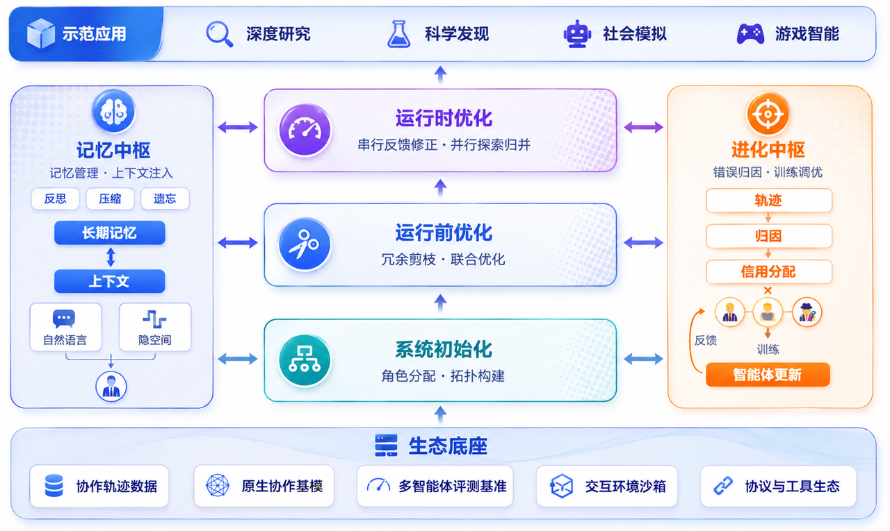

# LycheeMAS 团队入门与开发指南（ONBOARDING）

> 面向**每一位参与本项目的人**：我们要做什么、代码怎么读、按什么规则开发与协作。
> 三份文档的分工：本文是**入门与协作规范**；[`DESIGN.md`](DESIGN.md) 是**唯一架构设计文档**（接缝契约与组件全景）；仓库根 [`CLAUDE.md`](https://github.com/ecoli-hit/LycheeMAS/blob/LycheeMASv0.3/CLAUDE.md) 是**编码代理与日常操作规范**（命令、黄金法则、检查清单）。冲突时以 DESIGN/CLAUDE 为准并回来修本文。

---

<p align="center"></p>
<p align="center"><em>框架主图：中轴「系统初始化 → 运行前优化 → 运行时优化」对应 build / prerun / processing 接缝，左「记忆中枢」= memory，右「进化中枢」（轨迹→归因→信用→训练）= postrun；底部为数据/基模/评测/沙箱/工具的生态底座，顶部为示范应用。</em></p>

## 1. 项目目标

**LycheeMAS 是一个多智能体系统（MAS）研究框架**，回答一个问题：*如何把 MAS 领域的各种优化方法放进同一套可消融、可复现的实验体系里公平比较？*

核心思想：把整个 MAS 统一表示为一张带时序与记忆状态的有向图 **G=(V,E,W,T,M)**（V=智能体、E=通信边、W=边权、T=多轮时序、M=记忆状态）。**五个研究模块 = 五个挂载式接缝**，任何论文方法都变成"同一张图上一次可挂载的变换"——换方法 = 换一个 `method` 字符串，其余实验设置零改动。

三条具体目标：

1. **可消融的论文复现**：每个方法一个注册类，桩占名让消融矩阵在代码里可见。已复现：AgentPrune（ICLR 2025）、MASPO（ICML 2026）、AgentDropout（ACL 2025）、AggAgent（COLM 2026）、AgentInit（EMNLP'25）、GEPA。
2. **性能-成本联合度量**：所有评测同时报告 accuracy / token / latency，不许只报准确率。
3. **可复现**：固定种子、config 快照 + git SHA 落盘、离线可跑（无 GPU / 无 API key 也能跑通全部测试与 demo）。

代表性成果（MASPO × MATH-500 复现）：优化后 0.78→**0.85**（归一化口径 +7pt），并发现"免 gold 判官优化会漂移答案表面形式、评测端必须写法鲁棒"的方法学问题。

## 2. 项目总览

### 2.1 五接缝生命周期

一次任务的完整流程，任何一环不挂载即零回归直通：

```
build_langgraph(method)        构建：team 模板/选队器 → 契约 StateGraph
      │
optimize_langgraph(sg, method) 运行前：剪枝/提示优化改写图（optimize 离线产物化 / apply 即插即用）
      │
attach_memory(sg, method)      运行时：记忆注入包裹进 agent 节点（实现中）
      │
sg.compile() ──► runner        编译执行：每题跑图、组装 Trajectory
      │
run_processed(runner, method)  执行：serial 1 次 / parallel×K + 归约（pass@K 承载点）
      │
analyze_run / optimize_postrun / train_from_runs   运行后：归因 → 信用 → 闭环
```

### 2.2 三层设计（记住这一条就能读懂全仓库）

> **plugins/ 定义接缝（薄），methods/ 存方法（厚），backends/ 管怎么调 LLM。**

- `plugins/`：五接缝一缝一子目录。只放协议、统一入口、`method` 按名分发、返回校验、薄适配——不含任何论文级算法（<300 行/文件）。
- `methods/`：与 plugins 按接缝镜像。论文复现、训练循环、缓存执行器都在这里；注册装饰器 `@REGISTRY.register(category, name)` 打在实现类上。
- `backends/`：生成原语（本地 HF / OpenAI 兼容 API / spans 落盘）。methods 里的算法**不直接 import transformers/openai**，由脚本用本层构造 async 回调注入。

### 2.3 节点契约（五接缝互操作的唯一约定）

```python
sg.add_node(name, node_fn, metadata={"agent_spec": spec})   # spec: core.types.AgentSpec
# spec.system_prompt        可变异提示模板（{question}/{context} 占位）
# spec.meta["predecessors"] 通信前驱节点名列表（节点函数据此从 state 选 context）
# node_fn 运行时从 spec 读——闭包与元数据共享同一对象，优化器改 spec 即改执行行为
```

读写唯一通道 `plugins/prerun/graphview.py`（`extract_view` / `rebuild`）；只支持静态 DAG + 唯一终端，违反显式报错。

### 2.4 铁律（违反即返工，全文见 CLAUDE.md §3）

- **显式错误，禁止静默兜底**：不支持的输入/配置显式 raise，严禁写死数据造假阳性。
- **重依赖一律惰性导入**：`import lychee_mas` 与全部测试零重依赖（`make selfcheck` 必须 `HEAVY LOADED: NONE`）。
- **每个算法 = 注册一个类 + method 按名挂载**：新增方法不改任何 plugins/ 接口文件。
- **不提交密钥/大产物**：`runs/`、`*.jsonl`、`.env` 在 .gitignore；模型/数据路径走配置或环境变量。
- **整合外部论文代码**：保留原始引用与许可证（见 `methods/processing/aggagent/NOTICE.md` 范例），不整包搬仓库。

## 3. 项目结构

```
LycheeMAS/
├── src/lychee_mas/
│   ├── plugins/               ★ 接口层（薄）：五接缝，各自 base.py + __init__.py
│   │   ├── build/             构建：build_langgraph + AgentSelector/GraphBuilder 协议
│   │   ├── prerun/            运行前：optimize_langgraph + graphview 节点契约 + 薄适配×2
│   │   ├── memory/            运行时：attach_memory（实现中，显式桩）
│   │   ├── processing/        执行：run_processed + Processor/Aggregator 协议
│   │   └── postrun/           运行后：analyze_run + optimize_postrun + train_from_runs
│   ├── methods/               ★ 实现层（厚，与 plugins 镜像）
│   │   ├── build/             static 队伍模板、agentinit 选队（Pareto 多样性×相关性）
│   │   ├── prerun/            agentprune、agentdropout、maspo/、gepa/（+桩）
│   │   ├── memory/            channels{nl,latent,c2c} + managers{cdm} + routing + store/context
│   │   ├── processing/        serial / parallel + self_consistency / aggagent/（+dynamicagg 桩）
│   │   └── postrun/           attributor·credit 桩 + post_run_optimizer 桩 + TraceStore
│   ├── eval/                  评测：benchmarks（20 个）+ metrics（打分/落盘/pass@K）+ task_config
│   ├── core/                  地基：types.py（AgentSpec 等公共类型）+ registry.py（REGISTRY）
│   └── backends/              生成原语：hf_backend / openai_api_backend / spans
├── configs/                   按接缝分组 YAML（build/ prerun/ memory/ processing/ benchmarks…）
├── examples/                  01_five_seams_demo.py（make demo）、02_aggagent_e2e.py
├── scripts/                   实验入口（见 §5.3）
├── tests/                     pytest，全离线（LLM 一律脚本化）
└── docs/                      DESIGN.md + 本文 + plans/（方案与复现记录）+ 文档站
```

读代码的推荐顺序：`core/types.py`（10 分钟）→ `plugins/prerun/`（范式样板：base + graphview）→ 你要做的那一缝的 plugins 与 methods → `examples/01_five_seams_demo.py`（把五缝串起来）。

## 4. 各模块详细解读

### 4.1 build（构建）——「由谁组队、怎么连」

- 入口：`build_langgraph(method, node_factory, state_schema, team/agents, ...) -> StateGraph`。节点函数语义（生成后端、状态形状）由实验方以 `node_factory(spec, is_terminal)` 注入，构建器负责 AgentSpec 链、`meta["predecessors"]` 通信结构、元数据挂载与 START→…→END 边。
- 类别与方法：`graph_builder/static`（team 模板链，可跑）；`agent_selector/agentinit`（多样性×相关性 Pareto 选队，产出 AgentSpec 列表经 `agents=` 传入）。

### 4.2 prerun（运行前优化）——「执行前对图做什么」·范式样板

- 入口：`optimize_langgraph(sg, method, **kw) -> sg`，图进图出。两段式：`mode="optimize"` 离线跑训练（产物落 JSON/state 文件）；`mode="apply"` 加载产物注入图（即插即用）。**训练素材自给的方法，训练循环跟方法走**（都在 `methods/prerun/`）。
- 方法：`maspo`（联合提示优化：多粒度成对评估免 gold + 错位采样 + beam search + Beam Refresh + 断点续跑）；`agentprune`（时空掩码剪枝：REINFORCE 逐边 logit + one-shot 剪枝）；`agentdropout`（两阶段：逐轮节点淘汰 + 逐轮剪边，`round=r` 挂载 + `meta["dropped"]`）；`gepa`（optimizer 类别，图原生适配待接）。桩：`agentdropout_v2`、`agentvocab`。

### 4.3 memory（运行时记忆）——「记住什么、以什么表征传递」

- 入口：`attach_memory(sg, method, backend, **kw) -> sg`——把注入六步（observe→route→recall→注入→生成→记账）重包进每个 agent 节点。**当前为显式桩（P3 全新实现中）**；旧注入引擎语义见 git 历史 `runtime/injection.py`。
- 算法库（完整可用）：`channels/`（NL / 隐空间 soft_token / C2C KV 融合）+ `managers/`（`cdm` 双通道已实现；mem0/ama 桩）+ `routing/`（static/fixed 已实现；learned/soft_gate 桩）+ RoutingContext 决策日志。

### 4.4 processing（执行）——「跑几次、怎么归约」

- 入口：`run_processed(runner, method, k, aggregator, aggregator_kwargs) -> ProcessingResult`，`runner: async () -> Trajectory` 由调用方提供。pass@K 的承载点。
- 方法：`processor/serial`、`processor/parallel`（并发 K 次 + 聚合）；聚合器 `self_consistency`（多数投票）与 **`aggagent`**（AggAgent 移植：聚合本身 agentic 化，四个检索工具跨轨迹「数证据不数轨迹数」，mock 可测、真实跑分需 tool-calling 端点）；`dynamicagg` 桩。

### 4.5 postrun（归因训练）——「谁该负责、如何反哺」

- 三入口：`analyze_run(traj, score, method)`（读侧：归因→信用写回 meta/TraceStore）；`optimize_postrun(sg, trajectories, method)`（图+轨迹批→图的离线闭环）；`train_from_runs(method)`（写侧训练，产物经 prerun apply 挂载）。
- 现状：**接缝三入口全通、方法全为桩**（attributor×3、credit_assigner、post_run_optimizer/{attribution,train}、trainer 空）——是五缝中唯一没有可跑方法的一缝，欢迎认领。

### 4.6 基座：core / backends / eval

- `core/types.py`：AgentSpec（节点契约载体）、Message、Trajectory（τ）、TaskQuery（含 gold）、Answer、Budget——各层唯一的公共语言。`core/registry.py`：`@REGISTRY.register` / `create` / `snapshot`，类别按接缝分组。
- `backends/`：`hf_backend`（generate_chat / encode_hidden / KV 原语）、`openai_api_backend`、`spans`（JsonlSpanLogger，回归对拍原始数据）。
- `eval/`：20 个 benchmark（gsm8k / aime_2024 / math500 / GAIA / HumanEval / MAS 轨迹分析族…），统一记录 `{task, kind, question, gold, context}`；`metrics.score(kind, pred, gold)` 多口径打分 + `aggregate_samples` pass@K 聚合 + 统一落盘（samples / summary / config 快照）。

## 5. 模块开发与评测实例（dev → test → eval）

> 本节是最小配方；**完整真实案例**（MASPO 从论文到可挂载组件的全过程走读）见 [`example-maspo.md`](example-maspo.md)。

### 5.0 环境与三件套

```bash
conda activate CDM
uv pip install -e ".[dev]"          # 离线开发足够；真实跑分加 ".[all]"（勿加 --upgrade，防换掉 CUDA torch）
make lint && make test && make selfcheck   # 三件套：任何改动收尾必须全绿
make demo                            # 五接缝离线端到端（需 .[langgraph]）
make snapshot                        # 看当前全部已注册组件
```

### 5.1 dev：六步配方（新增一个方法 = 一篇消融）

以"给 processing 缝新增一个聚合器 `first_answer`"为例：

```python
# ① 读接口：plugins/processing/base.py 的 TrajectoryAggregator 协议
# ② 写实现：methods/processing/parallel/__init__.py（或独立文件）
@REGISTRY.register("aggregator", "first_answer")
class FirstAnswerAggregator:
    """取第一条轨迹的终答（演示用）。不支持空输入——显式报错，不静默兜底。"""
    name = "first_answer"

    def __init__(self, **kwargs):          # 超参走构造器（config 可透传）
        self.cfg = kwargs

    def aggregate(self, trajectories):
        if not trajectories:
            raise ValueError("first_answer: 需要 ≥1 条轨迹")
        return trajectories[0].final_answer
# ③ 触发注册：在该 methods 子包 __init__.py import 你的模块
# ④ 加配置：configs/processing/first_answer.yaml（超参默认值）
# ⑤ 加测试：tests/test_first_answer.py（见 5.2）
# ⑥ 验证：make lint && make test && make selfcheck && make demo
```

要点：重依赖（torch/langgraph/openai）只能在方法体内 import；需要 LLM 的方法接收 `async (prompt) -> str` 回调（参照 `methods/prerun/maspo/optimizer.py` 的 `agent_llm/evaluator_llm/proposer_llm`）。

### 5.2 test：离线测试范式（LLM 一律脚本化）

```python
# tests/test_first_answer.py —— 不碰 GPU/API/网络；显式报错路径必测
import pytest
from lychee_mas.core.registry import REGISTRY
from lychee_mas.core.types import Answer, Trajectory

def test_first_answer_picks_first():
    t1 = Trajectory(task_id="q"); t1.final_answer = Answer(content="42")
    t2 = Trajectory(task_id="q"); t2.final_answer = Answer(content="7")
    agg = REGISTRY.create("aggregator", "first_answer")
    assert agg.aggregate([t1, t2]).content == "42"

def test_first_answer_empty_raises():
    with pytest.raises(ValueError, match="≥1"):
        REGISTRY.create("aggregator", "first_answer").aggregate([])
```

需要 LLM 行为时写**脚本化回调/客户端**（范例：`tests/test_maspo.py` 的 `ScriptedEvaluatorLLM`、`tests/test_aggagent.py` 的 mock client）；需要 langgraph 的测试文件顶部 `pytest.importorskip("langgraph")`（范例：`tests/test_prerun.py`）。

### 5.3 eval：真实实验（推理 / 打分分离）

```bash
# 例一：MASPO × MATH-500（baseline → optimize → apply 评测三条腿）
CUDA_VISIBLE_DEVICES=0 python scripts/run_maspo_langgraph.py --phase baseline --eval-n 100
CUDA_VISIBLE_DEVICES=0,1 python scripts/run_maspo_langgraph.py --phase both \
    --train-n 50 --eval-n 100 --evaluator-model-path /path/to/Qwen3-32B

# 例二：AgentPrune × GSM8K（train 落 state → eval 挂载）
CDM_DATA_ROOT=... CUDA_VISIBLE_DEVICES=0 python scripts/run_agentprune_gsm8k.py \
    --phase both --model-path /path/to/model --train-n 40 --eval-n 40

# 事后打分（与推理分离）
python scripts/analyze_benchmark_run.py <run_dir> --score-predictions
```

评测纪律：结果目录 = `<root>/<model_tag>/<method>/<task>/`（samples + summary + config 快照）；同时报 accuracy / token / latency；对照实验只换 `method`/配置名；改了执行链路必须与改前基线小样本对拍（predictions 逐字一致）。长时优化要支持断点续跑（参照 maspo 的 `*_ckpt.json`）。

## 6. git 项目管理

已独立成文：**[`GIT_GUIDE.md`](GIT_GUIDE.md)**（分支模型与权限 / fork-PR 全流程 / 提交规范 / push 检查清单 / 五条红线 / 事故处置与复盘范例）。三句话版本：

1. **主线 `LycheeMASvX` 只由负责人更新**；成员 fork 后在 `<module>_<方法名>` 分支开发，提 PR 合入。
2. push 前四绿（lint / test / selfcheck / demo）+ 冲突标记自查，**永不**对共享分支 force-push。
3. 出事先备份（`backup/` 分支 + bundle）再处置，协作者的贡献不丢弃。
