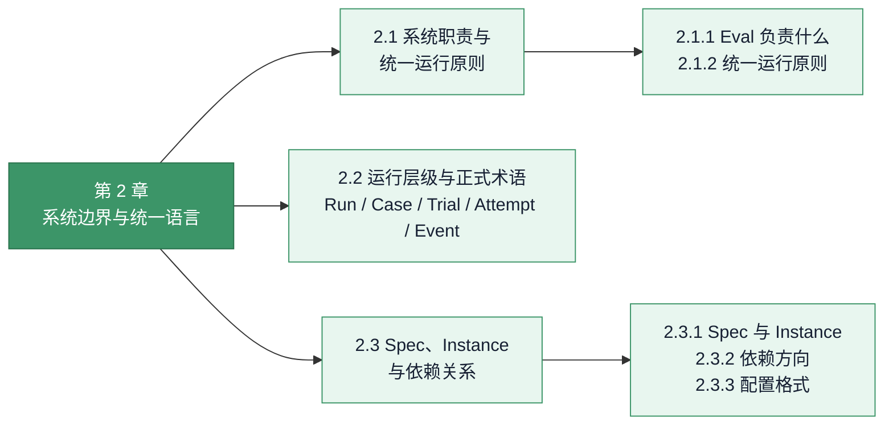
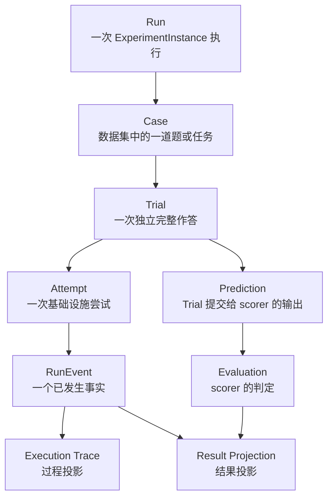
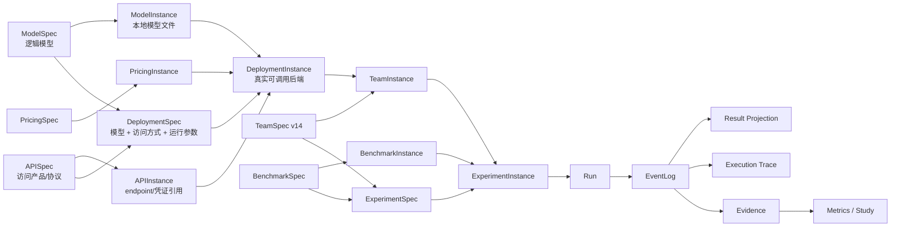

# 2. 系统边界与统一语言

[上一章：当前开发状态](01-current-status.md) · [返回总览](../EVAL_HANDOFF.md) · [下一章：相关工作与设计依据](03-related-work.md)

!!! abstract "本章回答什么"
    - LycheeMAS Eval 的职责边界是什么，哪些工作不属于本项目？
    - Run、Case、Trial、Attempt、Event、Node、Agent 等术语分别指什么？
    - Spec 与 Instance 如何依赖，配置在什么阶段转化为可运行对象？

> **性质：当前合同。** 本章定义全手册统一使用的职责边界、对象层级和术语。

<!-- chapter-map:start -->
**第 2 章展开：系统边界、术语与对象依赖**

<!-- chapter-map:end -->

## 2.1 系统职责与统一运行原则

### 2.1.1 Eval 负责什么

Eval 负责：

1. 注册和准备 benchmark、模型、API、价格等资源。
2. 用框架无关 TeamSpec 表达团队语义。
3. 将 TeamSpec 绑定到 DeploymentInstance，形成指定框架的 TeamInstance。
4. 用 ExperimentSpec 定义可复用实验，用 ExperimentInstance 表示可排队的一次具体执行。
5. 调用 RuntimeAdapter 完成推理，调用 benchmark 官方逻辑评分。
6. 把运行事实写入 EventLog，再生成 Result Projection、Execution Trace、Evidence 和 Metrics。
7. 汇总跨系统、跨框架、跨 benchmark 的研究结果。

Eval 不负责：

- 训练基础模型或 AutoThink 控制器。
- 修改 benchmark 的官方答案和评分标准。
- 把不同框架强行改造成完全相同的内部实现。
- 用“看起来类似”的近似实现冒充原生语义；近似必须写入 BindingReport。

### 2.1.2 统一运行原则

数据来自 benchmark，推理由 TeamInstance 指定的 MAS 框架完成，最终正确性由 benchmark 自己的 scorer 判断。smoke 与正式实验只允许 case 数量和抽样范围不同；团队、工具、prompt、解码、沙盒、评分器和观测流程必须相同。

## 2.2 运行层级与正式术语

最重要的层级如下。一个 Case 可以有多个 Trial；同一 Trial 因基础设施异常可以有多个 Attempt；Prediction 只是成功 Trial 交给 scorer 的最终结果；Trace 是过程查询，不是另一种执行实体。

| 名词 | 精确含义 | 主要标识 |
|---|---|---|
| Run | 一个 ExperimentInstance 的一次实际执行，共享配置快照、目录、状态和 EventLog | `run_id`、`run_dir` |
| Case | Benchmark 中的一道题或一个环境任务，只表示输入单元 | `case_id`、`dataset_index` |
| Trial | 对一个 Case 的一次独立完整执行，是最小独立评分和调度单位 | `(case_id, trial_index)`、`trial_seed` |
| Attempt | 同一 Trial 因基础设施异常发生的一次尝试；重试不增加 Trial 数 | `attempt` |
| Prediction | Trial 最终交给 scorer 的预测，不代表整条执行轨迹 | `final_output` |
| Evaluation | Benchmark scorer 对 Prediction 的判定 | `trial_event_id`、`score` |
| Event / RunEvent | 一个不可变的已发生事实；RunEvent 是本项目统一 JSON 包络 | `event_id`、`event_type` |
| EventLog | 按 `seq` 追加的 RunEvent 逻辑序列，可由多个 JSONL 分片承载 | `run_id`、`seq` |
| Operation | 有开始和 terminal 的实际操作，如模型调用、工具执行或 GroupChat | `operation_id` |
| Span | 将同一 Operation 的 started/terminal Event 配对得到的时间区间 | status、duration |
| Trace | 一组有因果关系的 Event 与 Span；是查询范围，不是第二份日志 | parent/correlation 链 |
| Execution Trace | 从 EventLog 派生的过程视图，展示消息、模型、工具、状态和错误 | Trace node |
| Result Projection | 从 EventLog 派生的逐 Trial 结果视图 | Trial key |
| GroupChat | AutoGen 对团队协作和消息发布机制的专有名称；其它框架保留自己的原生执行概念 | class、participant、message |
| Evidence | 从 RunEvent 确定性标准化的跨框架分析证据 | `evidence_id`、provenance |
| MetricObservation | 某个 Trial 在一个 Metric Contract 下的测量值或不可测状态 | `metric_id`、Trial key |
| Study | 对多个 Run 做严格配对和统计比较的研究集合 | `study_id`、`system_id` |

统一用词规则：

| 容易混用的词 | 本手册中的固定用法 |
|---|---|
| Node / Agent | `Node` 是 TeamSpec 中的框架无关执行单元；只有编译为具体框架对象后，才按该框架称 `Agent`、LangGraph node 或 CrewAI agent/task。工具执行器、代码函数和嵌套团队也可以是 Node，但不一定是 LLM Agent。 |
| Framework / RuntimeAdapter | `Framework` 指 AutoGen、LangGraph、CrewAI 等第三方执行框架；`RuntimeAdapter` 指 LycheeMAS 把 TeamSpec 编译并接入该框架的适配模块。 |
| Context / State | `Context` 是某个 Node 本次行动可见的信息窗口；`State` 是团队在执行过程中持续保存、合并或更新的数据。 |
| Task / Case / Trial | `Task` 仅在 benchmark 或第三方框架自身语境中使用；平台调度统一使用 Case 和 Trial，避免把数据输入、框架任务对象和一次独立作答混成同一层。 |
| Message / Event | `Message` 是团队协作中的语义载荷；`Event` 是 EventLog 中对消息发布、模型调用、工具执行等已发生事实的不可变记录。 |

后续章节若引用第三方框架的专有名称，会显式带上框架限定；没有限定时，一律采用上表的框架无关含义。

常用关联字段：

| 字段 | 含义 |
|---|---|
| `dataset_index` | Case 在本次 loader 结果中的 0-based 位置 |
| `trial_index` | 同一 Case 的第几次独立 Trial，0-based |
| `attempt` | 同一 Trial 的第几次 Attempt，1-based |
| `seq` | 同一逻辑 EventLog 内严格递增的写入序号 |
| `event_id` | 单个 Event 的唯一标识 |
| `operation_id` | 配对一个 Operation 的 started 与 terminal Event |
| `parent_event_id` | 因果或嵌套父 Event |
| `correlation_id` | 关联不是父子生命周期的协议事实，主要用于 tool call ID |

旧字段 `sample_index`、`k_index`、`prediction_index`、`samples_per_case`、`max_case_retries` 不属于当前合同。当前统一使用 Trial；统计学 bootstrap 中的 `samples` 只表示重采样次数，与 Trial 无关。

## 2.3 Spec、Instance 与依赖关系

### 2.3.1 Spec 与 Instance

`Spec` 是可复用定义；`Instance` 是某一版 Spec 的具体物化。Instance 保存引用 Spec 的 SHA-256 指纹。如果 Spec 的行为字段改变，旧 Instance 变为 `invalid`，需要重新实例化，避免实验悄悄使用变化后的配置。

| Spec | Instance | 作用 |
|---|---|---|
| ModelSpec | ModelInstance | 定义逻辑模型及其固有能力；物化为一份真实本地模型文件或外部路径引用 |
| APISpec | APIInstance | 定义远程推理服务的访问产品与协议；物化为 endpoint、凭证引用和限流配置 |
| PricingSpec | PricingInstance | 定义计费规则；冻结一次价格版本 |
| DeploymentSpec | DeploymentInstance | 定义推理服务；物化为可健康检查的 HF、vLLM 或 API 后端 |
| BenchmarkSpec | BenchmarkInstance | 注册 benchmark 身份；物化为可用 prepared 数据 |
| TeamSpec | TeamInstance | 定义协作语义；绑定部署并编译为一个框架的可运行团队 |
| ExperimentSpec | ExperimentInstance | 定义评测配方；绑定 benchmark/team 实例并进入调度队列 |

### 2.3.2 依赖方向

Spec 只能引用 Spec，Instance 只能绑定 Instance。TeamSpec 不保存模型路径或 API key；ExperimentSpec 不绑定 DeploymentInstance；这些具体选择只在 TeamInstance 和 ExperimentInstance 中发生。

### 2.3.3 配置格式

采用明确的双格式规则：

- `configs/eval_studio/**/specs/*.json` 和 `instances/*.json`：注册表的唯一规范来源，由 Studio 和后端共同读写。JSON 适合严格校验、稳定指纹和前端 round-trip。
- 人工维护的命令模板或非注册式示例：可使用 YAML。YAML 适合注释和手写，但不能与同名 JSON 同时成为规范来源。
- 运行快照：保存 JSON，因为快照应等于实际解析后的机器配置，而不是用户输入的语法外观。
