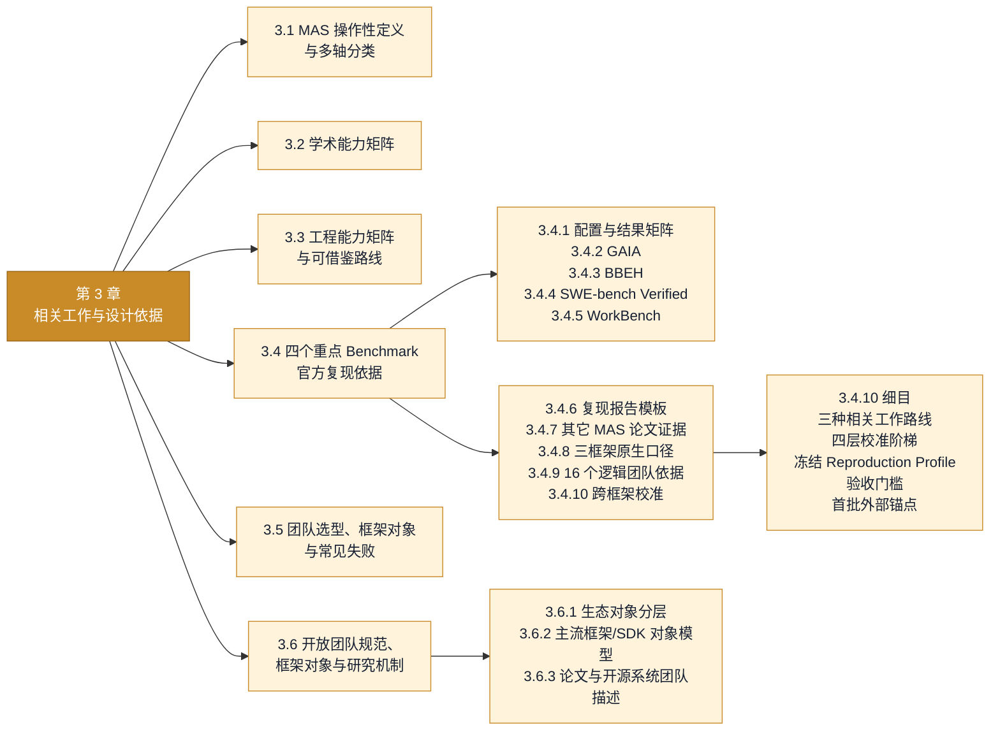

# 3. 相关工作与设计依据

[上一章：系统边界与统一语言](02-system-boundary.md) · [返回总览](../EVAL_HANDOFF.md) · [下一章：模块化结构与实现合同](04-implementation-contracts.md)

!!! abstract "本章回答什么"
    - 主流 MAS benchmark、评测框架、Agent 框架和开放规范已经做到了什么？
    - 四个重点 benchmark 的复现依据、团队配置和外部锚点来自哪里？
    - 哪些内容是外部事实与文献证据，哪些内容仍需要本项目实验验证？

<!-- chapter-map:start -->
**第 3 章展开：相关工作、复现依据与开放规范**


<!-- chapter-map:end -->

## 3.1 MAS 的操作性定义与多轴分类

工程语境中的 Agent 通常至少包含模型或策略、独立目标/指令、自己的可见上下文与状态、工具权限，以及决定下一步行动的控制逻辑。多个逻辑 Agent 可以共享同一底座模型；反过来，多次 LLM 调用或切换几套提示词并不会自动构成 MAS。

本文区分：

- **Workflow**：模型和工具沿开发者预先定义的路径运行；
- **Agentic coordination**：模型或自治节点在运行中决定下一步、工具或交接对象；
- **多角色工作流**：角色不同，但控制和状态仍主要属于中心程序；
- **中心化 MAS**：多个工作 Node 由 Selector、Manager 或 Orchestrator 控制；
- **去中心化 MAS**：Node 可以直接协商、交接或共同修改环境；
- **跨系统 Agent 网络**：不同团队、框架或服务通过协议协作。

“Sequential、Centralized、Collaborative、Heterogeneous、Graph-based”看起来互相冲突，是因为它们回答的不是同一个问题。描述一个团队至少需要以下七个正交维度：

| 维度 | 回答的问题 | 常见取值 | TeamSpec v14 落点 |
|---|---|---|---|
| 通信与控制拓扑 | 谁和谁存在可执行关系 | 星型、链/DAG、网络、层级、共享黑板 | `relations[].control` 与 `relations[].data` |
| 控制权 | 谁决定下一步 | 确定性代码、中心 LLM、peer、混合 | Node `operations` + Control Relation |
| 执行时序 | 工作何时发生 | 串行、并行、循环、异步 | Control Relation 与 Lifecycle limits |
| 协作关系 | 成员如何共同作用 | 合作、竞争、对抗、竞合 | Node role + workflow；不是单独 topology |
| 成员组成 | 团队由什么能力组成 | 同质探索者、职能专家、视角专家、异构 Node | `nodes[].kind/behavior/instructions/tools` |
| 上下文与状态 | 每个 Node 能看到、记住和修改什么 | 共享 transcript、点对点、私有上下文、artifact store | Node `context` + Data Relation + `shared_state` |
| 聚合、验证与停止 | 怎样得到最终结果 | synthesizer、vote、judge、测试、预算终止 | `lifecycle.result/termination/limits` + 官方 scorer |

因此 TeamSpec 不是一个 `topology=centralized` 字符串，也不是一张无类型有向图。v14 用可执行 Node、Control/Data Relation、SharedState 和 Lifecycle 共同描述控制、数据、状态与最终交付；每个 RuntimeAdapter 从这些事实独立选择自己的实现策略。

主流模式与 TeamSpec 的关系：

| 研究模式 | 典型形状 | 适合任务 | 主要风险 | TeamSpec 中必须显式出现的事实 |
|---|---|---|---|---|
| 单 Agent / Independent | 单 Node + tools | 单一目标、上下文可控、强单体基线 | 无协作增益，单点错误 | 一个执行 Node + submit |
| 确定性流水线 | A → B → C | 稳定 SOP、依赖明确、需要审计 | 上游错误传播、长尾僵硬 | 有序 Control Relation + Data transfer |
| Router → Specialist | 分类后选择一个或多个专家 | 专家边界清楚 | 错误路由、fallback 不清 | Node `select_next` operation + Control 候选范围 |
| Supervisor / Orchestrator → Workers | 中心动态拆解、委派和综合 | 开放检索、复杂代码、动态工具选择 | 中心瓶颈、重复委派 | 协调 operations + Control/Data Relations + SharedState |
| Parallel map–reduce / ensemble | fan-out → reducer/judge | 可独立探索的多个方向 | 相关错误、成本高 | Control fan-out/join + aggregate Operation |
| Handoff / Swarm | 当前 Node 转交控制权 | 多轮服务、所有权迁移 | 循环交接、责任丢失 | `handoff` Operation + 显式 Control Relations |
| Generator–Critic | 生成 → 评审 → 修改 | 有清楚 rubric 的代码/写作 | 无停止条件、同源盲点 | Control/Data Relations + Lifecycle result |
| Hierarchical / A2A | manager → sub-team，或跨服务协作 | 单一 manager 已成瓶颈、跨组织 | 摘要失真、身份和协议复杂 | 合同扩展位，普通 UI 暂不开放 |

这些模式还可以叠加不同的角色关系。角色模板不是另一套 topology，也不能只靠角色名字证明已经实现：

| 角色模板 | 价值来源 | 关键合同/风险 |
|---|---|---|
| Planner–Executor | 分离规划和行动 | 计划能否更新，执行是否遵循必要依赖 |
| Manager–Workers | 动态委派、并行和上下文隔离 | 重复委派、中心瓶颈、遗漏 owner |
| Specialist team | 真实工具、数据、权限或模态差异 | 只有 prompt 换皮时不构成能力分工 |
| Generator–Critic | 有 rubric 的迭代质量控制 | 独立上下文、最大迭代、确定性验证 |
| Proposers–Judge | 候选多样性和冗余 | Judge 偏差、相关错误与高成本 |
| Debaters–Judge | 交叉质询暴露论证漏洞 | 说服力不等于真实性，必须有收口机制 |
| Red team–Blue team | 主动发现并修复安全/鲁棒性问题 | 攻击面、审批、恢复和停止边界 |
| Assembly line | 阶段化 SOP 和可审计 artifact | 上游错误传播、阶段 gate |
| Role-playing society | 社会模拟、协商和合成数据 | 人设不能替代事实和能力 |
| Homogeneous explorer pool | 扩大独立搜索宽度 | 重复劳动、相关错误和聚合偏差 |

主流工程实践可以概括为：**小而明确的确定性骨架，包住少量必要的动态路由；中心协调上下文隔离的 Worker；通过结构化工件而不是无限群聊协作；最终用独立验证和硬预算收口。** 这不是说所有任务都应使用中心化团队，而是说“更多 Agent、更多消息、更多轮次”本身都不是质量保证。

参考：[Anthropic, Building Effective Agents](https://www.anthropic.com/engineering/building-effective-agents)、[LangChain Multi-agent overview](https://docs.langchain.com/oss/python/langchain/multi-agent)、[AutoGen Teams](https://microsoft.github.io/autogen/stable/user-guide/agentchat-user-guide/tutorial/teams.html)、[OpenAI Agents SDK orchestration](https://openai.github.io/openai-agents-python/multi_agent/)、[Google ADK](https://developers.googleblog.com/agent-development-kit-easy-to-build-multi-agent-applications/)。

## 3.2 学术能力矩阵

该矩阵比较论文研究了什么，不是软件功能总排名。`✓` 表示一等评价对象且有实证，`△` 表示部分覆盖，`P` 表示本课题已有正式设计但尚缺论文级验证，`—` 表示不是公开工作的主要对象。

| 工作 | 完整 MAS 对象 | 跨领域任务 | 官方任务结果 | 过程进度 | 通信/协作 | 规划/组织 | 角色贡献/因果 | 失败/恢复 | Token/成本/延迟 | 重复与统计 | 拓扑对照 | 适用性声明 | 指标效度验证 | 跨框架迁移 |
|---|---:|---:|---:|---:|---:|---:|---:|---:|---:|---:|---:|---:|---:|---:|
| **本课题 + LycheeMAS Eval** | ✓ | ✓ | ✓ | △ | △ | P | P | △ | ✓ | ✓ | ✓ | ✓ | P | P |
| [MultiAgentBench / MARBLE](https://aclanthology.org/2025.acl-long.421/) | ✓ | ✓ | ✓ | ✓ | ✓ | ✓ | △ | — | △ | △ | ✓ | — | △ | — |
| [MAST](https://papers.nips.cc/paper_files/paper/2025/hash/b1041e52d3be19f0a9bc491657488e4a-Abstract-Datasets_and_Benchmarks_Track.html) | ✓ | ✓ | △ | — | △ | △ | — | ✓ | — | — | △ | △ | ✓ | ✓ |
| [SILO-BENCH](https://aclanthology.org/2026.acl-long.1354/) | ✓ | — | ✓ | — | △ | — | — | △ | ✓ | △ | ✓ | — | ✓ | — |
| [AgentBoard](https://proceedings.neurips.cc/paper_files/paper/2024/hash/877b40688e330a0e2a3fc24084208dfa-Abstract-Datasets_and_Benchmarks_Track.html) | — | ✓ | ✓ | ✓ | — | — | — | △ | — | △ | — | — | ✓ | — |
| [AgentBench](https://proceedings.iclr.cc/paper_files/paper/2024/hash/e9df36b21ff4ee211a8b71ee8b7e9f57-Abstract-Conference.html) | — | ✓ | ✓ | — | — | — | — | △ | — | △ | — | — | △ | — |
| [HELM](https://arxiv.org/abs/2211.09110) | — | ✓ | ✓ | — | — | — | — | — | ✓ | ✓ | — | ✓ | △ | — |
| [MASEval](https://aclanthology.org/2026.acl-demo.34/) | ✓ | ✓ | ✓ | — | △ | — | — | △ | ✓ | △ | ✓ | — | — | ✓ |
| [MAESTRO](https://arxiv.org/abs/2601.00481) | ✓ | ✓ | ✓ | — | △ | △ | — | ✓ | ✓ | ✓ | ✓ | — | — | ✓ |
| [Inspect AI](https://inspect.aisi.org.uk/) | ✓ | ✓ | ✓ | △ | △ | △ | — | △ | ✓ | ✓ | △ | △ | △ | ✓ |
| [AutoGenBench / AgBench](https://github.com/microsoft/autogen/tree/main/python/packages/agbench) | ✓ | ✓ | ✓ | — | △ | △ | — | △ | △ | ✓ | △ | — | — | — |
| [lm-evaluation-harness](https://github.com/EleutherAI/lm-evaluation-harness) | — | ✓ | ✓ | — | — | — | — | — | △ | ✓ | — | △ | △ | — |
| [OpenAI Evals](https://github.com/openai/evals) | △ | ✓ | ✓ | △ | — | — | — | △ | △ | △ | △ | △ | △ | △ |

解读时必须避免四个误区：有 trace 不等于测量了协作质量；通信次数不等于通信质量；记录错误不等于完成失败归因；有一个公式不等于指标已经具备构念效度。本课题真正需要补的是指标适用性、效度验证和跨框架迁移，而不是追求每一列都打勾。

## 3.3 工程能力矩阵与可借鉴路线

工程矩阵比较公开实现能否把评测真正运行起来。这里的 `△` 表示需要场景脚本、外部组件或用户自行实现，而不是稳定的一等合同。

| 框架 | Benchmark 注册 | prepare/load/score | 原生 scorer/harness | 外部 MAS 适配 | 原生 MAS 编排 | 异构角色模型 | HF/vLLM/API | 文件/Web/代码 | 沙盒 | 持久控制面 | 队列/容量 | Trial 续跑 | 事件级日志 | 调用观测 | Token/金额 | 离线重评/Study | UI |
|---|---:|---:|---:|---:|---:|---:|---:|---:|---:|---:|---:|---:|---:|---:|---:|---:|---:|
| **LycheeMAS Eval** | ✓ | ✓ | ✓ | ✓ | ✓ | ✓ | ✓ | ✓ | ✓ | ✓ | ✓ | ✓ | ✓ | ✓ | ✓ | ✓ | ✓ |
| MultiAgentBench / MARBLE | ✓ | △ | ✓ | — | ✓ | ✓ | △ | ✓ | △ | — | — | — | △ | △ | — | △ | — |
| MAST / MAST-Data | △ | △ | — | △ | — | — | △ | — | — | — | — | — | △ | △ | — | ✓ | — |
| SILO-BENCH | ✓ | ✓ | ✓ | — | ✓ | — | △ | — | △ | — | — | — | △ | △ | △ | ✓ | — |
| AgentBoard | ✓ | ✓ | ✓ | △ | — | — | ✓ | ✓ | ✓ | — | — | — | △ | △ | — | ✓ | ✓ |
| AgentBench | ✓ | ✓ | ✓ | △ | — | — | ✓ | ✓ | ✓ | — | — | △ | △ | △ | — | ✓ | — |
| HELM | ✓ | ✓ | △ | — | — | — | ✓ | — | — | — | △ | ✓ | △ | ✓ | ✓ | ✓ | ✓ |
| MASEval | ✓ | ✓ | △ | ✓ | △ | △ | △ | △ | △ | — | — | △ | ✓ | ✓ | △ | △ | — |
| MAESTRO | △ | △ | △ | ✓ | — | △ | △ | ✓ | △ | △ | — | — | ✓ | ✓ | ✓ | ✓ | — |
| Inspect AI | ✓ | ✓ | △ | ✓ | ✓ | ✓ | ✓ | ✓ | ✓ | △ | △ | ✓ | ✓ | ✓ | ✓ | △ | ✓ |
| AgBench | △ | △ | ✓ | — | ✓ | △ | △ | ✓ | ✓ | — | — | △ | △ | △ | — | △ | — |
| lm-evaluation-harness | ✓ | ✓ | △ | — | — | — | ✓ | — | — | — | — | ✓ | △ | △ | △ | △ | △ |
| OpenAI Evals | ✓ | ✓ | △ | △ | — | △ | △ | △ | — | — | △ | △ | ✓ | △ | △ | △ | △ |

工程上最值得借鉴的边界如下：

| 来源 | 借鉴内容 | LycheeMAS 当前处理 |
|---|---|---|
| Inspect AI | Dataset–Solver–Scorer、工具/沙盒、失败恢复、自适应并发 | 保留为最强通用工程参照；本项目额外对象化 Team/Deployment/Experiment 和 MAS Evidence |
| AgBench | 干净容器、scenario 重复运行、benchmark 自己评分 | GAIA/HumanEval 沙盒与 scorer 尽量对齐其运行语义，但不把 AgBench 仓库嵌入为控制面 |
| MASEval | framework-agnostic adapter、trace-first | 已以 RuntimeAdapter + BindingReport 实现三框架入口，仍需验证语义等价性 |
| MAESTRO | 跨框架 trace、调用图、资源/成本/延迟与结构稳定性 | EventLog 已覆盖语义事实；系统资源时间序列、结构稳定性和 OTEL 交换仍是后续项 |
| MultiAgentBench | Task Score 与 Communication/Planning Score 分离、拓扑对照 | 任务得分与过程指标分开，不构造一个总分 |
| MAST | 失败 taxonomy、首次错误、传播和人工校准 | 已有底层错误事实；语义 failure taxonomy 和 Judge 校准尚未完成 |
| HELM | 多指标覆盖与适用范围 | 用 Evaluation Profile 和 `not_applicable` 防止错误套用指标 |

OpenTelemetry 是通用观测交换生态，不包含 Case、Trial、Benchmark scorer、TeamSpec 或研究分母。当前不让它替代 `run_events*.jsonl`；未来若接入，应作为 EventLog 的导出/导入桥，而不是第二个事实源。

原生 MAS benchmark 候选包括 MultiAgentBench、Collab-Overcooked、SILO-BENCH、MAS-BENCH、LLM-Coordination、CoLLAB/DCOP、DPBench 和 TeamBench。它们比“把单 Agent benchmark 套上多人 scaffold”更适合验证协作构念；接入顺序见 5.11。

### 3.3.1 论文中的过程性指标与接入边界 { #process-metrics-literature }

过程指标不是“凡是能从日志计数的东西”。论文中至少存在四种不同测量对象：运行开销、交互结构、协作内容和失败机制。它们需要的证据、适用范围与效度完全不同，不能拼成一个没有解释边界的总分。

| 来源 | 论文真正测量的过程量 | 计算或评定方式 | 所需证据 | 适用边界 | LycheeMAS Eval 当前状态 |
|---|---|---|---|---|---|
| [MultiAgentBench / MARBLE](https://aclanthology.org/2025.acl-long.421/) | Milestone KPI、个体贡献、Communication Score、Planning Score、Coordination Score | 对 Agent `j`，`KPI_j = n_j / M`，总体为各 Agent KPI 的均值；Communication 与 Planning 由 LLM judge 在 0–5 分量表上评定，Coordination 为二者均值 | 任务、角色、完整通信/规划轨迹、预定义或执行中检测到的 milestone、贡献者归属 | 依赖场景 milestone 与经过验证的 judge；不能仅靠消息数复现 | 事件已能提供轨迹与 actor；milestone、贡献归属、C/P judge 尚未实现。当前 `operation_count` 和角色均衡度不等于论文的 CScore/PScore |
| [MAESTRO](https://arxiv.org/abs/2601.00481) | Token、时延、成本、失败、CPU、内存、通信量，以及重复运行的调用图稳定性 | 调用图边集合用 Jaccard；有序调用边序列用归一化 LCS；资源与应用指标按相同配置的重复 Run 汇总 | 跨框架 trace、资源时间序列、同一 Case/配置的多次独立 Trial | Jaccard 测结构是否一致，LCS 测执行顺序是否一致；单次 Trial 无法给出稳定性 | Token/时延/成本/失败已覆盖；Jaccard/LCS 应作为 Study 级指标接入；CPU/RSS/网络时间序列仍是后续项 |
| [MAST](https://arxiv.org/abs/2503.13657) | 14 类 MAS failure mode incidence | 先由专家对轨迹建立并校准 taxonomy，再用经过人类一致性验证的 LLM annotator 扩展标注 | 完整执行轨迹、明确的失败定义、人工校准集、judge 输出与证据片段 | 是语义诊断，不是底层异常计数；同一 Trial 可以有多个 failure mode | EventLog 已保存诊断事实；尚未实现 MAST judge。工具错误率、模型错误率不能冒充 task derailment、information withholding 或 incomplete verification |
| [CORE](https://aclanthology.org/2026.eacl-long.57/) | 对话语言的 mode entropy、lexical repetition、semantic stagnation 与组合 CORE | 对语义聚类熵归一化，并乘以重复惩罚和相邻 utterance 语义停滞惩罚 | 完整对话、统一分词、句向量/聚类、语料相关的归一化与超参数 | 原文验证对象是成对、短程、博弈式对话；不应直接外推到长程工具 Agent | 当前只有严格规范化文本重复率；不等于 CORE。可作为 MAS-native 对话任务的实验性 Profile，不能默认套到 GAIA/SWE |
| [Capable language models can outgrow the benefits of collaboration](https://www.nature.com/articles/s42256-026-01268-y) | message density、coordination overhead、error absorption/amplification、redundancy、shared-token entropy、contradictory mass、information gain | 例如 `message density = inter-agent messages / reasoning turns`；`error absorption = (E_SAS - E_MAS) / E_SAS`；其余通过 token overlap、语义矛盾与任务不确定性变化估计 | 对齐的 SAS/MAS 试验、消息与 reasoning turn、事实错误标注、语义匹配、任务变量或不确定性代理 | 多数指标是 Study 级配对量；冗余并非越低越好，论文观察到的是存在中间区间而非单调关系 | message/turn 与开销可由 EventLog 派生；error absorption 需同 Case 的 SAS 对照；contradictory mass 与 information gain 仍需语义 evaluator |

因此当前 28 个 core 指标要被准确称为**确定性的运行与协作过程观测**，而不是已经完成效度验证的“协作质量评分”。其中调用次数、消息数、角色切换、控制调用占比、token、时延和错误率可由 EventLog 直接重算；它们回答“系统实际发生了什么”，不自动回答“协作是否有效”。

推荐按以下顺序接入论文指标：

1. **事件层直接量。** 保持现有调用、消息、角色、工具、token、时延、错误、replan 和 stall 观测，并完善 evidence coverage。
2. **Study 级结构量。** 对相同 Case 的重复 Trial 增加调用图 Jaccard、调用序列 LCS、方差和置信区间；该层不需要语义 judge，最适合作为下一批稳定指标。
3. **受控对照量。** 在冻结同 Case 的 SAS/MAS 配方后计算消息密度、协调开销、success-per-token、error absorption/amplification；没有配对基线时写 `not_applicable`。
4. **语义交互量。** 冗余、矛盾、信息增益、Communication/Planning Score 和 milestone contribution 必须定义内容 evaluator、模型版本、prompt、校准集和不确定性，默认标记为 experimental。
5. **失败诊断层。** MAST 类 failure taxonomy 需要人工标注小集与 judge 一致性验证；只有通过校准后才能进入正式 Evaluation Profile。

指标是否“能算”与是否“适合解释”必须分开。单 Agent 的 inter-agent message density 是 `not_applicable`，不是 0 分；没有重复 Trial 时调用图稳定性是 `missing_evidence`；CORE 在非对话型工具执行任务上可能是 `unsupported`。这三种状态都不能被空值或 0 替代。

## 3.4 四个重点 Benchmark 的官方复现依据 { #benchmark-reproduction-evidence }

!!! info "与第 5 章的边界"
    本节只整理外部可核验的官方配置、论文证据、复现轨道和校准锚点，回答“依据来自哪里”。LycheeMAS 自己如何抽样、控制变量、分配预算和做统计，由 [5.3 候选实验规范](05-research-plan.md#candidate-experiment-spec)定义。

本章记录“可比基线”，不把官方未披露参数补成猜测，也不把“使用了框架原生执行对象”误写成“框架官方提供了该 benchmark 配方”。复现时应固定数据版本、scorer、团队、工具、模型、prompt、解码、预算、超时和运行次数。

所有团队证据分成三条轨道：

| 轨道 | 证据要求 | 可以声称什么 | 不可以声称什么 |
|---|---|---|---|
| Official/native replication | benchmark 或框架官方仓库、论文和可执行配置 | 复现某个明确版本的官方/原生 scaffold | 只因调用了官方类就称为官方 benchmark 配方 |
| Literature replication | 论文描述、代码、prompt/角色/工具/参数与结果表 | 复现或近似复现某篇 MAS 论文系统 | 把 paper-inspired 角色改写后仍标成原论文结果 |
| Controlled portability | 同一 TeamSpec、模型、任务、预算与 scorer，经不同 RuntimeAdapter 执行 | 比较抽象合同的可移植性和 adapter semantic delta | 把 48 个组合称为 AutoGen/LangGraph/CrewAI 各自最佳实践 |

### 3.4.1 公开配置与结果矩阵

| Benchmark | 官方或主流公开 scaffold | 已公开的关键配置 | 已公开结果 | 与当前受控矩阵的关系 |
|---|---|---|---|---|
| GAIA | AutoGen Magentic-One：Orchestrator、FileSurfer、WebSurfer、Coder、ComputerTerminal | 默认所有 Agent 使用 GPT-4o；论文另测 Orchestrator/Coder 使用 o1-preview；Docker 隔离，网页、文件和终端工具 | 官方报告与 2024-10-21 当时 SOTA 统计可比，但网页正文未给可直接复制的逐题包 | 作为 AutoGen 原生复现轨；不能替代 4×4×3 中跨框架 `gaia-centralized` 的受控比较 |
| BBEH | 单模型推理加官方 `bbeh/evaluate.py` | full 4520、mini 460；公开 leaderboard 未完整记录 temperature、max tokens、逐题输出与 run provenance | o3-mini high：44.8 harmonic / 54.2 full micro / 56.7 mini micro；Gemini 2.0 Flash：9.8 / 23.9 / 27.0；DeepSeek R1：6.8 / 34.9 / 37.2 | 只能校验数据、scorer 和聚合口径；不能声称严格同配置模型复现 |
| SWE-bench Verified | 官方 leaderboard 当前用统一 mini-SWE-agent；2024 OpenAI 也报告 Agentless | mini-SWE-agent `step_limit=250`、`cost_limit=3`、每步 shell 交互、容器 `/testbed`、命令 timeout 60 秒；500 个 Verified case | 当前官方页称 mini-SWE-agent 可超过 74%；OpenAI 2024 的 GPT-4o + Agentless 为 33.2% | 作为单 Agent 强基线和工具合同参考；跨框架 MAS 结果必须另报 TeamSpec/BindingReport |
| WorkBench | 官方 ReAct loop 或 native tool calling loop | 五个沙盒数据库、26 个读写工具；`tool_selection=all\|domains`、`workers=N`、`--resume`、可选完整 trace；v1/v2 ground truth 分版本 | 2024 required-tools：GPT-4 49%、GPT-3.5 14%、Claude-2 23%、Llama2-70B 3%、Mixtral-8x7B 20%；GPT-4 all-tools 为 43% | 可复现官方单 Agent 轨；受控矩阵需要固定同一工具可见范围和 ground-truth version |

这张表不是一张统一 leaderboard：四行使用的模型、Agent scaffold、数据版本和提交政策不同。LycheeMAS 应同时保留两条轨道：

1. **官方复现轨**：尽量逐项复刻某一官方/主流配置，验证 loader、工具、沙盒和 scorer 是否可信。
2. **受控研究轨**：固定模型、抽样、生成参数和逻辑 TeamSpec，只改变 topology 或 RuntimeAdapter，用于归因框架与 MAS 结构差异。

### 3.4.2 GAIA

GAIA validation 共 165 题，分为 L1=53、L2=86、L3=26；正式总准确率应按 165 题逐题汇总。AutoGen 官方 Magentic-One 由 Orchestrator、FileSurfer、WebSurfer、Coder、ComputerTerminal 构成。Orchestrator 维护 Task Ledger 和 Progress Ledger，并动态委派。官方示例默认使用 GPT-4o，并建议 Orchestrator 使用强推理模型；另有 o1-preview 用于 Orchestrator/Coder 的配置。

来源：

- [AutoGen Magentic-One 文档](https://microsoft.github.io/autogen/stable/user-guide/agentchat-user-guide/magentic-one.html)
- [AutoGen GAIA AgBench 配置](https://github.com/microsoft/autogen/tree/main/python/packages/agbench/benchmarks/GAIA)
- [GAIA 论文](https://arxiv.org/abs/2311.12983)

LycheeMAS 的官方复现候选轨是 AutoGen + `gaia` TeamSpec + GAIA scorer；该 TeamSpec 使用 Orchestrator、FileSurfer、WebSurfer、Coder、ComputerTerminal，并编译为 MagenticOneGroupChat。4×4×3 控制矩阵中的 `gaia-centralized` 则由 Researcher、Solver、Verifier 和承担“选择下一执行节点”功能的 Selector Node 组成，用于让三个框架接受同一抽象合同。后者不是 Magentic-One，不能冒充官方分数。

### 3.4.3 BBEH

官方仓库给出 full 4520、mini 460，并要求使用 `bbeh/evaluate.py`。官方榜同时报告 harmonic mean、full micro average 和 mini micro average。公开榜示例包括 o3-mini high 44.8/54.2/56.7、Gemini 2.0 Flash 9.8/23.9/27.0、DeepSeek R1 6.8/34.9/37.2。当前提交方式只要求三个聚合分数和论文链接，没有统一要求逐题 Prediction、temperature/top-p/max tokens、seed、代码 revision 与运行时间，因此只能做“同数据与 scorer 口径校验”，不可据此声称严格同配置模型复现。

来源：

- [Google DeepMind BBEH 仓库](https://github.com/google-deepmind/bbeh)
- [BBEH leaderboard](https://github.com/google-deepmind/bbeh/blob/main/leaderboard.md)
- [BBEH 论文](https://arxiv.org/abs/2502.19187)

### 3.4.4 SWE-bench Verified

Verified 是原 SWE-bench test 中经人工核验的 500 题子集。Agent 获得 issue 描述和仓库，但看不到隐藏测试；只有 `FAIL_TO_PASS` 与 `PASS_TO_PASS` 都通过才算 resolved。官方新 harness 使用 Docker。OpenAI 2024 发布时报告 GPT-4o + Agentless 33.2%。2026 年 OpenAI 进一步指出 Verified 已出现污染和测试设计问题，因此论文必须记录评测日期和 harness 版本，并把污染审计作为限制。

当前框架无关工具合同提供受限目录枚举、分段文件读取、原子精确文本替换和 60 秒代码执行。`replace_text_file` 要求旧文本出现次数与 `expected_replacements` 完全一致，避免模型在大仓库中进行模糊全局替换。只有 Developer、Implementer 和 Reviewer 等写职责 Node 获得精确替换工具；Investigator 的职责和 prompt 只要求定位与证据。需要注意，Investigator 仍有诊断代码执行器，因此“只读”目前是职责约束而不是操作系统级权限隔离；如论文需要严格最小权限，还要为该 Node 提供只读 workspace mount。该工具合同适用于三个 RuntimeAdapter，但它不等同于 mini-SWE-agent 的自由 shell，论文必须分别标注。

来源：

- [Introducing SWE-bench Verified](https://openai.com/index/introducing-swe-bench-verified/)
- [SWE-bench 官方站点](https://www.swebench.com/)
- [mini-SWE-agent 官方 SWE-bench 配置](https://github.com/swe-agent/mini-swe-agent/blob/main/src/minisweagent/config/benchmarks/swebench.yaml)
- [2026 年局限性审计](https://openai.com/index/why-we-no-longer-evaluate-swe-bench-verified/)

### 3.4.5 WorkBench

WorkBench 官方实现提供 ReAct 文本解析和 native tool-calling 两种 agent loop，可选择全部工具或仅 domain 工具，并支持 `--workers` 并行。2026 Revisited 对每个模型保存 690 题逐题结果和 `_meta.json` sidecar，并用同一评分流水线派生成绩与成本图；`--resume` 只重跑缺失或报错任务。该设计可作为 LycheeMAS Result Projection、运行快照与断点续测的外部核对。结果必须记录 benchmark/scorer 版本，因为 2026 Revisited 更新了任务、模型注册和 evaluator，原论文与重评分数字不可直接混用。

来源：

- [WorkBench 官方仓库](https://github.com/olly-styles/WorkBench)
- [WorkBench 论文](https://arxiv.org/abs/2405.00823)
- [WorkBench Revisited](https://arxiv.org/abs/2606.13715)

### 3.4.6 复现报告模板

| 项 | 必须记录 |
|---|---|
| Dataset | source、revision/hash、split、case selection、数量 |
| Scorer | 官方代码 revision、profile、聚合公式 |
| Model | 精确模型 ID、权重 revision、chat template |
| Deployment | HF/vLLM/API 版本、TP/DP、max model len、max num seqs |
| Team | TeamSpec fingerprint、TeamInstance、BindingReport |
| Generation | thinking、budget、max output、sampling、seed |
| Runtime | turns/rounds/model-call limits、tools、timeout、network、sandbox |
| Repetition | trials per case、attempt policy、统计区间 |
| Evidence | EventLog coverage、失败分母、污染标记 |

### 3.4.7 其它 MAS 论文中的配置与基线证据

官方 benchmark 论文不是唯一依据。很多 MAS 论文会在 GAIA 或 SWE-bench 上同时报告单 Agent、手工 MAS 和自动搜索工作流，这些结果更适合约束角色、协调机制和资源预算。下面只记录能追溯到论文/代码的机制；“可借鉴”不等于当前 TeamSpec 已经完成逐项复现。

| 工作 | Benchmark | 单 Agent / MAS 对照 | 公开机制 | 对当前设计的约束 |
|---|---|---|---|---|
| [Magentic-One](https://arxiv.org/abs/2411.04468) | GAIA | 与当时通用 Agent 基线比较 | Orchestrator、WebSurfer、FileSurfer、Coder、ComputerTerminal；Task/Progress Ledger | 支持 GAIA 原生中央编排轨；不支持把普通 Selector 团队称为 Magentic-One |
| [AutoAgent](https://aclanthology.org/2026.findings-acl.2129/)；[代码](https://github.com/HKUDS/AutoAgent) | GAIA validation | FRIDAY、Magentic-One、AutoGen Multi-Agent Experiment、HuggingFace Agents 等公开系统 | 基础 Agent 先执行并收集反思，失败时由 Tool Editor 创建工具；Claude 3.5 Sonnet；论文报告 55.15% | 提供另一套可执行的 orchestrator/workflow/tool-creation 配方及单/多系统基线，但不能把其动态工具创建缩写成固定 Researcher–Solver–Verifier |
| [Anemoi](https://arxiv.org/abs/2508.17068) | GAIA | 同模型 planner 与 OWL 对照 | semi-centralized A2A、规划与专门 Agent；论文报告 GPT-4.1-mini 条件下 52.73 对 43.63 | 支持“中央规划 + 专长节点”候选，同时要求记录同模型控制 |
| [Beyond Rule-Based Workflows / CORAL](https://arxiv.org/abs/2601.09883) | GAIA | 控制角色与模型后比较 orchestrator/A2A | 基于信息流的动态协调；论文报告 63.64 对 OWL 55.15 | 支持把 coordination 作为独立变量，而非只比较角色 prompt |
| [COLA](https://arxiv.org/abs/2503.09263) | GAIA | 动态系统与静态 Agent 基线 | Task Scheduler、决策 Agent 池、memory、rollback | 为中央协调、恢复和动态成员选择提供机制候选 |
| [EvoMAS](https://arxiv.org/abs/2602.06511)；[代码 revision `93fd9d6`](https://github.com/amazon-science/EvoMAS/tree/93fd9d6766b093f6bbdeeffc35896910cbece6e2) | BBEH、WorkBench、SWE-bench Verified | 每个任务族公开 single baseline，并以 debate、majority vote、peer review、CROTO/SMOA 或 ChatDev/MetaGPT 等池作为 MAS 搜索起点 | BBEH 公开 6-worker majority vote、6×3-round all-to-all debate、creator-reviewer-reviser-aggregator；WorkBench 按六个 domain 发布相应池；SWE 还含 SWEAgent、ChatDev、MetaGPT | 证明三个 benchmark 有直接 MAS 论文与可执行配方；同时证明当前三节点受控 TeamSpec 只是缩减改写，真正复现必须保留原 agent 数、模型、prompt、工具、并行图与聚合器 |
| [Multi-agent Architecture Search via Agentic Supernet](https://openreview.net/forum?id=imcyVlzpXh) | GAIA 等六个 benchmark | GPT-4o-mini 单 Agent、AutoGPT、TapeAgent、Sibyl、AutoAgents、GPTSwarm、ADAS、AgentSquare、AFlow 与 MaAS | query-dependent agentic supernet，联合优化质量与调用/token 成本 | 说明固定四拓扑不是唯一 MAS 轴；后续应增加 query-dependent architecture 轨，但不能混入当前 48 格受控表 |
| [MATPO](https://openreview.net/pdf/73c0a9cc6e50d38458c591ffec25c492a480b5aa.pdf) | GAIA-text | 单 Agent GRPO 与 planner/worker multi-agent RL | planner 拆分 browsing subtask，worker 执行；论文报告 42.60% 对 32.16% | 只适合作为 GAIA-text 训练式 MAS 证据，不能直接对比完整 GAIA validation |
| [BenchAgent](https://arxiv.org/abs/2606.05670) | 包含 GAIA 的标准化 Agent 评测 | single、fixed MAS、evolving MAS | 统一 scaffold 与 PAE；报告“增加 Agent 经常无增益” | 强化 Independent 强基线和等预算比较的必要性 |
| [Capable language models can outgrow the benefits of collaboration](https://www.nature.com/articles/s42256-026-01268-y) | WorkBench、SWE-bench Verified 等六个 agentic benchmark | SAS 与 independent、centralized、decentralized、hybrid MAS；三家模型族、相同 prompt/工具/系统级计算上限 | 3 个 base agent；centralized 为 orchestrator↔workers 星形，decentralized 为全连接多轮 debate + 0.7 consensus，independent 为无 peer 通信的并行探索 + synthesis-only；WorkBench 取 seed=42 的 100 题分层子集，SWE Verified 取 seed=42 的 20 题子集 | 这是当前 WorkBench/SWE 拓扑最直接的文献依据；必须注意该文的 Independent 是多 Agent ensemble，而本项目历史 `*-independent` 是单 Agent baseline，二者不可同名混用 |
| [Understanding Multi-Agent LLM Frameworks / MAFBench](https://arxiv.org/abs/2602.03128) | 跨 benchmark 的框架级能力任务 | 多框架受控实现对照 | 固定底层模型后比较 planning、memory、specialization、coordination 与运行开销；论文报告框架选择可造成数量级延迟差和明显准确率差 | 直接支持“抽象合同 + RuntimeAdapter + 过程指标”的研究方向，但不能替代 benchmark 官方 scorer 或证明当前 adapter 已语义等价 |
| [BOAD](https://openreview.net/forum?id=b15b95d6d3c681bbed2fa9991f931fc0605e2139) | SWE-bench Verified | 单 Agent/手工流水线与多 Agent 编排对照 | Orchestrator + localization、editing、validation 专长 Agent | 为 SWE Centralized 候选提供直接依据；当前 TeamSpec 仍是受控改写，不是 BOAD 复现 |
| [DeLM](https://arxiv.org/abs/2606.10662) | SWE-bench Verified | 中央/单 Agent 与去中心化系统对照 | decentralized agents、shared verified context、task queue | 为 SWE peer/decentralized 轨提供论文依据，并提示“去中心化”不能只是 fan-out 后交给中央 Verifier |
| [icat-agent](https://arxiv.org/abs/2606.25514) | SWE-bench Verified | 单 Agent 与去中心化事件系统对照 | decentralized event messaging；论文报告相对基线提升 3.6–8.4 个百分点并降低成本 | 支持把事件通信和共享上下文作为独立变量，不等同于当前文本 handoff |
| [MASAI](https://openreview.net/forum?id=94L33aYLJd) | SWE-bench Lite | 单 Agent 与 Test Template、Issue Reproducer、Edit Localizer、Fixer、Ranker 分工 | 模块化软件工程角色 | 可借鉴角色职责，但 benchmark 是 Lite，不得把其数字当 Verified 基线 |

截至当前检索，四个重点 benchmark 都已经找到 MAS 论文证据，但证据形态不同：GAIA 有 Magentic-One、COLA、CORAL、Anemoi 等完整系统；BBEH 有 EvoMAS 的可执行 MAS pool；WorkBench 与 SWE-bench Verified 同时有 EvoMAS pool 和 Nature agent-scaling 的受控拓扑实验。**这并不自动升级当前 48 格为论文复现**：`bbeh-centralized` 的 turn-level Selector 不等于 EvoMAS 的 architecture evolution 或 majority-vote aggregator；`*-decentralized` 的三节点 handoff cycle 不等于 6-agent/3-round debate，也不等于 Nature 的 all-to-all consensus；`*-independent` 更是单 Agent，不是 Nature 的三 Agent ensemble。当前矩阵仍属于 controlled portability，literature-replication 轨必须另建不可变配置并冻结来源 revision、原 prompt、Agent 数、工具、轮次、聚合、预算和抽样。

为避免只引用论文标题却没有记录可执行配置，当前已经核对到的复现颗粒度如下。表中的“缺口”必须保留为缺口，不能用 LycheeMAS 默认值代填后继续声称复现。

| 工作 | 数据与抽样 | 模型与团队 | 公开运行参数/机制 | 结果与复现边界 |
|---|---|---|---|---|
| AutoGen Magentic-One | GAIA validation | GPT-4o；Orchestrator、FileSurfer、WebSurfer、Coder、ComputerTerminal | AGBench GAIA recipe、Docker、Task/Progress Ledger、动态委派 | 可形成 AutoGen 官方复现轨；当前 48 格没有实例化该 recipe |
| AutoAgent | GAIA validation 165 题；success rate | Claude 3.5 Sonnet；基础 Agent + Tool Editor + 动态 orchestrator/workflow | 基础 Agent 先尝试，失败后创建新工具继续；论文同时列出 Magentic-One、AutoGen Multi-Agent Experiment 等榜单基线 | 55.15%；公开仓库给出 `evaluation/gaia/scripts/run_infer.sh`，适合作为 literature-replication 候选，不能并入三框架受控矩阵 |
| Anemoi | GAIA validation；pass@3 | GPT-4.1-mini planner，GPT-4o worker；semi-centralized A2A | planner 仍存在，但 worker 可直接结构化通信并共同监控、修正计划 | 52.73%，同模型 OWL 43.63%；公开论文没有给出足以替换全部 provider/解码默认值的单一冻结文件 |
| CORAL information-flow orchestration | GAIA validation；pass@1 | Information Flow Orchestrator、Planner、Web、Document、Reasoning & Coding；同质 Grok 4.1 Fast 或异质 Grok + GPT-4.1-mini | 所有角色有 `send_message`/`wait_for_mention`，Orchestrator 有 `submit_answer`；同角色、同模型对照 OWL | 同质设置双方 64.24%；异质设置 63.64% 对 55.15%。这是 A2A 协调实验，不等于通用 SelectorGroupChat |
| COLA | GAIA validation/test，论文采用先在 validation 获得 guidance 再测 test 的流程 | Planner、Task Scheduler、Decision Agent Pool、Executor、Reviewer | 场景匹配、动态 Agent 池、memory、人工 rollback；另有单 Agent all-actions 消融 | 完整系统 31.89%，单 Agent 消融 23.26%；其 guidance/HITL 条件必须单列，不能与纯自动 pass@1 混表 |
| EvoMAS | BBEH mini 460 或具体 subset；SWE Verified 500；WorkBench 六个 domain | single、majority vote、6-worker/3-round debate、peer review、CROTO/SMOA；SWE 另含 SWEAgent、ChatDev、MetaGPT | 代码默认 `SEED=42`、`BATCH_SIZE=1`、`WORKERS=16`、`MAX_STEPS=2`、`NUM_PARENTS=2`；worker palette 和 meta/judge model 均显式可配 | 有可执行 repository 和 pool YAML，适合建立 literature-replication 轨；当前三节点 TeamSpec 改了人数、图、prompt、聚合与模型，故仅为 inspired adaptation |
| Nature agent-scaling v2.1.3 | WorkBench 100 题六领域分层、seed 42；SWE Verified 20 题、seed 42 | SAS + 三个 base agents 的 Independent/Centralized/Decentralized/Hybrid；OpenAI、Google、Anthropic 三族 | 同 prompt、工具和系统级推理预算；MAS 在三个 Agent 间分配同一总预算；任务完成、共识或预算耗尽可提前终止 | WorkBench decentralized 相对 SAS 平均约 +5.6%；SWE 四种 MAS 相对 SAS 约 -13% 到 -1%。论文也明确 normalized adapter 与上游 bit-for-bit harness 有差异 |

因此当前有两类“依据”：一类是可直接冻结的原始 recipe，例如 AGBench GAIA 和 EvoMAS pool；另一类只是支持某个研究假设，例如“GAIA 值得研究动态中央协调”或“WorkBench 值得研究 peer coordination”。后者可以决定受控矩阵的变量与优先级，但不能决定论文复现参数。每个 ExperimentInstance 必须在 `recipe-audit.json` 中写清它属于哪一类。

### 3.4.8 三种框架“原生跑四个 benchmark”的准确口径

“原生”至少有两种不同含义：**原生运行内核**表示最终调度确实由框架官方对象执行；**原生 benchmark recipe**表示框架官方还提供了该 benchmark 的团队、prompt、工具和参数。当前不能把二者合并。

| Framework | GAIA | BBEH | SWE-bench Verified | WorkBench |
|---|---|---|---|---|
| AutoGen | 有 Magentic-One + AgBench GAIA 官方 recipe；受控四拓扑另由 TeamSpec 编译 | 没有发现 AutoGen 官方 BBEH recipe；当前为官方 GroupChat 内核运行受控 TeamSpec | AgBench 可承载 benchmark，但没有发现等同当前三角色四拓扑的官方 recipe；当前为 GroupChat/Swarm/GraphFlow 受控适配 | 没有发现 AutoGen 官方 WorkBench recipe；当前为 GroupChat 内核运行受控 TeamSpec |
| LangGraph | 没有发现官方预制 GAIA team；当前 `StateGraph` 原生运行由 LycheeMAS 编译的 nodes/conditional edges | 没有官方 BBEH recipe；当前是 StateGraph 受控图 | 没有发现官方 SWE Verified recipe；当前是 StateGraph + portable workspace tools | 没有官方 WorkBench recipe；当前是 StateGraph + portable action tools |
| CrewAI | 没有发现官方预制 GAIA crew；sequential/hierarchical 使用原生 Crew，handoff 使用 Flow 外壳加 LycheeMAS 调度 | 没有官方 BBEH recipe；当前是 Crew/Flow 受控适配 | 没有发现官方 SWE Verified recipe；当前是 Crew/Flow + portable workspace tools | 没有官方 WorkBench recipe；当前是 Crew/Flow + portable action tools |

因此“48 个组合都使用框架原生代码”可以成立，但“48 个组合都是三个框架各自官方跑法”不成立。真正的官方/论文复现必须另建不可变 TeamSpec/ExperimentSpec，并保存来源 revision、原始 prompt、工具、预算、停止条件和我们做过的每一项改写。

### 3.4.9 当前 16 个逻辑团队的依据与改写边界

下表回答“当前 Team 到底凭什么这样设”。其中 `Independent` 是历史矩阵键，实际语义统一写成 single-agent baseline；文献中的多 Agent independent ensemble 必须另建 ID。`当前实现` 描述本项目真正执行的合同，`直接证据` 只说明机制来源，`主要差异` 决定它能否称为复现。

| Benchmark | 矩阵键 | 当前实现 | 直接证据 | 与证据配置的主要差异 |
|---|---|---|---|---|
| GAIA | Independent | 一个 Generalist，具备 Web/File/Code 工具 | GAIA 单 Agent baseline；generalist coding+browsing agent | 不是 GAIA 官方 baseline 的逐项复现；prompt、模型和工具封装由 LycheeMAS 控制 |
| GAIA | Sequential | Researcher → Solver → Verifier 固定顺序 | Magentic-One 专长角色；CORAL 的角色/协调比较 | 把动态编排压缩为三阶段线性流；没有 Task/Progress Ledger |
| GAIA | Centralized | Selector 在三名 participant 中逐 turn 选下一位 | CORAL、COLA、Anemoi 的中央/半中央协调 | 不是 Magentic-One Orchestrator，也不复现论文的 scheduler、rollback 或动态 Agent pool |
| GAIA | Decentralized | 三名 participant 通过 handoff 轮转，无持久中央控制者 | Anemoi 的 A2A 通信 | 当前是小型 handoff cycle，不是 Anemoi 完整协议或任意全连接协作 |
| BBEH | Independent | 一个 Solver | EvoMAS `single_codeagent` | 保留单一推理 locus，但没有复刻模型、prompt 和 CodeAgent 实现 |
| BBEH | Sequential | Analyst → Solver → Verifier | EvoMAS peer-review | 把 creator/reviewer/reviser/aggregator fan-out 缩成三个串行 Node |
| BBEH | Centralized | Selector 动态选择 Analyst/Solver/Verifier | EvoMAS majority vote；Agentic Supernet | 不是并行 workers + aggregator，也不是 query-dependent architecture search；仍属受控假设 |
| BBEH | Decentralized | 三节点 handoff cycle | EvoMAS 6-agent、3-round debate | 不具备 all-to-all 辩论轮次和 moderator 聚合 |
| SWE Verified | Independent | 一个 Developer 使用仓库与终端工具 | mini-SWE-agent；EvoMAS single SWEAgent | portable tool contract 与原 scaffold、prompt、container 和轨迹限制不同 |
| SWE Verified | Sequential | Investigator → Implementer → Reviewer | MASAI、BOAD、EvoMAS ChatDev | 角色数和阶段被缩减；没有完整 Test/Reproducer/Ranker 或 CEO/CTO/Tester 流 |
| SWE Verified | Centralized | Selector 动态选择三名软件角色 | BOAD；Nature centralized；EvoMAS majority vote | 不是 hierarchical orchestrator-worker star，也不是并行投票聚合 |
| SWE Verified | Decentralized | 三节点 handoff cycle | DeLM、icat-agent、Nature debate、EvoMAS debate | 不复现 shared verified context、事件总线或 all-to-all consensus |
| WorkBench | Independent | 一个 WorkplaceAgent 调用办公工具 | WorkBench ReAct agent；EvoMAS single；Nature SAS | scorer/tool task 对齐，但具体 ReAct scaffold、模型和预算未逐项复刻 |
| WorkBench | Sequential | Planner → Executor → Auditor | EvoMAS peer-review | 把多 creator/reviewer/reviser/aggregator 改成三阶段单路径 |
| WorkBench | Centralized | Selector 动态选择三名办公角色 | Nature centralized；EvoMAS majority vote | 不是 orchestrator↔workers 星形，也不是并行 workers + aggregator |
| WorkBench | Decentralized | 三节点 handoff cycle | Nature decentralized；EvoMAS debate | 不具备 all-to-all 多轮讨论、0.7 consensus 或 moderator；只是受控 peer-coordination adaptation |

这 16 个逻辑 Team 经三个 RuntimeAdapter 形成 48 个执行配方。矩阵创建前，`scripts/setup_cross_framework_matrix.py` 会把每格的 `provenance`、精确方法语义和 BindingReport 写入 `runs/eval_studio/<matrix_id>-recipe-audit.json`。审计失败时不得创建实例；`approximated` 配方可以做可运行性和工程诊断，但不得进入“只改变框架”的严格因果排名。

### 3.4.10 跨框架研究与分层复现校准

#### 相关工作给出的三种路线

跨框架研究并不只有一种做法。当前最有参考价值的工作分为三类，必须区分它们各自在比较什么：

| 工作 | 核心做法 | 能回答的问题 | 对 LycheeMAS 的直接启示 |
|---|---|---|---|
| [MAS-PromptBench](https://arxiv.org/abs/2606.23664) / [代码](https://github.com/juyangbai/MAS-PromptBench) | 固定任务模型，研究 task、topology、communication、team size 和 prompt optimizer；使用 LangGraph、CrewAI、AutoGen、OpenAI Agents SDK | 某个公开 MAS 配方在相应原生框架中的结果，以及配置因素怎样影响结果 | 它没有把每种 topology 强行实现到每个框架：Single/Independent 用 LangGraph，Sequential 用 CrewAI，Centralized 用 AutoGen，Decentralized 用 OpenAI SDK；这证明“原生代表配方”和“同 TeamSpec 跨框架”是两种实验 |
| [MASEval](https://arxiv.org/abs/2603.08835) / [代码](https://github.com/maseval/MASEval) | 评测库不实现 Agent；通过薄 adapter 包装已有系统，统一 task lifecycle、environment、evaluator 和 callbacks | 不同完整 Agent 系统在同一 benchmark 上的系统级差异 | 增加 native black-box runner，保留第三方系统自身调度，不要求先翻译为 TeamSpec |
| [MAESTRO](https://arxiv.org/abs/2601.00481) / [代码](https://github.com/sands-lab/maestro) | 收集多个框架中的代表性原生 MAS，用轻量 adapter 统一执行、trace 和系统信号 | 原生架构的调用图、资源、可靠性和时间波动 | Event importer 应尽量在边界观测；结构稳定不代表延迟稳定，必须重复运行 |
| [MAFBench](https://arxiv.org/abs/2602.03128) / [代码](https://github.com/CoDS-GCS/MAFBench) | 固定模型和任务，通过统一 pipeline 分别研究 orchestration、memory、planning、specialization 和 coordination | 框架级架构选择造成的性能、吞吐和准确率差异 | 跨框架实验必须冻结模型、prompt、数据和能力，只改变被声明的框架/架构变量 |
| [Open Agent Specification](https://arxiv.org/abs/2510.04173) / [规范](https://oracle.github.io/agent-spec/) | 用声明式 Agent/Flow、Control/Data Edge 和 runtime adapter 提供跨框架表示 | 某个公共语义子集能否移植到不同 runtime | TeamSpec 路线成立，但 adapter 必须报告不可表达或近似表达的语义，不能假定序列化成功即行为等价 |
| [Agentproof](https://arxiv.org/abs/2603.20356) | 从 LangGraph、CrewAI、AutoGen、Google ADK 提取统一抽象图并做结构与时序性质检查 | workflow 是否存在死节点、不可达出口或策略违例 | 增加静态结构 conformance，但它不能替代真实运行、上下文和工具语义检查 |
| [MultiAgentBench](https://aclanthology.org/2025.acl-long.421/) / [MARBLE](https://github.com/ulab-uiuc/MARBLE) | 在 MAS 原生交互环境中比较 star、chain、tree、graph 与 discussion/planning | 团队协调、里程碑与协作机制是否有效 | 用作 MAS-native 指标和拓扑构念校准，不作为 AutoGen/LangGraph/CrewAI 等价性的证明 |

团队研究还给出两个一致结论。第一，团队不是“角色名字列表”：MAS-PromptBench 将系统写成 Agent 集合、协调 workflow 和 communication protocol；Open Agent Specification 进一步分开 Agent、Flow、Control Edge 和 Data Edge。第二，稠密通信和更多 Agent 不保证更好：Sparse Debate、MacNet、信息传播研究和 G-Designer 均说明 topology、错误传播、上下文膨胀和任务难度共同决定质量与成本。因此复现时必须冻结 Node、Relation、上下文、聚合和停止条件，不能只对齐角色名。

#### MAFBench 实际怎样比较框架

[MAFBench](https://arxiv.org/abs/2602.03128) 的价值不在于提供一个可以直接替代本平台的通用 MAS Runtime，而在于把“框架差异”拆成可控制的小问题。它分别构造 orchestration、memory、planning、specialization、coordination 与 framework overhead 实验，并在每个实验中尽量固定模型、任务与其它模块。其 `2+2`、50 次重复、并发 4 的测试只测最小 Agent 包装和调度开销；它不能代表多 Agent、工具、长上下文或复杂状态图的整体开销。

| MAFBench 子实验 | 固定了什么 | 改变了什么 | 能回答什么 | 不能回答什么 |
|---|---|---|---|---|
| 最小框架开销 | `2+2`、模型、请求与重复次数 | 框架 Agent 包装 | 单 Agent 短请求的额外延迟与吞吐 | 任意 MAS 拓扑的总开销 |
| Planning | benchmark、模型与评分 | NoPlan、CrewPlan、DirectLLMPlan 等规划接口 | 规划模块是否改善任务结果及增加多少成本 | 所有方案是否属于同一完整团队结构 |
| Memory | 任务与底层模型 | 不同框架的 memory adapter | 记忆接口对效果和延迟的影响 | 跨框架内部状态逐字段等价 |
| Specialization | 任务、角色目标和评分 | 角色专门化实现 | 专门化是否比通用 Agent 有收益 | 工具与 prompt 未冻结时的纯框架因果效应 |
| Coordination | 协调任务与消息合同 | 不同协调实现 | 消息传递和协调机制的工程/结果差异 | 一个万能 TeamSpec 已被证明完全等价 |

MAFBench 给本项目四个直接启示。第一，先做确定性 microbenchmark 和 conformance fixture，再跑昂贵 benchmark；否则最终分数差无法定位。第二，把“原生最佳实践轨”和“公共语义受控轨”分开：前者允许各框架使用自己的强项，后者必须冻结 prompt、工具、上下文、终止和结果合同。第三，框架原语能启动不等于语义等价，必须保存 BindingReport 和运行期证据。第四，最终分数、模型随机性与框架包装开销要分层报告，不能从一次随机轨迹直接归因。

LycheeMAS 在此基础上增加 **TeamSpec Reference Executor**：它不调用模型，也不是第四个框架，而是用确定性 Node handler 解释同一 Node、Operation、Control/Data Relation、SharedState 和 Lifecycle 合同。三个 adapter 先在直接执行、顺序、分支、循环、并行汇合、状态读写、失败和结果提交等 fixture 上与参考轨迹核对，再进入真实模型实验。它能证明公共语义子集被履行，但仍不能替代 upstream-native 复现或证明三个框架内部算法相同。

#### 四层校准阶梯

LycheeMAS 不应只跑“我们编译后的版本”，也不应只核对最终分数。推荐对每个选定外部配方执行四层校准：

| 层级 | 执行方式 | LycheeMAS 可以介入什么 | 这一层能证明什么 |
|---|---|---|---|
| A. `upstream_native` | 在冻结 commit、依赖和容器中直接运行上游入口 | 只负责启动进程、保存 stdout/stderr 和复制最终 artifact | 我们获得了可信的上游参考结果 |
| B. `instrumented_native` | 仍运行相同上游代码，只增加模型代理/回调或事后日志导入 | 只记录请求、响应、工具和资源；不改变 prompt、路由、重试、停止或 scorer | 观测本身没有明显改变上游行为，并得到可比较 Event |
| C. `adapted_replication` | 用 LycheeMAS Benchmark/Deployment/RuntimeAdapter 逐项复刻同一 recipe | 可以转换配置和事件，但不得静默改变语义；所有差异进入 Binding/Parity report | 当前 adapter 是否忠实实现某个已知系统 |
| D. `controlled_portability` | 同一 LycheeMAS TeamSpec 分别编译到 AutoGen、LangGraph、CrewAI | TeamSpec、Binding 和统一工具合同全部生效 | 公共语义在不同框架上的可移植性、开销和 semantic delta；不能称为框架官方结果 |

A 与 B 之间校准“观测扰动”，B 与 C 之间校准“适配误差”，C 与 D 之间区分“复现某个外部系统”和“研究统一抽象”。只跑 D 无法证明 adapter 正确；只跑 A 又无法证明 TeamSpec 的跨框架编译正确。

> **当前实施状态：已设计，暂缓开发。** 本轮只冻结上述四层、ReproductionProfile 字段、差异报告和验收门，不创建 native runner、不修改上游仓库、不启动复现实验。这样可以先完成当前 Eval 执行链、生命周期和可观测性的可靠性收口，同时避免用一个半成品的“原生复现”给跨框架结论背书。未来启动该工作时必须作为独立纵向切片实施，不能把 upstream-native 逻辑塞进现有 RuntimeAdapter。

#### 冻结的 Reproduction Profile

每个外部锚点应生成不可变 `ReproductionProfile`，由 ExperimentSpec 引用，不把信息散落在命令、README 和 UI 默认值中：

| 类别 | 必须冻结的字段 |
|---|---|
| 上游代码 | repository、commit、submodule commit、patch set、license |
| 环境 | Python、lockfile/container digest、framework/provider SDK 版本 |
| 数据 | source revision、split、case manifest 与顺序、附件 hash |
| 模型 | model ID/revision、chat template、endpoint protocol、thinking、sampling、seed、长度限制 |
| 团队 | 原始 prompt、Agent 数、角色、工具、控制/消息/数据关系、context、aggregation、result submitter |
| 执行 | rounds/turns/calls、timeout、retry、concurrency、network、sandbox、workspace reset |
| 评测 | upstream scorer commit、输入投影、聚合公式、失败分母 |
| 观测 | request/response、message、tool、artifact、termination 和 resource coverage |

一次复现还必须保存 `reproduction_diff.json`：列出上游字段、LycheeMAS 字段、映射方式、`exact/composed/approximated/unsupported` 和影响。未知参数保持 `unknown`，不能用当前默认值补齐后继续标为 exact replication。

#### 验收门槛

复现正确性应按由低到高的六道门检查：

1. **Artifact gate**：代码、submodule、数据、模型、prompt、工具和 scorer hash 全部可核验。
2. **Scorer parity**：对同一批 Prediction，上游 scorer 与 LycheeMAS scorer 的逐题值和聚合值必须完全一致。
3. **Request-contract parity**：在确定性微型 fixture 上比较实际 provider request，包括 system/user messages、tools、tool choice、sampling、thinking、seed 和 token limits；差异不能只看最终文本猜测。
4. **Runtime conformance**：分别验证 fixed order、fan-out/fan-in、manager-worker、peer debate、message visibility、artifact permission、tool success/failure、termination 和 result submitter。严格轨不得包含未声明的 `approximated`。
5. **Paired outcome parity**：对同一 case manifest 配对比较正确/错误、失败类型、模型调用数、输入输出 token、工具次数和团队 turn。确定性 fixture 要求事件不变量一致；随机模型实验报告配对差异、置信区间和多 seed/repeat，不要求逐字输出相同。
6. **Non-interference gate**：A/B 以及 B/C 分别比较；若加入 Event 记录后分数、请求或停止行为变化，先修观测层，不能直接进入论文主表。

最终分数接近并不能单独证明正确：错误的 prompt 与错误的 scorer 可能偶然抵消。最终分数不同也不自动证明框架有问题：上下文可见性、manager 调用、工具 schema、重试和停止默认值中的任一项都可能造成差异。Parity report 必须同时给出结果差异和执行语义差异。

#### 首批外部锚点

首选 [MAS-PromptBench commit `1aade274`](https://github.com/juyangbai/MAS-PromptBench/tree/1aade2745afd3e8a02d157c00fa9b0c88155aa8b)，因为它与当前环境同样使用 Qwen3.5-9B，并公开了角色 prompt、runner、case 输出和 scorer。该 revision 固定的 submodule 为 LangGraph `eae9167`、CrewAI `2f48937`、AutoGen `027ecf0`；任务模型配置为 thinking disabled、temperature 0.2、top-p 0.9、seed 0、max output 32768。先复现 baseline，不先引入 GEPA/MIPRO：

1. LangGraph Single 和 Independent；
2. CrewAI Sequential；
3. AutoGen Centralized；
4. OpenAI SDK Decentralized 可作为后续第四框架，不阻塞当前三 adapter 校准。

先用 HotpotQA 或 BFCL 做低成本请求/控制/scorer parity，再用 SWE-bench Verified 核对工具与 patch 链。论文表中 SWE-bench Verified baseline 分别为 Single/LangGraph 33.3、Independent/LangGraph 36.7、Sequential/CrewAI 33.3、Centralized/AutoGen 16.7、Decentralized/OpenAI SDK 40.0；这些数字只能在完全相同 case manifest 和 recipe 下作为目标，不能拿当前 30-case 受控矩阵直接比较。

第二个锚点采用 MAESTRO：直接运行其 AutoGen Magentic-One 与 LangGraph Plan-and-Execute 示例，验证 native black-box runner、Event importer 和系统资源观测。第三个锚点采用 MultiAgentBench/MARBLE 的原生配置，验证协作里程碑和 topology 指标。完成这三类锚点后，才能把“Benchmark/scorer 正确”“原生系统可复现”“adapter 语义可信”“统一 TeamSpec 可移植”四个结论分别写清楚。

## 3.5 团队选型、框架对象与常见失败

不同框架用不同对象表达团队，TeamSpec 的职责是保留逻辑语义，RuntimeAdapter 的职责是构造原生对象并报告差异：

| 框架/系统 | 主要原生抽象 | 代表模式 | 本项目使用边界 |
|---|---|---|---|
| AutoGen AgentChat | Agent、Team、termination、message | RoundRobin、Selector、Swarm、Magentic-One、GraphFlow | 由 AutoGen 原生 team loop 运行，LycheeMAS 负责绑定与 Event |
| LangGraph | StateGraph、node、edge、Command/state | custom graph、supervisor、router、handoff | 由编译后的 StateGraph 运行，condition/edge 保留图语义 |
| CrewAI | Crew、Agent、Task、Process、Flow | sequential、hierarchical、Flow | Crew/Flow 负责原生生命周期；无法严格映射时标 approximated |
| OpenAI Agents SDK | Agent、tool、handoff、Runner | agents-as-tools、handoff、代码编排 | 相关工作参照，当前不是 RuntimeAdapter |
| Google ADK | Agent hierarchy、workflow agent、transfer | sequential/parallel/loop、LLM transfer | 相关工作参照 |
| A2A | agent card、task、message、artifact | 跨服务异步协作 | 未来 remote Node/跨团队协议扩展 |

选择团队前先问：任务是否可并行分解，是否需要上下文隔离、真实能力/权限差异、独立验证或跨所有者 handoff。以下信号优先支持单 Agent：单 Agent baseline 已强、子任务顺序依赖紧、所有 Node 必须共享同一大上下文、没有可靠聚合/验证、额外 token 与失败面超过收益、所谓专家没有独特工具/数据/权限。

常见失败分四组：

| 失败组 | 典型表现 | 需要的证据 |
|---|---|---|
| 任务与组织 | 不可分任务被强行并行、角色换皮、manager 重复委派、无人 owner、循环 | TeamSpec、controller call、动态调用图、termination |
| 通信与状态 | 关键信息遗漏、共享 transcript 噪声、handoff 丢上下文、共享状态竞态 | backend messages、Message/Data relation、artifact version |
| 验证 | 把另一个 LLM 的同意当真、generator/critic 同源盲点、只测局部不测终局 | verifier input/output、确定性测试、official Evaluation |
| 成本与可靠性 | 上下文随人数/轮数膨胀、小概率失败沿长链累积、超时与重试失控 | token、queue、TTFT、call graph、Attempt、failure propagation |

MAESTRO 特别提醒结构稳定性与时间稳定性不同。后续可以从 EventLog 派生调用图、调用序列、消息字节数、agent–LLM/inter-agent 延迟，并在相同 Case 的重复 Trial 间计算图 Jaccard、序列 LCS、编辑距离和延迟 CV；CPU/RSS/网络/GPU 时间序列按 timestamp 与 deployment/Node 关联，但不混入单个 LLM Event 伪装成 per-request 指标。

团队设计和评审时使用同一份检查清单：

| 阶段 | 必须回答的问题 | 主要合同或证据 |
|---|---|---|
| 任务适配 | 单 Agent 强基线是否已经足够；任务能否分解，是否真的需要信息、权限或能力隔离 | Benchmark 动作空间、单 Agent baseline、任务依赖图 |
| Node | 每个 Node 有什么职责、能力、工具和写权限；是否只是换了角色名 | `nodes[].role/execution/tools`、Node prompt 与权限 |
| 协调 | 下一步由代码、中心模型还是 peer 决定；失败时如何回退 | `nodes[].operations`、`relations[].control`、派生协调计划、BindingReport |
| 通信与状态 | 谁能看谁的消息、读取谁的 artifact、修改什么共享状态 | Control/Message/Data Relation、Context/State policy |
| 验证与停止 | 谁验证，谁提交结果，循环、stall、预算和错误如何终止 | verifier/test、`completion`、turn/call/tool 上限 |
| 可观测性 | 能否从 EventLog 看见真实消息、模型、工具、状态、错误和成本 | Event coverage、Trace、Evaluation、Metric applicability |
| 公平比较 | 与单 Agent、其它 topology 或其它框架相比，除研究变量外还改变了什么 | 冻结配置、TeamSpec fingerprint、BindingReport、预算 |

只有角色 prompt 不同、但所有 Node 看见同一完整上下文、拥有同一工具并由固定代码串行调用时，应称为多角色 workflow，而不是自动宣称动态 MAS。反过来，确定性协调也不排除 MAS：关键是是否存在具有独立职责、状态或能力的多个可执行 Node，以及它们之间是否存在真实协作语义。

## 3.6 开放团队规范、框架对象与研究机制

### 3.6.1 不同生态对象不能混成一个 Team

当前没有被所有主流框架共同采用的单一 TeamSpec 标准。框架、论文、互操作协议和评测系统描述的是不同层对象：

| 层次 | 常见术语 | 回答的问题 | 不能替代什么 |
|---|---|---|---|
| 成员 | Agent、Role、Worker、Participant、Node | 团队中有谁、能做什么 | 不能说明执行顺序和消息去向 |
| 组织 | Team、Crew、Workforce、Society | 哪些成员组成协作单元 | 不能自动确定运行语义 |
| 协调 | GroupChat、Process、Supervisor、Orchestration | 下一步由谁执行、由代码还是模型决定 | 不能完整描述状态与产物 |
| 工作流 | Workflow、Graph、SOP、Chat Chain | 依赖、分支、并行、循环是什么 | 不能替代角色职责和资源能力 |
| 通信 | Broadcast、Direct Message、Handoff、Message Hub | 信息怎样传播 | 收到消息不等于获得执行权 |
| 状态 | Context、Session、Memory、Ledger | 谁能看到、修改和保留什么 | 不能仅由拓扑推断 |
| 产物 | Result、Artifact、Task Output | 中间和最终交付物是什么 | 不能替代 Benchmark scorer |
| 部署 | Model Client、Endpoint、Runtime、Deployment | 具体调用哪个模型服务 | 不属于抽象团队语义 |

生态接口也必须分层：

| 类别 | 代表 | LycheeMAS 对应边界 |
|---|---|---|
| Agent/MAS 框架 | AutoGen、LangGraph、CrewAI、OpenAI Agents SDK、Google ADK | `RuntimeAdapter`；当前只接前三种 |
| 可运行 MAS 系统 | MetaGPT、ChatDev、Magentic-One、Anthropic Research | TeamSpec 模板或框架原生上限轨道 |
| 研究机制 | Debate、MoA、DyLAN、GPTSwarm、AgentPrune | 显式 Node/Relation、typed IR、mutation 或论文实验变量 |
| 声明式规范 | Open Agent Specification | TeamSpec import/export、capability diff 和 conformance |
| Agent 间协议 | A2A | 未来 remote Node/Team adapter |
| 工具协议 | MCP | 未来跨框架 tool capability adapter |
| 观测交换 | OpenTelemetry/OTLP | EventLog 的可选导出/受约束导入桥 |
| Benchmark/评测系统 | MultiAgentBench、MAST、MAESTRO、Inspect AI | Benchmark、scorer、Evidence、Metric 和 Study |

因此 TeamSpec 的准确定位是：**与 Benchmark、模型、部署和具体运行框架解耦的协作语义合同；TeamInstance 才选择 RuntimeAdapter，并把 Node requirement 绑定到具体资源 Instance。**

[Open Agent Specification](https://github.com/oracle/agent-spec) 是与本方向最接近的开放声明式规范。它以可序列化 Agent/Flow/Swarm/ManagerWorkers component、输入输出 schema、工具、模型配置、Control/Data Edge 和 runtime adapter 为中心；其论文已经使用同一份 Agent Spec 在 AutoGen、CrewAI、LangGraph 和 WayFlow 上进行跨框架比较。LycheeMAS 的 Deployment/Pricing、Experiment/Scheduler、Trial/Event、Benchmark scorer 和研究 Evidence 仍是其它独立模块，不应因为采用 Agent Spec 而混回 Team 定义。

截至 2026-08-29，正确路线不再是默认继续扩张私有 TeamSpec，再把 Agent Spec 仅当作 import/export 格式；而是先把 Agent Spec 作为**团队规范权威来源候选**进行 fit-gap audit：

1. 冻结 TeamSpec v14 的继续扩张，逐字段映射到 Agent Spec 标准 Component；
2. 用官方 PyAgentSpec 校验、序列化、组件引用和 Adapter 跑通最小 Sequential/Flow 样例；
3. 对 AutoGen、LangGraph、CrewAI 分别生成原生运行对象，并用 conformance fixtures 检查控制流、数据流、Prompt、工具、终止和输出；
4. Deployment、Benchmark、Experiment、Event 和评分保持独立模块，只在边界提供绑定或交换 Adapter；
5. 标准确实缺失的能力优先向 Agent Spec 上游贡献；必须保留本地扩展时，应最小、显式、版本化并进入 BindingReport；
6. 只有 fit-gap 和三框架 smoke 证明其不能满足核心需求时，才继续维护自有 TeamSpec Schema。

### 3.6.2 主流框架与 SDK 的对象模型

下表是兼容性研究地图，不是“已经接入”清单。只有 AutoGen、LangGraph 和 CrewAI 具有当前 RuntimeAdapter；其余行用于审查 TeamSpec 是否把某个框架的核心语义错误压扁。

| 框架/SDK | 抽象中心 | 代表控制/工作流 | 状态与上下文 | 嵌套/远程 | 当前项目状态 |
|---|---|---|---|---|---|
| AutoGen AgentChat | Agent + Team/GroupChat | RoundRobin、Selector、Magentic-One、Swarm、GraphFlow | model context、team state、typed message/event | 可组合 | `executable`，已接 adapter |
| LangGraph/LangChain | State + Node + Edge | StateGraph、Supervisor/Router、Command/Handoff | typed state、checkpoint | subgraph；远程需协议 | `executable`，已接 adapter |
| CrewAI | Agent + Task + Process + Crew/Flow | sequential、hierarchical、Flow | memory、Flow state | 可组合 | `executable`，已接 adapter |
| OpenAI Agents SDK | Agent + Runner + Tool/Handoff | agents-as-tools、handoff、Python 编排 | context、session、run state | agent-as-tool | `described` |
| Google ADK | Root/Sub Agent + Workflow + Session | Sequential/Parallel/Loop、transfer、Graph | session state、event | 原生层级、A2A | `described` |
| Microsoft Agent Framework | Agent + Workflow/Orchestration | Sequential、Concurrent、Handoff、GroupChat、Magentic | workflow state/event | 可组合 | `described` |
| Semantic Kernel | Agent + Orchestration + Runtime | Sequential、Concurrent、Handoff、GroupChat、Magentic | runtime、message transform | 可组合 | `described`；注意后继框架路线 |
| Strands Agents | Agent + Swarm/Graph/Workflow | Swarm、Graph、Workflow | shared state | nested graph、A2AAgent | `described` |
| CAMEL | ChatAgent + Worker + Workforce + Task | coordinator、task planner、worker | memory、task result | nested/dynamic workforce | `described` |
| AgentScope | Agent + MsgHub + Pipeline | sequential、fan-out、routing/moderator | memory、session、MsgHub | 动态 participant、A2AAgent | `described` |
| LlamaIndex AgentWorkflow | Agent + Workflow + Context | event workflow、handoff | Context/store | 可组合 | `described` |
| Agno Teams | Team leader + member/nested team + mode | coordinate、route、broadcast、tasks | session state、memory | nested team、dynamic member | `described` |
| PydanticAI | Agent + delegation + handoff + Graph | agent tool、programmatic handoff、Pydantic Graph | typed deps/context/usage | delegate tree | `described` |
| smolagents | Code/Tool Agent + managed agents | manager 调 managed agent | 每个 agent 独立 memory | hierarchical managed agent | `described` |
| Mastra | Agent + Workflow + network | branch、parallel、loop、routing agent | workflow state/persistence | agent/workflow composition | `described` |
| Amazon Bedrock multi-agent | supervisor + collaborator agents | supervisor / supervisor-router | 托管 session/resources | 托管层级 collaborator | `described`，平台黑盒 |

这些对象模型给 TeamSpec 的约束包括：角色与 Task 不得混为一物；manager-as-tools 与 handoff 的控制权返回语义必须分开；control、message 与 state/artifact 不能使用一类含糊边；确定性 workflow 与模型路由可以组合但不能共用一个不透明字段；nested team、dynamic workforce 和 remote Agent 在没有 RuntimeAdapter 支持时必须显式拒绝，而不是退化成普通 AssistantAgent。

### 3.6.3 代表论文与开源系统怎样描述团队

论文常用研究机制而非通用 Team 类描述系统。复现时至少要保留下列核心语义：

| 论文/项目 | 团队描述方法 | TeamSpec/评测必须保留的语义 |
|---|---|---|
| CAMEL | 具名角色 role-playing | persona、初始任务、轮次和消息可见性 |
| MetaGPT | Role + SOP + 软件工件 | stage、artifact contract、dependency、review gate |
| ChatDev | Role + phase + Chat Chain | 角色配对、阶段输入输出、循环与停止 |
| AgentVerse | 专家招募、协作、行动、反馈 | candidate pool、recruitment、team mutation |
| Magentic-One | Orchestrator + Web/File/Coder/Terminal | Task/Progress Ledger、委派、stall、replan、专用能力 |
| GPTSwarm | 可递归计算图 | typed operation、typed edge、subgraph、优化边界 |
| DyLAN | 候选角色池与动态协作 | selection policy、贡献证据、dynamic activation |
| Multiagent Debate | 同轮独立提案和多轮互评 | round barrier、broadcast、debate depth、共识/聚合 |
| Mixture-of-Agents | 分层 proposer + aggregator | layer 内并行、层间 fan-in、aggregation |
| AgentPrune | 时空消息传递图 | message edge identity、temporal step、pruning evidence |
| MultiAgentBench/MARBLE | 多拓扑与 discussion/planning | environment action、milestone、Task/Coordination evidence |
| MAST | 多系统失败轨迹 taxonomy | role、message、controller、verification、termination 的无损证据 |
| MAESTRO | 轻量 adapter + 跨框架 trace | 保留原生系统，统一运行与观测合同 |
| Anthropic Research | lead + 并行 subagents + citation agent | dynamic spawn、private context、fan-in、checkpoint、citation artifact |
| Open Agent Specification | Agent/Flow component + adapter | 声明式 IR、I/O schema、capability diff、conformance |

可将这些工作归纳为七种互补视角：Role/persona、organization、process/SOP、group chat、state graph、message topology、dynamic composition。TeamSpec 需要能组合这些视角，但不应为每篇论文增加一个互相重叠的顶层字符串。

### 3.6.4 Agent Spec 的组件引用、工具和记忆边界

#### `$component_ref` 不是执行边

Agent Spec 官方定义了符号组件引用：

```yaml
llm_config:
  $component_ref: researcher_llm

tools:
  - $component_ref: web_search
```

`$component_ref` 的值是另一个 Agent Spec `Component.id`，相当于配置模型中的外键或符号链接。它不是 JSON Schema 的 `$ref`，也不表示控制流、数据流或运行时调用。加载器通过 `components_registry` 或独立文件中的 `$referenced_components` 将其解析成实际组件。同一 LLM、Tool、Agent 或子 Flow 被多处复用时应使用引用；在同一配置里复制两个相同 `id` 的组件是无效配置。

这个机制可以保持 Team 与 Deployment 解耦：团队主配置只引用逻辑 LLM 槽位；TeamInstance 实例化阶段再把该引用解析为由 DeploymentInstance 生成的 `LlmConfig`。未解析的引用不能直接执行，但团队主配置和实际资源配置可以分文件维护。

#### Agent Spec Tool 与模型 tool call 的关系

用户常见的表示：

```text
<tools>
{"type":"function","function":{"name":"realtime_aqi", ...}}
</tools>
```

通常是模型 chat template 最终渲染出的 Prompt 片段。OpenAI-compatible 请求在结构化层一般把 `tools: [{type: "function", function: ...}]` 作为独立字段发送；Local HF 再由 tokenizer/chat template 把结构化 Tool schema 拼成模型实际看到的 `<tools>...</tools>`、特殊 token 或其它模板。模型输出工具调用后，provider/parser 将其还原为 `tool_calls`，Runtime 执行工具，把 Tool result 追加回对话，再继续下一次模型调用。

Agent Spec 位于这条链路的更上层：它不取代模型 tool calling，而是定义“这个工具是什么、输入输出是什么、在哪里执行、是否需要确认”。其五类 Tool 如下：

| Agent Spec Tool | 执行位置 | 可移植性与使用建议 |
|---|---|---|
| `ServerTool` | Agent 所在 Runtime；通过 `tool_registry` 绑定真实 Callable | 最适合三框架共享同一实现；配置不嵌入任意代码 |
| `ClientTool` | 客户端收到调用请求后执行并回传结果 | 适合 UI、本地受控能力和人机协作 |
| `RemoteTool` | Runtime 通过 HTTP/REST 调外部服务 | URL、Header、Body、重试和 allow-list 可声明 |
| `MCPTool` | MCP Server | 适合跨框架复用同一远程工具合同和实现 |
| `BuiltinTool` | 具体执行引擎内建 | 最依赖 Runtime；跨框架公平实验应谨慎使用 |

`Tool` 本身保存 `name`、`description`、输入/输出 JSON Schema 和 `requires_confirmation` 等合同。ServerTool 的 Python 实现必须由加载器的 `tool_registry` 提供；Adapter 再把同一合同转换成 AutoGen、LangGraph 或 CrewAI 的原生 Tool。完整调用链是：

```text
Agent Spec Tool contract
    -> Runtime Adapter 注册为框架原生 Tool
    -> 模型 Backend 转成 provider tools 字段或 HF chat template
    -> 模型生成 tool call
    -> 框架/Runtime 校验参数并执行真实 Tool
    -> Tool result 回到对话和统一 EventLog
```

跨框架实验若要公平，不能只保证工具名字相同；还必须复用同一个实现、沙盒、超时、网络、输入输出 schema、异常规则和结果序列化方式。

#### Agent Spec 26.1.2 尚未统一完整 Memory

“记忆”必须拆开描述：

| 记忆层次 | Agent Spec 26.1.2 的状态 | 推荐处理 |
|---|---|---|
| 当前 Conversation | Agent/Flow 执行时隐式维护；父 Flow 与子 Agent/Flow 默认共享 Conversation | 用于本次 Trial 的消息历史，但不能自动视为隔离或长期记忆 |
| Context 变换 | `MessageTransform` 支持消息摘要和会话摘要 | 可声明上下文压缩；必须记录变换前后证据 |
| 摘要缓存和结构化存储 | `Datastore` 支持内存、PostgreSQL、Oracle 等实现 | 用于缓存和显式数据存取，不等于完整 Agent memory policy |
| Checkpoint/Session | 部分 Adapter 通过 Runtime 参数实现，例如 LangGraph Loader 的 `checkpointer` | 当前不是统一 Agent Spec 字段，不能宣称三框架严格对齐 |
| 长期语义/情景记忆策略 | 官方规范明确列为后续扩展方向 | 可暂用统一读写 Tool + Datastore；论文比较需单独声明 |

因此采用 Agent Spec 不代表记忆问题已经自动解决。第一阶段应限定一条可验证的 Portable Memory Profile：无长期记忆、共享 Conversation、显式摘要变换和统一 Datastore/Tool；框架原生 Memory 作为另一条实验变量，不混入“同语义跨框架”主比较。

### 3.6.5 相关项目全景与避免重复造轮子

下表按它们真正拥有的职责分类。名称相似不表示应把多个框架直接嵌套运行：

| 项目/规范 | 主要所有权 | 已提供的关键能力 | 与 LycheeMAS Eval 的建议关系 |
|---|---|---|---|
| [Open Agent Specification](https://oracle.github.io/agent-spec/) | 团队/Agent/Flow 声明与跨框架 Adapter | Component、Agent、Flow、Swarm、ManagerWorkers、Control/Data Edge、Tool、Tracing、Adapter | **实际依赖候选**；优先替代 TeamSpec 自有 Schema，而不是再造一套同类语言 |
| [Agent Spec Eval](https://oracle.github.io/agent-spec/26.1.2/agentspec/evaluation.html) | 最小评测语义 | Dataset、Sample、Metric、Evaluator、重复/集成 Judge、指标并发 | **Metric 交换/适配候选**；它不负责完整 Agent/Benchmark 执行生命周期 |
| [MASEval](https://github.com/maseval/MASEval) | Agent-agnostic benchmark harness | Task、Benchmark、Environment、AgentAdapter、Evaluator、Callback、消息 Trace、并行与重复 | **外部 Harness 和选择性复用对象**；不应在 LycheeMAS Scheduler 内再启动一套 MASEval Scheduler |
| [MAESTRO](https://github.com/sands-lab/maestro) | MAS 系统评测、可靠性和观测研究套件 | 代表性原生 MAS、统一配置入口、OTel Trace、延迟/网络/失败与结构稳定性 | **外部复现锚点与 Trace 语义参考**；不把整个研究仓库作为核心运行依赖 |
| [MAFBench](https://github.com/CoDS-GCS/MAFBench) | 框架架构因素的受控实验 | overhead、memory、planning、specialization、tool use、coordination/topology | **研究协议和基线**；复用实验设计与结果，不承担生产 Runtime |
| [NeMo Agent Toolkit](https://docs.nvidia.com/nemo/agent-toolkit/latest/) | 跨框架包装、Profiling、Evaluation、Observability | Workflow profiling、工具/Agent 级时延和 token、Evaluator plugin、多观测后端 | **可选 Profiling/Exporter 集成**；先比较其 profiler 与现有 Event 派生指标 |
| [Inspect AI](https://inspect.aisi.org.uk/agents.html) | 通用模型/Agent eval 与沙盒 | Task、Dataset、Scorer、Tool、Sandbox、Agent Bridge、外部 Agent | **Benchmark/Sandbox 互操作候选**；适合作为外部校准运行轨道 |
| [AnyAgent](https://github.com/mozilla-ai/any-agent) | 多框架 Agent 的最小统一调用 API | AgentConfig、Tool、Trace、Evaluation、A2A | 研究其最小公共面；项目已 soft-deprecation，不作为新核心依赖 |
| [OASF](https://docs.agntcy.org/pages/oasf.html) | Agent 身份、能力和发现 schema | skills/capabilities taxonomy、注册、发现和验证 | 未来资源/能力注册互操作；不能替代执行 Flow |
| [MCP](https://modelcontextprotocol.io/specification/) | Tool/Resource/Prompt 接入协议 | Tool discovery/call、Resource、Prompt、会话传输 | 作为 ToolBox/远程工具边界，不替代 Team Spec |
| [A2A](https://a2a-protocol.org/latest/specification/) | 远程 Agent 间通信协议 | Agent Card、Task、Message、Artifact、streaming | 作为 Remote Agent/Team 通信边界，不描述本地内部拓扑 |
| [AG-UI](https://github.com/ag-ui-protocol/ag-ui) | Agent 与前端的事件协议 | Run、Message、Tool、State 和 UI 交互事件 | 未来 Studio Transport 候选，不替代无损研究 EventLog |

三类最相关评测项目并不处于同一层：

- Agent Spec Eval 是**最小指标 API**，输入通常已经包含 `response/reference/conversation`；它本身不是完整 benchmark runner。
- MASEval 是**评测生命周期 Harness**，会建立 Task/Environment/AgentAdapter/Evaluator 并运行完整系统。
- MAESTRO 是**系统研究套件和观测方案**，核心价值是代表性原生 MAS、框架无关 Trace 与系统级可靠性分析。

所以不能把它们按 `Agent Spec -> MASEval -> Agent Spec Eval -> MAESTRO` 串成一条嵌套调用链。这样会产生多个 Run/Task/Metric/Trace 所有者、重复并发控制和不一致的失败分母。

### 3.6.6 MASEval 当前支持范围与接入边界

截至 2026-08-29，[MASEval Benchmark 清单](https://github.com/maseval/MASEval/blob/main/BENCHMARKS.md)和[官方 Reference](https://maseval.readthedocs.io/en/stable/reference/)实际包含六个 Benchmark 集成。这里的“支持”必须继续区分为：已有 Benchmark 生命周期接口、已有默认 Agent，以及已经与原论文结果完成一致性验证；三者不能混为一谈。

| Benchmark | 当前覆盖 | 可运行形态 | 成熟度与主要限制 |
|---|---|---|---|
| MACS | `travel`、`mortgage`、`software` | 提供 Environment、Tool、User、Evaluator 和抽象 `MACSBenchmark` | 未标记 Beta，但使用者仍需实现 `setup_agents()` 和 ModelAdapter；不是任意框架开箱即跑 |
| tau2-bench | `retail`、`airline`、`telecom`，支持 `base/hard/all` | 提供框架无关基类和默认 ReAct Agent | Beta；官方说明尚未与原始实现结果完成验证 |
| MultiAgentBench / MARBLE | `research`、`bargaining`、`coding`、`database`、`werewolf`、`minecraft` | 提供抽象 Benchmark 和 `MarbleMultiAgentBenchBenchmark` 复现模式 | Beta；Database 依赖 PostgreSQL，Minecraft 尚未充分测试；使用修复 fork，当前默认 commit 未固定，且复刻协调循环而非直接调用原生 `Engine.start()` |
| GAIA2 | 当前代码覆盖 `execution`、`search`、`adaptability`、`time`、`ambiguity` | 提供 ARE Environment、默认 ReAct Agent、Judge 和按能力统计 | Beta；它是 GAIA2 而非经典 GAIA；当前只支持含 oracle events 的 validation；`agent2agent/noise` 尚未进入代码的有效能力集合 |
| CONVERSE | `travel_planning`、`real_estate`、`insurance` | 提供默认 Tool-calling Agent、外部对抗 Agent、Privacy/Security Evaluator | Beta；本质更接近单 Agent 面对环境侧对抗服务 Agent，不代表一般 MAS 拓扑评测 |
| MMLU | 57 个学科 | 提供 Hugging Face 本地模型默认实现，并可选接 DISCO、lm-eval | Beta，但在六项中最接近开箱即用；它是模型/单 Agent 基准，不是 MAS 协作基准 |

当前 MASEval 没有经典 GAIA、BBEH、HLE、SWE-bench Verified、WorkBench、LiveCodeBench、GSM8K 或 HumanEval 的正式 Benchmark 模块；也没有官方 AutoGen/CrewAI AgentAdapter。因此它不能替代 LycheeMAS 的 Benchmark Catalog 和三框架 Runtime。建议保留两条互操作路径：

1. 用 MASEval `AgentAdapter` 包装 LycheeMAS 已编译团队，让 MASEval 独占该次外部校准 Run 的生命周期；
2. 选择性移植其 Benchmark/Environment/Evaluator，但通过 LycheeMAS `BenchmarkPort` 执行，由 LycheeMAS Scheduler 独占 Trial 所有权。

MultiAgentBench 应先做一致性校准：在原始 MARBLE 与 MASEval 的 MARBLE 模式上运行相同 `research` 任务，冻结任务配置、模型、工具和 seed，对比消息轨迹、调用次数、协调指标、失败语义和最终得分。通过前只能称为 Beta 兼容路径，不能作为论文真值。

### 3.6.7 MAESTRO 当前实现与建议接入方式

MAESTRO 与 MASEval 不属于同一插件类别。MASEval 主要拥有 Benchmark 生命周期；MAESTRO 主要提供代表性原生 MAS、OpenTelemetry 观测和系统级重复运行分析。其论文将工作流分为 MAS 实例准备、Configuration、Runtime、Observation 和 Post-processing，并提出 MAESTRO-native 与第三方框架两种接入方式。

当前公开仓库包含 12 个代表性 MAS 案例，而不是 12 个标准数据集 Benchmark：

| 框架 | 当前案例 |
|---|---|
| MCP-Agent | Financial Analyzer |
| ADK | Image Scoring、Marketing Agency、Brand SEO、Content Creation |
| AutoGen | Magentic-One、Stock Research、Travel Planning |
| LangGraph | Tree of Thoughts、CRAG、Plan-and-Execute、LATS |

它重点记录和分析 Agent/LLM/Tool 调用、token、时延、成本、失败、CPU、RSS、通信量和调用图，并在重复 Run 之间计算调用边集合的 Jaccard 相似度和调用顺序的归一化 LCS。这里特别适合补足 LycheeMAS 的系统资源时间序列和 Study 级执行稳定性指标。

不过，论文描述的统一 transformation/runtime 接口尚未完整落入公开 SDK。当前 `src/maestro` 主要是 CLI 与 [telemetry helper](https://github.com/sands-lab/maestro/tree/main/src/maestro/telemetry_helpers)；通用 [`maestro run`](https://github.com/sands-lab/maestro/blob/main/src/maestro/cli/main.py) 仍抛出 `NotImplementedError`，不同框架主要由各自示例脚本和手工埋点运行，内置案例中也没有 CrewAI。因此当前不应把 MAESTRO 作为 LycheeMAS 核心 Runtime 依赖，或宣称它已经提供成熟的任意 MAS 即插即用 Adapter。

推荐把 MAESTRO 接成两条受控边界，而不是嵌进核心调度器：

| 接入点 | 推荐实现 | 权威所有者 |
|---|---|---|
| 外部案例复现 | `ExternalSuiteAdapter` 启动 MAESTRO 原生示例，收集退出状态、结果、`.otel.jsonl` 和系统 metrics | MAESTRO 拥有该外部进程的内部执行；LycheeMAS 拥有外层 Experiment/Trial |
| OTel 导入 | `OTelEventImporter` 将 Span、Metric 和 Resource attributes 映射为规范 RunEvent，同时保留原始 payload | LycheeMAS RunEventLog |
| OTel 导出 | `OTelEventExporter` 从 RunEvent 派生 OTLP/JSONL，供 SigNoz、MAESTRO 或其它工具消费 | LycheeMAS RunEventLog |
| Study 指标 | 从统一 Event 派生 call graph Jaccard、sequence LCS、时延 CV 和资源曲线 | LycheeMAS Metric/Study pipeline |
| 团队声明与 Benchmark | 不由 MAESTRO 替代；继续分别由 Agent Spec 候选规范和 BenchmarkPort 负责 | Team/Benchmark 模块 |

第一阶段只需选择 AutoGen Magentic-One 与 LangGraph Plan-and-Execute 两个官方案例做黑盒校准，验证进程启动、OTel 导入、失败映射和资源采样。不要同时启用 MAESTRO 与 LycheeMAS 两套内部调度、评分和事实日志，否则会再次出现多个 Run/Trace 所有者。

### 3.6.8 推荐采用架构与迁移验证

推荐坚持“一个概念只有一个权威所有者”，通过 Port/Adapter 互操作：

```text
团队声明
  Open Agent Specification
        |
        v
TeamInstance 绑定
  LycheeMAS DeploymentInstance / Tool registry / Runtime choice
        |
        v
框架执行
  Agent Spec official adapter + LycheeMAS thin integration
  -> AutoGen / LangGraph / CrewAI native runtime object
        |
        v
无损事实
  LycheeMAS RunEventLog（唯一权威事件源）
  -> Agent Spec Tracing / OpenTelemetry 可选导出
        |
        +----------------------+
        v                      v
Benchmark Pipeline        Metric Pipeline
LycheeMAS Case/Trial      LycheeMAS MetricPort
scorer/environment        <-> Agent Spec Eval Metric adapter
        |
        v
外部校准
MASEval / MAESTRO / MAFBench / Inspect AI reproduction tracks
```

具体采用方式：

1. **真正复用 Agent Spec**：使用 PyAgentSpec 的标准模型、校验、序列化、组件引用、Tool 合同和官方 Adapter；不复制其 Schema 后改名。
2. **桥接 Agent Spec Eval**：让简单确定性指标和 LLM Judge 可在 `MetricPort` 与 Agent Spec Metric 间转换；Benchmark 专属 scorer、失败分母和过程指标仍由所属模块负责。
3. **对接而非内嵌 MASEval**：一方面允许 MASEval `AgentAdapter` 包装 LycheeMAS 编译后的团队，另一方面评估导入其 Benchmark/Task；不让两个调度器同时拥有同一 Trial。
4. **复现而非依赖 MAESTRO/MAFBench**：运行其官方原生配置作为外部锚点，导入 OTel/结果做对照；借鉴结构稳定性、资源和架构消融指标。
5. **保留唯一 EventLog**：`run_events` 继续保存无损事实；Agent Spec Tracing、OTel、MASEval Callback 和 Studio read model 都由它导出或在边界同步写入，不能各自成为另一份事实源。

正式迁移前需完成一个小型证据包：

| 验证项 | 通过条件 |
|---|---|
| Sequential Team | 一份 Agent Spec 在三框架得到相同角色、Prompt、Control/Data Flow 和 Tool contract |
| Tool calling | 同一 Tool registry、参数 schema、超时、错误和结果在三框架可观察地一致 |
| Deployment 解耦 | 替换 `$component_ref` 对应 LlmConfig 不修改团队主配置 |
| Memory | Portable Memory Profile 的 Conversation、Transform 和 Datastore 行为可重复 |
| Adapter coverage | 不支持的 Agent Spec Component 明确失败并生成 capability report，不静默降级 |
| Trace conformance | 三框架原生事件均能映射为相同核心 RunEvent，原始 provider/framework payload 仍保留 |
| Evaluation bridge | 同一 response/reference 经内部 Metric 与 Agent Spec Eval adapter 得到一致值和失败语义 |

这个证据包通过后，组内拓扑优化、Prompt 优化和 Tool 优化可以直接以 Agent Spec 为搜索空间：拓扑算法修改 Control/Data Edge，Prompt 算法修改 `Agent.system_prompt`，Tool 算法修改 Tool reference；部署绑定和 benchmark 实验配置无需随之改变。Agent Spec 当前对 Memory 和部分跨框架复杂组件仍不完整，因此“只优化一份规范”可以作为主要方向，但必须受 portability profile 和 capability report 约束，不能把 Adapter 能成功返回对象误认为语义已经完全一致。
