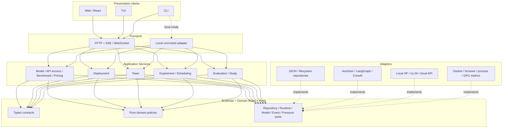
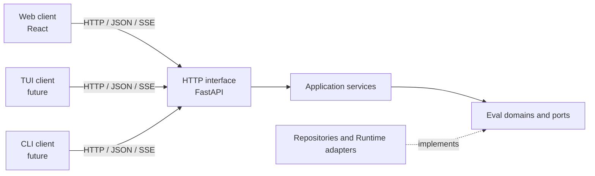

# 4.1 工程原则、依赖边界与模块地图

[返回第 4 章索引](04-implementation-contracts.md) · [下一部分：接口与生命周期](04-interface-and-lifecycle-contracts.md)

### 4.1.1 采用的工程原则

LycheeMAS Eval 已经是中型研究软件，不能继续依靠“某个脚本能跑”作为唯一质量标准。这里采用的软件工程原则及其在本项目中的落点如下。

| 原则 | 本项目中的含义 | 审查问题 |
|---|---|---|
| 关注点分离 / 单一职责 | 注册、校验、调度策略、进程生命周期、HTTP、UI、观测和评分分别归属独立模块 | 这个文件是否同时在做业务决策、I/O 和界面传输？ |
| 高内聚、低耦合 | 同一模块围绕一种变化原因组织；通过稳定合同协作，不读取对方私有字段 | 改一个 benchmark scorer 是否会迫使 Scheduler 或 UI 一起改？ |
| 依赖倒置 | 核心策略依赖抽象输入，不依赖 FastAPI、React、AutoGen 或具体文件系统 | 纯策略能否用普通字典和假依赖完成单测？ |
| 显式依赖 | 时钟、指标读取器、Registry 和 RuntimeAdapter 由构造参数或函数参数传入 | 测试是否需要 monkeypatch 隐藏全局状态或别的类的私有方法？ |
| 封装与契约 | Spec、Instance、Event、Metric 和 RuntimeAdapter 有明确 schema、校验和错误语义 | 调用者是否绕过注册表直接拼内部 JSON？ |
| 单一事实来源 | 配置以注册表 JSON 为准，运行事实以 EventLog 为准，派生视图可以重建 | 同一字段是否在 YAML、JSON、代码默认值和 UI 中各维护一份？ |
| KISS / YAGNI | 先实现当前研究问题需要的最小完整合同，不为假设需求叠加兼容层 | 这个分支、别名或 fallback 是否有真实使用者和测试？ |
| DRY 但不错误抽象 | 重复规则集中；只因代码长得像而语义不同的 scorer 不强行合并 | 去重后是否反而隐藏了 benchmark 的官方差异？ |
| 可复现与确定性 | 保存配置快照、版本、seed、抽样范围和失败事实；派生分析可重新生成 | 同一 EventLog 能否重建同一结果和指标？ |
| 失败隔离与幂等 | 单 Trial 失败不破坏其他 Trial；prepare、分析、恢复和状态写入可重复执行 | 中断后能否确认已经完成什么，并安全继续？ |
| 可观测性属于合同 | 队列、模型、工具、成本和评分事件不是临时日志，而是研究证据 | 失败发生在 Trial 完成前时是否仍有无损证据？ |
| 性能预算与按需加载 | 首屏、列表和详情有不同 read model；大目录、日志和实例详情延迟加载 | 打开环境页是否扫描了所有 runs 和 ExperimentInstance？ |
| 测试与风险匹配 | 纯算法做单元测试，注册表做合同测试，API 做集成测试，关键界面做构建和视觉测试 | 测试是在验证公开行为，还是锁死旧私有实现？ |
| 小步、可审查变更 | 每次重构保持一个清晰目标、配套测试和可解释 diff | 变更能否在不理解整个系统的情况下被可靠审查？ |

这些原则不是本项目自造的术语。参考依据包括 [CMU SEI 的软件质量属性与架构推理](https://www.sei.cmu.edu/library/reasoning-about-software-quality-attributes/)、[Microsoft 的架构原则](https://learn.microsoft.com/en-us/dotnet/architecture/modern-web-apps-azure/architectural-principles)、[Microsoft 的显式依赖说明](https://learn.microsoft.com/en-us/dotnet/architecture/modern-web-apps-azure/develop-asp-net-core-mvc-apps)、[Google 的小变更与代码审查实践](https://google.github.io/eng-practices/review/developer/small-cls.html)以及 [React 的代码分割建议](https://react.dev/learn/build-a-react-app-from-scratch#code-splitting)。

### 4.1.2 强制依赖边界

1. `eval/benchmarks/` 可以依赖 benchmark 公共合同和下载工具，不能依赖 Studio API 或前端。
2. `eval/scheduling/admission.py` 与 `projections.py` 必须保持确定性，不允许 FastAPI、进程、文件或网络 I/O。
3. `scheduling/pressure.py` 只保留无 I/O 的单域摘要函数；`deployment_pressure.py` 负责采集 provider/GPU telemetry 并形成部署健康反馈；`scheduling/manager.py` 只消费同一个共享 monitor。
4. `experiment_registry.py` 负责 Spec/Instance 的规范化和持久化，不负责启动进程或计算压力。
5. `workspace_catalog.py` 与各领域 projector 负责页面级只读投影；`application/` 负责编排用例；`transport/http/` 只做 HTTP 参数和错误翻译；`api.py` 只做依赖装配和静态页面入口。
6. React 视图只能调用 API 合同，不能推断磁盘注册表格式或补写后端默认值。
7. RuntimeAdapter 可以适配框架原生语义，但必须把语义差异写入 BindingReport，不能静默近似。
8. EventLog 是唯一无损运行事实；Result Projection、Execution Trace、Evidence 和 Metrics 不得反向修改 EventLog。

`tests/test_eval_architecture.py` 对其中可机械验证的边界做回归检查。架构测试不替代代码审查，但可以防止压力公式重新回流到生命周期类、页面再次依赖全量 bootstrap 等明显倒退。

### 4.1.3 控制面、执行面与数据面

这三个“面”是职责边界，不是三套彼此独立的程序：

| 分层 | 负责什么 | 主要对象与模块 | 不应负责什么 |
|---|---|---|---|
| 控制面 | 注册、实例化、队列、准入、健康检查和生命周期 | Spec/Instance Registry、Studio API、Scheduler、Pricing | 不直接实现 Agent 对话、工具执行或 benchmark 评分 |
| 执行面 | 对一个 Trial 运行团队、模型和工具，并忠实发出事件 | Runner、RuntimeAdapter、Model Gateway、Browser、Sandbox | 不决定研究聚合口径，不直接修改注册表定义 |
| 数据与评测面 | 准备 Case、执行官方 scorer、保存无损事实并派生分析 | Benchmark Adapter、EventLog、Projection、Evidence、Metric、Study | 不反向控制 Agent，也不把派生指标写回原始 Event |

一次正式运行由控制面创建和接纳 Trial，执行面消费冻结快照并产生 Event，数据与评测面据此评分和分析。三者通过 Spec/Instance、运行快照和 RunEvent 合同连接；任何一层读取另一层私有文件或隐式默认值，都会破坏可复现性。

### 4.1.4 模块地图

| 逻辑模块 | 当前主要文件 | 目标所有权与单一职责 |
|---|---|---|
| Environment | `eval/environment/service.py` | Python/Conda、依赖 profile 与环境可用性探测 |
| Model | `eval/models/registry.py`、`eval/application/read_models/catalog.py`、`eval/contracts/lifecycle.py` | ModelSpec 的逻辑模型身份与固有能力；ModelInstance 的本地文件下载、引用、扫描、校验和清理 |
| API Access | `eval/apis/registry.py`、`eval/application/read_models/catalog.py`、`eval/contracts/lifecycle.py` | APISpec/Instance、endpoint、SecretReference、鉴权、限流、连通性和协议能力探测；不拥有模型定义 |
| Pricing | `eval/pricing/registry.py`、`eval/pricing/costing.py` | PricingSpec/Instance、部署价格绑定和确定性成本计算 |
| Deployment | `eval/deployments/registry.py`、`eval/deployments/probes.py`、`eval/deployments/vllm_launch.py`、`runtime/adapters/inference/deployment_pool.py` | Registry 持久化部署事实；Probe 验证服务能力；vLLM launch 只负责命令/环境；DeploymentPool 绑定运行期 endpoint |
| Secret resolution | Deployment/API 配置与进程环境装配 | 只把 SecretReference 在最后时刻解析为进程内凭据；禁止进入 Spec、Event 和 API 响应 |
| Deployment pressure | `eval/deployments/pressure.py`、`eval/scheduling/pressure.py`、`runtime/adapters/inference/vllm_metrics.py` | vLLM/GPU/API 分域 telemetry、健康窗口和压力快照；Deployment 是唯一所有者，Scheduler 只读 |
| Team contract | `eval/teams/contracts.py`、`eval/teams/registry.py` | Node/Relation/ResultContract 等 TeamSpec 事实、严格校验和持久化 |
| Team compilation | `eval/teams/compiler.py`、`runtime/coordination/compiler.py` | TeamSpec 到 CoordinationIR、FrameworkPlanCompiler、框架能力和本地执行计划 |
| Team binding | `eval/teams/instances.py` | Node 到 DeploymentInstance 的绑定、FrameworkBinding 与 BindingReport |
| Experiment definition | `eval/experiments/registry.py`、`eval/experiments/finalization.py`、`eval/contracts/specs.py` | ExperimentSpec/Instance、运行策略、队列阶段、配置指纹，以及 Evaluation/Metrics/Instance 的幂等终态收口与 reconciliation |
| Experiment assembly | `eval/application/experiments.py`、`eval/experiments/compiler.py` | 解析 Spec/Instance 引用，形成 FrozenExperiment、不可变运行快照与 RunLaunchPlan |
| Experiment queue | `eval/scheduling/manager.py`、`eval/scheduling/launch_lifecycle.py`、`eval/experiments/registry.py` | Manager 拥有队列锁和准入循环；LaunchLifecycle 拥有 compile/start/resume/monitor/finalize/recovery；Application Service 不直接操作线程 |
| Trial scheduling | `eval/scheduling/admission.py`、`eval/scheduling/projections.py` | TrialAdmissionQueue、RunningTrialPool、AdmissionPolicy 与只读投影 |
| Run supervision | `eval/scheduling/jobs.py`、`eval/scheduling/run_supervisor.py`、`eval/scheduling/manager.py` | 子进程/tmux、launch/control/status、drain/stop/resume 和孤儿恢复；RunSupervisor 独立拥有 monitor thread 与 terminal/release callback |
| Run/Trial execution | `scripts/run_mas.py`、`eval/runner/`、`eval/runner/run_finalization.py`、`runtime/contracts/runtime.py` | CLI 只组合进程生命周期；BackendAssembly 物化后端，RunCoordinator 组织 Run，TrialPoolController 管 Runner 并发/准入，TrialExecutor 组织 Attempt；RunFinalization 是 stopped/paused/failed/complete 的唯一写入点 |
| Benchmark identity/data | `eval/benchmarks/assets.py`、`eval/benchmarks/manifest.py`、`registry.py` | BenchmarkSpec/Instance、数据下载/导入/扫描/prepare、健康和实现绑定 |
| Benchmark execution semantics | `eval/benchmarks/base.py`、`*.py`、`sampling.py`、`common.py` | BenchmarkPlugin、case、附件、工具声明、Prediction 转换、官方 scorer 和聚合 |
| Runtime contract/factory | `runtime/contracts/runtime.py`、`runtime/adapters/frameworks/factory.py` | RuntimePort、RuntimeAdapter factory 与能力报告 |
| AutoGen adapter | `runtime/adapters/frameworks/autogen/runtime.py`、`autogen/client.py`、`autogen/coordination.py`、`autogen/events.py`、`runtime/coordination/group_chat.py` | Runtime 组合 AutoGen 原生 Team/GroupChat；client 适配模型；coordination 构造选择/终止；events 规范化工具与浏览器事件 |
| LangGraph adapter | `runtime/adapters/frameworks/langgraph/runtime.py` | 构造并运行 LangGraph 原生 StateGraph/路由，映射事件和结果 |
| CrewAI adapter | `runtime/adapters/frameworks/crewai/runtime.py` | 构造并运行 CrewAI Crew/Process/Manager，映射事件和结果 |
| Runtime shared services | `runtime/adapters/frameworks/base.py`、`runtime/workspaces/service.py`、`runtime/tools/code_execution.py`、`runtime/results/projection.py` | LangGraph/CrewAI 共用模型网关外壳；三个 adapter 组合 Workspace、CodeExecution 和 ResultProjection 窄服务 |
| Runtime conformance | `runtime/conformance/report.py`、`tests/test_runtime_conformance.py` | 把 BindingReport、Control/Message/Data、工具证据和 ResultContract 汇总为运行期可核验报告；不比较随机文本是否逐字一致 |
| Model gateway | `runtime/model/gateway.py`、`runtime/model/token_budget.py`、`runtime/execution/seeding.py` | 规范化模型请求、上下文与输出预算、seed、usage 和 provider 响应 |
| Inference adapters | `runtime/adapters/inference/hf.py`、`runtime/adapters/inference/openai_compatible.py` | Local HF 使用原生 HF adapter；vLLM 与云 API 都使用 OpenAI-compatible 模型协议。vLLM 专属启动与 telemetry 分别属于 Deployment 和 metrics adapter，不存在第二套 completion client |
| Tool/workspace | `runtime/tools/portable.py`、`runtime/tools/code_execution.py`、`runtime/workspaces/service.py`、`runtime/adapters/infrastructure/docker.py` | 工具绑定/执行、workspace、sandbox 和 artifact 生命周期 |
| Result contract | `runtime/results/contract.py` | 合法 submitter、Text/Action/Patch 提交收集、验证和失败事实 |
| Network/proxy | `runtime/adapters/infrastructure/proxy.py`、Experiment network config | 模型、浏览器和下载操作的显式网络与代理策略 |
| EventLog | `runtime/events/store.py`、`eval/evaluation/events.py` | 无损 EventDraft/RunEvent、分片、顺序读取和评测事件 |
| Result/Trace projection | `eval/evaluation/projections.py`、`eval/application/read_models/run_events.py` | 从 EventLog 派生 Prediction、Result Projection 和 Execution Trace |
| Benchmark evaluation | `eval/evaluation/evaluators/run_evaluation.py` | 组织 Prediction、官方 scorer、EvaluationResult 和增量/重跑评分 |
| Evidence | `eval/evaluation/evidence/normalizer.py` | 从 RunEvent 生成可追溯、带适用性的规范化指标证据 |
| Metric | `eval/evaluation/metrics_registry/`、`eval/evaluation/evaluators/metric_evaluator.py`、`eval/evaluation/evaluators/profiles.py` | Metric Contract、Registry、applicability、profile 和四类指标计算 |
| Contamination | `eval/evaluation/contamination.py` | case identity、网页答案污染和泄漏审计 |
| Study/reporting | `eval/evaluation/studies/`、`eval/evaluation/reports/benchmark_excel.py` | 跨 Run 聚合、覆盖率、统计分析及 Excel/论文结果导出 |
| Application services | `eval/application/` | Web/TUI/CLI 可复用的按领域 command/query/use-case 编排；当前主要剩类型化合同建设 |
| Page read models | `eval/application/read_models/` | Resource/Deployment/Team/Experiment/Run 页面所需的客户端无关只读投影 |
| HTTP/stream transport | `eval/interfaces/http/` | Router 只负责 FastAPI 参数、序列化和状态码，不承载业务规则 |
| Server composition | `apps/eval/server/` | 创建 Repository、Application Service、Scheduler 和 Router，提供 Web 静态文件；不拥有领域规则 |
| Frontend presentation | `apps/eval/web/src/` | typed API client、页面、图表、交互、搜索和分页，不计算领域规则 |
| Persistence | `configs/eval_studio/`、`data/`、`runs/` | Spec/Instance、资产、launch control、Event shards、artifact 和派生报告 |

#### 4.1.4.1 全模块交互总图（规范开发蓝图）

下图覆盖 Eval Studio 的全部**逻辑模块**、持久化边界、第三方 Adapter 和外部系统。它是开发时判断所有权与依赖方向的规范图，而不是页面导航图。一个逻辑模块可以由多个 Python/TypeScript 文件实现，但任何新增模块都必须先在图中找到位置，或先更新本图说明为什么需要新的边界。

交互线型统一如下：

| 线型 | 语义 | 允许传递的内容 |
|---|---|---|
| `A --> B` | 同步命令、查询或类型化领域数据 | Command、Query、Spec/Instance、Plan、Prediction、Report |
| `A -.-> B` | B 实现 A 的 Port，或 A 读取 B 的外部 telemetry | 只通过 Port Schema，不泄漏第三方私有对象 |
| `A ==> B` | 追加式事实、事件或产物流 | EventDraft、RunEvent、Artifact；不能反向修改来源 |

```mermaid
flowchart TB
    subgraph CLIENT["客户端与展示层"]
        direction LR
        WEB["Web / React"]
        TUI["TUI"]
        CLI["CLI / scripts"]
    end

    subgraph TRANSPORT["Transport 与页面查询"]
        direction LR
        HTTP["FastAPI HTTP router"]
        STREAM["SSE / WebSocket progress stream"]
        LOCAL["Local CLI transport"]
        CMD["StudioCommandService"]
        QUERY["StudioQueryService"]
        PAGE["Versioned PageReadModel"]
    end

    subgraph APPLICATION["按领域组织的 Application Services"]
        direction LR
        ENVAPP["EnvironmentApplicationService"]
        MODELAPP["ModelApplicationService"]
        APIAPP["APIAccessApplicationService"]
        BENCHAPP["BenchmarkApplicationService"]
        PRICEAPP["PricingApplicationService"]
        DEPAPP["DeploymentApplicationService"]
        TEAMAPP["TeamApplicationService"]
        EXPAPP["ExperimentApplicationService"]
        SCHEDAPP["SchedulingApplicationService"]
        EVALAPP["EvaluationApplicationService"]
    end

    subgraph CONTROL["控制面领域模块"]
        direction TB
        subgraph ENVIRONMENT["Environment"]
            ENVPROBE["EnvironmentProbe / profiles"]
        end
        subgraph MODELRESOURCE["Model"]
            MODELREPO["ModelSpec / ModelInstance Repository"]
            MODELACQUIRE["ModelAssetAcquirer\ndownload / reference / scan / release"]
        end
        subgraph APIRESOURCE["API Access"]
            APIREPO["APISpec / APIInstance Repository"]
            APIPROBE["API connectivity / capability probe"]
        end
        subgraph PRICING["Pricing"]
            PRICEREPO["Pricing Repository"]
            PRICERESOLVE["PricingResolver / CostCalculator"]
        end
        subgraph DEPLOYMENT["Deployment"]
            DEPREPO["Deployment Repository"]
            PROVISION["DeploymentProvisioner / HealthProbe"]
            PRESSURE["DeploymentPressureService\nvLLM / GPU / API snapshots"]
            SECRET["SecretResolver"]
        end
        subgraph TEAMDOMAIN["Team"]
            TEAMREPO["TeamSpec / TeamInstance Repositories"]
            TEAMVALID["TeamSpecValidator"]
            COORD["CoordinationCompiler / CoordinationIR"]
            FWCOMP["FrameworkPlanCompiler Port"]
            BINDER["TeamInstanceBinder / BindingReport"]
        end
        subgraph EXPERIMENT["Experiment"]
            EXPREPO["ExperimentSpec / Instance Repository"]
            ASSEMBLE["ExperimentAssembler / FrozenExperiment"]
            PLAN["ExecutionPlanCompiler / RunLaunchPlan"]
        end
        subgraph SCHEDULING["Scheduling"]
            EXPQUEUE["ExperimentQueueRepository"]
            TRIALQUEUE["TrialQueueBuilder / TrialAdmissionQueue"]
            ADMISSION["AdmissionPolicy"]
            POOLPROJ["RunningTrialPool / AdmissionStatus projections"]
        end
    end

    subgraph BENCHMARK["Benchmark 领域"]
        direction LR
        BENCHREPO["BenchmarkSpec / BenchmarkInstance Repository"]
        BENCHACQUIRE["BenchmarkDataAcquirer\ndownload / import / scan / prepare"]
        BENCHREG["Benchmark implementation registry"]
        BENCHPLUGIN["BenchmarkPlugin facade"]
        CASES["CaseLoader / CaseSampler"]
        MATERIALIZE["Case materialization / tool declarations"]
        SCORER["Official BenchmarkScorer"]
    end

    subgraph EXECUTION["Run、Trial 与执行生命周期"]
        direction LR
        SUPERVISOR["RunSupervisor / JobManager"]
        RUNWORKER["RunCoordinator"]
        BACKENDASSEMBLY["BackendAssembly"]
        TRIALPOOL["TrialPoolController\nlocal concurrency + admissions"]
        TRIALRUNNER["TrialExecutor\nTrial -> Attempts -> Outcome"]
        RUNCONTROL["RunControlPort\npermit / drain / stop / resume"]
        RESULT["ResultContract validator / submission collector"]
    end

    subgraph RUNTIME["Runtime 公共能力与跨框架 Port"]
        direction LR
        RUNTIMEPORT["RuntimePort / RuntimeAdapter contract"]
        MODELGW["ModelGateway"]
        MODELBACKEND["ModelBackend Port"]
        TOOLPROVIDER["ToolProvider / ToolExecutor Port"]
        WORKSPACE["WorkspaceService / ArtifactStore"]
        EVENTPORT["EventSink / EventSource"]
        BUDGET["TokenBudget / Context / Seed policies"]
        NETWORK["Network / Proxy policy"]
    end

    subgraph FRAMEWORKADAPTERS["Framework Adapters"]
        direction LR
        AUTOGEN["AutoGen RuntimeAdapter"]
        LANGGRAPH["LangGraph RuntimeAdapter"]
        CREWAI["CrewAI RuntimeAdapter"]
    end

    subgraph INFADAPTERS["Inference Adapters"]
        direction LR
        HF["Local HF backend"]
        VLLM["vLLM OpenAI-compatible backend"]
        CLOUD["Cloud API backend"]
    end

    subgraph TOOLADAPTERS["Tool 与基础设施 Adapters"]
        direction LR
        DOCKER["Docker sandbox"]
        BROWSER["Browser / WebSurfer"]
        FILECODE["Filesystem / code / terminal tools"]
        PROCESS["subprocess / tmux / OS process"]
    end

    subgraph OBSERVABILITY["无损事实、评测与研究分析"]
        direction LR
        EVENTLOG["RunEvent log / shard reader"]
        PROJECTION["Result Projection / Execution Trace"]
        EVIDENCE["EvidenceNormalizer"]
        EVALUATION["RunEvaluation / scoring events"]
        METRICREG["MetricRegistry / applicability"]
        METRICEVAL["MetricEvaluator / EvaluationProfile"]
        CONTAM["Contamination audit"]
        STUDY["StudyAggregator / coverage / statistics"]
        REPORT["Report / Excel export"]
    end

    subgraph STORAGE["持久化与运行产物"]
        direction LR
        CONFIG["configs/eval_studio\nSpec / Instance JSON"]
        SNAPSHOT["Frozen run configuration snapshot"]
        ASSETS["data/benchmarks + models\nraw / prepared / references"]
        LAUNCH["runs/eval_studio/launches\njob / control / status / log"]
        EVENTS["run_events/*.jsonl"]
        ARTIFACTS["workspace / patch / screenshot / files"]
        DERIVED["predictions / evaluation / metrics / studies"]
    end

    subgraph EXTERNAL["外部系统与第三方实现"]
        direction LR
        PYENV["Python / Conda / packages"]
        SOURCES["Hugging Face / ModelScope / GitHub / local assets"]
        FWL["AutoGen / LangGraph / CrewAI libraries"]
        PROVIDERS["vLLM service / local GPU / cloud providers"]
        TOOLSYS["Docker daemon / Chromium / host filesystem"]
        TELEMETRY["vLLM metrics / nvidia-smi / API rate signals"]
    end

    WEB -->|"typed Command / Query"| HTTP
    TUI -->|"typed Command / Query"| HTTP
    CLI -->|"remote mode"| HTTP
    CLI -->|"local mode"| LOCAL
    HTTP --> CMD
    HTTP --> QUERY
    LOCAL --> CMD
    LOCAL --> QUERY
    QUERY --> PAGE
    PAGE --> HTTP
    QUERY --> STREAM
    STREAM --> WEB
    STREAM --> TUI
    STREAM --> CLI

    CMD --> ENVAPP
    CMD --> MODELAPP
    CMD --> APIAPP
    CMD --> BENCHAPP
    CMD --> PRICEAPP
    CMD --> DEPAPP
    CMD --> TEAMAPP
    CMD --> EXPAPP
    CMD --> SCHEDAPP
    CMD --> EVALAPP

    ENVAPP --> ENVPROBE
    MODELAPP --> MODELREPO
    MODELAPP --> MODELACQUIRE
    APIAPP --> APIREPO
    APIAPP --> APIPROBE
    BENCHAPP --> BENCHREPO
    BENCHAPP --> BENCHACQUIRE
    BENCHAPP --> BENCHREG
    BENCHAPP --> BENCHPLUGIN
    PRICEAPP --> PRICEREPO
    PRICEAPP --> PRICERESOLVE
    DEPAPP --> DEPREPO
    DEPAPP --> PROVISION
    DEPAPP --> PRESSURE
    DEPAPP --> SECRET
    TEAMAPP --> TEAMREPO
    TEAMAPP --> TEAMVALID
    TEAMAPP --> COORD
    TEAMAPP --> BINDER
    EXPAPP --> EXPREPO
    EXPAPP --> ASSEMBLE
    EXPAPP --> PLAN
    SCHEDAPP --> EXPQUEUE
    SCHEDAPP --> TRIALQUEUE
    SCHEDAPP --> ADMISSION
    SCHEDAPP --> POOLPROJ
    SCHEDAPP --> SUPERVISOR
    SCHEDAPP --> RUNCONTROL
    EVALAPP --> PROJECTION
    EVALAPP --> EVIDENCE
    EVALAPP --> EVALUATION
    EVALAPP --> METRICEVAL
    EVALAPP --> CONTAM
    EVALAPP --> STUDY

    MODELREPO -->|"ModelSpec + local ModelInstance"| DEPAPP
    APIREPO -->|"APISpec + APIInstance"| DEPAPP
    PRICEREPO -->|"PricingInstance"| PRICERESOLVE
    PRICERESOLVE -->|"PricingBinding"| DEPAPP
    DEPREPO -->|"DeploymentInstance + capabilities"| TEAMAPP
    TEAMREPO --> TEAMVALID
    TEAMVALID -->|"NormalizedTeamSpec"| COORD
    COORD -->|"CoordinationIR"| FWCOMP
    FWCOMP -->|"FrameworkBinding"| BINDER
    BENCHREPO -->|"BenchmarkInstance"| EXPAPP
    TEAMREPO -->|"TeamSpec"| EXPAPP
    BINDER -->|"TeamInstance + FrameworkBinding"| EXPAPP
    EXPREPO --> ASSEMBLE
    ASSEMBLE -->|"FrozenExperiment"| PLAN
    PLAN -->|"generation / context policies"| BUDGET
    PLAN -->|"network policy"| NETWORK
    EXPREPO -->|"QueueEntry"| EXPQUEUE
    EXPQUEUE --> TRIALQUEUE
    POOLPROJ -->|"RunningTrialPool"| ADMISSION
    PRESSURE -->|"DomainPressureSnapshot"| ADMISSION
    TRIALQUEUE --> ADMISSION
    ADMISSION -->|"AdmissionDecision / TrialPermit"| RUNCONTROL
    RUNCONTROL --> TRIALPOOL
    PLAN --> SUPERVISOR
    SUPERVISOR --> RUNWORKER
    RUNWORKER --> BACKENDASSEMBLY
    RUNWORKER --> TRIALPOOL
    BACKENDASSEMBLY --> MODELBACKEND
    TRIALPOOL --> TRIALRUNNER

    BENCHREPO --> BENCHPLUGIN
    BENCHREG --> BENCHPLUGIN
    BENCHACQUIRE --> BENCHPLUGIN
    BENCHPLUGIN --> CASES
    CASES -->|"BenchmarkCase / TrialPlan"| TRIALRUNNER
    BENCHPLUGIN --> MATERIALIZE
    MATERIALIZE -->|"MaterializedCase / ToolBundle"| TRIALRUNNER
    TRIALRUNNER -->|"AttemptExecutionRequest"| RUNTIMEPORT
    RUNTIMEPORT -->|"RuntimeExecutionResult"| TRIALRUNNER
    TRIALRUNNER --> RESULT
    BENCHPLUGIN --> SCORER

    RUNTIMEPORT -. "implemented by" .-> AUTOGEN
    RUNTIMEPORT -. "implemented by" .-> LANGGRAPH
    RUNTIMEPORT -. "implemented by" .-> CREWAI
    FWCOMP -. "implemented by" .-> AUTOGEN
    FWCOMP -. "implemented by" .-> LANGGRAPH
    FWCOMP -. "implemented by" .-> CREWAI
    AUTOGEN --> MODELGW
    LANGGRAPH --> MODELGW
    CREWAI --> MODELGW
    AUTOGEN --> TOOLPROVIDER
    LANGGRAPH --> TOOLPROVIDER
    CREWAI --> TOOLPROVIDER
    AUTOGEN --> WORKSPACE
    LANGGRAPH --> WORKSPACE
    CREWAI --> WORKSPACE
    BUDGET --> MODELGW
    NETWORK --> MODELGW
    NETWORK --> TOOLPROVIDER
    SECRET -->|"ephemeral credentials"| MODELGW
    MODELGW --> MODELBACKEND
    MODELBACKEND -. "implemented by" .-> HF
    MODELBACKEND -. "implemented by" .-> VLLM
    MODELBACKEND -. "implemented by" .-> CLOUD
    TOOLPROVIDER -. "implemented by" .-> DOCKER
    TOOLPROVIDER -. "implemented by" .-> BROWSER
    TOOLPROVIDER -. "implemented by" .-> FILECODE
    WORKSPACE -. "implemented by" .-> DOCKER
    WORKSPACE -. "implemented by" .-> FILECODE

    RUNWORKER ==>|"run lifecycle events"| EVENTPORT
    TRIALPOOL ==>|"admission / concurrency events"| EVENTPORT
    TRIALRUNNER ==>|"trial / attempt / outcome events"| EVENTPORT
    RESULT ==>|"result-contract events"| EVENTPORT
    AUTOGEN ==>|"framework events"| EVENTPORT
    LANGGRAPH ==>|"framework events"| EVENTPORT
    CREWAI ==>|"framework events"| EVENTPORT
    MODELGW ==>|"model-call events"| EVENTPORT
    TOOLPROVIDER ==>|"tool events"| EVENTPORT
    WORKSPACE ==>|"artifact events"| EVENTPORT
    SCORER ==>|"official evaluation events"| EVENTPORT
    EVENTPORT ==> EVENTLOG
    EVENTLOG --> PROJECTION
    EVENTLOG --> EVIDENCE
    EVENTLOG --> CONTAM
    PROJECTION -->|"Prediction"| SCORER
    PROJECTION -->|"Result / Trace"| EVALUATION
    SCORER -->|"BenchmarkEvaluationResult"| EVALUATION
    EVIDENCE --> METRICEVAL
    EVALUATION --> METRICEVAL
    METRICREG --> METRICEVAL
    PRICERESOLVE -->|"CostRecord"| METRICEVAL
    METRICEVAL --> STUDY
    STUDY --> REPORT

    QUERY --> ENVPROBE
    QUERY --> MODELREPO
    QUERY --> APIREPO
    QUERY --> BENCHREPO
    QUERY --> PRICEREPO
    QUERY --> DEPREPO
    QUERY --> PRESSURE
    QUERY --> TEAMREPO
    QUERY --> EXPREPO
    QUERY --> POOLPROJ
    QUERY --> PROJECTION
    QUERY --> METRICREG
    QUERY --> STUDY
    QUERY --> REPORT
    DERIVED -->|"stored reports"| QUERY

    MODELREPO --> CONFIG
    APIREPO --> CONFIG
    BENCHREPO --> CONFIG
    PRICEREPO --> CONFIG
    DEPREPO --> CONFIG
    TEAMREPO --> CONFIG
    EXPREPO --> CONFIG
    EXPQUEUE --> CONFIG
    MODELACQUIRE ==> ASSETS
    BENCHACQUIRE ==> ASSETS
    ASSEMBLE ==>|"immutable configuration"| SNAPSHOT
    SNAPSHOT --> RUNWORKER
    SUPERVISOR ==> LAUNCH
    RUNCONTROL ==> LAUNCH
    EVENTLOG ==> EVENTS
    WORKSPACE ==> ARTIFACTS
    PROJECTION ==> DERIVED
    EVALUATION ==> DERIVED
    METRICEVAL ==> DERIVED
    STUDY ==> DERIVED
    REPORT ==> DERIVED

    ENVPROBE -. "probe" .-> PYENV
    MODELACQUIRE -. "download / scan" .-> SOURCES
    BENCHACQUIRE -. "download / scan" .-> SOURCES
    APIPROBE -. "minimal completion / capability query" .-> PROVIDERS
    AUTOGEN -. "native API" .-> FWL
    LANGGRAPH -. "native API" .-> FWL
    CREWAI -. "native API" .-> FWL
    HF -. "transformers" .-> PROVIDERS
    VLLM -. "HTTP /metrics" .-> PROVIDERS
    CLOUD -. "HTTPS" .-> PROVIDERS
    PROVISION -. "start / stop / probe" .-> PROVIDERS
    PROVIDERS ==>|"service telemetry"| TELEMETRY
    DOCKER -. "Docker API" .-> TOOLSYS
    BROWSER -. "Playwright" .-> TOOLSYS
    FILECODE -. "filesystem / process" .-> TOOLSYS
    PROCESS -. "OS API" .-> TOOLSYS
    SUPERVISOR -. "subprocess / tmux" .-> PROCESS
    PRESSURE -. "sample" .-> TELEMETRY
```



图中的模块按职责可完整归为：客户端与展示、Transport、Application Service、Environment、Model、API Access、Pricing、Deployment、Team、Experiment、Scheduling、Benchmark、Run/Trial、Runtime、Framework Adapter、Inference Adapter、Tool/Infrastructure Adapter、Event、Projection/Evidence/Evaluation/Metric/Study、Storage 和 External Systems。后面各节的合同表必须能逐项映射回这张图；如果出现无法归属的新接口，先更新所有权和交互合同，再开始写实现。

#### 4.1.4.2 一级模块与子模块目录

| 一级模块 | 子模块 | 模块拥有的事实或能力 |
|---|---|---|
| 客户端与展示 | Web/React、TUI、CLI/scripts | 用户输入、页面状态和展示；不拥有任何业务规则 |
| Transport 与查询 | FastAPI router、SSE/WebSocket、Local CLI transport、StudioCommandService、StudioQueryService、PageReadModel | Command/Query 传输、序列化、状态码、进度流和只读页面投影 |
| Application Services | Environment、Model、API Access、Benchmark、Pricing、Deployment、Team、Experiment、Scheduling、Evaluation Application Service | 一个用户用例的校验与 Port 编排；不实现第三方框架细节 |
| Environment | EnvironmentProbe、installation profiles | Python/Conda、包、命令和基础能力可用性 |
| Model | ModelSpec/Instance Repository、ModelAssetAcquirer | 逻辑模型身份、固有能力以及本地模型文件的下载、引用、扫描、校验和清理 |
| API Access | APISpec/Instance Repository、SecretReference、connectivity/capability probe | 远程访问产品、协议、endpoint、凭据引用、限流、最小调用和访问能力事实；不重复定义模型 |
| Pricing | Pricing Repository、PricingResolver、CostCalculator | 计费规则、部署价格绑定、实际成本和 API 等价成本 |
| Deployment | Deployment Repository、DeploymentProvisioner、HealthProbe、DeploymentPressureService、SecretResolver | 推理服务实例、endpoint/process、健康、分域压力和临时凭据 |
| Team | TeamSpec/Instance Repository、TeamSpecValidator、CoordinationCompiler、FrameworkPlanCompiler、TeamInstanceBinder、BindingReport | 框架无关 Node/Relation、协调 IR、框架计划、部署绑定和语义差异 |
| Experiment | ExperimentSpec/Instance Repository、ExperimentAssembler、FrozenExperiment、ExecutionPlanCompiler、RunLaunchPlan | Benchmark/Team/运行策略装配、不可变快照和启动计划 |
| Scheduling | ExperimentQueueRepository、TrialQueueBuilder、TrialAdmissionQueue、AdmissionPolicy、RunningTrialPool、AdmissionStatus projection | 优先级、逐 Trial 待调度序列、准入和运行池读模型 |
| Benchmark | BenchmarkSpec/Instance Repository、BenchmarkDataAcquirer、implementation registry、BenchmarkPlugin、CaseLoader、CaseSampler、materializer、tool declarations、official scorer | 数据生命周期、Case、附件/工具和 benchmark 官方正确性；是 Benchmark 的唯一领域所有者 |
| Run/Trial execution | RunSupervisor、JobManager、RunControlPort、RunWorker、TrialRunner、ResultContract validator | 进程生命周期、Trial/Attempt、重试、控制和合法团队提交 |
| Runtime core | RuntimePort、ModelGateway、ModelBackend Port、ToolProvider/Executor、WorkspaceService、ArtifactStore、EventSink/Source、Budget/Context/Seed、NetworkPolicy | 三框架共享的执行合同和可组合公共能力 |
| Framework Adapters | AutoGen、LangGraph、CrewAI RuntimeAdapter | 将 FrameworkBinding 变成框架原生对象并由原生执行引擎运行 |
| Inference Adapters | Local HF、vLLM OpenAI-compatible、Cloud API backend | 一次模型 completion、provider payload、usage、finish reason 和错误映射 |
| Tool/Infrastructure Adapters | Docker sandbox、Browser/WebSurfer、filesystem/code/terminal、subprocess/tmux | 工具、浏览器、文件、代码沙盒和宿主进程具体实现 |
| Event 与评测分析 | RunEvent log、Result/Trace Projection、EvidenceNormalizer、RunEvaluation、MetricRegistry、MetricEvaluator、Contamination、StudyAggregator、Report/Excel export | 无损事实、Prediction、官方评分、四类指标、污染审计、跨 Run 统计和报告 |
| Persistence | Config store、asset roots、frozen snapshot、launch/control/status、event shards、workspace/artifacts、derived reports | 各类事实的持久化位置；不负责业务决策 |
| External Systems | Python/Conda、HF/ModelScope/GitHub/local assets、三框架库、vLLM/GPU/cloud provider、Docker/Chromium/filesystem、telemetry sources | 被 Adapter 调用的第三方系统，不进入核心领域合同 |

这里的 `StudioCommandService` 和 `StudioQueryService` 是跨客户端门面；真正的业务用例仍归属于各个按领域组织的 Application Service，不能再次把门面发展成新的巨型类。Studio 中的“资源中心”只是 Model、API、Benchmark 三个领域的聚合页面和查询投影，不是第四个 Resource 领域，也不拥有它们的 Repository。`Event 与评测分析` 在总图中拆成多个节点，是因为 Event、Projection、Evidence、Scoring、Metric 和 Study 有不同变化原因；表中合在一个一级模块只是为了目录索引，不表示应合并实现。

##### Model、API Access 与 Deployment 的边界

这三个模块不能合并成一个笼统的“模型资源”，也不能让 API 配置顺便成为另一份模型定义：

| 模块 | 回答的问题 | 拥有的事实 | 不应拥有 |
|---|---|---|---|
| Model | “这是什么模型，它理论上会什么？” | 厂商、模型族、参数规模、官方上下文上限、模态、工具调用/思考协议、provider model alias；本地文件来源与校验规则 | endpoint、API key、GPU 编号、TP/DP、服务进程和请求并发 |
| ModelInstance | “这台机器上是否有一份可用的本地模型文件？” | 本地或外部引用路径、revision、文件指纹、tokenizer/config 校验、managed 状态 | vLLM/HF 进程、远程 API endpoint |
| API Access | “通过什么远程产品和协议访问推理服务？” | provider、协议、base URL 模板、鉴权方式、SecretReference、账号级限流和 capability probe | 模型的固有能力、本地模型文件、部署进程 |
| APIInstance | “当前具体哪个 endpoint 和凭据引用可用？” | 实际 base URL、凭据引用、请求限额、共享属性、健康和实测协议能力 | 明文密钥、模型文件、团队角色参数 |
| Deployment | “怎样把一个模型变成真正可调用的推理后端？” | backend kind、ModelSpec 引用、APISpec 引用、运行参数、最大上下文、TP/DP、并发、价格绑定和生命周期策略 | 模型下载、API 凭据明文、Team 协作规则 |
| DeploymentInstance | “此刻哪个后端可以被角色调用？” | ModelSpec + ModelInstance 或 ModelSpec + APIInstance 的实际绑定、endpoint/process、健康和实测有效能力 | 重新定义模型、API 产品或 Team |

因此，本地 HF/vLLM 路径是 `ModelSpec + ModelInstance -> DeploymentSpec -> DeploymentInstance`；云 API 路径是 `ModelSpec + APISpec + APIInstance -> DeploymentSpec -> DeploymentInstance`。同一个 APIInstance 可以作为访问通道承载多个模型，由多个 DeploymentSpec 分别选择对应的 ModelSpec；同一个 ModelSpec 也可以通过本地 vLLM、共享 vLLM 和云 API 形成多个 DeploymentInstance。Role Binding 最终只绑定 DeploymentInstance，不直接绑定模型文件或 API。

能力也必须分层记录：ModelSpec 保存官方声明的固有能力，APIInstance 保存访问通道实测支持的请求协议，DeploymentInstance 保存最小调用后得到的**最终有效能力**。最终有效能力是前两者与具体推理后端配置的交集；例如模型理论上支持 tool call，并不表示某个 API endpoint 或当前 vLLM parser 已经正确支持。

该迁移已经完成：`normalize_api_spec()` 与 `normalize_api_instance()` 会直接拒绝 `model_id`、`model_info`、模型 `capabilities` 和 `thinking_protocol` 等过时字段。模型语义只来自 ModelSpec；APISpec 只保留访问产品、协议、鉴权、限流、endpoint 默认值和 `allowed_model_spec_ids`。资源中心只是 Model、API Access、Benchmark 三个领域的聚合页面，不拥有第四套 ResourceSpec/Instance。

Benchmark 在模块图中分成“身份/数据”和“执行语义”不是两个 Benchmark 真源：前者属于 Studio 控制面，管理 BenchmarkSpec/Instance、来源、下载、prepare 和健康；后者属于 Eval 数据面，管理 Case、附件、Prediction 转换、官方 scorer 与聚合。Model 也采用同样的两层边界：ModelSpec/Instance 管“模型是什么、文件在哪里”，Inference Adapter 管“怎样调用”；API Access 管 endpoint/凭据/协议，ModelGateway 管一次模型调用。三组边界都通过稳定 ID 引用，不复制对方事实。

#### 4.1.4.3 从任意前端到具体实现的分层摘要



这里最重要的不是方框数量，而是**业务依赖永远向内**：Application Service 可以依赖 Port，Adapter 实现 Port；Core 不能反向 import FastAPI、React、AutoGen 或 vLLM。Web/TUI/CLI 只是不同入口，因此新增 TUI 不应复制任何注册、调度、运行或评分代码。

#### 4.1.4.4 当前代码组织（已落地）

下图是当前磁盘上的真实结构，不是未来蓝图。`eval/` 和 `runtime/` 顶层都只保留 `__init__.py`；具体实现必须进入明确的领域或 Adapter 包。历史 `eval/control_plane/`、`runtime/backends/` 及其兼容入口已删除，架构测试会防止它们重新出现。

```text
src/lychee_mas/
├── eval/
│   ├── contracts/                 # 跨领域 Spec/Instance 与生命周期合同
│   ├── models/                    # ModelSpec/ModelInstance 注册、扫描与校验
│   ├── apis/                      # APISpec/APIInstance、鉴权引用与 endpoint
│   ├── pricing/                   # Pricing Registry 与确定性成本投影
│   ├── deployments/               # Registry、health probe、vLLM launch 与压力所有权
│   ├── teams/                     # TeamSpec 图合同、编译、Registry 与 TeamInstance
│   ├── experiments/               # Registry、冻结装配、进度与幂等终态收口
│   ├── scheduling/                # admission、queue、launch lifecycle、pressure 与 supervision
│   ├── benchmarks/                # Benchmark 实现、数据资产、case、tool 与官方 scorer
│   ├── evaluation/                # Event、Projection、Evidence、Metric、Report 与 Study
│   │   ├── evaluators/
│   │   ├── evidence/
│   │   ├── metrics_registry/
│   │   ├── reports/
│   │   └── studies/
│   ├── environment/               # Python/Conda 环境发现与健康检查
│   ├── infrastructure/            # JSON/filesystem 持久化 Adapter
│   ├── application/               # 交通方式无关的用例编排与 Port
│   │   └── read_models/           # Web/CLI/TUI 共用的页面投影
│   ├── interfaces/http/           # FastAPI Router 与 HTTP 错误翻译
│   └── runner/                    # Run/Trial worker、resume、artifact、backend assembly 与 Run 终态
├── runtime/
│   ├── contracts/                 # Runtime/MASGraph 公共合同
│   ├── coordination/              # TeamSpec 到 CoordinationIR/框架计划的编译
│   ├── execution/                 # Trial 并发政策与确定性 seed
│   ├── model/                     # ModelGateway、上下文与 token budget
│   ├── tools/                     # 便携工具与 CodeExecutorFactory
│   ├── workspaces/                # Trial workspace 与 artifact 生命周期
│   ├── events/                    # 无损 RunEvent 分片存储与读取
│   ├── results/                   # ResultContract 与确定性 result projection
│   ├── conformance/               # 跨框架运行期语义与证据报告
│   └── adapters/
│       ├── frameworks/            # AutoGen/LangGraph/CrewAI/Mock RuntimeAdapter
│       │   ├── autogen/
│       │   ├── langgraph/
│       │   └── crewai/
│       ├── inference/             # Local HF 与 OpenAI-compatible（云 API/vLLM）
│       └── infrastructure/        # Docker 与 proxy 等系统 Adapter
└── ...                            # LycheeMAS 原有非 Eval 模块

apps/eval/
├── server/                         # Python 服务端组合入口，不存放领域规则
├── web/                            # React Web 客户端，产品名 Eval Studio
│   └── src/
│       ├── api/                    # 由版本化 Schema 约束的 typed client
│       ├── pages/                  # Resource/Deployment/Team/Experiment/Run
│       ├── components/             # 无业务所有权的可复用展示组件
│       └── views/                  # PageReadModel 到页面的映射
├── tui/                            # 未来终端交互客户端；当前仅有边界 README
└── cli/                            # 未来用户管理 CLI；当前仅有边界 README
```

这些目录不追求形式上完全对称：只有真实存在独立合同、规则、投影或 Adapter 时才创建对应文件。所有权判定以“它因为哪种业务事实变化”为准：

- ModelSpec 和本地模型文件只由 `eval/models/` 拥有；API 访问通道只由 `eval/apis/` 拥有。
- 部署压力是 `eval/deployments/` 的事实；Scheduler 只读取快照，不采集 provider telemetry。
- Team 图合同与框架无关编译分属 `eval/teams/` 和 `runtime/coordination/`；框架代码只出现在 `runtime/adapters/frameworks/`。
- EventLog 的无损写入/读取属于 `runtime/events/`；评分、Evidence、Metric 和报告属于 `eval/evaluation/`。
- `application/` 编排用例，`interfaces/http/` 翻译 HTTP，`apps/eval/web/` 只展示；三者不复制领域规则。
- `teams/`、`experiments/`、`scheduling/`、`application/` 和 `interfaces/http/` 的 `__init__.py` 保持轻量；调用方直接从所有者模块导入，避免包初始化提前构造 Registry/Compiler 并形成循环依赖。

如果新代码无法归入上述所有者，先解决边界问题，不允许放回 `eval/`/`runtime/` 顶层，也不重建笼统的 `control_plane`、`backends` 或 `utils.py`。

#### 4.1.4.5 Web、TUI、CLI 与 Server 的关系

Web、TUI 和 CLI 是三个平等客户端，Server 是唯一远程控制入口，四者都不是领域逻辑所有者。Web 在浏览器执行；TUI 和 CLI 可以在服务器或个人电脑执行；它们通过同一版本化 HTTP API 发送命令、读取 PageReadModel，并通过 SSE/WebSocket 订阅运行进度。`apps/eval/server/` 只负责依赖装配和进程启动，真正用例位于 `eval/application/`，FastAPI Router 位于 `eval/interfaces/http/`。



这里还要区分两种 CLI：未来 `apps/eval/cli/` 是面向用户的控制面客户端；`scripts/run_mas.py` 是 Scheduler 启动的底层 Run Worker/可复现执行入口。前者不得直接读 Registry JSON 或复制 Scheduler 规则，后者也不承担资源注册和页面查询。

当前只实现 Server 与 Web。`apps/eval/tui/` 和 `apps/eval/cli/` 只有边界说明 README，没有空 `__init__.py` 或伪造入口；页面和文档不得把它们展示成已实现能力。第一个真实命令或界面切片出现时，再增加依赖、入口和 conformance test。

#### 4.1.4.6 新代码放置规则

| 新代码回答的问题 | 应放位置 | 示例 |
|---|---|---|
| “这个领域事实长什么样？” | 所有者模块的 `contracts.py` | `DomainPressureSnapshot` 放 Deployment，不放 Experiment |
| “不做 I/O 时如何判断？” | 所有者模块的 `rules.py` | Trial admission、result validity、case selection |
| “业务需要哪种可替换能力？” | 所有者模块的 `ports.py` | `DeploymentPressureProvider`、`RuntimePort` |
| “用户发起一次操作时按什么顺序办？” | 对应 Application Service | 实例化 Deployment、入队 Experiment、重新分析 Run |
| “怎样调用某个具体框架或系统？” | `adapters/` | CrewAI runtime、vLLM backend、JSON repository |
| “怎样通过网页、TUI、CLI 暴露？” | `eval/interfaces/` 和 `apps/eval/<client>/` | FastAPI route、CLI command、React page |
| “页面要怎样组合只读信息？” | `eval/application/read_models/` | Deployment pressure page、running-pool admission view |
| “这只是展示样式和交互吗？” | `apps/eval/web/` | 图、表格、按钮、搜索和分页 |

开发一个纵向功能时按固定顺序推进：先确定领域所有者和 Schema，再写纯规则与 Port，然后实现 Adapter 和 Application Service，最后接 HTTP/CLI/TUI 与页面；同时补合同测试、纯规则测试、Adapter conformance 和最小端到端 smoke。若一开始无法在上图中确定代码属于哪个模块，应先解决所有权问题，而不是新建 `utils.py` 或继续扩大 `api.py`。
