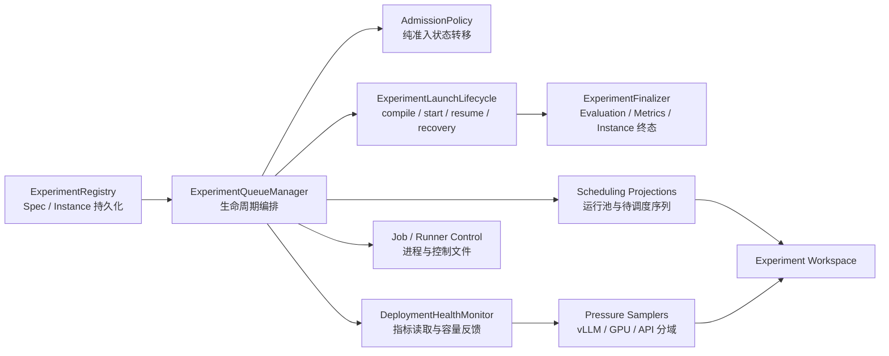

# 4.7 Experiment、Runner 与 Scheduler

[上一部分：Deployment 与推理](04-deployment-and-inference-contracts.md) · [返回第 4 章索引](04-implementation-contracts.md) · [下一部分：Observability 与 RunEvent](04-observability-and-event-contracts.md)

### 4.7.1 三层执行单元

- Run：一次 ExperimentInstance 执行产生的完整运行目录。
- Trial：一个 `(case_id, trial_index)` 的独立作答；以前常称 prediction sample。
- Attempt：同一 Trial 遇到运行异常后的重试。重试不改变 trial_index，也不重新获得一份 model-call 总额度。

`trials_per_case` 表示同一 case 独立作答多少次；`max_attempts_per_trial` 表示运行错误时最多尝试多少次。两者不能混淆。

Studio 自动生成的 Run 目录遵循：

```text
<runs_root>/<benchmark_spec_id>/<task>/<team_spec_id>/<method>/<experiment_spec_id>/<UTC_timestamp>
```

路径不使用单一 `model` 层，因为一个 TeamInstance 可以为不同 Node 绑定不同 DeploymentInstance。每个 Run 目录同时冻结 `project.json`、`team_spec.json`、`deployments.json`、`runtime_config.yaml` 和配置快照；`launch_dir` 保存 Studio 的启动控制与日志，`run_dir` 保存 Trial、Event、评分和分析产物，两者不能混用。

ExperimentSpec 还必须冻结 Evaluation 合同，不能让官方 scorer 或 Judge 只存在于一次手工命令：

| 字段 | 含义 |
|---|---|
| `evaluation.external_evaluator` | `auto/run/skip`；是否执行 benchmark 的 Run 级官方 scorer |
| `evaluation.profile_id` | 本次使用的标准化 Metric Profile，例如 `core`；它决定四类指标集合，不决定 Benchmark 官方评分口径 |
| `evaluation.hle_judge.model/base_url` | HLE Judge 的具体模型与 OpenAI-compatible 端点 |
| `evaluation.hle_judge.auth_mode/api_key_env` | Judge 鉴权合同；本地可信端点显式设为 `none`，不得只根据 URL 猜测 |
| `evaluation.hle_judge.workers/timeout_s/max_tokens` | Judge 并发、单请求超时和输出上限 |
| `evaluation.hle_judge.thinking_mode` | Judge 是否继承、开启或关闭模型 thinking；本地 Qwen Judge 必须显式冻结，不能依赖部署默认值 |
| `evaluation.hle_judge.output_mode` | `official_schema` 使用 HLE 官方严格 Pydantic structured output；`local_json_object` 是针对本地 vLLM 的开发模式，使用只含四个评分字段的本地合同 |
| `evaluation.hle_judge.max_attempts` | 结构化输出失败后的完整请求重试次数；重试不修改、补括号或修复模型输出 |

`official_schema` 与 `local_json_object` 的评分结果不可无标注混报。前者用于复现 HLE 官方 Judge 合同，严格要求 `correct=yes/no` 和 `strict=true`；后者解决本地 Qwen 在 xgrammar schema 中可能无限扩写 `reasoning`、直至长度截断的问题，只用于 smoke、开发诊断和显式标注的本地 Judge 对照。两者都无损保存模型实际输出。local 模式不修复 JSON 语法，只对已经成功解析且语义无歧义的标量做可审计归一化，例如 `true -> yes`、`95% -> 95`、数值答案 `-20 -> "-20"`，并把每次变换写入 `field_coercions`。重试不会复用完全相同的坏请求：第一次解析失败后只在下一次请求中增加短字段、枚举值和禁止重复转义的纠错约束；每次原始输出和 `prompt_variant` 仍分别写入 attempts Event，不覆盖前一次事实。

Benchmark implementation 可通过 `evaluation_requirements` 声明外部评分器所需配置。Compiler 在生成 launch 之前验证配置键和必填字段；例如 HLE/HLE-Verified 在 `external_evaluator=auto/run` 时必须存在有效的 `evaluation.hle_judge.model/base_url`。这避免长时间生成结束后才因为默认 API key 或缺失 Judge 配置而整批失败。

`benchmark.scoring_profile` 才描述 Benchmark 原生口径，例如 LiveCodeBench
`official_release_v6` 或 HLE-Verified `official_gold`。运行顺序是先由 Benchmark scorer
写入逐 Trial `evaluation.completed/failed`，再由 `evaluation.profile_id` 指定的 Metric
Profile 从 EventLog 计算跨 Benchmark 的标准化指标。通用指标物化成功不能掩盖官方 scorer
失败；Finalizer 会检查每个 terminal Trial 的最新 Evaluation Event，存在 `failed` 或
`not_scored` 时将 ExperimentInstance 的 `evaluation_status` 标记为 `failed`。

批量外部评分采用逐 Trial 故障隔离：成功结果先写 `evaluation.completed`，失败项写
`evaluation.failed`，随后才汇报批次存在失败。不得因一个 malformed Judge response
丢弃同一批次已经完成的数百个有效评分。Run 的生成终态与后处理终态也分别保存：若
`run_status=complete/complete_with_errors` 而 `analyze.sh` 失败，ExperimentInstance 的执行
状态仍为 `completed`，同时记录 `evaluation_status=failed`、`launcher_failure_after_run=true`
和 `post_run_failure`，不能把成功生成误报成生命周期冲突。

`ExecutionPlanCompiler` 把该合同写入不可变 `runtime_config.yaml`，`analyze.sh` 只从快照恢复这些参数。smoke 与正式实验共享同一 Evaluation 合同，只改变 Case 范围；因此不能在 smoke 中跳过官方 checker/Judge，再声称正式流程已经跑通。

### 4.7.2 运行限制

| 参数 | 作用域 | 含义 |
|---|---|---|
| `max_rounds` | Trial | 可移植的协作轮数预算；顺序/图团队可换算为 `Node 数 × rounds` 的 turn 上限，适配器不得在原生团队外再重复运行整个团队 |
| `max_turns` | Trial | 原生团队最多调度多少次 Node；一次 turn 是一次 Node 激活，不等于一次模型请求 |
| `Node.execution.max_tool_iterations` | Node activation | 某个模型 Node 被激活一次后，最多执行多少轮“模型请求 → 工具 → 工具结果回填” |
| `max_model_calls_per_case` | Trial | 整个 Trial 最多模型请求；可不限制 |
| `trial_concurrency` | Run | 同一 ExperimentInstance 最多同时运行多少 Trial |
| `concurrency_policy` | Run | 选择固定目标并发或动态弹性并发；两种模式都逐 Trial 接纳，独立 CLI 才由 Runner 本地控制，Studio 管理时由 Scheduler 统一控制 |
| `next_segment_case_limit` | Instance | 下一次启动或续跑额外接纳多少个新 case |
| `case_completion_target` | Instance | 累计完成 case 的硬上限 |

四个上限从外到内是：`Trial → GroupChat turn → Node activation 内的 tool iteration → model call`。例如 Selector 选择一次 Reviewer 只消耗一个 GroupChat turn，但 Reviewer 可以在这次激活中反复读取文件、执行命令并再次调用模型。因此 centralized/decentralized 的 `max_turns=14` 绝不等于最多 14 次模型调用；当前 SWE 合同还单独允许最多 448 次真实模型调用，并以 10800 秒限制整个 Trial。single 和 sequential 因协调结构不同分别使用 1 与 12 turns。最终兜底是 `max_model_calls_per_case` 与整 Trial deadline 的先到者；SWE-bench 代码 Agent 出现数百次模型调用可以是允许的运行结果，不是 `max_rounds` 把团队意外重复了多遍。

`max_turns` 同时受 TeamSpec 终止合同和 ExperimentSpec 运行上限约束，解析后的有效值取更严格者。当前矩阵生成器为 SWE ExperimentSpec 设置 14-turn 外层上限；single TeamSpec 自身只允许 1 turn，sequential TeamSpec 只允许 12 turns，centralized/decentralized TeamSpec 允许 14 turns，所以不可变 launch `runtime_config.yaml` 分别保存 1/12/14/14。这里不是两个互相覆盖的真源：TeamSpec 描述该团队在语义上允许的生命周期，ExperimentSpec 只能进一步收紧一次实验，不能放宽团队合同；最终生效值必须在配置快照中可见。

三框架对 `max_rounds` 的原生表达并不完全相同，所以 RuntimeAdapter 先生成 `effective_max_turns` 并写入运行快照和 EventLog：

- AutoGen：把 `effective_max_turns` 交给原生 GroupChat；不会在 `group_chat.run_stream()` 外再套 rounds 循环。
- LangGraph：同时用 graph step/round 状态和 recursion limit 截止。
- CrewAI：顺序 Crew 由原生 task 生命周期截止；显式 Flow 循环使用同一 effective turn 上限。

跨框架报告必须同时展示 `max_rounds`、`effective_max_turns`、实际 GroupChat turn 和实际 model-call 数，不能只展示其中一个。

### 4.7.3 调度模块结构

Scheduler 不是一个不断增长的“总控类”，而是以下协作模块：



只有 `ExperimentQueueManager` 持有锁、线程和活动分配状态。`ExperimentLaunchLifecycle` 负责 compile/plan、segment、start/resume、monitor/finalize、snapshot recovery 和 allocation；`ExperimentFinalizer` 用持久化 receipt 幂等串联 Evaluation、Metrics 与 Instance 终态。`rebalance_trial_admissions()` 接收快照并返回 `AdmissionDecision`，本身不读文件、不启动进程；因此优先级、固定并发、动态并发、压力阻塞和全局硬上限可以独立测试。健康监测通过可注入的 `snapshot_reader` 读取 vLLM 指标，测试不再 monkeypatch QueueManager 的旧私有方法。

### 4.7.4 逐 Trial 调度

Scheduler 把每个 ExperimentInstance 的下一执行段展开成两个逻辑序列：

1. **待调度 Trial 序列**：尚未进入执行阶段的 `(case_id, trial_index)`，先按 ExperimentInstance 优先级、再按入队时间、最后按该实例内部 Trial 顺序排列。
2. **运行中 Trial 序列**：Runner 已经真正创建并正在执行的 Trial。它不是模型请求队列；一个 Trial 可能正在调用模型，也可能正在浏览网页、执行代码或等待工具结果。

状态迁移是 `waiting -> dispatching -> running -> terminal`。Scheduler 每次只增加一个启动许可；Runner 领取许可并创建具体 Trial 后才进入 `running`。`dispatching` 是跨进程控制产生的短暂状态，表示“许可已经发出、Runner 尚未确认启动”，不能伪装成已经运行。界面将其称为“启动中”，不再称为“已分配槽位”。

ExperimentSpec 有两种并发语义：

| 模式 | 配置 | 正常压力时 | 过载时 |
|---|---|---|---|
| 固定并发 `fixed` | 目标并发 `n` | 实例首次进入运行池后，逐个补足到 `min(n, remaining)` | 已在运行池内的固定实例仍先补足目标；尚未进入运行池的实例不在过载时启动 |
| 动态并发 `auto` | 最大并发 `n_max` | 按全局优先顺序逐个接纳，单实例最多达到 `min(n_max, remaining)` | 暂停新增，已有 Trial 不抢占 |

每个调度周期严格分成两个阶段：

1. **固定并发保底阶段**：只扫描运行池内现有 Trial 所属的 ExperimentInstance，并从中找出固定并发实例；不会遍历待调度序列去发现新的固定实例。若运行池中某个固定实例的 `running + dispatching < min(n, remaining)`，Scheduler 才到待调度序列中寻找属于这个已在运行池实例的下一个 Trial，逐个接纳，直到补足目标或该实例已无待调度 Trial。多个固定实例按优先级和入队时间依次补足；若全局安全硬上限不足，高优先级实例先获得剩余容量。
2. **压力驱动扩容阶段**：完成固定并发保底后，再读取运行池相关 vLLM、GPU 和 API 的最新压力。压力正常时，从待调度 Trial 序列头部开始逐个检查：实例未达到自身上限就接纳，已达到上限就跳到下一个 Trial。压力过载时，本周期不再执行任何一般性接纳，等待下一次采样。

因此压力过载后的动作不再单独实现为“再补固定实例”；固定并发补足已经提前到压力判断之前。待调度序列中的固定实例在第一阶段没有特殊身份，它和其他待调度实例一样，只有第二阶段在压力正常时才可能从序列头部被接纳。固定并发也不采用“先凑齐整组才一次性准入”的 gang admission，而是进入运行池后逐个补足并维持目标。

每次 Trial 完成后，待调度扫描指针回到序列头部，因此高优先级实例总是先获得下一次一般性接纳机会；同优先级按入队时间稳定排序。某个实例达到自身并发上限时，指针跳过它，继续寻找后续可接纳 Trial。

这里必须区分四个层级：

| 名称 | 限制对象 | 作用 |
|---|---|---|
| Runner process limit | ExperimentInstance 进程 | 防止同时存活过多 Runner 进程 |
| Running Trial hard limit | 全部运行中和启动中的 Trial | 防止压力指标延迟、监控失效或工具资源失控时无限接纳；它是安全熔断上界，不是日常调度目标 |
| Per-experiment concurrency | 单个 ExperimentInstance | 固定模式的目标值或动态模式的最大值 |
| Deployment request concurrency | 某个模型 Deployment 的并发请求 | 限制同时进入 HF/vLLM/API 的模型请求；超出的模型调用在客户端或服务端等待 |

Trial 与模型请求不是一一对应：一个 Trial 可产生多次串行模型调用，也可能长时间只运行浏览器或代码；一个 Deployment 也可被多个 ExperimentInstance 共享。因此 Scheduler 不再把 `DeploymentInstance.request_limits.max_concurrency` 当成 Trial 数容量。正常准入主要读取 vLLM、GPU 和 API 的实时压力；Deployment 请求并发仍由 backend 自己严格执行。即使运行中 Trial 数高于 vLLM 并发请求上限，也不等于越界，只表示其中一部分 Trial 的模型调用会排队。真正需要阻止的是持续上升的 Queue/TTFT、KV 压力、preemption、429、timeout 或资源不可用。

仅依赖压力仍不安全，因为监控有采样间隔、Trial 启动后压力不会瞬间反映，浏览器和 Docker 也可能先于 vLLM 耗尽宿主资源。因此保留 `max_running_trials` 作为全局硬熔断上限，默认 64；降低到当前运行数量以下时不抢占，只停止新接纳。Scheduler 每轮按顺序逐个决策，并限制单轮启动突发量，让下一轮压力采样有机会反馈，而不是在同一份低压力快照下瞬间放入全部 Trial。

并发控制只有一个权威：Studio 管理的 Run 由 Scheduler 决定是否新增 Trial；Runner 只消费逐步更新的启动许可。独立 CLI 没有 Scheduler，才由 Runner 本地 `TrialConcurrencyController` 控制。

Studio 的运行区依次展示：运行中 Trial 序列、待调度 Trial 序列、逐 ExperimentInstance 调度状态。每个 ExperimentInstance 使用稳定颜色，三个视图颜色一致。长队列只渲染可控数量的 Trial 方块并标注剩余数量，避免数千个 DOM 节点拖慢 Studio；状态接口保留完整计数与按实例分段的稳定顺序。运行序列中的实心方块表示真正运行中，虚线方块表示已发许可但 Runner 尚未确认的“启动中”。

跨进程控制使用累计单调许可 `scheduler_trial_admission_total`：Scheduler 每接纳一个 Trial 就将其加一；Runner 在开始一个具体 `(case_id, trial_index)` 前原子消费一个许可，并把 `segment_started_trials` 写回 `run_status.json`。因此 Trial 完成后，即使补位前后的并发数量相同，也能通过累计许可的变化可靠触发下一个 Trial。`control_protocol_version=2` 标识该协议；旧运行进程只在结束前按旧并发上限继续受控，新启动和续跑均使用 v2。

优雅停止：`draining` 不接纳新的 Trial，当前 Trial 完成后进入 `paused`。暂停实例重新入队时，`next_segment_case_limit=13` 表示在旧的在途 Trial 完成后再额外接纳 13 个新 case，而不是把累计完成数改成 13。

断点续跑保留冻结的实验快照和同一个 Run 目录，但会重新生成当前代码所需的操作文件，包括 `resume.sh`、`runtime_config.yaml` 和部署校验脚本。仅允许无语义变化的运行术语迁移，例如 `case_concurrency -> trial_concurrency`、`control_window_cases -> control_window_trials`；原始 `project.json` 和 `config_snapshot/` 不改写。若规划、迁移或启动失败，Scheduler 会释放额度、关闭该实例的队列开关并把异常写入 `ExperimentInstance.error`，实例进入“需处理”，不会在后台无限静默重试。

### 4.7.5 分域动态压力

压力分数严格按资源域隔离，界面不把不同来源混成一个“综合压力”：vLLM 综合压力只使用 vLLM 服务指标；GPU 综合压力只使用 `nvidia-smi` GPU 指标；API 综合压力只使用 API 客户端及 provider 可观测指标。Scheduler 可以同时把三个独立压力作为准入约束，但不能把 GPU 分数或运行池额度写进 vLLM 综合压力。

| 信号 | 解释 |
|---|---|
| `requests_running` | vLLM 正在处理的序列 |
| `requests_waiting` | 服务内部等待调度的序列 |
| `gpu_cache_usage_fraction` | KV cache 压力 |
| `preemptions_window` | KV 不足引发抢占/重算 |
| Queue mean/P95 | 请求进入服务到开始处理的排队时间 |
| TTFT mean/P95 | 首 token 延迟，反映调度和 prefill 压力 |
| E2E latency | 服务端完整请求时延 |
| prefix cache hit ratio | 输入缓存效果，不直接表示过载 |

GPU 域单独使用 GPU utilization、显存分配比例、温度和功耗/上限；其中 utilization 用于描述计算利用率，综合过载分数由显存、温度和功耗安全余量计算。API provider 的服务端并发、quota 和其他进程的请求通常不可统一查询，因此当前不根据 Experiment 的 Trial 数伪造“API 并发使用率”；429、timeout 和 retry 写入 EventLog，后续可由 provider 官方响应头或监控接口补充真实压力。

动态控制使用 AIMD 思路：在“有积压 + 当前上限被充分使用 + 连续健康”的窗口后按 `increase_step` 增加；vLLM waiting、preemption、KV 高水位、Queue/TTFT 尾延迟触发在线准入上限收缩。GPU 显存、温度或功耗高水位不改写 vLLM 在线准入上限，而是作为独立安全门暂时阻止新 Trial 准入。GPU utilization 接近 100% 本身说明计算单元被充分使用，不单独视作过载。硬上限来自 DeploymentSpec，实际 Trial 并发由运行池控制。

`max_model_len`、`gpu_memory_utilization`、端口、TP/DP、`max_num_seqs` 等现在同时具有前端输入约束、后端数值规范化、vLLM 命令映射和自动测试。非法显存比例、长度或端口会在保存/实例化阶段失败，不会等到服务子进程启动后才暴露。

当前阈值是工程初值，不是论文常数：Queue P95 10 秒、TTFT P95 12 秒视为过载；健康窗口要求 Queue P95 <3 秒、TTFT P95 <5 秒。正式调参要保存吞吐、P50/P95/P99、失败率和 preemption 曲线。

GPU 压力容忍 `nvidia-smi` 功耗或温度字段返回 `N/A`，不会因为单字段缺失让整张卡失效。
