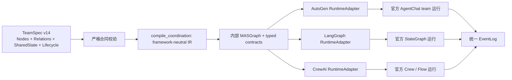
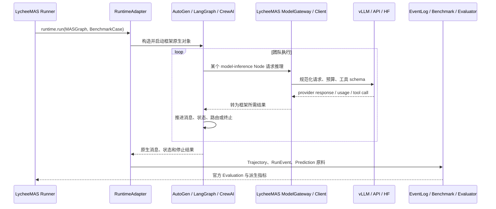
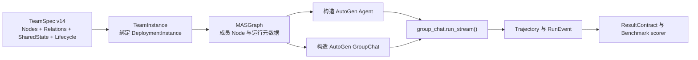
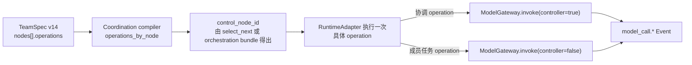
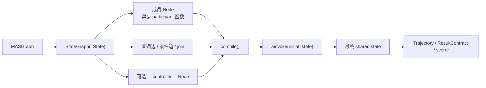
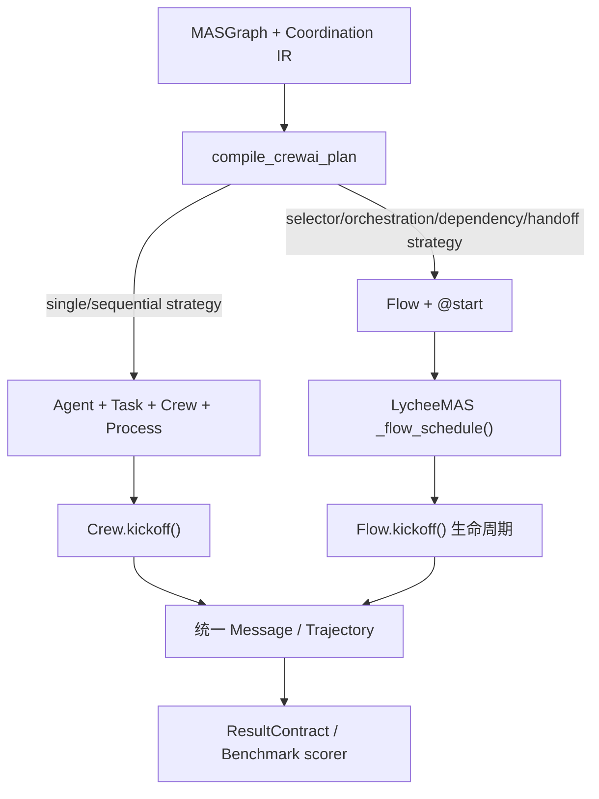

# 4.5 TeamInstance 与跨框架 RuntimeAdapter

[上一部分：TeamSpec v14](04-team-spec-v14-contract.md) · [返回第 4 章索引](04-implementation-contracts.md) · [下一部分：Deployment 与推理](04-deployment-and-inference-contracts.md)

TeamInstance 选择 `runtime_framework`，并用 `resource_bindings` 为每个需要模型的 Node 绑定 DeploymentInstance。每个绑定可设置 Node 级生成覆盖，如 max output、thinking、采样参数；executor Node 不绑定模型。

TeamInstance 是带 TeamSpec 指纹的不可变运行快照，不是可被新 TeamSpec 原地覆盖的别名。TeamSpec 的工具、instructions、框架绑定或 Node 资源需求变化后，必须实例化新的 TeamInstance；已有 ExperimentInstance 继续引用原快照。阶段性抽样扩展到全量时应沿用同一 TeamInstance，避免在断点续测中悄悄改变团队语义。

### 4.5.0 先理解三个框架各自怎样推动任务 { #framework-native-execution-models }

这一节只解释三个框架的官方概念和原生执行模型，不描述 LycheeMAS 当前调用路径；实际编译、调用栈和代码归属见 [4.5.3 原生团队构造后在哪里运行](#runtime-adapter-call-stack)。三个框架都能运行 LLM-MAS，但它们推动任务前进的基本单位并不相同：

| 框架 | 基本执行单位 | 全局事实的主要载体 | 下一步由什么决定 | 最简直觉 |
|---|---|---|---|---|
| AutoGen AgentChat | 一次 Agent turn / response | GroupChat message thread 与各 Agent model context | GroupChat manager、selector、handoff 或 graph | 一群 Agent 在受控群聊中轮流工作 |
| LangGraph | 一次 StateGraph Node 激活 | typed State 与 reducer 合并后的状态快照 | fixed edge、conditional edge、router 或 `Command` | 状态沿节点和边流动 |
| CrewAI | 一个 Task 或 Flow step | TaskOutput、Crew context 与 Flow state | Process、Manager 或 Flow router | 把工作分给岗位，再按流程推进 |

这里还要区分四个常被混用的粒度：一次模型调用只是后端生成一次；一次工具调用是模型或代码请求外部能力；一次 Agent turn 是某个 Agent 获得行动机会；一个完整 Task 可以包含多次模型和工具调用。因此 `max_turns=20` 不等于最多二十次模型调用。

以下统一使用同一个示例：用户要求“查找数据、运行代码计算，并验证最终答案”，团队包含 Researcher、Coder 和 Verifier。

#### AutoGen：消息驱动的 GroupChat

AutoGen AgentChat 的原生团队由 participant Agent、GroupChat manager、message thread 和 termination condition 组成。一次运行的主循环是：

AutoGen 本身还要分层理解。本项目直接使用的是高层 AgentChat，但其消息与 Agent 生命周期建立在 AutoGen Core 之上，模型、浏览器和执行器等具体能力来自 Extensions：

```text
AutoGen Core
  事件、消息路由和 Agent Runtime
        ↓
AutoGen AgentChat
  AssistantAgent、专用 Agent、Team、GroupChat、termination
        ↓
AutoGen Extensions
  模型 client、Docker executor、WebSurfer 等实现
```

普通 `AssistantAgent` 也不只是一个 prompt，而是一个带模型状态和工具循环的运行对象：

```text
AssistantAgent
|-- identity: name / description
|-- instructions: system_message
|-- inference: model_client / model_context
|-- capabilities: tools / handoffs
|-- execution: max_tool_iterations / reflect_on_tool_use
`-- local state: 已处理的模型消息与工具调用状态
```

其中 `model_client` 决定怎样请求后端，`model_context` 决定该 Agent 保留哪些模型消息，`tools` 是可调用函数，`handoffs` 是可移交目标；这些对象状态与团队的共享 message thread 不是同一份东西。

1. `team.run()` 或 `team.run_stream()` 把用户任务加入团队消息线程。
2. GroupChat manager 根据团队类型决定下一位 speaker。
3. 被选 Agent 接收它在当前合同下可见的消息，调用模型；模型可以调用工具，工具结果回到该 Agent 后还可以继续调用模型。
4. Agent 完成本 turn 后发布 response；RoundRobin、Selector 和 Swarm 等 GroupChat 通常把 participant response 放入共享团队线程。
5. 团队在 Agent response 后检查 termination condition；未终止就重新选人，终止后返回 `TaskResult`。

```text
user task
  -> GroupChat manager selects Researcher
  -> Researcher model/tool loop -> publishes evidence
  -> manager selects Coder
  -> Coder model/tool loop -> publishes calculation
  -> manager selects Verifier
  -> Verifier publishes final answer
  -> termination condition -> TaskResult
```

被选 participant 的一个 turn 内部还可能包含多次真实调用：

```text
Team selects Coder
  -> Coder 接收本轮新增消息并更新 model context
  -> model call 1 返回 tool_call
  -> 执行工具并写回 tool result
  -> model call 2 读取工具结果
  -> 形成 AgentResponse
  -> Team 发布 response 并检查 termination
```

因此 `turn` 是团队调度粒度，model call 是后端推理粒度，tool call 是外部动作粒度；一个 turn 可以同时包含多条内部事件和多次调用。

GroupChat 类型主要改变“谁获得下一次 turn”：`RoundRobinGroupChat` 按固定顺序；`SelectorGroupChat` 用选择模型、`selector_func` 或候选过滤选择；`Swarm` 根据 HandoffMessage 转交；`GraphFlow` 按显式图推进；`MagenticOneGroupChat` 由 Orchestrator 维护任务与进度账本、分派工作并在停滞时重新规划。

| Team | 谁决定下一位 | 最适合表达什么 | 不自动保证什么 |
|---|---|---|---|
| `RoundRobinGroupChat` | manager 维护 participant 索引 | 固定轮询、生成器—验证器、明确流水线 | 不判断当前角色是否真的需要执行 |
| `SelectorGroupChat` | 模型 selector 或 Python selector | 动态中央选人 | 不等同完整规划与进度管理 |
| `Swarm` | 当前 Agent 的 HandoffMessage | 去中心化局部移交 | 不自动执行项目自定义 retry/fallback |
| `GraphFlow` | 显式图中当前可激活后继 | 固定依赖图、分支和汇聚 | 不自动生成任务规划 |
| `MagenticOneGroupChat` | Orchestrator 状态机 | 开放式网页、文件、代码综合任务 | 不等同普通 SelectorGroupChat |

`SelectorGroupChat` 的 Selector 通常是 manager 内部的一次选人操作，不是向团队贡献任务答案的普通 participant；它仍会发生真实模型调用并消耗 token。Magentic-One 的 Orchestrator 则是更完整的控制实体，会规划、委派、监控、检测停滞和聚合答案。TeamSpec 将二者都表示为一等 operation Node，是为了保存模型绑定、行为语义与 Event 归因，而不是声称它们在 AutoGen 内部具有相同类层级。

Selector 的三个入口也不能混用：

| 入口 | 实际作用 |
|---|---|
| `candidate_func` | 根据当前消息缩小合法候选集合，仍可继续调用 selector 模型 |
| `selector_func` | 由 Python 逻辑直接返回下一 speaker，可绕过模型选择 |
| selector model | 根据候选、角色描述与对话上下文生成 speaker 名称 |

Magentic-One 则包含两个循环。外循环维护 Task Ledger，包括目标、事实和整体计划；内循环维护 Progress Ledger，检查是否完成、是否取得进展、下一步委派谁。Worker 返回后 Orchestrator 再次更新进度；连续停滞达到 `max_stalls` 后回到外循环重新规划，最后再单独聚合答案。由此一个 worker turn 前后可能出现多次 Orchestrator model call。

AutoGen 中还存在不依赖普通 LLM turn 的专用 Agent，说明“Node”必须比“模型角色”更一般：

| Agent | 主要运行方式 | 是否必然绑定模型 |
|---|---|---|
| `AssistantAgent` | 模型推理并调用注册工具 | 是 |
| `MultimodalWebSurfer` | 模型控制 Chromium 并读取页面状态 | 是 |
| `FileSurfer` | 模型通过文件浏览能力读取本地材料 | 是 |
| `CodeExecutorAgent` | 从消息中取得代码块并交给 executor | 否 |
| `UserProxyAgent` | 请求用户输入或代表外部交互 | 否 |

AutoGen 至少有三层上下文需要分别观测：

| 层次 | 含义 |
|---|---|
| GroupChat message thread | 团队已经正式发布的消息事实 |
| Agent model context | 某个 Agent 经过过滤、累计或裁剪后实际保留的模型消息 |
| Provider request | 应用 chat template、工具 schema、生成参数和 token 预算后真正发给后端的请求 |

GroupChat 中存在一条消息，不代表某个 Agent 必然有权读取，也不代表它最终进入 provider request。`Unbounded`、buffered 或 token-limited model context 还会产生不同裁剪行为。

停止条件可以来自文本、最大消息数、token、超时、handoff、外部停止或自定义 Result 条件；GroupChat 通常在完整 AgentResponse 后检查 termination。需要立即中断时使用官方 cancellation token。最终 `TaskResult` 至少包含消息序列和 `stop_reason`，但内部 selector、Orchestrator 和工具调用仍要从 Event 中完整观测。

在本项目中，AutoGen adapter 真正创建官方 Agent 和 GroupChat，并调用 `run_stream()`；LycheeMAS 位于外层，负责冻结配置、绑定 Deployment、包装工具、记录 Event、投影结果和调用 benchmark scorer。这里的逐 turn 团队循环由 AutoGen 原生 Team 推进。

#### LangGraph：State 驱动的执行图

LangGraph 不要求系统首先是一场群聊。它把运行建模为 `State + Node + Edge`：State 是当前任务快照；Node 是读取 State 并返回更新的同步或异步函数；Edge 决定更新合并后激活哪个 Node。Node 可以包装模型、工具、普通代码、子图或完整团队，不天然等于 LLM Agent。

构造首先从 State schema 开始。例如：

```python
class TeamState(TypedDict):
    task: str
    messages: list
    evidence: list
    code_result: str | None
    next_role: str | None
    final_answer: str | None
    steps: int
```

State schema 只说明系统可以保存哪些事实；reducer 决定一个 Node 返回更新后如何合并：

| Reducer 语义 | 典型字段 | 效果 |
|---|---|---|
| 覆盖 | `next_role`、`final_answer` | 新值替换旧值 |
| 追加 | `messages`、`events` | 将新元素追加到已有列表 |
| 集合/映射合并 | `evidence`、`artifacts` | 保留多个 Node 的产物 |
| 自定义冲突处理 | versioned state | 校验版本、去重或拒绝冲突 |

Node 接收当前 State 快照，但通常只返回部分更新：

```python
async def researcher(state):
    evidence = await search(state["task"])
    return {
        "messages": [research_message],
        "evidence": evidence,
        "steps": 1,
    }
```

Node 可以是一次模型调用，也可以把 `model -> tool -> model` 的完整 Agent activation 包在内部。前者把工具循环显式画成多个图节点，后者让一个逻辑 Node 对应一次完整角色行动；两种方式的 step 数、错误边界和 Event 粒度不同，实验中必须冻结。

集中式示例可以写成：

```text
initial State {task, messages, evidence, next_role, final_answer}
  -> START -> Selector Node
  -> Selector writes next_role=Researcher
  -> conditional edge activates Researcher Node
  -> Researcher writes evidence/messages
  -> edge returns to Selector
  -> Selector routes to Coder or Verifier
  -> result condition satisfied -> END
  -> final State
```

一次 Node 运行只返回 State 更新；reducer 决定同名字段是覆盖、追加还是合并。固定边表达确定顺序，条件边或 `Command(goto=...)` 表达动态路由；多条被同时激活的边可以在同一个 super-step 中执行多个 Node。图必须先 `compile()`，再通过 `invoke/ainvoke/stream` 推进。

图的实际运行循环可以展开为：读取当前 State 快照，激活本 super-step 的 Node，等待这些 Node 返回更新，使用 reducer 合并，再根据固定 edge、conditional edge 或 `Command` 计算下一批激活 Node。当所有路径进入 `END`，或没有活动 Node 与在途消息时，返回最终 State。若图中存在循环，必须有显式终止分支或 recursion limit。

多后继并不只是图上画了多条线：多个 Node 可以在同一个 super-step 并行读取同一轮 State 快照，完成后再合并更新。因此两个并行 Node 同时覆盖 `final_answer` 会产生合同问题；fan-out/fan-in 必须为共享字段定义 reducer 或单独 Aggregator Node。

动态中央路由一般由 supervisor Node 读取 State，写入 `next_role`，再由 conditional edge 进入合法工作 Node：

```text
Selector Node writes next_role=Researcher
  -> conditional edge activates Researcher
  -> Researcher updates messages/evidence
  -> fixed edge returns to Selector
  -> Selector chooses Coder, Verifier or END
```

这个 supervisor 可以调用模型、使用普通 Python 规则，或组合模型判断与确定性约束。LangGraph 不自带一个必须使用的 Selector 人设；合法候选、重试、finish 前置条件和非法路由处理都必须由图作者显式定义。

工具循环同样有两种常见结构：

```text
显式工具图：AgentModel Node -> ToolNode -> AgentModel Node
封装式角色图：Coder Node 内部完成 model -> tool -> model
```

显式工具图更容易观察每一步和做条件路由；封装式角色图更容易保持“一个 Node activation 等于一个角色行动”的抽象。两者都可能使用官方 LangGraph API，不能只看是否出现 `ToolNode` 判断谁更原生。

消息只是 State 的一种可选字段。若 State 保存完整 `messages`，系统可以表现得像共享对话；若 Node 只读取指定字段，Researcher、Coder 和 Verifier 可以看到不同上下文。LangGraph 本身不会替项目决定“所有人都看到全部消息”，也不会自动提供 AutoGen 式 Selector；开发者需要把 supervisor、router、工具循环、终止条件和 State schema明确构造成 Node 与 Edge。

这里必须区分三层：State 已保存某项内容、Node 合同允许读取某项内容、Node 最终把哪些内容组装为模型输入。Checkpoint 负责持久化或恢复图状态，也不意味着所有 Node 都能读到 checkpoint 中的全部字段。

在本项目中，LangGraph adapter 真正创建并编译官方 `StateGraph`，然后调用 `ainvoke()`。LycheeMAS 负责把框架无关的协调事实落实为 Node、Edge、router 和 State 字段，并让 Node 通过统一 ModelGateway 调模型和工具；编译后的图执行顺序、条件边和 super-step 由 LangGraph 运行时推进。

#### CrewAI：Agent 承担 Task，Process 或 Flow 组织工作

CrewAI 必须先区分“谁”和“做什么”：Agent 保存 role、goal、backstory、LLM 和 tools；Task 保存 description、expected output、负责 Agent 和前序 context；Crew 把 Agents 与 Tasks 组成协作单元；Process 决定 Task 怎样推进。

| 对象 | 回答的问题 | 典型内容 |
|---|---|---|
| Agent | 谁来做、具备什么能力 | role、goal、backstory、LLM、tools、memory、delegation |
| Task | 这一次具体做什么 | description、expected output、agent、context、output schema、guardrail |
| Crew | 哪些 Agent 承担哪些 Task | agents、tasks、process、manager、callbacks |
| Process | Crew 中 Task 怎样推进 | sequential 或 hierarchical |
| Flow | 应用级状态和事件怎样流转 | state、start、listener、router、分支与恢复 |

最简单的 `Process.sequential` 不是自由群聊，而是任务流水线：

```text
Research Task assigned to Researcher
  -> TaskOutput 1
  -> Solve Task assigned to Coder with prior context
  -> TaskOutput 2
  -> Verify Task assigned to Verifier
  -> CrewOutput
```

`crew.kickoff()` 启动 Crew 生命周期。一个 Task 内部的 Agent 仍可能多次调用模型和工具，但 Crew 的外层主线是 Task，而不是每轮广播发言。`Process.hierarchical` 可以增加 Manager 做任务分配与审查，但它不自动等同于 AutoGen Selector 或 Magentic-One。

每个 Task 启动时，CrewAI 会把 Agent 的 role/goal/backstory、当前 Task description/expected output 和显式前序 context 组合成执行上下文。Agent 在 Task 内进行模型与工具循环，完成后形成 `TaskOutput`；后续 Task 是否读取它，由 Task context 与 Process 规则决定。因此“Researcher 向 Coder 发消息”在 sequential Crew 中更准确的解释通常是“Research Task 的工作产品成为 Coding Task 的 context”。

Hierarchical Process 的 Manager 可以规划、分派和复核 Worker Task；Agent delegation 则允许某个 Agent 通过框架协作工具请求另一个 Agent 工作。这是两种不同控制机制。当前受控顺序 adapter 设置 `allow_delegation=False`，避免在显式 Task 顺序之外产生未声明的动态委派。

需要条件分支、循环、事件触发和显式共享状态时，CrewAI 使用 Flow。Flow 通过 `@start`、listener/router 和 Flow state 推动步骤；一个 Flow step 可以运行普通代码、Agent、Task 或完整 Crew。因此“Crew”适合角色与任务边界明确的协作，“Flow”适合需要精确控制的工作流，也可以由 Flow 在局部调用 Crew。

```text
Flow @start
  -> 更新 Flow state
  -> listener 接收上一步结果
  -> router 选择分支
  -> 普通 Python / Agent / Crew
  -> 更新 state
  -> 下一事件或结束
```

Crew 与 Flow 不是互相替代关系：Crew 提供角色—任务协作，Flow 提供应用级确定性编排；一个 Flow 可以在某个步骤启动 Crew，让局部子任务保持自主协作。若只是在 `@start` 方法内调用一段项目自写调度循环，虽然使用了官方 Flow 生命周期，也不能说每一步路由都是 CrewAI 原生 Router 完成的。

当前 LycheeMAS 的简单单成员和顺序链会真正构造官方 `Agent + Task + Crew(Process.sequential)` 并调用 `crew.kickoff()`。复杂依赖、动态选人和 Handoff 会构造官方 Flow，但详细调度循环仍主要位于 adapter 的 `_flow_schedule()`；因此这是“CrewAI Flow 生命周期 + LycheeMAS 组合调度”，不能表述为 CrewAI 自带了与 AutoGen 完全相同的 GroupChat。

当前顺序路径会将前序逻辑 Task 绑定为后续 Task context，并把每个 `TaskOutput` 映射回对应 TeamSpec Node provenance。复杂 Flow 路径只有在 Flow state、合法路由、Message/Data 权限、handoff、termination 和 ResultContract 均通过 conformance 时，才能标记为语义保持的 `composed`；创建了 `Flow` 对象本身不是充分条件。

#### 同一集中式意图在三框架中的不同落点

| 逻辑意图 | AutoGen | LangGraph | CrewAI |
|---|---|---|---|
| Researcher/Coder/Verifier | GroupChat participants | StateGraph Nodes | Agents assigned to Tasks |
| 中央选择下一执行者 | SelectorGroupChat manager | selector/supervisor Node + conditional edges | Flow router 或 hierarchical Manager |
| 团队历史 | message thread 与 Agent context | typed State 中的消息/证据字段 | Task context、TaskOutput 与 Flow state |
| 工具 | Agent tool loop 或专用工具 Agent | ToolNode 或 Node 内工具循环 | Agent tools 或 Flow step |
| 停止 | termination condition | route to `END` | Process/Crew 完成或 Flow 结束 |
| 原生返回 | `TaskResult` | final State | `CrewOutput` 或 Flow output |

因此跨框架受控实验要求的是逻辑不变量一致：合法执行者、消息可见性、产物权限、停止前置条件和最终提交者应保持；它不要求三框架产生完全相同的内部对象、模型调用次数或逐步日志。AutoGen 的问题是“下一位谁说”，LangGraph 的问题是“State 下一步流向哪里”，CrewAI 的问题是“下一项 Task/Flow step 由谁完成”。

#### 同一 Magentic-One 语义为什么仍会得到不同轨迹

同一 TeamSpec 可以冻结共同的**外部语义合同**：Orchestrator 与四个 worker Node、plan/delegate/monitor/stall/replan/aggregate 操作、Control/Data Edge、工具权限、结果提交者、预算和终止边界。它不能把三个框架的内部执行引擎变成同一份算法：

| 维度 | AutoGen | LangGraph | CrewAI |
|---|---|---|---|
| 原生承载 | 官方 `MagenticOneGroupChat` 与内部 Orchestrator | 官方 `StateGraph`、typed state 与 conditional edge | 官方 Flow 生命周期、router/listener；worker 可使用 Agent/Task |
| Ledger | AutoGen 官方 Task/Progress Ledger prompt、解析与重试 | LycheeMAS 框架无关 Ledger 合同保存在 Graph state | 同一框架无关 Ledger 合同保存在 Flow state |
| 下一步推进 | GroupChat manager 发布/选择 speaker | Node 返回 state delta，条件边选择下一 Node | Flow method 更新 state，router 选择下一 step |
| 工具与上下文 | AgentChat participant、专用 Agent 与 message context | Node/ToolNode 读取显式 state slice | Agent tools、Task context 与 Flow state |
| 可观测边界 | 官方内部 Ledger 不一定成为公共 GroupChat Event | 每次 operation/state transition 可直接写中性 Event | 每次 Flow operation/state transition可直接写中性 Event |

因此应明确区分两种实验：

1. **Controlled portability track。** 三个 adapter 尽可能执行同一框架无关 Ledger、prompt、合法动作、重试和终止合同，用于研究语义可移植性、adapter delta 和运行时开销。若 AutoGen 仍使用官方私有 Ledger，而另外两者使用 portable Ledger，就必须在 BindingReport 中披露差异，不能声称严格因果隔离。
2. **Framework-native track。** AutoGen 使用官方 Magentic-One；LangGraph/CrewAI 使用各自最自然的 supervisor/Flow 组合。它回答“各生态中的原生或最佳组合实现表现如何”，但差异同时包含框架、协调算法和 prompt，不能只归因于框架名称。

同 Case、模型、工具、数据、解码和预算冻结后，可以研究五类问题：任务质量是否相近；控制调用、replan/stall 和角色转换的轨迹形状是否不同；token、TTFT、队列、工具与墙钟开销差多少；错误如何恢复或放大；重复 Trial 的调用图 Jaccard、调用序列 LCS 和结果方差是否稳定。报告时必须同时展示 BindingReport 和 Evidence coverage，否则“缺少框架内部事件”会被误读成“没有发生协调”。

参考：[AutoGen Teams](https://microsoft.github.io/autogen/stable/user-guide/agentchat-user-guide/tutorial/teams.html)、[AutoGen Magentic-One](https://microsoft.github.io/autogen/stable/user-guide/agentchat-user-guide/magentic-one.html)、[LangGraph Graph API](https://docs.langchain.com/oss/python/langgraph/graph-api)、[CrewAI 核心概念](https://docs.crewai.com/core-concepts/Agents)。

### 4.5.1 编译流程



构造和执行两部分都有 LycheeMAS 与框架代码：LycheeMAS 负责校验、资源绑定、工具封装和事件记录；对应框架负责其原生调度循环。不能把 adapter 自己写的循环说成官方 GroupChat，也不能把官方团队的行为说成纯 LycheeMAS 调度。

完整的实际链路分为注册、实例化、物化和逐 Trial 构造四段：

1. `TeamSpecRegistry` 读取 JSON，`normalize_team_spec_document()` 严格校验 v14，并拒绝未知或废弃字段。
2. TeamInstance 选择 `runtime_framework`，为每个 `kind=model_agent` 的 Node 绑定 DeploymentInstance，并调用 `runtime_support()` 生成 BindingReport。提供协调 Operation 的模型 Node 同样需要模型绑定；`tool_executor` 等非模型 Node 不绑定 DeploymentInstance，SharedState 也不是可执行 Node。
3. Experiment 实例化时解析 BenchmarkInstance、TeamInstance、DeploymentInstance 和 PricingInstance，把 `team_spec.json`、`team_instance.json`、`deployments.json`、`runtime_config.yaml` 与完整配置快照写入 launch 目录。后续注册表修改不能反向改变这次 Run。
4. Runner 加载冻结 TeamSpec，生成 Coordination IR、`MASGraph` 和三个 adapter-local plan；`DeploymentPool.bind_graph()` 只在内存中把 Node 绑定到后端；`runtime/adapters/frameworks/factory.py` 再按 TeamInstance 的框架选择 AutoGen、LangGraph 或 CrewAI adapter。每个 Trial 启动时，adapter 才创建本 Trial 的原生 GroupChat、StateGraph、Crew 或 Flow 对象。

其中 Coordination IR 保存成员顺序、Operation 所有者、合法候选、Control 邻接、入口和终点等框架无关派生事实；`MASGraph` 保存 Node 编译结果，并在 `meta` 中携带规范化 TeamSpec、Control/Data Relation、SharedState、消息策略、Lifecycle result contract 和 adapter plan。提供协调 Operation 的 Node 仍是一等 Node；adapter 可将其绑定为 AutoGen GroupChat 内部控制客户端、LangGraph supervisor graph Node 或 CrewAI Flow router，但必须保留该 Node 的 Deployment 绑定和 Event 归因。

### 4.5.2 从共同事实到 adapter 本地策略

三个 adapter 读取同一 Coordination IR，但不共享一套 Team pattern 枚举。下表的左列是图中可验证的事实，不是保存到 TeamSpec 的类别；右侧是各 adapter 当前独立选择的实现。

| TeamSpec / IR 事实 | AutoGen adapter | LangGraph adapter | CrewAI adapter |
|---|---|---|---|
| 只有一个可执行成员 | 单成员 `RoundRobinGroupChat` | 单 `StateGraph` Node | 单 Agent/Task Crew |
| `completed -> activate` Control Relations 构成完整单链 | `RoundRobinGroupChat` | 确定性 StateGraph edges | `Process.sequential` |
| 存在 `select_next` operation 及显式候选 | `SelectorGroupChat` | supervisor Node + conditional edges | Flow model router |
| 存在完整 orchestration operation bundle | `MagenticOneGroupChat` | StateGraph 中组合 task/progress ledger、delegate、stall/replan 与 aggregate | Flow 中组合 task/progress ledger、delegate、stall/replan 与 aggregate |
| 存在无界 retry 型 Handoff operation/relation | `Swarm` | conditional handoff edges | Flow handoff |
| Handoff 声明 `max_attempts` 与 `fallback=next_priority` | `SelectorGroupChat` + bounded handoff selector | conditional handoff edges + attempt state | Flow handoff + attempt state |
| 其余显式 Control 图 | `GraphFlow` | 显式 `StateGraph` | Flow scheduler 组合实现 |

这张表只解释当前 adapter 如何编译同一组事实。它不允许公共层先给团队贴上 `fixed_order` 或 `orchestrator` 标签后再分发；adapter 的 `strategy` 只存在于运行快照和 BindingReport，可随框架升级独立演进。

BindingReport 使用 `exact/composed/approximated/unsupported`：

- `exact`：TeamSpec 的一项事实可以一对一落到框架原生原语，而且该原语的激活、消息、状态和终止语义与合同一致。例如不要求尝试上限和强制 fallback 的显式 Handoff relation 可直接映射到 AutoGen `Swarm` handoff。
- `composed`：框架没有一个单独原语与合同一一对应，但 adapter 使用多个官方原语组合后，仍能保持合同要求的可观察语义。例如 LangGraph 用 operation-provider Node、conditional edges 和共享 state 组合实现 `select_next`。它不是“一对一原生映射”，但可以是语义保持实现，因此仍可进入受控比较。
- `approximated`：组合能够运行，但至少存在一项已知 semantic delta，例如候选选择规则、消息可见范围、Handoff 协议、状态生命周期或终止条件不同。它只能进入探索性或框架原生能力实验，不能把结果当作严格同合同横向比较。
- `unsupported`：框架或 adapter 无法执行必要 Node/Relation/Operation，或者执行会改变团队定义；实例化或启动必须失败。

映射等级必须按三层事实共同判定，不能只看“团队最后能否输出答案”：

| 判定层 | 必须核对的内容 | 典型失败 |
|---|---|---|
| 结构 | Node、协调功能、合法后继、消息通道、Workspace 和提交者是否保留 | 多 Node 被退化为单 Agent；Selector 被漏掉 |
| 行为 | 激活、依赖、Handoff、消息过滤、工具循环、状态更新和停止条件是否一致 | Handoff 缺失时擅自选择首个候选；Crew Task 自动看到不该看的历史 |
| 观测 | 控制决定、模型调用、工具、消息、结果来源和错误是否能对应回逻辑 Node/Relation | 框架内部 Manager 调用无法归因；提交者被错误改成最后发言者 |

`compile_*_plan()` 给出的等级只是协调原语的初始判断。最终以 `runtime_support()` 生成的 BindingReport 为准：即使 GroupChat 类型能够直接映射，只要 TeamSpec 还要求 adapter 未执行的 Data transfer、SharedState 或 Lifecycle contract，最终报告仍必须降为 `approximated`。

跨框架研究必须同时报告逻辑 TeamSpec 和 BindingReport。比较的是“同一抽象合同在不同框架中的可实现行为”，不是假定三个框架内部完全一样。

#### 为什么详细 TeamSpec 仍不能让三个框架全部 Exact

TeamSpec 描述得详细，只解决了“想要什么行为”这一半；`Exact` 还要求目标框架原生提供语义相同的执行机制。三个框架的抽象层级本来就不同：AutoGen AgentChat 提供预制 GroupChat，LangGraph 提供通用状态图，CrewAI 提供 Agent/Task/Crew/Process/Flow。一个合同事实可能在某框架中是一等原语，在另一个框架中只能组合或近似。

| TeamSpec 要求 | 当前差异出现在哪里 | 为什么不是 Exact |
|---|---|---|
| orchestration operation bundle | AutoGen 有官方 Magentic-One；LangGraph/CrewAI 用各自 StateGraph/Flow 原语组合 task/progress ledger、delegate、stall/replan 与 aggregate | 后两者属于 semantics-preserving composed，不是与 AutoGen 内部算法一对一的 exact 原语；真实 smoke 还必须验证 aggregate 和逻辑 submitter |
| `select_next` | AutoGen `SelectorGroupChat` 原生支持；LangGraph 需 supervisor + conditional edges；CrewAI 需 Flow + model router | 后两者是官方原语组合，因此是 composed，不是一对一 exact |
| Handoff | AutoGen Swarm 有原生 handoff，但不会替 TeamSpec 执行 `max_attempts + next_priority`；LangGraph/CrewAI 通过条件边或 Flow 解析 `HANDOFF: role` | 无界 retry 型 AutoGen Handoff 可 exact；有界 Handoff 由官方 `SelectorGroupChat` 与 adapter-local selector 组合执行，和 LangGraph/CrewAI 一样标记 composed。若 fallback、payload 或错误语义不能保持，BindingReport 必须降级 |
| 定向消息可见性 | AutoGen 可用 `MessageFilterAgent`；LangGraph 可在 Node 调用前过滤；CrewAI 原生 Task context 会积累前序 Task 输出 | CrewAI 可能让 Node 看到 Data transfer 未授权的消息 |
| Data transfer filter/transform | v14 可声明 typed filter 和注册转换 | adapter 未执行的字段必须在 BindingReport 中披露 |
| Artifact state | v14 用 `kind=artifact_store` 的 SharedState 和 Data transfer 表达读写方向 | 当前 Workspace 多数仍是共享路径和工具级访问，尚非严格 ACL 和类型检查 |
| Control priority/condition | Relation 保存 priority 与结构化 condition | adapter 尚未执行的 guard 或排序规则不能静默忽略 |
| 专用 Node | AutoGen 有 FileSurfer、WebSurfer、CodeExecutorAgent | LangGraph/CrewAI 目前主要将同类能力降为普通 model Node + portable tools，不是相同原生 Agent 生命周期 |
| 终止和恢复 | AutoGen GroupChat、LangGraph recursion/state、CrewAI Crew/Flow 各有自己的停止机制 | `max_turns`、ledger stall、Lifecycle result 和框架内部完成状态不能天然一一对应 |

所以“不能全是 Exact”不等于 TeamSpec 不够详细。主要问题分成两类：一类是**框架本体没有同构原语**，只能 Composed；另一类是**当前 adapter 还没有完整执行合同**，因此只能 Approximated。前者是合理差异，后者是工程技术债。

#### 应该怎样解决

最稳妥的方案不是强行把所有标签改成 `exact`，而是保留两条明确实验轨道：

1. **Portable semantic track**：以 TeamSpec 为唯一语义真源。为每项 Function 和 Relation 建立可执行合同与 conformance fixture；adapter 可以使用多个框架原语组合，只要结构、行为和观测不变量全部通过，就标为 `composed` 并纳入受控比较。若想让三个框架都严格遵循同一调度状态机，可以由 LycheeMAS 提供框架无关 coordination kernel，三个框架只承载 Node 执行；代价是比较的不再是三个框架各自的原生协调能力。
2. **Framework-native track**：分别采用 AutoGen、LangGraph、CrewAI 官方或社区认可的最佳团队配方，允许 TeamSpec、控制协议和消息模型不同，用来测框架原生上限。该轨不能声称“同一 TeamSpec 的严格横向比较”。

Portable track 的工程顺序应为：

1. 为 Node 激活、Control Relation、Data transfer、SharedState、结果提交和停止条件分别定义机器可判定的不变量。
2. 建立无模型 deterministic conformance cases，使三个 adapter 在固定输入下产生可比较的 Node、Relation、Event 和 Result 序列。
3. Handoff 只执行显式目标或 Operation 声明的 `error/retry/next_priority/finish` fallback，不允许 adapter 猜首个候选。
4. CrewAI 路径必须按 Data transfer 精确控制 Task context；无法控制时继续标为 `approximated`。
5. 逐项执行 Relation priority/condition、Data filter/transform、SharedState ACL 和 artifact schema；未实现项必须进入 semantic delta。
6. 完整协调束读取 v14 的 Operations 和 SharedState：AutoGen 可绑定官方 Magentic-One，LangGraph/CrewAI 分别用 StateGraph/Flow 组合公开的规划、委派、监控、停滞、重规划和聚合语义。字段合同见 [TeamSpec v14](04-team-spec-v14-contract.md)。
7. 在每次 TeamInstance 实例化和 Run 启动时重新生成 BindingReport；只有全部必需不变量通过时，才能进入 controlled comparison。

需要保留一个重要边界：如果通过 LycheeMAS 公共调度器完全接管下一 Node、消息过滤、状态和终止，三个后端当然更容易达到语义一致，但这测到的是“LycheeMAS coordination kernel + 三种框架执行适配”的差异。若研究问题是比较三个框架的原生团队机制，就必须接受部分映射无法 Exact，并把 semantic delta 当作研究结果而不是错误掩盖。

### 4.5.3 原生团队构造后在哪里运行 { #runtime-adapter-call-stack }

本节只描述 LycheeMAS 当前实现的编译路径、调用栈和责任边界；三个框架各自的官方执行概念见 [4.5.0](#framework-native-execution-models)。结论不是“只由 LycheeMAS 运行”，也不是“构造后完全交给第三方框架”，而是**同一实验 worker Python 进程中的混合调用栈**。AutoGen、LangGraph 和 CrewAI 是由 LycheeMAS import 的库；通常独立成进程或服务的是 vLLM/远程 API、Docker code executor 和 Chromium 等资源。



公共外层由 LycheeMAS 控制：`scripts/run_mas.py` 建立 Trial/Attempt 并调用 Runtime；`eval/teams/compiler.py` 与 `runtime/coordination/compiler.py` 把 TeamSpec v14 的 Node、Operation、Control/Data Relation、SharedState 和 Lifecycle 编译为 `MASGraph`、Coordination IR 与 adapter plan；`runtime/adapters/frameworks/factory.py` 按 TeamInstance 的 `runtime_framework` 创建 adapter。资源绑定、生成参数、统一工具、workspace、EventLog、Prediction 提取和 Benchmark scorer 仍属于 LycheeMAS。框架负责其原生协调内核，但具体边界不同。

#### 当前代码归属与基类不对称

当前实现不追求“三个 adapter 机械继承一个完整公共 Runtime”，而是共享窄服务、保留框架原生生命周期。职责分布为：

| 文件 | 实际职责 |
|---|---|
| `runtime/adapters/frameworks/autogen/` | AutoGen Agent/GroupChat、专用 Agent、客户端和原生事件适配 |
| `runtime/adapters/frameworks/langgraph/` | StateGraph、Node、conditional edge 和状态投影 |
| `runtime/adapters/frameworks/crewai/` | Crew/Task/Process/Flow 构造与事件适配 |
| `runtime/adapters/frameworks/base.py` | **仅 LangGraph/CrewAI 继承**的 `ModelGatewayRuntimeBase` 外壳；不是三框架公共基类 |
| `runtime/model/gateway.py` | LangGraph/CrewAI 共用的模型、工具循环、token 预算和 Event |
| `runtime/workspaces/`、`runtime/tools/`、`runtime/results/`、`runtime/state/` | 三框架组合使用的 workspace、执行器、结果与团队状态窄服务 |

`ModelGatewayRuntimeBase` 只服务 LangGraph/CrewAI，因为 AutoGen 的 ChatCompletionClient、专用 Agent 与 GroupChat 生命周期不同。AutoGen 代码较多既包含合理的框架专属复杂度，也提示仍需继续提取 EventBridge、Workspace、ToolExecution 等窄服务；正确方向不是建立所有 adapter 被迫继承的“大一统基类”。

文件短也不代表 adapter 更完整。LangGraph/CrewAI 当前未覆盖 AutoGen 专用 Agent、原生浏览器生命周期、topology-filtered context 和 latent；CrewAI 的 graph/handoff 还是 Flow 外壳加自定义调度。正确目标不是让三个文件机械达到相同行数，而是让共享职责只有一个事实来源：

```text
runtime/
|-- model/gateway.py                   统一 backend、预算和模型调用 Event
|-- workspaces/service.py              workspace 与附件物化
|-- tools/code_execution.py            portable tools 与 executor
|-- results/{contract,projection}.py   ResultContract 与确定性投影
|-- conformance/report.py              运行期语义与证据门禁
|-- events/store.py                    无损 EventLog 分片存储
`-- adapters/frameworks/
    |-- autogen/{runtime,client,coordination,events}.py
    |                                      AutoGen 原生生命周期与窄适配服务
    |-- langgraph/runtime.py            StateGraph 适配
    `-- crewai/runtime.py               Crew/Process/Flow 适配
```

上图只列已经落盘的物理路径。下一步如果提取 framework event normalizer 或共享 lifecycle，必须先完成 conformance fixture，再新建对应包；文档不再预先画出尚不存在的文件。

重构前必须先用 conformance fixture 冻结三条路径的模型调用、工具、消息、ResultContract 和资源回收行为。否则简单把 AutoGen 代码搬进公共基类，很容易把 AutoGen 原生事件或工具语义改坏。

#### AutoGen

AutoGen 适配的准确链路是：



##### A. TeamSpec 如何进入 AutoGen

`eval/teams/compiler.py::load_team_spec()` 先严格校验 v14，再调用 `compile_coordination()`。`nodes[].kind` 决定 Node 使用模型、工具执行器、函数、人类、子团队或远程 handler；`behavior` 选择框架特化；`instructions/tools/context` 定义执行合同；`operations` 是协调职责的唯一来源。Control Relation 决定激活，Data transfer 与 SharedState 决定输入和可见性，Lifecycle 决定入口、结果和停止。Node 名称、文件名和 `centralized` 等研究标签都不参与 dispatch。

`runtime/coordination/compiler.py::compile_autogen_plan()` 只在 AutoGen adapter 内执行以下选择：

| Coordination IR 中的显式事实 | AutoGen 原生对象 | 当前映射等级 |
|---|---|---|
| 单个成员 | 单 participant 的 `RoundRobinGroupChat` | exact |
| `completed -> activate` Control Relations 构成完整单链 | `RoundRobinGroupChat` | exact |
| Node 提供 `select_next`，候选由其外出 Control relation 显式给出 | `SelectorGroupChat` | exact |
| 同一 Node 提供完整协调操作束，所需 ledger 位于显式 SharedState，且 Lifecycle 声明结果来源 | `MagenticOneGroupChat` | exact/composed，按公开语义和 BindingReport 审计 |
| Handoff relation | `Swarm` | exact |
| 其它显式 Control 图 | `GraphFlow` + `DiGraphBuilder` | exact/composed，按具体关系审计 |

这里的 `exact` 表示“显式事实能直接落到对应 AutoGen 原语”，不表示当前 TeamSpec 是某个 benchmark、论文或 AgBench 的官方复现配方，也不产生一个跨框架公共 pattern。

##### B. 普通 Node 如何变成 AutoGen participant

`runtime/adapters/frameworks/autogen/runtime.py::_build_agents()` 遍历 `MASGraph.order()` 中的成员 Node，并为每个需要推理的 Node 解析自己的 DeploymentInstance、backend、model、上下文策略、生成参数和工具。当前映射为：

| TeamSpec v14 Node 合同 | AutoGen 对象 | 模型是否必需 |
|---|---|---|
| `kind=model_agent, behavior=assistant` | `AssistantAgent` | 是 |
| `kind=model_agent, behavior=code_author` | 带代码作者指令的 `AssistantAgent` | 是 |
| `kind=tool_executor, behavior=code_executor` | `CodeExecutorAgent` | 否 |
| `kind=model_agent, behavior=file_navigator` | `autogen_ext.agents.file_surfer.FileSurfer` | 是 |
| `kind=model_agent, behavior=web_navigator` | `MultimodalWebSurfer` | 是 |

普通 `AssistantAgent` 的 `system_message` 来自 `nodes[].instructions`；工具经 `_resolve_function_tools()` 解析后交给 Agent；模型上下文使用 AutoGen 官方 `UnboundedChatCompletionContext`、`BufferedChatCompletionContext` 或 `TokenLimitedChatCompletionContext`。当 Data transfer 或 message-channel SharedState 限定可见来源/窗口时，participant 会被官方 `MessageFilterAgent` 包装；只有合同明确允许完整共享历史时才无需额外包装。

便携语义轨优先使用三框架共同支持的 Node behavior 与工具合同；AutoGen 原生能力轨可以使用 FileSurfer、WebSurfer、CodeExecutorAgent 或 Magentic-One。两条轨道必须使用不同 TeamSpec provenance 和 BindingReport，不能混称同一个团队配方。

##### C. LycheeMAS 模型后端如何接给 AutoGen

AutoGen `AssistantAgent` 只认识 `ChatCompletionClient`。LycheeMAS 在 `runtime/adapters/frameworks/autogen/client.py` 中实现了兼容该接口的 `InjectionClient`：

1. 接收 AutoGen 的 `LLMMessage` 历史和工具 schema；
2. 转换为统一 backend message；
3. 应用模型上下文、输入/输出 token 预算、thinking 和采样参数；
4. 对普通 participant 可选执行 `none/nl_only/latent_only/both` 的 memory routing 与注入；
5. 调用 TeamInstance 绑定的 HF、vLLM 或 API backend；
6. 将文本、reasoning、tool call、usage 和 finish reason 转换为 AutoGen `CreateResult`；
7. 记录 `model_call.*`、路由、token、延迟和 provider payload Event。

多个角色可以共享一个 DeploymentInstance，也可以各自绑定不同后端。AutoGen adapter 有两个彼此独立的维度，不能用一个类名混为一谈：

1. **请求是否经过 memory-channel 注入。** `InjectionClient` 执行 `none/nl_only/latent_only/both` 的 routing；`PlainClient` 直接调用 backend，不执行 NL/latent 注入。
2. **本次调用是否承担控制职责。** 每个请求用独立的 `controller: bool` 记录事实；它不由 client 类名、Node 名称或角色名称推断。

因此 Selector 和 Magentic-One Orchestrator 当前使用 `PlainClient(controller=true)`：仍走绑定的 Deployment backend、预算和 EventLog，但不执行 participant memory/latent 注入。一个不需要注入的普通模型 Node 也可以使用 `PlainClient(controller=false)`；“plain”不等于“controller”。

这里的 `controller` 不是“是否属于团队”的分类，也不是第二条模型通道。它是写在每个 `model_call.*` Event 上的事实标签：

| 调用来源 | AutoGen client | Event 字段 | 含义 |
|---|---|---|---|
| 普通模型 Node，例如 Coder、FileSurfer、WebSurfer 或一般 AssistantAgent | `InjectionClient` | `controller=false` | 这次模型调用直接完成成员任务，可以按 Team method 执行 participant memory/latent routing |
| 不需要 memory-channel 注入的普通模型 Node | `PlainClient(controller=false)` | `controller=false` | 直接调用绑定 backend；是否 plain 只描述请求处理路径 |
| 显式控制 Node，例如 Selector 或 Magentic-One Orchestrator | `PlainClient(controller=true)` | `controller=true` | 这次调用用于选择、规划、委派、监控、replan 或汇总；仍调用其绑定的同一个 DeploymentInstance，但不套用 participant memory 注入 |
| ComputerTerminal 等确定性 executor Node | 不使用模型 client | 没有 `model_call.*` | 它仍是 TeamSpec Node，只是其执行证据属于 tool/executor Event，而不是模型调用 |

`PlainClient` 的 `Plain` 只表示“不执行 memory/latent 注入”，不表示控制身份；`controller` 是正交的调用级事实。提供 Selector/Orchestrator 等协调 Operation 的 Node 与其它 Node 一样可绑定、可观测，控制职责来自本次执行的 Operation，不来自 client 类名或 Node 名称。

显式布尔值解决的是观测歧义。若不记录它，离线分析只能根据 `role == "Orchestrator"` 或名字包含 `selector` 猜测控制开销；用户把控制 Node 改名为 `Coordinator` 后指标就会失真。现在 `controller_model_call_ratio` 与 `controller_output_token_ratio` 直接读取调用事实，不参与 speaker selection，也不改变 AutoGen 的运行决策。

`controller` 的完整派生路径如下；其中只有最后两步包含布尔值：



对应代码职责是：

| 阶段 | 负责模块 | 输入事实 | 输出 |
|---|---|---|---|
| Team 编译 | `runtime/coordination/compiler.py` | Node 显式声明的 Operation | `operations_by_node`、`operation_bindings`、`control_node_id` |
| Team 运行图 | `eval/teams/compiler.py` | Coordination IR | `MASGraph.meta.control_node_id` 和 operation owner |
| AutoGen | `runtime/adapters/frameworks/autogen/runtime.py` | 构造官方 Selector/Magentic-One 控制 client | 控制 client 的调用记录为 `true`；participant InjectionClient 为 `false` |
| LangGraph | `runtime/adapters/frameworks/langgraph/runtime.py` | `__controller__` StateGraph Node 执行控制 operation | 调用 ModelGateway 时传 `true` |
| CrewAI | `runtime/adapters/frameworks/crewai/runtime.py` | Flow router 执行控制 operation | 调用 ModelGateway 时传 `true` |
| 统一模型协议 | `runtime/model/gateway.py` | Runtime 传入的调用用途 | 原样写入 start/completed/failed Event，并用于控制开销指标 |

因此 TeamSpec 中不应新增持久化 `controller: true/false`。如果某个 Node 同时声明 `analyze` 与 `select_next`，前者调用应记为 `false`，后者调用应记为 `true`；把布尔值固定到 Node 上会丢失这一层事实。

`controller` 不得决定调用哪个 Deployment。所有模型调用都按发起调用的显式 Node ID 读取 `resource_bindings`、模型和 generation overrides；Orchestrator/Selector 与普通模型 Node 一样独立绑定资源。该布尔值只保留 Event 归因、调用额度和过程指标语义。

##### D. GroupChat 如何构造和运行

`runtime/adapters/frameworks/autogen/runtime.py::_build_chat()` 根据编译后的 GroupChat 类型实例化 AutoGen 官方对象：

- `round_robin`：按 participant 顺序循环，由 Lifecycle result 与 turn/model-call 上限终止；
- `selector`：将控制 Node 的 DeploymentInstance 包装为 `PlainClient(controller=true)`，交给 `SelectorGroupChat` 选择下一 participant；若 TeamSpec 选择 topology function/candidates，则分别传入官方 `selector_func`/`candidate_func` 接口；
- `magentic_one`：将控制 Node 的模型客户端传给 `MagenticOneGroupChat`，Task Ledger、Progress Ledger、stall 检查、委派和最终总结由 AutoGen 内部 Orchestrator 推进；
- `swarm`：把 participant handoff 配置交给官方 `Swarm`；
- `graph_flow`：通过 `DiGraphBuilder` 将运行时 control graph 编译为官方 `GraphFlow`。

Selector/Orchestrator 在 TeamSpec 中是 Node，但 AutoGen 运行时具有特殊位置：它们的 Deployment 绑定和生成设置仍然独立存在，实际协调生命周期则由 `SelectorGroupChat` 或 `MagenticOneGroupChat` 内部对象管理。ComputerTerminal 不同，它是显式 participant，只是不绑定大模型。

构造完成后，adapter 调用 `group_chat.run_stream(task=...)`。从这里开始，speaker selection、消息发布、Agent 内部工具迭代、handoff、ledger、GraphFlow 激活和 GroupChat termination 主要由 AutoGen 运行循环推进。LycheeMAS 监听流事件，将官方消息和工具事件规范化为 `agent.message.published`、`tool_call.requested`、`tool_execution.observed` 等 RunEvent。

##### E. AutoGen 结束后如何进入评测

AutoGen 返回 `TaskResult` 后，adapter 将其中的消息转换为 LycheeMAS `Message` 和 `Trajectory`。外层按 `lifecycle.result.submissions` 选择有资格提交答案的 Node 和 source，再由 Benchmark 实现：

1. `extract_messages()` 提取文本候选；
2. `collect_prediction()` 汇总文本、Action 或 workspace Patch；
3. `validate_result_contract()` 检查提交者和结果类型；
4. evaluator 调用 benchmark scorer 产生 Evaluation 和标准化指标。

因此 AutoGen 不负责 benchmark 下载、case 划分和官方评分。准确边界是：**AutoGen 原生 Agent/GroupChat 内核运行；LycheeMAS 提供 TeamSpec 编译、模型客户端、Deployment、资源、统一观测、结果合同和评测层。**

当前仍需注意三项边界：

- 控制 Node 的一般 `instructions` 不能自动等价为普通 `AssistantAgent.system_message`；目前通过 `selector_prompt`、`final_answer_prompt` 和 AutoGen 原生控制协议表达。
- v14 的 Control Relation、Data transfer、SharedState 和 Lifecycle 并非都能由一个 AutoGen GroupChat 原语无损执行；消息可见性需要额外过滤，artifact 仍由 workspace、SharedState 和 result contract 共同管理。
- `max_turns` 限制 GroupChat participant turn，不等于模型调用数；Agent 内部工具循环、Selector 和 Orchestrator 都可能额外调用模型，因此还必须单独设置 `max_model_calls_per_case` 和 Trial wall-time。

#### LangGraph

LangGraph 适配与 AutoGen 最大的不同是：LangGraph 提供的是通用图执行引擎，而不是 RoundRobin、Magentic-One 这一类预制团队。LycheeMAS 必须将 TeamSpec 的 Node、控制流和共享状态显式编译成 `StateGraph`。



##### A. LangGraph 公共 Runtime 外壳

`LangGraphRuntime` 继承 `ModelGatewayRuntimeBase`。在进入 LangGraph 前，公共基类负责：

1. 检查 BindingReport，拒绝 unsupported 组合；
2. 建立 Trial workspace，物化 benchmark 文件；
3. 按需启动 Docker/local code executor；
4. 为每个角色解析便携文件、网页和代码工具；
5. 创建统一 `ModelGateway`；
6. 记录 runtime/group-chat/workspace 事件；
7. 执行结束后验证 ResultContract、生成 `Trajectory` 并关闭资源。

目前 LangGraph/CrewAI 公共 Runtime 只允许 `method=none`；CDM/latent 注入仍是 AutoGen `InjectionClient` 路径的能力。这属于当前 adapter 能力差异，不能在报告中写成三框架均支持 latent。

##### B. StateGraph 的状态是什么

`runtime/adapters/frameworks/langgraph/runtime.py::_execute_team()` 使用官方 `StateGraph`，typed state 当前包含：

| 状态字段 | 合并/更新方式 | 含义 |
|---|---|---|
| `task_text` | 保留 | 当前 BenchmarkCase 的任务文本 |
| `messages` | `operator.add` | 各 Node 发布的统一 `Message` 列表 |
| `rounds` | `operator.add` | 完成完整固定顺序周期的次数 |
| `steps` | `operator.add` | 已执行 participant Node 的次数 |
| `next_role` | 覆盖 | controller 选择的下一 Node 或 `FINISH` |

成员 Node 会被注册成异步 graph node。Node 被 LangGraph 激活时，adapter 调用公共 `_invoke_role()`：

1. 组合 Node system prompt 和可选 handoff 指令；
2. 加入原始任务；
3. 按目标 Node 的 Data transfer 与 message-channel SharedState 过滤来源和窗口，再转换为 backend messages；
4. 调用该 Node 对应的 `ModelGateway`；
5. 将最终文本转换为 LycheeMAS `Message`；
6. 返回 `messages += [message]`、`steps += 1` 的 state update。

LangGraph 路径与 AutoGen 读取同一 `message_policies` 编译结果：Data transfer 限定来源和 view，`kind=message_channel` 的 SharedState 定义共享读写者。尚未执行的 filter/transform 或 retention 语义必须由 BindingReport 报告。

##### C. 模型和工具如何运行

这里没有把 Node 构造成 AutoGen `AssistantAgent`，也没有直接使用 LangGraph 的预制 ReAct agent 或 `ToolNode`。模型与工具循环由 LycheeMAS `ModelGateway` 统一完成：

```text
LangGraph 激活 participant Node
-> _invoke_role()
-> ModelGateway.invoke()
-> Deployment backend 生成文本或 tool call
-> ModelGateway 执行 portable tool
-> 工具结果写回本次 Node conversation
-> 继续模型调用，直至文本结果或 max_tool_iterations
-> Node 返回一个 Message state update
```

这样做使 HF、vLLM、API、工具 schema、token/thinking 参数和 EventLog 在 LangGraph/CrewAI 间共用；代价是工具生命周期属于 LycheeMAS 组合实现，不能宣称使用了某个 LangGraph 官方 Agent 模板。

##### D. LangGraph adapter 如何独立编译

`compile_langgraph_plan()` 只读取 Coordination IR 的事实，并产生 LangGraph 本地 `strategy`；这个名称不是 TeamSpec 字段，也不会被 AutoGen/CrewAI 读取。

| IR 事实 | LangGraph 本地 strategy | 实际 StateGraph 结构 | 语义等级 |
|---|---|---|---|
| 单个成员 | `single_node` | `START -> 唯一 Node`，随后按 Result Contract/limits 结束 | composed |
| `completed -> activate` Control Relations 构成完整单链 | `deterministic_dependency_chain` | `START -> N1 -> ... -> Nk` | composed |
| 一般 Control 图 | `explicit_control_graph` | root、普通边、多前驱 join、sink 与 START/END | exact/composed，按合同审计 |
| Handoff relation + Node `handoff` operation | `conditional_handoff_edges` | participant 后接条件边，解析显式 handoff 目标并执行合同 fallback | composed |
| Node `select_next` operation + 显式 Control candidates | `supervisor_conditional_edges` | operation-provider Node 选择 participant，participant 后返回该 Node | composed |
| 完整 orchestration operation bundle | `supervisor_orchestration` | StateGraph 执行 task/progress ledger、delegate、stall/replan 与 final aggregate | composed |

具体区别如下：

- **单 Node/单链**：边由 adapter 确定性创建；LangGraph 负责激活 Node 和合并 state。
- **一般 dependency 图**：无入边 Node 是 root，无出边 Node 是 sink；多前驱目标通过 LangGraph 多源 edge 形成 join。
- **handoff relations**：adapter 给 participant 附加精确 `HANDOFF: <role>` 指令；条件函数解析最新消息，并按 handoff operation 的 `fallback` 执行 `error/retry/next_priority/finish`。只有已经选中具体 Relation 后的目标执行失败才读取 Relation `on_failure`。它由多个 StateGraph 原语组合实现，语义等级是 `composed`，不声称与 AutoGen `Swarm` 的内部算法相同。
- **`select_next` operation**：adapter 为声明该操作的 Node 构造 graph node，通过该 Node 的 DeploymentInstance 在显式 Control candidates 中选择或返回 `FINISH`；无效决定按 operation 的 `max_attempts` 重试。
- **完整 orchestration operation bundle**：StateGraph 使用框架无关 `LedgerOrchestrationProtocol` 保存 facts、plan、stall 和 replan 状态，以条件边委派 participant，并在完成或 participant 上限处执行 final aggregate。它由多个 LangGraph 原语组合，因此标记 `composed`，而不是把 Magentic-One 类名写回抽象 TeamSpec。

controller 返回 `FINISH` 时，adapter 还会检查 `_may_finish()`：只有 TeamSpec 允许的 result submitter 已发布非空结果，才允许结束。这是框架无关 CompletionContract 的前置条件，不是要求 LangGraph 模仿 AutoGen ledger。

##### E. 谁真正推进运行

图构造完成后执行：

```python
compiled = builder.compile()
result = await compiled.ainvoke(initial_state, config={"recursion_limit": ...})
```

LangGraph 原生引擎负责：

- 按普通边和条件边激活 Node；
- 合并 `messages/steps/rounds` state update；
- 等待多前驱 join；
- 推进循环并执行 recursion limit；
- 返回最终 shared state。

LycheeMAS 负责：

- 每个 graph node 内部到底怎样调用模型；
- controller prompt 和控制决定解析；
- handoff 文本协议；
- portable tool loop；
- Team Result Contract、模型调用和 Trial wall-time 外层限制；
- Event、ResultContract、Prediction 和 scorer。

`_should_stop()` 当前同时检查 participant step 上限、`max_rounds` 和 TeamSpec 文本 termination；`compiled.ainvoke()` 另有 recursion limit。三者用途不同，报告时应保留实际 step、model-call 和停止原因，不能只展示 recursion limit。

##### F. 当前 LangGraph 适配的准确定位

准确表述是：**LangGraph 官方 `StateGraph` 运行由 LycheeMAS 编译的图；LangGraph 负责图调度和状态传播，模型 Node、控制函数、工具循环、结果合同及评测由 LycheeMAS 实现。**当前不是调用一个官方预制的“LangGraph GAIA/SWE Team”。

因此当前最主要的语义边界是：

- 显式 dependency graph 最接近 LangGraph 的原生强项；
- `select_next` 与 `handoff` 是多个原生 graph node/conditional edge 组合出的语义保持实现；
- 完整 orchestration bundle 已是通过 conformance 与真实 smoke 的 composed 映射；它保持公开合同的可观察语义，但不能写成与 AutoGen Magentic-One 内部算法逐行相同；
- executor、FileSurfer、WebSurfer 等专用 AutoGen Agent 在 LangGraph 中不会自动出现，目前由普通模型 Node 加 portable tools 近似；
- 当前共享 history、工具循环和最终消息投影仍需 conformance 测试，尤其要防止 controller 提前 `FINISH`、submitter 消息为空和跨框架工具事件粒度不一致。

#### CrewAI

CrewAI 适配必须分成 **Crew/Process 路径** 和 **Flow 路径**。两条路径都使用 CrewAI 官方对象，但框架负责协调的程度明显不同。



##### A. CrewAI 公共 Runtime 外壳

`CrewAIRuntime` 和 `LangGraphRuntime` 一样继承边界更准确的 `ModelGatewayRuntimeBase`。因此 workspace、附件物化、Docker executor、portable tools、`ModelGateway`、runtime/group-chat Event、ResultContract 和资源回收来自这条模型网关外壳及其组合的窄服务。AutoGen 不继承这个基类，但会组合其中可共享的 Workspace、CodeExecution 和 ResultProjection 服务；CrewAI Runtime 自己主要决定“采用 Crew 还是 Flow，以及如何把 TeamSpec Node 映射过去”。

`_execute_team()` 根据 CrewAI adapter 自己编译的 `strategy` 分流：

| TeamSpec / IR 事实 | CrewAI 本地 strategy | 执行路径 |
|---|---|
| 单个成员 | `single_task_crew` | `_run_crew()` |
| `completed -> activate` Control Relations 构成完整单链 | `sequential_crew` | `_run_crew()` |
| Node `select_next` operation + 显式 candidates | `selector_flow` | `_run_flow()`，composed |
| 完整 orchestration operation bundle | `orchestration_flow` | `_run_flow()` 组合 ledger、delegate、stall/replan 与 aggregate，当前 composed |
| 一般 Control 图 | `dependency_flow` | `_run_flow()`，composed |
| Handoff relation + Node `handoff` operation | `handoff_flow` | `_run_flow()`，composed |

CrewAI 的 `kickoff()` 是同步接口，所以 adapter 使用 `asyncio.to_thread()`，避免阻塞实验 worker 的异步事件循环。

##### B. ModelGateway 如何伪装成 CrewAI LLM

CrewAI `Agent` 和 manager 需要一个 `BaseLLM`。adapter 动态定义 `GatewayLLM(BaseLLM)`，其 `call()` 不直接访问模型提供商，而是转发到统一 `ModelGateway.invoke_sync()`：

```text
CrewAI Agent / Manager 请求 LLM
-> GatewayLLM.call()
-> 从 from_agent.role 识别逻辑角色
-> ModelGateway 解析该角色的 DeploymentInstance
-> HF / vLLM / API backend
-> portable tool loop 与 EventLog
-> 返回纯文本给 CrewAI
```

participant 的 role 来自 `from_agent.role`。在 Crew 路径中，一个 `GatewayLLM` 对象可以被多个 CrewAI Agent 共享，但 `ModelGateway` 仍按逻辑 Node ID 选择各自的 DeploymentInstance 和参数；在 Flow 路径中，operation-provider Node 也按自己的 Node ID 使用同一套 `resource_bindings`，不存在隐藏的 `control_deployment_id` 通道。

CrewAI 传入的 tool schema、available function 和 LycheeMAS 为角色注册的 portable tools 会在 `ModelGateway` 汇合。实际工具迭代、Event 和执行器调用仍由 ModelGateway 完成，而不是完全交给 CrewAI 内部工具执行器。

##### C. Crew/Process 路径

`_run_crew()` 为每个 TeamSpec member Node 创建一对官方对象：

| TeamSpec 字段 | CrewAI 字段 |
|---|---|
| Node name | `Agent.role` |
| Node `purpose` | `Agent.goal` |
| Node `instructions` | `Agent.backstory` |
| Deployment binding | 经共享 `GatewayLLM` 按 role 解析 |
| Node 顺序 | `Task` 创建顺序 |
| 前序贡献 | 当前 Task 的 `context=previous_tasks` |

Agent 当前设置 `allow_delegation=False`，避免普通 participant 自行改变 TeamSpec 控制关系；每个 Task 都包含原始题目、该 Node 职责和前序 Task context。

对于单成员或 dependency 单链：

```python
Crew(process=Process.sequential)
```

CrewAI 负责按 Task 生命周期顺序执行、传递 Task context 并形成 `CrewOutput`。

`select_next`、完整 orchestration bundle、一般 dependency graph 与 handoff 不再压缩到一个 `Process.hierarchical`。它们进入 CrewAI `Flow`，并分别由 `selector_flow/orchestration_flow/dependency_flow/handoff_flow` 执行。这样可以保持 operation-provider Node 的独立 Deployment 绑定、显式 candidates、fallback 和 Event 归因；`select_next`、handoff 与完整 orchestration 都是由多个官方 Flow 原语组成的 `composed` 映射。

##### D. Crew 输出如何映射回逻辑 Node

`crew.kickoff()` 返回 `CrewOutput`。adapter 遍历 `tasks_output`，按创建时的 Task 顺序映射回 TeamSpec Node，并保存 CrewAI 自己报告的 agent label 为 `framework_source`。

这样做是因为 CrewAI hierarchical manager 可能成为表面作者，而 CrewAI 展示标签不是稳定的 TeamSpec Node ID。当前 ResultContract 的 provenance 依赖“Task index 与逻辑 Node 顺序一致”这一假设。若没有 `tasks_output`，adapter 会把 `CrewOutput.raw` 归属给最后一个允许提交的逻辑 Node。该回退保证结果可提取，但仍需 conformance test 验证 manager 汇总没有被错误冒充为 participant 原文。

CrewAI 的模型调用会实时写入 `model_call.*`；普通 `agent.message.published` 当前主要在 Task 完成后由 `tasks_output` 投影，而不是完整复制 CrewAI 内部每一次 manager/agent 中间事件。这也是跨框架消息数暂时不能直接排名的原因之一。

##### E. Flow 路径

一般 dependency 图和 handoff relations 不进入 `Crew(Process...)`。adapter 创建官方 `Flow` 子类：

```python
class PortableTeamFlow(Flow):
    @start()
    def execute_team(self):
        return asyncio.run(_flow_schedule(...))
```

随后调用 `PortableTeamFlow().kickoff()`。CrewAI Flow 负责启动和生命周期外壳，但 `@start` 内的调度由 LycheeMAS `_flow_schedule()` 完成。

对于一般 dependency 图：

1. 从 `MASGraph.edges` 计算每个 Node 的前驱；
2. 找出当前所有 dependency 已完成的 ready Node；
3. 使用 `asyncio.gather()` 并行调用这些 Node；
4. 合并结果并继续下一批 ready Node；
5. 无 ready Node 但仍有 pending Node 时判定为 cycle。

对于 handoff relations：

1. 从第一个 member Node 开始；
2. 给 Node 增加 `HANDOFF: <role>` 指令；
3. 解析最新消息中的目标；
4. 没有显式目标时读取当前 Node 的 handoff operation fallback；只有显式声明 `next_priority` 才沿 priority 最小的合法 Relation 前进，`retry/finish/error` 分别按合同处理；
5. completion condition 命中或达到 effective turn limit 后结束。

这两个循环不是 CrewAI 提供的 GraphFlow/Swarm 等价算法。尤其是 graph ready-set、并行 fan-out/join 和文本 handoff 都由 LycheeMAS operation handler 决定，因此属于 `composed` 映射；只有 BindingReport 检出未执行的 contract 字段时才降为 `approximated`，不能仅因不是单个 CrewAI 内建类就自动判为近似。

##### F. CrewAI 适配的准确定位

各部分的真实责任边界为：

| 能力 | 负责方 |
|---|---|
| Agent、Task、Crew、Process 生命周期 | CrewAI 原生 |
| Sequential Task 执行 | CrewAI 原生 |
| Operation-provider Node 的选择/委派 | CrewAI Flow 内由 LycheeMAS operation handler 执行，CrewAI 负责 Flow 生命周期 |
| Flow 启动/结束生命周期 | CrewAI 原生 |
| Graph ready-set 与并行 join | LycheeMAS `_flow_schedule()` |
| Handoff 解析与默认后继 | LycheeMAS `_flow_schedule()` |
| 模型、Deployment 和生成参数 | LycheeMAS `ModelGateway` |
| Portable tools 和执行器 | LycheeMAS 公共 Runtime/ModelGateway |
| Event、ResultContract、Prediction、评分 | LycheeMAS |

准确表述是：**单成员/有序 dependency 使用 CrewAI 原生 sequential Crew；`select_next`、orchestration、一般 dependency 和 handoff 使用 CrewAI Flow 生命周期外壳加 LycheeMAS operation handler。**这些只是 CrewAI adapter 对显式事实的本地实现选择，不能把它们当成跨框架公共 pattern，也不能仅因都能运行就视为与 AutoGen GroupChat 或 LangGraph StateGraph 的内部算法相同。

当前主要限制包括：

- 单成员/有序 dependency 当前一次 `Crew.kickoff()` 只执行一遍 Task 链，不会像 AutoGen RoundRobin/LangGraph loop 那样按 `max_rounds` 重复；因此跨框架轮次语义仍需降级审计；
- `select_next` 与 handoff 已分开执行；完整 orchestration bundle 通过共享 ledger 协议和 CrewAI Flow 执行 plan/progress/stall/replan/aggregate，语义等级为 `composed`；
- dependency graph/handoff 的核心调度不是 CrewAI 原生机制；
- `Agent.max_iter` 和 `ModelGateway.max_tool_iterations` 当前都派生自 Node 的 `max_tool_iterations`，把 CrewAI Agent 内部迭代预算与单次模型工具循环预算混在了一起，后续应拆成两个字段；
- `_invoke_role()` 路径可执行 Message source 与 `all/latest`，但 CrewAI 原生 Task context 仍会累积前序 Task；两者叠加是否与 TeamSpec 消息合同完全等价仍需 conformance 审计；
- 专用 FileSurfer/WebSurfer/ComputerTerminal Node 被普通模型 Node 加 portable tools 近似；
- 中间 manager/agent 消息观测不如 AutoGen 完整，当前 task-output 投影和 ResultContract provenance 仍需重点校准；
- 与 LangGraph 相同，当前公共 Runtime 只允许 `method=none`，不能声称 CrewAI 路径已经支持 latent/CDM。

| 问题 | 准确回答 |
|---|---|
| 团队对象存在哪里 | 当前实验 worker 的 Python 内存中 |
| 谁启动团队 | LycheeMAS RuntimeAdapter |
| 谁推进协调循环 | AutoGen 主要由框架；LangGraph 由图引擎执行 LycheeMAS Node/route；CrewAI 依 adapter 本地 strategy 而异 |
| 谁触发和执行模型请求 | 框架触发；LycheeMAS Client/ModelGateway 连接 Deployment backend |
| 谁执行工具 | 框架 tool lifecycle 与 LycheeMAS portable tool/executor 共同完成 |
| 谁停止、提取和评分 | 框架先给出停止结果；LycheeMAS 收尾、形成 Prediction，并由 Benchmark evaluator 评分 |

所以 LycheeMAS 是实验 harness 和集成控制层，第三方框架是可替换的协调内核；一次 Trial 的调用栈会在两者之间多次往返。

### 4.5.4 支持层级、能力协商与禁止静默降级

“研究过一个框架”“能导入配置”“能执行共同子集”“能公平比较”是四种不同能力：

| 支持层级 | 验收条件 |
|---|---|
| `described` | 有官方来源、对象模型、语义差异和目标 TeamSpec 事实 |
| `importable` | 声明式配置可读写，未知字段不会静默丢失 |
| `executable` | adapter capability、smoke、Event 完整性和资源生命周期通过 |
| `comparable` | 核心语义没有 `approximated/unsupported`，Case、工具、模型、预算和停止条件受控 |

BindingReport 映射等级固定为 `exact/composed/approximated/unsupported`。框架独有能力可以进入 framework-native 实验轨，但不能伪装成跨框架共同合同。

`runtime/coordination/compiler.py::adapter_capabilities()` 的机器可读声明包括：framework 是否受支持、`execution_kinds`、`operations`、`relation_types` 和 SharedState 能力。TeamInstance 实例化时，`runtime_support()` 将 TeamSpec 要求与这些能力求差，并检查 Node、Operation、Control/Data Relation、消息策略、SharedState 和 Lifecycle result；每个 adapter 的本地 strategy 也写入报告，但不反向成为 TeamSpec 字段：

- 出现 `unsupported`：拒绝实例化或启动；
- 出现 `approximated` 或其它 semantic delta：允许探索性运行，但 `controlled_comparison_eligible=false`；
- 不允许把未知或不可表达的事实静默改成有序执行；
- 不允许把多 Node 团队退化成单 Agent 后仍标记成功；
- `FrameworkBinding` 中的 BindingReport 必须随 TeamInstance/Run 快照保存。

能力声明只允许包含 adapter 已真实执行的 Node kind、Operation、Relation facet、SharedState 和 Lifecycle 语义。LangGraph/CrewAI 的复杂协调可由 StateGraph/Flow 组合实现并标记为 `composed`；检查粒度是每个 Node、每项 Operation、每条 Relation 及其类型化 contract，不得用“代码能进入某个分支”冒充完整语义支持。

跨框架 conformance 不要求随机模型输出逐字相同，而要求以下结构不变量：

| 不变量 | 最小断言 |
|---|---|
| Node 与调用 | 声明 Node 被正确创建，协调职能绑定正确，没有凭空增加模型调用者 |
| 控制流 | fixed order 顺序一致；fan-out 的所需分支在 join 前完成 |
| 消息流 | direct 不被错误广播；handoff receiver 和 payload 可追踪 |
| 状态 | 私有 key 不泄漏；共享 key 更新顺序可解释 |
| 工具与产物 | tool schema、workspace、artifact producer/consumer 一致 |
| 停止 | turn、预算、submitter 和 error stop reason 进入 Event |
| 观测 | 模型、工具、控制决策、消息和最终结果都有稳定关联 ID |

当前 `runtime/conformance/report.py` 将这些事实汇总为 `RuntimeConformanceReport`，由三个 adapter 在每次执行结束时生成 `runtime.conformance_evaluated` Event。它检查的是：框架能力报告是否支持所需语义、Control/Data 是否来自同一 TeamSpec、ResultContract 是否有效、工具请求是否有对应执行记录、工具失败是否被如实记录。它不修改模型文本，也不因为最终答案正确就忽略执行证据缺失。

确定性回归矩阵现已覆盖：

| 维度 | AutoGen | LangGraph | CrewAI |
|---|---:|---:|---:|
| Text ResultContract | 通过 | 通过 | 通过 |
| Action ResultContract | 通过 | 通过 | 通过 |
| Patch ResultContract | 通过 | 通过 | 通过 |
| Control/Data 同源 | 通过 | 通过 | 通过 |
| 工具成功与工具失败证据 | 通过 | 通过 | 通过 |
| 工具请求缺少执行记录时拒绝 conformance | 通过 | 通过 | 通过 |

这只是公共语义的确定性门禁。真实 WebSurfer、AutoGen 专用 Agent、CrewAI manager、LangGraph checkpoint、Docker/sandbox 和 benchmark scorer 仍必须通过真实 smoke；固定用例通过不能把 framework-native delta 自动升级成 `exact`。

### 4.5.5 Node 资源绑定与协议边界

v14 中 Node 的执行和资源绑定由一组正交字段共同决定：`kind` 选择执行机制，`behavior` 选择框架特化，`instructions` 定义具体行为，`tools` 声明工具需求，`operations` 声明可观察的协调职责。ComputerTerminal 可以是无需模型的 `tool_executor`；`select_next` 可以由 `model_agent` 的模型 Operation 提供，也可以由未来受支持的确定性 `function` Node 提供。`Selector`、`Orchestrator` 只是可读名称或 behavior 提示，不能成为 Runtime 分发条件。

TeamInstance 使用 `resource_bindings`，每条记录包含 `node_id`、`requirement`、`resource_instance_type` 和 `resource_instance_id`。当前完整可用主路径是 `model_inference -> DeploymentInstance`；不需要模型推理的 Node 不应出现在模型绑定列表。Sandbox、browser、nested Team、remote Agent 和 human channel 属于各自资源合同，不能用 DeploymentInstance 假装承载。

协议与框架适配也不能混为一层：

| 接口 | 正确位置 |
|---|---|
| RuntimeAdapter | 把 TeamSpec 编译成 AutoGen/LangGraph/CrewAI 等进程内对象 |
| A2A adapter | 把远程 Agent/Team 暴露为 remote Node；不假定看得见其内部拓扑 |
| MCP adapter | 为 Node 提供跨框架工具/资源能力；不决定谁下一步执行 |
| OTLP bridge | 从权威 RunEvent 派生通用观测，或受约束导入；不替代 EventLog |
| Open Agent Spec bridge | 导入/导出团队声明并报告 capability diff；不承载 Benchmark scorer |
