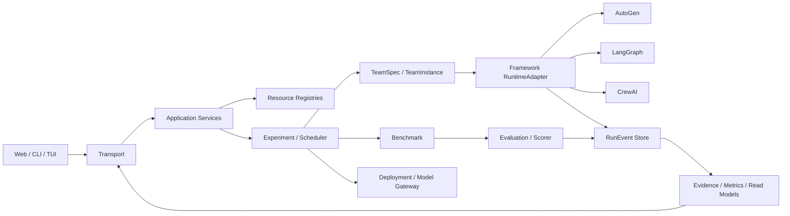

# 4. 模块化结构与实现合同

[上一章：相关工作与设计依据](03-related-work.md) · [返回总览](../EVAL_HANDOFF.md) · [下一章：系统性评估研究方案](05-research-plan.md)

## 本章怎样阅读

第 4 章是 LycheeMAS Eval 的工程合同索引。它不再将架构、资源、Team、Runtime、Deployment、Scheduler、Event 和 Studio 全部塞进一个文件，而是按模块所有权拆分成下列子文档。

| 部分 | 主要回答的问题 | 文档 |
|---|---|---|
| 4.1 架构与模块地图 | 模块怎样分层，依赖只能向哪里流动，代码应放在哪里 | [架构与模块地图](04-architecture-and-module-map.md) |
| 4.2 接口与生命周期 | Schema、Port、Adapter、Application Service、Transport 怎样协作，核心数据和错误合同是什么 | [接口、数据与生命周期](04-interface-and-lifecycle-contracts.md) |
| 4.3 资源与 Benchmark | Model/API/Benchmark 资源怎样注册，Benchmark 怎样 prepare/load/score | [资源与 Benchmark](04-resource-and-benchmark-contracts.md) |
| 4.4 TeamSpec v14 | 团队的 Node、Relation、SharedState、Lifecycle 如何完整表达 | [TeamSpec v14 当前权威合同](04-team-spec-v14-contract.md) |
| 4.5 跨框架 Runtime | TeamInstance 怎样编译为 AutoGen、LangGraph 和 CrewAI 的具体团队 | [TeamInstance 与 RuntimeAdapter](04-framework-runtime-contracts.md) |
| 4.6 Deployment 与推理 | HF/vLLM/API、生成参数、长度、超时和成本怎样归属 | [Deployment 与推理](04-deployment-and-inference-contracts.md) |
| 4.7 Experiment 与 Scheduler | Run/Trial/Attempt 如何组织，断点续测和逐 Trial 调度如何运作 | [Experiment、Runner 与 Scheduler](04-experiment-and-scheduler-contracts.md) |
| 4.8–4.9 Observability | EventLog 如何成为唯一事实源，Evidence、Metric 和 RunEvent 的完整合同是什么 | [Observability、Evidence 与 RunEvent](04-observability-and-event-contracts.md) |
| 4.10 Eval Studio | Web 页面怎样通过 Transport 和 read model 读取平台状态 | [Eval Studio 与页面读模型](04-studio-contracts.md) |

## 模块交互摘要

上图只是入口摘要；所有模块、子模块和依赖约束以 4.1 的完整蓝图为准。

## 唯一真源

| 对象 | 唯一真源 | 派生产物 |
|---|---|---|
| 资源 | 对应 Spec/Instance 注册文档 | 健康状态、扫描结果、UI read model |
| 团队 | TeamSpec v14 + TeamInstance | Coordination IR、MASGraph、BindingPlan、框架原生对象 |
| 实验 | ExperimentSpec + ExperimentInstance + 不可变 runtime snapshot | 队列视图、进度、ETA |
| 运行事实 | `run_events/` 中的 RunEvent 分片 | Result Projection、Evidence、Metric、Studio 回放 |

任何派生对象都不能反向成为第二份可编辑配置。

## 阅读和修改规则

1. 要改变团队语义，修改 TeamSpec，不直接改 Coordination IR 或 BindingPlan。
2. 要更换模型、框架或部署，修改或重建 Instance，不把部署信息写入 TeamSpec。
3. 要新增页面、CLI 或 TUI，复用 Application Service 和 Transport，不在客户端重写领域规则。
4. 要新增指标，从 RunEvent 派生 Evidence 和 MetricObservation，不修改原始事件。
5. 运行批次、smoke 数字、历史队列快照和一次性调试流程不属于实现合同，不再写入本章。
