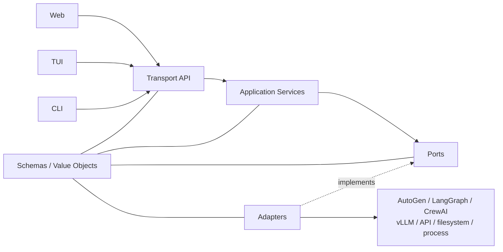
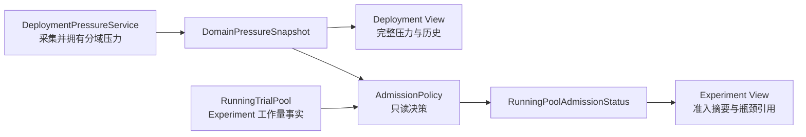

# 4.2 接口、数据合同与生命周期

[上一部分：架构与模块地图](04-architecture-and-module-map.md) · [返回第 4 章索引](04-implementation-contracts.md) · [下一部分：资源与 Benchmark](04-resource-and-benchmark-contracts.md)

### 4.2.1 接口先行：五层接口到底是什么

“模块化”不能只表现为目录变多。两个模块之间如果仍然读取对方私有字典、磁盘文件或类的下划线方法，依然是紧耦合。这里的 **Schema + Port + Adapter + Application Service + Transport** 不是五个依次执行的脚本，而是五种不同职责。可以分别理解为“统一表单、能力插座、转接器、办事流程和访问入口”。

| 层 | 通俗理解 | 它回答的问题 | 本项目示例 | 明确禁止 |
|---|---|---|---|---|
| Schema / Value Object | 统一表单和领域名词 | 模块之间传递的事实长什么样、哪些字段必填？ | `TeamSpec`、`TrialPlan`、`RunEvent`、`DomainPressureSnapshot` | 用松散 `dict` 临时加字段；把 React state 或第三方框架对象当领域数据 |
| Port / Protocol | 业务需要的“插座” | 上层需要什么能力，而不关心由谁实现？ | `RuntimeAdapter.execute()`、`ModelGateway.invoke()`、`EventSink.append()` | 接口名称或参数暴露 AutoGen、LangGraph、CrewAI、vLLM 私有对象 |
| Adapter | 接到具体系统的“转接器” | 怎样用某个具体框架、provider、文件或进程实现 Port？ | AutoGen runtime adapter、OpenAI-compatible backend、JSON repository | 在 adapter 内决定 benchmark 评分口径、研究指标或页面布局 |
| Application Service | 一次完整的“办事流程” | 用户发起一个用例时，应按什么顺序校验并调用多个 Port？ | 实例化 Deployment、装配 Experiment、入队、停止 Run、重新分析 | 解析 React 组件状态；直接拼 HTML；自己实现第三方框架内部逻辑 |
| Transport / Presentation | 不同访问入口 | Web、TUI、CLI 如何提交命令并读取结果？ | FastAPI route、SSE/WebSocket、CLI/TUI command、React page | 直接读写 Registry JSON、操作私有锁、绕过 Application Service 启动 shell |

依赖方向必须是：入口依赖应用服务，应用服务依赖 Port，具体 Adapter 反过来实现 Port。Port 本身绝不能 import Adapter。这就是依赖倒置，而不是把所有代码都放到一个“公共工具”文件里。



以“启动一个 ExperimentInstance”为例：

1. Web 点击按钮、TUI 选择菜单或 CLI 执行命令，最终都形成同一个 `StartExperimentCommand`。
2. Transport 只负责身份、参数解析和状态码，然后调用 `ExperimentApplicationService.start()`。
3. Application Service 读取 Spec/Instance、冻结配置、校验绑定，再调用队列、运行监督和事件 Port。
4. JSON Repository、子进程、AutoGen 或 vLLM Adapter 完成实际工作，但不能改变用例规则。
5. Application Service 返回同一个 `ExperimentOperationResult`；Web、TUI、CLI 各自决定怎样显示。

因此前后端**应该解耦**。目标不是让 Web 后端、TUI 后端和 CLI 后端各写一套业务，而是让它们共享同一套 Application Service 和版本化 Schema。远程 Web/TUI/CLI 统一通过 HTTP + SSE/WebSocket；本机 CLI 可以为了低开销直接调用 Application Service，但仍不得重新实现校验、调度或生命周期逻辑。当前 React 已主要通过 `/api/*` 访问后端，这是正确起点；尚需继续把 `api.py` 中的业务编排下沉到 Application Service，并让现有 CLI 也复用这些用例。

不是每个文件都需要一个抽象类。只有“存在多个实现”“需要独立测试替身”或“跨越模块边界”的能力才建立 `Protocol`；纯计算使用普通函数和不可变输入输出即可。协议必须同时定义输入、输出、错误、生命周期、副作用、幂等性和可观测事件，不能只写一个方法名。

### 4.2.2 核心数据合同（按模块）

以下对象是模块之间允许传递的正式数据；框架原生消息、FastAPI Request、React state 和磁盘内部格式不能越过对应 Adapter。为了避免再把全系统对象混在一张表里，按所有权模块列出。

#### Model、API Access、Pricing 与 Deployment 模块

| 数据合同 | 表示什么 | 主要字段 | 产生者 | 消费者 |
|---|---|---|---|---|
| `ModelSpec` / `ModelInstance` | 逻辑模型定义；已经注册或物化的本地模型文件 | organization、family、provider aliases、intrinsic capabilities；source、path、fingerprint、health | Model Application Service | Deployment assembler、UI |
| `APISpec` / `APIInstance` | 远程访问产品定义；经过校验的 endpoint 与凭据引用 | provider、protocol、base URL、secret reference、request limits、observed protocol capabilities、health | API Access Application Service | Deployment assembler、ModelGateway |
| `PricingSpec` / `PricingInstance` | 可复用计价规则；冻结到某次部署绑定的规则实例 | billing mode、currency、token/GPU-hour rates、source、fingerprint | Pricing Application Service | PricingResolver、Deployment assembler |
| `DeploymentSpec` / `DeploymentInstance` | 推理服务怎样部署；当前部署实例是什么 | backend kind、runtime settings、endpoint/process、model binding | Deployment Application Service | Team binder、DeploymentPressureProvider |
| `PricingBinding` / `CostRecord` | Deployment 使用哪套价格；某段 usage 的确定性成本 | pricing IDs、currency、token/GPU-hour rate、usage、amount | PricingResolver、CostCalculator | Metrics、Study、UI |
| `DomainPressureSnapshot` | 某个 Deployment 的某个资源域在一个时间点的压力事实 | domain、deployment IDs、utilization、queue、freshness、health | Deployment Pressure Service | AdmissionPolicy、Deployment view |

#### Benchmark 与评测模块

| 数据合同 | 表示什么 | 主要字段 | 产生者 | 消费者 |
|---|---|---|---|---|
| `BenchmarkSpec` / `BenchmarkInstance` | Benchmark 的稳定身份与类别；已经准备或外部引用的数据实例 | id、name、category；raw/prepared roots、source、health、fingerprint | Benchmark registry、AssetAcquirer | Experiment assembler、Benchmark plugin |
| `BenchmarkCase` | Benchmark 中一道尚未物化到 workspace 的标准 case | task、kind、question、gold、context、metadata | Benchmark implementation | CaseSampler、Trial planner |
| `MaterializedCase` | 已准备好附件、workspace 和工具声明的 case | case identity、task payload、workspace、tool declarations | Benchmark plugin | RuntimeAdapter |
| `Prediction` | 一个 Trial 对该 case 的正式提交，不等同于任意 agent 发言 | case/trial identity、result kind、submitter、content、artifact | ResultProjector、Benchmark plugin | BenchmarkScorer |
| `BenchmarkEvaluationResult` | Benchmark 官方 scorer 对一个 Prediction 的判断 | scorer、score/correct、error、scorer evidence | BenchmarkScorer | MetricEvaluator、Study、UI |
| `MetricObservation` / `MetricReport` | 通用质量、效率、协作、可靠性指标 | metric id、value、unit、applicability、evidence IDs | MetricEvaluator | StudyAggregator、UI |

#### Team 与框架适配模块

| 数据合同 | 表示什么 | 主要字段 | 产生者 | 消费者 |
|---|---|---|---|---|
| `TeamSpec` / `TeamInstance` | 框架无关团队定义；绑定框架和 Deployment 后的可运行团队 | nodes、relations、contracts；deployment bindings、framework binding、fingerprint | Team registry、TeamInstanceBinder | Experiment assembler、RuntimeAdapter |
| `NormalizedTeamSpec` | 通过合同校验、信息显式化后的抽象团队图 | nodes、typed relations、workflow、termination、result contract | TeamSpecValidator | CoordinationCompiler、Team binder |
| `CoordinationIR` | 与 AutoGen/LangGraph/CrewAI 无关的可执行协作事实 | eligible nodes、routing、message/data flow、state、stop rules | CoordinationCompiler | FrameworkPlanCompiler |
| `FrameworkBinding` | 某框架的执行计划和语义支持报告组成的不可分割绑定 | framework、execution plan、binding report、fingerprint | FrameworkPlanCompiler | TeamInstance、RuntimeAdapter |
| `BindingReport` | 框架对 TeamSpec 的语义实现程度 | exact/composed/approximated/unsupported、semantic deltas | FrameworkPlanCompiler | Experiment validator、UI、研究报告 |

#### 实验、Run、Trial 与 Attempt 模块

| 数据合同 | 表示什么 | 主要字段 | 产生者 | 消费者 |
|---|---|---|---|---|
| `ExperimentSpec` / `ExperimentInstance` | 可复现实验定义；带有队列、阶段和运行状态的实例 | BenchmarkSpec/TeamSpec/runtime policy；bound instances、priority、stage/progress | Experiment registry、Experiment Application Service | ExperimentAssembler、Scheduler、UI |
| `FrozenExperiment` | 一次运行真正使用的不可变 Spec/Instance 快照 | benchmark、team、deployments、runtime policy、fingerprints | ExperimentAssembler | ExecutionPlanCompiler、RunWorker |
| `TrialPlan` | 一个独立作答单元的执行计划 | case、trial index、trial seed、frozen bindings | RunWorker | TrialRunner |
| `AttemptExecutionRequest` | 某个 Trial 第几次基础设施尝试交给框架执行 | trial identity、attempt、framework plan、workspace、limits | TrialRunner | RuntimeAdapter |
| `RuntimeExecutionResult` | RuntimeAdapter 完成一次 Attempt 后的事实 | framework messages、tool facts、termination、artifacts | RuntimeAdapter | TrialRunner、ResultProjector |
| `TrialOutcome` | Trial 的终态，不因内部重试而变成多个 Trial | terminal status、Prediction/error、attempt summary、artifacts | TrialRunner | EventLog、BenchmarkScorer |
| `RunControlCommand` | Scheduler 对承载多个 Trial 的 Run worker 下发的控制 | permits、drain/stop、dynamic limits | Scheduler | RunControlPort、RunWorker |

#### 模型、工具与工作区模块

| 数据合同 | 表示什么 | 主要字段 | 产生者 | 消费者 |
|---|---|---|---|---|
| `ModelCallRequest` / `ModelCallResult` | 一次 provider completion 的规范化输入输出 | messages、tools、budget；provider payload、usage、finish reason | RuntimeAdapter、ModelGateway | ModelBackend、EventLog |
| `ToolExecutionRequest` / `ToolExecutionResult` | 一次真实工具调用及结果 | tool name、arguments、workspace、stdout/stderr、artifacts、error | Runtime/ToolExecutor | RuntimeAdapter、EventLog |
| `Workspace` / `ArtifactManifest` | 当前 Attempt 可用工作目录；运行后产生的文件清单 | root、ownership、inputs；paths、hashes、media types | WorkspaceService | RuntimeAdapter、ResultProjector |

#### 事件、投影与研究分析模块

| 数据合同 | 表示什么 | 主要字段 | 产生者 | 消费者 |
|---|---|---|---|---|
| `EventDraft` / `RunEvent` | 组件提交的类型化草稿；EventSink 补齐 envelope 后形成的不可变事实 | type-specific payload；run/trial/attempt IDs、event id、seq、time | 所有执行组件、EventSink | EventSource、Projection、Evidence |
| `ResultProjection` / `ExecutionTrace` | 从无损 Event 派生的作答视图；可读执行轨迹 | Prediction list；ordered actor/model/tool/termination steps | ProjectionBuilder | Scorer、UI、人工审计 |
| `EvidenceSet` | 指标计算使用的规范化证据，不是另一份原始日志 | evidence facts、source event IDs、applicability | EvidenceNormalizer | MetricEvaluator |
| `StudyReport` | 跨 Run 比较与统计结论 | cohorts、aggregates、uncertainty、coverage | StudyAggregator | 研究报告、UI |

#### 调度模块

| 数据合同 | 表示什么 | 主要字段 | 产生者 | 消费者 |
|---|---|---|---|---|
| `ExperimentQueue` | 已入队 ExperimentInstance 的顺序和优先级 | instance ID、priority、enqueue time、stage limits | ExperimentQueueRepository | TrialQueueBuilder |
| `TrialAdmissionQueue` / `RunningTrialPool` | 尚未准入的逐 Trial 序列；已经准入运行池的 Trial | trial keys、origin experiment、policy；active/launching state | TrialQueueBuilder、Scheduler | AdmissionPolicy、UI projection |
| `TrialPermit` / `AdmissionDecision` | 某个明确 Trial 是否准入及其依据 | trial key、admit/defer、reason、pressure snapshot versions | AdmissionPolicy | Scheduler、RunControlPort |
| `RunningPoolAdmissionStatus` | 运行池当前还能否接纳 Trial 的派生决策摘要 | normal/constrained/blocked/unknown、bottlenecks、reasons | Scheduler projection | Experiment view、CLI/TUI |

这些名称描述 Eval 领域事实，不应随着第三方框架类名变化。迁移期间可以由现有 `MASGraph`、`TaskQuery` 和 `Trajectory` 承载其中一部分，但新代码不得继续给这些历史容器添加无边界字段；应逐步物化上表的正式 Value Objects。

### 4.2.3 各模块目标接口

接口按“哪个模块拥有它”组织。表中的输入输出是正式 Schema，不是随意的 `dict`。同一接口可以有多个 Adapter；例如 `RuntimeAdapter` 有 AutoGen、LangGraph、CrewAI 三个实现，而 Team 模块只依赖这个 Port。

#### Model、API Access、成本与 Deployment

| Port / Service | 类型 | 输入 | 输出 | 唯一职责 |
|---|---|---|---|---|
| `SpecRepository[T]` | Port | ID 或 Spec | Spec / Spec 列表 | 校验后持久化 Spec；不知道下载和运行 |
| `InstanceRepository[T]` | Port | ID 或 Instance | Instance / Instance 列表 | 持久化实例事实；`registered` 不等于 `healthy` |
| `ModelAssetAcquirer` | Port | ModelSpec + acquisition request | ModelInstance | 下载、引用、扫描和清理模型资产 |
| `BenchmarkDataAcquirer` | Port | BenchmarkSpec + acquisition request | BenchmarkInstance | 下载、导入、扫描、prepare 和清理 benchmark 数据 |
| `APIHealthProbe` | Port | APIInstance + minimal request | HealthReport / CapabilityReport | 校验 endpoint、凭据引用和访问协议能力；API Access 没有下载/prepare 生命周期 |
| `DeploymentProvisioner` | Port | DeploymentSpec + resources | DeploymentInstance | 启动、停止、销毁本地或远程推理部署 |
| `HealthProbe[T]` | Port | Instance | `HealthReport` | 只判断当前可用性，不修改注册事实 |
| `SecretResolver` | Port | `SecretReference` | 进程内 `SecretValue` | 在最后时刻解析密钥，禁止写入 Event/API 响应 |
| `PricingResolver` | Port | DeploymentInstance | `PricingBinding` | 为部署选择本地实际成本和 API 等价价格 |
| `CostCalculator` | Domain service | Usage + PricingBinding | `CostRecord` | 纯确定性费用计算，不发模型请求 |
| `DeploymentPressureProvider` | Port | Deployment IDs | 分域 `DomainPressureSnapshot` | 由 Deployment 模块采样并拥有 vLLM/GPU/API 压力事实 |
| `ModelApplicationService` | Application service | register/acquire/release command | operation result | 编排逻辑模型注册和本地模型文件生命周期 |
| `APIAccessApplicationService` | Application service | register/probe/delete command | operation result | 编排 API 访问产品、endpoint、凭据引用、限流和连通性检查 |
| `BenchmarkApplicationService` | Application service | register/acquire/prepare/release command | operation result | 编排 BenchmarkSpec/Instance、数据生命周期和实现插件 |
| `DeploymentApplicationService` | Application service | instantiate/start/stop/probe command | operation result | 编排 Deployment 全生命周期和压力查询 |

#### Benchmark 与评测

| Port / Service | 类型 | 输入 | 输出 | 唯一职责 |
|---|---|---|---|---|
| `BenchmarkPlugin` | Facade Port | prepare/case/materialize/evaluate request | asset、case、Prediction、score | 聚合一个 benchmark 的来源、case、工具和官方评分能力 |
| `CaseSampler` | Domain service | cases + CaseSelection | selected cases | 确定性完成 head/uniform/stratified/full 选择 |
| `ResultProjector` | Port | RunEvents + ResultContract | `Prediction` | 从团队执行事实得到一次合法提交 |
| `BenchmarkScorer` | Port | Prediction + benchmark context | `BenchmarkEvaluationResult` | 调用 benchmark 官方或严格等价 scorer |
| `MetricEvaluator` | Port | EvidenceSet + EvaluationProfile | `MetricReport` | 计算通用四类指标和适用性 |
| `StudyAggregator` | Port | Run references + StudySpec | `StudyReport` | 跨 Run 比较、置信区间、覆盖率和统计检验 |
| `EvaluationApplicationService` | Application service | score/analyze/study command | operation result | 组织投影、评分、证据、指标和研究聚合 |

#### Team 与跨框架适配

| Port / Service | 类型 | 输入 | 输出 | 唯一职责 |
|---|---|---|---|---|
| `TeamSpecValidator` | Domain service | TeamSpec | NormalizedTeamSpec | 校验 Node、Relation、workflow、termination 和 result contract |
| `CoordinationCompiler` | Domain service | NormalizedTeamSpec | CoordinationIR | 从显式图合同提取框架无关协作事实 |
| `FrameworkPlanCompiler` | Adapter Port | CoordinationIR | `FrameworkBinding` | 为一个框架生成原生执行计划和 BindingReport |
| `TeamInstanceBinder` | Application service | TeamSpec + DeploymentInstances + framework | TeamInstance | 绑定 Node 到 Deployment，并冻结 framework binding |
| `RuntimeAdapter` | Port | AttemptExecutionRequest | RuntimeExecutionResult | 在对应框架内执行一次 Attempt；不负责 Trial 重试和评分 |

#### 模型、工具、工作区与 Event

| Port / Service | 类型 | 输入 | 输出 | 唯一职责 |
|---|---|---|---|---|
| `ModelBackend` | Adapter Port | ModelCallRequest | ModelCallResult | 完成一次具体 provider/model completion |
| `ModelGateway` | Port | ModelCallRequest | ModelCallResult | 解析 Deployment 绑定、预算、usage、错误和无损 provider 记录 |
| `WorkspaceService` | Port | WorkspaceRequest | Workspace / ArtifactManifest | 准备、收集和幂等关闭 Attempt 工作区 |
| `ToolProvider` | Port | Tool declarations + Workspace | ToolSet | 把 Team/Benchmark 工具声明绑定到当前框架 |
| `ToolExecutor` | Port | ToolExecutionRequest | ToolExecutionResult | 执行一次工具调用；不决定下一位角色 |
| `SandboxProvider` | Port | SandboxRequest | SandboxHandle | 管理代码执行沙盒生命周期 |
| `BrowserSessionProvider` | Port | BrowserRequest | BrowserSession | 管理浏览器会话生命周期 |
| `EventSink` / `EventSource` | Port | EventDraft / EventQuery | RunEvent / event stream | 唯一分配 event envelope；按序读取无损事实 |
| `ArtifactStore` | Port | ArtifactDraft / ArtifactReference | reference / binary stream | 保存真正的二进制或外部产物，不替代文本 Event |
| `RunSnapshotStore` | Port | FrozenRunConfiguration | SnapshotReference | 保存一次 Run 使用的全部冻结配置 |

#### Experiment、Run、Trial 与 Scheduler

| Port / Service | 类型 | 输入 | 输出 | 唯一职责 |
|---|---|---|---|---|
| `ExperimentAssembler` | Application service | ExperimentSpec + ExperimentInstance | FrozenExperiment | 解析所有引用并冻结本次运行事实 |
| `ExecutionPlanCompiler` | Domain service | FrozenExperiment | RunLaunchPlan | 生成可执行命令、环境和 snapshot plan |
| `ExperimentQueueRepository` | Port | queue entry / instance ID | ExperimentQueue | 持久化优先级和入队时间，不展开 Trial |
| `TrialQueueBuilder` | Domain service | ExperimentQueue + RunProgress | TrialAdmissionQueue | 展开 A1、A2、B1 等逐 Trial 待准入序列 |
| `AdmissionPolicy` | Domain service | queue + pool + pressure snapshots | AdmissionDecision list | 纯状态转移；不启动进程、不采集压力 |
| `RunSupervisor` | Port | launch/resume request | RunHandle / process status | 管理承载多个 Trial 的 worker 进程 |
| `RunControlPort` | Port | RunHandle + RunControlCommand | acknowledgement | 将 permits、drain、stop 发送给 Run worker |
| `TrialRunner` | Domain/Application service | TrialPlan | TrialOutcome | 管理 Attempt 重试、投影和 Trial 终态 |
| `RunWorker` | Runtime service | FrozenExperiment + controls | RunOutcome | 消费 permits，并发执行本 Run 的 Trial |
| `SchedulingApplicationService` | Application service | enqueue/start/drain/stop/resume command | operation result | 组织 Queue、Policy、Supervisor 和 Control Port |

#### Transport、页面和其它客户端

| 接口 | 输入 | 输出 | 说明 |
|---|---|---|---|
| `StudioCommandService` | typed command | typed operation result | Web/TUI/CLI 共用的写用例门面；内部委托各模块 Application Service |
| `StudioQueryService` | `PageQuery` | versioned `PageReadModel` | 只构建页面或终端需要的 read model，不返回 Registry 私有结构 |
| FastAPI Transport | HTTP/SSE/WebSocket | JSON/Event stream | 处理鉴权、序列化、状态码和长任务事件，不承载业务规则 |
| CLI Transport | argv/stdin | terminal output/exit code | 将命令转换成同一 typed command；不能另写一套调度器 |
| TUI Transport | keyboard/event | terminal widgets | 使用同一命令和查询接口，仅展示方式不同 |
| React Presentation | PageReadModel + user actions | rendered UI + command calls | 不计算压力公式、不直接访问文件系统、不修改服务器进程 |

下面保留方法级伪签名，供实际编码和 contract tests 使用；日常理解系统优先看上面的模块表。

<details>
<summary>展开：方法级 Protocol 参考签名</summary>

下列伪签名是公开边界，不要求所有实现继承共同基类；Python 实现优先用结构化 `Protocol`，第三方对象只存在于 Adapter 内部。

```python
class BenchmarkPlugin(Protocol):
    # Facade；内部可组合 DataProvider、CaseRuntimeBinding 和 BenchmarkScorer。
    def descriptor(self) -> BenchmarkDescriptor: ...
    def prepare(self, request: PrepareRequest) -> PreparedAsset: ...
    def iter_cases(self, selection: CaseSelection) -> Iterable[BenchmarkCase]: ...
    def materialize_case(self, case: BenchmarkCase, workspace: Workspace) -> MaterializedCase: ...
    def create_tools(self, case: BenchmarkCase, workspace: Workspace) -> ToolBundle: ...
    def collect_prediction(self, result: RuntimeExecutionResult) -> Prediction: ...
    def evaluate(self, request: BenchmarkEvaluationRequest) -> BenchmarkEvaluationResult: ...
    def aggregate(self, results: Iterable[EvaluationResult]) -> BenchmarkSummary: ...

class TeamSpecValidator(Protocol):
    def validate(self, spec: TeamSpec) -> NormalizedTeamSpec: ...

class CoordinationCompiler(Protocol):
    def compile(self, spec: NormalizedTeamSpec) -> CoordinationIR: ...

class FrameworkPlanCompiler(Protocol):
    framework: str
    def compile(self, ir: CoordinationIR) -> FrameworkBinding: ...

class TeamInstanceBinder(Protocol):
    def bind(self, spec: NormalizedTeamSpec,
             deployments: Mapping[str, DeploymentInstance],
             framework: str) -> TeamInstance: ...

class RuntimeAdapter(Protocol):
    framework: str
    def capabilities(self) -> CapabilityReport: ...
    async def execute(self, request: AttemptExecutionRequest) -> RuntimeExecutionResult: ...

class ModelBackend(Protocol):
    async def complete(self, request: ModelCallRequest) -> ModelCallResult: ...

class ModelGateway(Protocol):
    async def invoke(self, request: ModelCallRequest) -> ModelCallResult: ...

class WorkspaceService(Protocol):
    def prepare(self, request: WorkspaceRequest) -> Workspace: ...
    def collect_artifacts(self, workspace: Workspace) -> ArtifactManifest: ...
    async def close(self, workspace: Workspace) -> None: ...

class ToolProvider(Protocol):
    def bind(self, declarations: Iterable[ToolDeclaration], workspace: Workspace) -> ToolSet: ...

class ToolExecutor(Protocol):
    async def execute(self, request: ToolExecutionRequest) -> ToolExecutionResult: ...

class SandboxProvider(Protocol):
    async def start(self, request: SandboxRequest) -> SandboxHandle: ...
    async def stop(self, handle: SandboxHandle) -> None: ...

class BrowserSessionProvider(Protocol):
    async def open(self, request: BrowserRequest) -> BrowserSession: ...
    async def close(self, session: BrowserSession) -> None: ...

class EventSink(Protocol):
    def append(self, event: EventDraft) -> RunEvent: ...

class EventSource(Protocol):
    def iter_events(self, query: EventQuery) -> Iterable[RunEvent]: ...

class ResultProjector(Protocol):
    def project(self, events: Iterable[RunEvent], contract: ResultContract) -> Prediction: ...

class BenchmarkScorer(Protocol):
    def evaluate(self, request: BenchmarkEvaluationRequest) -> BenchmarkEvaluationResult: ...

class MetricEvaluator(Protocol):
    def evaluate(self, evidence: EvidenceSet, profile: EvaluationProfile) -> MetricReport: ...

class StudyAggregator(Protocol):
    def aggregate(self, runs: Iterable[RunReference], study: StudySpec) -> StudyReport: ...

class DeploymentPressureProvider(Protocol):
    def snapshot(
        self, deployment_ids: Iterable[str]
    ) -> Mapping[str, DomainPressureSnapshot]: ...

class AdmissionPolicy(Protocol):
    def decide(self, queue: TrialAdmissionQueue, pool: RunningTrialPool,
               pressure: Mapping[str, DomainPressureSnapshot]) -> list[AdmissionDecision]: ...

class RunSupervisor(Protocol):
    # 管理承载多个 Trial 的 Run worker 进程，不把一个进程误称为 Trial。
    def start(self, request: RunLaunchRequest) -> RunHandle: ...
    def resume(self, request: RunResumeRequest) -> RunHandle: ...
    def status(self, handle: RunHandle) -> RunProcessStatus: ...
    def drain(self, handle: RunHandle) -> None: ...
    def stop(self, handle: RunHandle) -> None: ...

class RunControlPort(Protocol):
    def apply(self, handle: RunHandle, command: RunControlCommand) -> None: ...

class TrialRunner(Protocol):
    async def execute(self, plan: TrialPlan) -> TrialOutcome: ...

class RunWorker(Protocol):
    async def run(self, experiment: FrozenExperiment,
                  controls: RunControlPort) -> RunOutcome: ...
```

Registry 统一使用两个窄接口，而不是让上层记住 `specs()/all()/instances()/get()/instance()` 等不同命名：

```python
class SpecRepository(Protocol[SpecT]):
    def list_all(self) -> list[SpecT]: ...
    def get(self, spec_id: str) -> SpecT: ...
    def save(self, spec: SpecT) -> SpecT: ...
    def delete(self, spec_id: str) -> None: ...

class InstanceRepository(Protocol[InstanceT]):
    def list_all(self) -> list[InstanceT]: ...
    def get(self, instance_id: str) -> InstanceT: ...
    def save(self, instance: InstanceT) -> InstanceT: ...
    def delete(self, instance_id: str) -> None: ...
```

资源注册、物化和健康检查是不同能力。Repository 只负责规范化和持久化；Model/Benchmark 由 `AssetAcquirer` 下载、导入或扫描，Deployment 由 `DeploymentProvisioner` 启停，Team 由 `TeamInstanceBinder` 绑定，Experiment 由 `ExperimentAssembler` 冻结装配；`HealthProbe.probe()` 检查实例现在是否可用。API/Pricing Instance 主要是经过校验的注册事实，不强行伪装成需要启动的资源。`registered`、`materialized` 和 `healthy` 必须分别表达。

其余跨模块端口不能遗漏：

```python
class AssetAcquirer(Protocol[SpecT, AssetInstanceT]):
    # 仅用于 Benchmark/Model 的 download/import/scan/materialize 生命周期。
    def acquire(self, spec: SpecT, request: AcquisitionRequest) -> AssetInstanceT: ...
    def scan(self, spec: SpecT, roots: Sequence[Path]) -> list[AssetInstanceT]: ...
    def release(self, instance: AssetInstanceT, *, delete_managed_data: bool) -> None: ...

class DeploymentProvisioner(Protocol):
    def instantiate(self, spec: DeploymentSpec,
                    resources: DeploymentResources) -> DeploymentInstance: ...
    def stop(self, instance: DeploymentInstance) -> None: ...
    def destroy(self, instance: DeploymentInstance) -> None: ...

class HealthProbe(Protocol[InstanceT]):
    def probe(self, instance: InstanceT) -> HealthReport: ...

class SecretResolver(Protocol):
    def resolve(self, reference: SecretReference) -> SecretValue: ...

class PricingResolver(Protocol):
    def resolve(self, deployment: DeploymentInstance) -> PricingBinding: ...

class CostCalculator(Protocol):
    def calculate(self, usage: UsageRecord, pricing: PricingBinding) -> CostRecord: ...

class CaseSampler(Protocol):
    def select(self, cases: Sequence[BenchmarkCase], selection: CaseSelection) -> list[BenchmarkCase]: ...

class ExperimentAssembler(Protocol):
    def assemble(self, spec: ExperimentSpec, instance: ExperimentInstance) -> FrozenExperiment: ...

class ExecutionPlanCompiler(Protocol):
    def compile(self, experiment: FrozenExperiment) -> RunLaunchPlan: ...

class ExperimentQueueRepository(Protocol):
    def enqueue(self, entry: QueueEntry) -> None: ...
    def dequeue(self, experiment_instance_id: str) -> None: ...
    def snapshot(self) -> ExperimentQueue: ...

class TrialQueueBuilder(Protocol):
    def expand(self, experiments: ExperimentQueue,
               progress: Mapping[str, RunProgress]) -> TrialAdmissionQueue: ...

class ProjectionBuilder(Protocol[ProjectionT]):
    def build(self, events: EventSource, query: EventQuery) -> ProjectionT: ...

class EvidenceNormalizer(Protocol):
    def normalize(self, events: EventSource, query: EventQuery) -> EvidenceSet: ...

class ArtifactStore(Protocol):
    def publish(self, artifact: ArtifactDraft) -> ArtifactReference: ...
    def open(self, reference: ArtifactReference) -> BinaryIO: ...

class RunSnapshotStore(Protocol):
    def freeze(self, run: RunIdentity, snapshot: FrozenRunConfiguration) -> SnapshotReference: ...

class StudioQueryService(Protocol):
    def query(self, request: PageQuery) -> PageReadModel: ...
```

`SecretResolver` 只在控制面把凭据引用解析到进程环境，SecretValue 不写入 Spec、Instance、Event 或 API 响应。`PricingResolver` 绑定计费规则，`CostCalculator` 只执行确定性计算；二者不能混进 ModelGateway。`ExperimentQueueRepository` 保存 ExperimentInstance 的优先级和入队时间；`TrialQueueBuilder` 再依据 Case/Trial 计划与已完成进度展开 A1、A2、B1 这类逐 Trial 待准入序列。`AdmissionPolicy` 只做纯决策，`RunSupervisor` 只管理 Run worker 进程，三者不能再次合并成一个巨型 Scheduler 类。

几个看似重复的接口有明确前后关系：

- `BenchmarkPlugin.create_tools()` 声明某个 Case 需要的 benchmark 专属工具；`ToolProvider.bind()` 把这些声明和 TeamSpec 工具槽绑定为当前框架可调用工具；`ToolExecutor.execute()` 才执行一次调用。
- `ResultProjector` 先按 TeamSpec 的 submit relation 从运行事件得到合法团队提交；`BenchmarkPlugin.collect_prediction()` 再把文本、patch、action 或 workspace artifact 转成 benchmark 的 Prediction。
- `BenchmarkPlugin.evaluate()` 是注册插件 facade；它内部委托 `BenchmarkScorer`，从而同时支持 incremental scorer 和 batch-final 官方 harness。
- `ModelBackend.complete()` 只完成一次 provider/model completion；`ModelGateway.invoke()` 负责部署绑定、统一参数、token budget、provider 记录和错误映射。工具循环由框架原生 runtime 或独立 ToolLoopCoordinator 承担，不能隐式藏在 Backend 中。
- `TeamInstanceBinder` 负责把 Role/Function Node 绑定到 DeploymentInstance；`FrameworkPlanCompiler` 只把协调 IR 编译为框架计划，不能读取模型路径、API key 或价格。
- Event producer 只能提交 `EventDraft`；只有 EventSink 可以分配 `event_id/seq/timestamp` 并封装 `RunEvent`，防止多 worker 自己制造冲突序号。结构化 messages、模型文本输入输出和 provider payload 仍在 Event 中无损保存；只有本来就属于外部 artifact 的仓库文件、截图、patch 包和其它二进制对象进入 ArtifactStore，Event 保存稳定引用、哈希和必要元数据。
- `StudioQueryService` 只生成页面 read model；FastAPI router 不直接拼 Registry 私有结构，React 也不能把 read model 当作可写 Spec 回传。

</details>

### 4.2.4 Deployment 压力与 Experiment 运行池的所有权

压力的**采集、计算、所有权和展示位置**必须区分。页面为了方便可以引用其它模块的数据，但不能因此改变数据所有者。

| 信息 | 真正所有者 | 怎样产生 | 哪些模块可以读取 | 应主要显示在哪里 |
|---|---|---|---|---|
| vLLM 服务压力 | Deployment | 由对应 Deployment 的 `/metrics`、请求 telemetry 和健康窗口计算 | Scheduler、Experiment projection、UI | Deployment 管理显示完整细节 |
| GPU 压力 | Deployment | 对 Deployment 实际占用设备采集利用率、显存、温度、功耗等 | Scheduler、Experiment projection、UI | Deployment 管理显示完整细节 |
| API 压力 | Deployment | 根据 provider rate-limit、in-flight、429/timeout、可观测 queue 等计算；不可观测时明确 `unknown` | Scheduler、Experiment projection、UI | Deployment 管理显示完整细节 |
| Trial 运行池状态 | Experiment/Scheduler | active、launching、pending、所属 Experiment、固定/动态并发策略 | Experiment UI、CLI/TUI | Experiment 管理 |
| 运行池准入状态 | Scheduler projection | AdmissionPolicy 读取所有相关 Deployment 的独立快照和运行池状态后派生 | Experiment UI、CLI/TUI | Experiment 管理显示摘要 |

这里不存在一个把 vLLM、GPU、API 百分比直接加权相加的“全局综合压力”。每个 Deployment 的每个 domain 可以有自己的 `pressure_score`；运行池只形成离散的 `RunningPoolAdmissionStatus`：

| 状态 | 含义 |
|---|---|
| `normal` | 相关 Deployment 快照新鲜且没有阻止新 Trial 的资源条件 |
| `constrained` | 仍可运行，但某个 Deployment 接近阈值或只能小步准入 |
| `blocked` | 至少一个当前 Trial 必需的 Deployment 明确阻止准入 |
| `unknown` | 关键 Deployment 缺少新鲜 telemetry，不能伪造为低压力 |

`RunningPoolAdmissionStatus` 还应包含 `deployment_ids`、`bottleneck_deployment_ids`、`reasons` 和使用的 `snapshot_versions`。这样 Experiment 页面可以显示“当前因 `qwen35-vllm-gpu67` 的 vLLM queue 受限”，并链接到 Deployment 详情；它不需要复制一整套压力仪表盘，更不能在 React 中重新计算 queue、TTFT 或 GPU 分数。



目标 API/read model 也按所有权分开：

| 查询 | 返回内容 |
|---|---|
| `GET /api/deployments/{id}/pressure` | 该 Deployment 的 vLLM/GPU/API 快照、freshness、health 和采样来源 |
| `GET /api/deployments` 的页面读模型 | 每个 Deployment 的当前压力摘要，供部署管理列表使用 |
| `GET /api/experiments/scheduler` | Trial queue、running pool、`RunningPoolAdmissionStatus` 和瓶颈 Deployment 引用 |

当前实现已完成物理所有权迁移：`DeploymentHealthMonitor` 位于 `eval/deployments/pressure.py`，由 Server 组合入口创建一次，再同时注入 Deployment 查询与 Scheduler；`StudioView.tsx` 通过 `ResourcePressure` 展示后端事实，`ExperimentView.tsx` 只展示运行池准入摘要和瓶颈原因。`eval/scheduling/pressure.py` 只提供无 I/O 的单域汇总函数，不拥有采样生命周期。vLLM 没有采样时明确返回 `telemetry_available=false`，最后样本超过 30 秒时返回 `telemetry_stale=true` 和 `unknown`，不会把缺失事实显示成 0% 压力。下一步是把当前松散字典收敛为版本化 `DomainPressureSnapshot`。

### 4.2.5 错误、生命周期与事件合同

模块不能依赖解析异常字符串来协作。跨边界错误至少分为：

| 错误 | 含义 | 默认处理 |
|---|---|---|
| `ContractValidationError` | Spec、Request 或 Event 不满足 schema | 拒绝保存或启动，不重试 |
| `CapabilityUnsupportedError` | Adapter 明确无法执行所需语义 | 阻止实例化，展示 BindingReport |
| `BindingError` | Spec 合法，但找不到或无法绑定所需 Instance | 保留 Spec，修复资源后重试 |
| `ResourceUnavailableError` | 模型、API、浏览器、Docker 等当前不可用 | defer 或基础设施重试 |
| `RuntimeExecutionError` | 一次 Attempt 的框架执行失败 | 按 Experiment retry 策略处理 |
| `ResultContractError` | 执行结束但没有合法提交 | Trial 失败并保留完整事件 |
| `EvaluationError` | Prediction 存在，但 scorer/harness 失败 | 推理结果保留，评分可独立重跑 |

所有有资源生命周期的接口都遵循 `prepare/start -> use -> close`，`close()` 必须幂等并放在 `finally`。每个跨模块操作发出 started/completed/failed Event，关联同一个 `operation_id`；协议实现不得只打印日志而不留下事件。写操作还要说明幂等键：prepare 按 asset fingerprint，Trial 按 `(run_id, case_id, trial_index)`，Evaluation 按 `(trial_event_id, scorer fingerprint)` 去重。

Run、Job、Evaluation/Metrics 和 ExperimentInstance 是四份不同事实，终态按以下规则收口：

1. Runner 的 `run_status.json` 是 Run 是否 complete/paused/stopped/failed 的首要事实，所有终态统一由 `runner/run_finalization.py` 写入，终态一律 `accepting_new_trials=false`。
2. Job process return code 说明承载进程怎样结束，不能覆盖已经持久化的 Run failure；两者冲突时 read model 返回 `lifecycle_consistent=false` 和结构化 `lifecycle_conflict`。
3. `ExperimentFinalizer` 先原子写 `run_finalization.json` 的 `finalizing` receipt，再运行可重放 Evaluation、写 Metrics 与 Instance 终态，最后将 receipt 标记为 `finalized`。
4. Server 启动或 Scheduler 恢复时检查未完成 receipt 和陈旧 Instance；reconciliation 只重放幂等步骤，不重新运行已完成 Trial。
5. Evaluation 失败不会删除 Prediction 或把 Run 改回 running；Instance 进入带诊断信息的失败状态，可独立重新评分。

### 4.2.6 推荐开发与迁移顺序

后续不进行一次性重写，而按纵向切片迁移：

1. **冻结合同测试**：为上面的 Schema、Protocol、错误和事件建立 contract tests；现有实现先通过 adapter 包装满足合同。
2. **拆 Coordination**：保留纯 `CoordinationIR` compiler，把 AutoGen/LangGraph/CrewAI plan compiler 移入各自 Adapter 子包。
3. **组合 Runtime 公共服务（第二轮完成）**：Workspace、CodeExecution、ResultProjection 已提取，误导性的公共基类已改名为 `ModelGatewayRuntimeBase`；AutoGen coordination/events 已成为窄服务，运行期 conformance report 已建立。后续只有出现第二个真实消费者时才继续抽 ToolLifecycle。
4. **修正压力所有权（第二轮完成）**：DeploymentPressureService、共享 monitor、前端分域展示和 missing/stale telemetry 已落地；下一轮只做版本化 snapshot 和正式负载阈值校准。
5. **建立按领域 Application Service（第一轮完成）**：System、Resource、Pricing、Deployment、Team、Experiment、Run 均已有独立应用服务；下一轮补版本化 command/query schema，并让 CLI 复用。
6. **瘦身 Transport（已完成物理拆分）**：FastAPI Router 已移入 `eval/interfaces/http/`，`apps/eval/server/app.py` 仅装配依赖；下一轮收敛错误类型与 OpenAPI schema。
7. **拆前端页面并类型化客户端（进行中）**：Team 图与 d3-force/React Flow 生命周期已进入 `TeamGraphCanvas.tsx`；Runs 已增加服务端搜索、分页和窗口化渲染。下一步继续拆 Team/Experiment 大组件、类型化 read model，并在规模需要时建立持久化索引。
8. **做三层验证**：纯合同单测、每个 Adapter 的 conformance fixture、真实 `Benchmark x Team x Framework` smoke。Text/Action/Patch 与工具故障的确定性 conformance 已完成；真实 smoke 仍是外部工具和官方 scorer 的门禁。

每个切片都必须保持 `make lint/test/selfcheck` 和前端 build 通过，并在 BindingReport/EventLog 中证明行为未被静默改变。衡量拆分是否成功的标准不是文件行数，而是能否用假 Repository、假 DeploymentPressureProvider、假 ModelGateway 独立测试一个模块，以及替换某个框架时其它模块是否无需修改。
