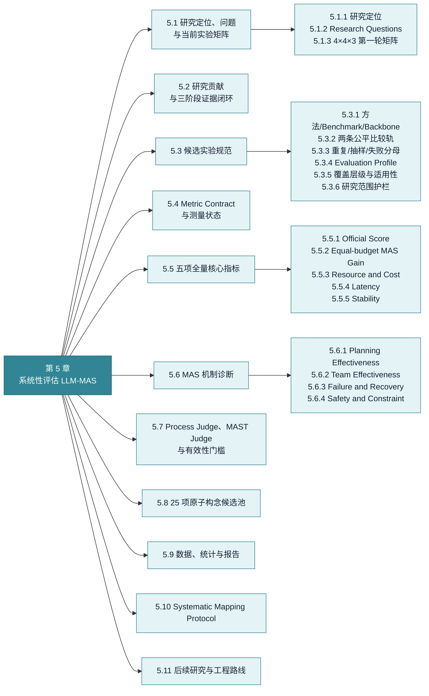
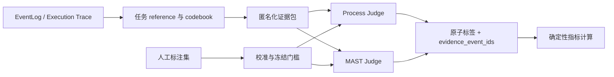

# 5. 系统性评估 LLM-MAS 的研究方案

[上一章：模块化结构与实现合同](04-implementation-contracts.md) · [返回总览](../EVAL_HANDOFF.md) · [下一章：使用、扩展与交接](06-operations-and-handoff.md)

!!! abstract "本章回答什么"
    - 系统性评估 LLM-MAS 要回答哪些研究问题，创新点在哪里？
    - 如何控制 benchmark、团队、框架、模型和预算，形成公平实验？
    - 指标如何定义、何时可测、怎样统计并形成可审计的研究证据？

> **性质：研究假设。** 本章提出的研究问题、构念和候选矩阵必须通过冻结配置、实验和统计检验，不能因为已经写入手册就当作结论。

<!-- chapter-map:start -->
**第 5 章展开：研究问题、指标与实验方法**


<!-- chapter-map:end -->

## 5.1 研究定位、问题与当前实验矩阵

### 5.1.1 研究定位

研究中心是“一个 MAS 到底应评什么，以及怎样系统、可信地描述评测”。两个出发点：

1. 任务相关：数学、推理、代码、网页、办公任务是否完成。
2. 系统自身：规划、组织、通信、工具、恢复和资源分配是否有效。

创新不应只是把已有指标全部实现一次，而应建立任务结果、协作机制、资源成本和失败恢复之间的可验证因果链，并说明不同框架、团队形态和任务适合哪些评测方式。

研究叙事可压缩为“一个中心、两个视角、四类评价、三种证据”：一个中心是完整 LLM-MAS 的系统性评估；两个视角是任务相关与系统自身；四类评价是 Task、Coordination、Efficiency、Reliability；三种证据是官方终局证据、运行过程证据和配对干预证据。前三者不是四个可相加的总分，而是相互制约的分析层。

### 5.1.2 Research Questions

- RQ1：只看官方正确率会遗漏哪些 MAS 行为和失败？
- RQ2：在相同模型、预算和工具条件下，MAS 相比强单 Agent 是否提供显著收益？
- RQ3：Independent、Sequential、Centralized、Decentralized 在不同任务上如何交换质量、成本、延迟和稳定性？
- RQ4：重复、冗余、多余、上下文隔离和答案泄漏如何被可靠区分并测量？
- RQ5：同一抽象 TeamSpec 在 AutoGen、LangGraph、CrewAI 中的实现差异会怎样改变结果？
- RQ6：哪些指标真正反映机制，哪些只是系统规模或 token 数的代理变量？

### 5.1.3 4×4×3 第一轮矩阵

Benchmark：GAIA、BBEH、SWE-bench Verified、WorkBench。

Team：Independent、Sequential、Centralized、Decentralized。

Framework：AutoGen、LangGraph、CrewAI。

共 48 个组合。这是 **Controlled portability track**：验证同一抽象 TeamSpec 经三个 RuntimeAdapter 后能否运行、结果合同是否有效、semantic delta 有多大。它不是 48 个框架官方或论文复现配方。smoke 使用分层或均匀抽样，验证同一正式流程。通过后创建 `cases=all` 的 ExperimentSpec/Instance，但 Instance 的首个 segment 只接纳 30 case，保留后续断点续跑能力。

每个 TeamSpec 必须携带 provenance：`paper_reproduction`、`paper_inspired` 或 `hypothesis`。四个 benchmark 都已有直接 MAS 文献证据，但当前 16 个逻辑 TeamSpec 仍是为跨框架控制而缩减的 adaptation：它们没有逐项保留论文中的 Agent 数、并行 fan-out、prompt、工具、轮次、聚合器和系统预算。历史矩阵键 `Independent` 实际表示一个 Node 的 **single-agent baseline**，不表示多 Agent 独立集成。优先级第一层称为 **evidence candidate**，不称“最佳团队”：GAIA Centralized、SWE Centralized、BBEH Sequential、WorkBench Decentralized；单 Agent 强基线第二；其余组合第三。同优先级按入队时间。

本矩阵如何保证公平、指标如何定义、失败如何进入分母以及结论如何通过干预验证，分别见 5.3、5.4–5.8 和 5.9。5.1 只界定研究问题与第一轮实验范围，不重复后续的方法合同。

## 5.2 研究贡献与三阶段证据闭环

“Systematic Study”不等于只做系统综述，也不等于把主流指标全部实现一遍。研究对象是完整系统配置：

```text
System = Model + Team semantics + Runtime framework + Tools/Sandbox
       + Context/State + Budget + Benchmark/Harness + Deployment
```

候选贡献包括：

1. 一个把任务结果、协作机制、资源效率和失败恢复分开的 LLM-MAS 评价框架；
2. 一套带 required evidence、applicability、N/A policy 和 validity status 的 Metric Contract；
3. 同一抽象 TeamSpec 在 AutoGen、LangGraph、CrewAI 中的可实现性与 semantic delta 证据；
4. 通过 mutation、ablation、角色删除和错误注入验证过程指标，而不是只展示相关性；
5. 一条从无损 EventLog 到跨 Run Study 的可复现工程链。

三阶段证据闭环：

| 阶段 | 回答的问题 | 主要方法 |
|---|---|---|
| 描述性评估 | 系统做得怎样、消耗多少、哪里出错 | 官方 scorer、EventLog、确定性 telemetry |
| 诊断性评估 | 规划、协作、工具和恢复过程怎样 | Process/MAST Judge + 人工 gold + Trace |
| 因果性评估 | 某角色、消息、边或策略是否真的有贡献 | 配对消融、mutation、fault injection、replay |

仅有第一阶段时，论文应称为系统测量或 benchmark study；只有第二、三阶段形成校准与干预证据后，才能把“重复度高”“协作有效”“某角色多余”等解释写成机制结论。

## 5.3 候选实验规范 { #candidate-experiment-spec }

!!! info "与第 3 章的边界"
    本节只规定 LycheeMAS 研究实验怎样控制变量、抽样、重复、记录失败和报告覆盖，回答“我们具体怎样测”。官方配置、外部论文证据和复现锚点集中在 [3.4 四个重点 Benchmark 的官方复现依据](03-related-work.md#benchmark-reproduction-evidence)，这里不重复维护来源事实。

### 5.3.1 方法、Benchmark 与 Backbone 轴

第一轮受控矩阵以四种团队结构为方法轴：Independent、Sequential、Centralized、Decentralized；以 GAIA、BBEH、SWE-bench Verified、WorkBench 为任务轴；以 AutoGen、LangGraph、CrewAI 为 Runtime 轴。模型、工具、数据、case、generation、预算和评分尽量冻结。

当前受控 TeamSpec 的 Node 组成如下。表中箭头描述主要工作流或汇合关系；真正可执行语义仍以 TeamSpec 的 Coordination、Relation、Context 和 Completion 合同为准。

| Benchmark | Independent | Sequential | Centralized | Decentralized |
|---|---|---|---|---|
| BBEH | Solver | Analyst -> Solver -> Verifier | Selector 在 Analyst、Solver、Verifier 中选择 | Analyst -> Solver -> Verifier -> Analyst 的 peer handoff cycle |
| GAIA | Generalist | Researcher -> Solver -> Verifier | Selector 在 Researcher、Solver、Verifier 中选择 | Researcher -> Solver -> Verifier -> Researcher 的 peer handoff cycle |
| SWE-bench Verified | Developer | Investigator -> Implementer -> Reviewer | Selector 在 Investigator、Implementer、Reviewer 中选择 | Investigator -> Implementer -> Reviewer -> Investigator 的 peer handoff cycle |
| WorkBench | WorkplaceAgent | Planner -> Executor -> Auditor | Selector 在 Planner、Executor、Auditor 中选择 | Planner -> Executor -> Auditor -> Planner 的 peer handoff cycle |

Independent 是强单 Agent 基线，不是“缺少团队配置”的异常。受控矩阵中的 Centralized 使用一个声明 `select_next` operation 的普通 model-agent Node，并通过外出 Control relations 显式列出候选，三框架从同一事实合同生成各自本地实现；其 Role 可以叫 Coordinator，也可以改成其它名称，名称不影响执行。AutoGen 原生 `MagenticOneGroupChat` 属于 Native-capability 轨道的独立配置：只有 TeamSpec 显式声明完整 plan/delegate/progress/stall/replan/aggregate 操作与对应资源时，AutoGen adapter 才会选择它，不能把任意 Centralized 团队都解释为 Magentic-One。

这里的 Decentralized 只表示“没有持久中央协调 Node，执行 Node 按显式 Handoff relations 转交控制”，并不自动等于论文中的 A2A、shared blackboard、event bus 或并行去中心化算法。AutoGen 可映射到原生 `Swarm`；LangGraph/CrewAI 由各自原生图/Flow 原语组合执行同一候选与 fallback 合同，标为 `composed`。论文报告仍必须同时展示 BindingReport，不能仅凭 topology 标签进行框架排名。

Backbone 必须冻结精确模型 ID、权重 revision、chat template、reasoning 模式、temperature/top-p/top-k、quantization、推理引擎和日期。原生视觉模型与“文本模型 + 外部 OCR”不是同一种能力条件，不能混为同一 backbone。

### 5.3.2 两条公平比较轨道

| 轨道 | 保留什么 | 控制什么 | 能回答什么 |
|---|---|---|---|
| Native-capability / 最佳实践轨 | 各框架官方工作流、默认角色和推荐参数 | 相同任务与记录合同 | 一个用户按该框架最佳实践能得到什么 |
| Resource-matched / 严格控制轨 | 尽量等价的工具、信息和总 token/调用/费用/超时 | 模型、任务、预算、scorer | MAS 或框架增益是否来自组织结构，而不只是更多资源 |

每种方法先通过 artifact gate：官方 commit/checkpoint、依赖、prompt、工具 schema、终止条件、单任务官方 scorer 和成本账必须可核验。不能完整复现的结果标为 reproduction，不冒充 official run。

### 5.3.3 重复运行、抽样和失败分母

- 每个 `method × benchmark × backbone` 建议至少 3 个 seed，关键诊断子集 5 个 seed；
- 相同 seed 使用相同 task ID、任务顺序、环境初态和外部资源 snapshot；
- 全部失败、超时和无输出 Trial 保留在分母；
- smoke 只改变 case selection/数量，不改变团队、工具、scorer、参数或观测；
- smoke 不是独立的 BenchmarkSpec、TeamSpec、ExperimentSpec 类型或简化运行链；同一全量 ExperimentSpec 由 ExperimentInstance 的阶段性 case 目标先运行小样本，再在同一个 Run 中断点续测；
- 主结果报告 task-level bootstrap 95% CI、seed SD、worst seed、crash 与 timeout；
- 子集必须说明 head/uniform/stratified，不能把 level-balanced pilot 冒充官方总体分数。

### 5.3.4 Evaluation Profile

共同的任务、资源和可靠性指标不因架构改变；过程指标由 Evaluation Profile 按协作载体启用：

| 架构 | 额外诊断 | 不适用时的处理 |
|---|---|---|
| 固定 SOP/角色流程 | 阶段遗漏、handoff、角色遵循、验证覆盖 | 没有计划对象时 Planning 为 N/A |
| Supervisor/Manager | 委派、重规划、controller token、单点故障 | 确定性 selector 不计算 LLM controller token |
| 状态图/工作流 | 状态转移、异常分支、checkpoint/replay | 框架不暴露状态时记 missing evidence |
| 搜索/树式 | 分支利用、回溯、sample efficiency、verifier 偏差 | 非搜索团队为 N/A |
| 动态自动 MAS | 每题实际图、角色/operator 和 design-time cost | 不能只记录设计时 TeamSpec |

历史方案曾建议把它拆成 `EvaluationProfileSpec` 与 `EvaluationProfileInstance`。当前代码没有采用这组独立生命周期对象，而是使用版本化 `EvaluationProfileRegistry` 选择 Metric Contract，并把本次 profile ID、evaluator fingerprint 和结果写入运行分析产物。这样避免在 Judge prompt、人工 codebook 和阈值尚未冻结时过早增加一组 Spec/Instance。未来只有在“同一 Profile 定义需要反复绑定不同 Judge Deployment/阈值且必须排队实例化”成为稳定需求后，才应引入 Instance；在此之前不能在文档中把它写成已实现对象。

### 5.3.5 测量覆盖层级与 Benchmark 适用性

不是所有研究指标都应立即对所有 Trial 全量运行。正式计划分三层：

| 层级 | 覆盖范围 | 主要指标 | 方法 |
|---|---|---|---|
| A. 全量自动层 | 所有冻结的 task × team × framework × backbone × seed | official score、token/cost、latency、runtime success、crash/timeout、28 项 core | 官方 evaluator + Event telemetry + 确定性规则 |
| B. 语义诊断层 | 人工校准集；Judge 通过门槛后才扩展到验证通过的范围 | milestone、dependency、replanning、MAST failure、语义通信 | Process/MAST Judge + 人工 gold |
| C. 因果干预层 | 相同分层 task ID 的配对子集 | Node/message contribution、detection、recovery、propagation | 删除 Node、屏蔽消息/边、错误或故障注入 |

抽样单位优先是 task/Case：先按 benchmark、难度和任务类型选择相同 Case ID，再让所有方法运行。失败富集样本可以发现罕见错误，但不能不加权地估计总体失败率。

| 指标 | BBEH | GAIA | SWE-bench Verified | WorkBench |
|---|---|---|---|---|
| Official / matched gain / cost / latency / stability | 必选 | 必选 | 必选 | 必选 |
| Planning | 可分解推理子集 | research/tool 子集 | 定位—修改—测试链 | multi-domain workflow |
| Team contribution | 选定角色/图消融 | 检索与工具角色 | coder/tester/reviewer | domain/tool 角色 |
| MAST / recovery | 数学与终止错误 | retrieval/tool failure | bad patch/test failure | tool failure/动作阻断 |
| Safety / constraint | 通常 N/A | 扩展 | 不破坏既有测试 | 必选 |

第一版主实验暂不纳入完整隐私、长期记忆、完整 scalability curve、全 Shapley contribution、统一置信度校准和单一综合 MAS 总分。它们保留在 5.8 候选池；原因是需要新的权限环境、时点真值、大量组合重跑或额外模型接口，而不是因为这些构念不重要。

### 5.3.6 研究范围护栏与仓库边界

主实验必须遵守以下护栏：不用玩具任务代替主表；不用明显偏弱的单 Agent 充当基线；不隐藏搜索、设计或训练成本；不删除失败运行；不跨 Benchmark 直接平均不可比的原始分数；不把未经校准的 Judge 输出当真值；不把通信量或 Agent 数单独解释成协作质量；不发布来源不透明的统一总分。

LycheeMAS Eval 仓库保存通用运行与评价能力，具体论文项目保存自己的研究选择：

| 位置 | 应保存 | 不应保存 |
|---|---|---|
| LycheeMAS Eval | Benchmark/RuntimeAdapter、EventLog、官方评分、通用 Metric/Evidence/Study、成本、调度和干预接口 | 某篇论文的私有任务 ID、未冻结 Judge prompt、人工标签和写作草稿 |
| 独立研究工作区 | protocol、sampling plan、方法 artifact manifest、人工 codebook/calibration/frozen test、论文矩阵和统计产物 | 通用 Eval 模块的复制分叉 |
| `runs/` | 原始 Event、Prediction、Evaluation、配置快照和可重建派生产物 | 手工改写后失去 provenance 的主表 |

研究配置引用稳定的 Spec/Instance ID、fingerprint 和 Run 路径。验证后具有普遍价值的能力回写 Eval；研究选择、标注和论文结论留在研究工作区。这样把“系统性评估研究属于 LycheeMAS Eval 范畴”与“某次论文实验不应污染通用注册表”同时成立。

## 5.4 Metric Contract 与测量状态

一个 Metric 不是“名字 + 公式”。每个指标必须登记：

| 字段 | 含义 |
|---|---|
| `metric_id` | 稳定机器标识；系统持续使用最新实现，不维护多个可选的 core 版本 |
| `category/construct` | Task、Coordination、Efficiency、Reliability 及声称测量的原子构念 |
| `unit/scope` | message、edge、Node、Trial、Case、Run 或 Study |
| `required_evidence` | official output、model/tool/message Event、plan、state、人工 gold 或配对干预 |
| `applicable_tasks/systems` | 适用任务、协作载体与框架能力 |
| `computation` | 确定性公式、Judge schema 或干预协议 |
| `known_confounders` | 长度、模型身份、结果、角色名、调用次数等混杂因素 |
| `validation` | 人工一致性、mutation sensitivity、跨 seed/框架状态 |
| `na_policy` | `not_applicable`、`missing_evidence`、`unsupported`、`evaluator_error` 的触发条件 |

当前工程 core Profile 的 28 项确定性指标见 4.7。论文主指标比 UI core 更收敛，研究型指标只有通过 validity gate 后才进入主表。

## 5.5 五项全量核心指标

### 5.5.1 Official Score

任务是否完成由 benchmark 官方 evaluator 判断。二元任务：

\[
Score=\frac{1}{T}\sum_{t=1}^{T}\mathbf 1[\hat y_t=y_t].
\]

开放或行动任务沿用官方 normalized score、goal predicates、tests 或 sandbox state。不同 benchmark 的原始分数不直接求平均。

### 5.5.2 Equal-budget MAS Gain

\[
\Delta_{MAS}^{(B)}=Score(MAS\mid B)-Score(SAS\mid B),
\]

其中 \(B\) 固定模型、工具以及 token/调用/费用预算。Native 与 resource-matched 的增益必须分开报告。

### 5.5.3 Resource and Cost

\[
C_{infer}=\sum_m usage_m\times price_m+C_{tool}+C_{GPU},
\]

\[
C_{amort}=C_{infer}+\frac{C_{search}+C_{train}}{N},\qquad
CPS=\frac{C_{total}}{\#success}.
\]

记录 input/output/reasoning/cache token、模型/工具调用、GPU time 和外部工具费用。共享 vLLM 的本地成本按 DeploymentInstance 服务存活区间计一次，不能把并行 Run 的整卡估算相加；API 等价成本可以按调用累加，但须说明缓存输入是否可观测。

### 5.5.4 Latency

\[
L_r=t_{end}-t_{start}.
\]

主报 Trial wall time 的 p50/p95、critical-path latency、provider queue、TTFT、tool wait 和 timeout rate。模型调用时延之和与 Trial wall time不是同一量；并发 Trial 的 wall time 之和也不是 Run 真实墙钟。

### 5.5.5 Stability

\[
Flip=\frac{\#\{\text{跨 seed 同时出现成功和失败的 Case}\}}{T}.
\]

同时报告 mean±SD、95% CI、Flip、crash/no-op/timeout。随机 seed 稳定性、输入扰动鲁棒性和故障恢复是三个不同构念。

## 5.6 三项 MAS 机制诊断

### 5.6.1 Planning Effectiveness

| 指标 | 定义 |
|---|---|
| Milestone Coverage | 必要 milestone 被可观察计划覆盖的比例 |
| Dependency Violation | 计划或执行违反必要先后依赖的比例 |
| Replanning Recall | 出现失败/新证据且应调整计划时，正确调整的比例 |

\[
PlanCoverage=\frac{\#\text{被计划覆盖的必要 milestone}}{\#\text{必要 milestone}},\qquad
ReplanRecall=\frac{\#\text{正确重规划}}{\#\text{需要重规划的机会}}.
\]

系统没有可观察 plan 时记 N/A，不能根据隐藏思维猜测。执行 milestone coverage 可以另报，但必须使用不同名称。

### 5.6.2 Team Effectiveness

第一版用角色/Node 边际贡献、unused-node rate 和 coordination overhead，而不是笼统的主观 1–5 分：

\[
c_i=\mathbb E_r[Y(S)]-\mathbb E_r[Y(S_{-i})],\qquad
UnusedNodeRate=\frac{1}{n}\sum_i\mathbf 1[c_i\le\delta].
\]

完整 Shapley 枚举成本过高；第一版只在预注册的配对子集上删除关键角色或屏蔽一类消息。通信少可能高效，也可能没有协作，必须与 score、贡献和成本联合解释。

重复、冗余、多余、隔离和泄漏是不同原子构念：

| 概念 | 操作性定义 | 主要证据 |
|---|---|---|
| `repetition` 表面重复 | 当前消息与此前可见消息的词汇/语义相似 | message trace + lexical/embedding features |
| `information_redundancy` 信息冗余 | 相对接收者已有上下文，消息信息是否已存在 | receiver-visible context + 条件分析 |
| `causal_dispensability` 因果多余 | 删除消息、Node 或 relation 后结果/状态是否基本不变 | 同 task/seed 配对干预 |
| `context_isolation_fidelity` 上下文隔离一致性 | 声明可见性与真实 backend input 是否一致 | TeamSpec + backend messages |
| `unauthorized_exposure` 未授权暴露 | 受保护信息是否进入未授权 Node、工具或输出 | canary/授权矩阵 + 全通道 Event |
| `benchmark_leakage` Benchmark 泄漏 | 答案、隐藏测试或标签进入系统可见输入 | 数据来源、网页、文件、prompt 审计 |

“看起来重复”不等于“因果上无用”：重复且有贡献可能是有益复核；新颖但无贡献也可能只是无关噪声。

### 5.6.3 Failure and Recovery

自然 Trace 用 MAST 风格标签描述失败类型、首次位置、责任 Node 与传播；确定性代码计算：

\[
Incidence_k=\frac{\#\text{包含失败类型 }k\text{ 的 Trial}}{\#\text{全部 Trial}},\qquad
Fatality_k=\frac{\#\text{包含 }k\text{ 且最终失败}}{\#\text{包含 }k}.
\]

在配对子集注入错误中间答案、错误测试结果、工具超时/空返回或弱建议：

\[
DetectionRate=\frac{\#\text{被发现的注入错误}}{\#\text{注入错误}},\qquad
RecoveryRate=\frac{\#\text{恢复有效状态并完成任务}}{\#\text{可恢复故障}}.
\]

自然失败率与注入条件分开报告；恢复新增 token、费用、轮数和延迟一起报告。

### 5.6.4 Safety and Constraint

安全与约束只在系统存在行动、权限、外部副作用或明确禁止条件时作为主指标：

\[
UnsafeRunRate=\frac{\#\{\text{至少一次 harmful 或 unauthorized action 的 Trial}\}}{\#\text{全部适用 Trial}}.
\]

同时报告 goal completion、constraint violation opportunity 和 over-refusal，避免“拒绝一切”被误判为安全。若 benchmark 的 official success 已经定义为“完成任务且零违规”，official score 与 violation 可以分别展示为终局结果和诊断分解，但不能再次加权相加。没有行动或权限机会的文本推理任务记 `not_applicable`，不能记 0。

## 5.7 Process Judge、MAST Judge 与有效性门槛

Judge 只识别“发生了什么并给出 Event 证据”，确定性代码计算比例和聚合值。不能把整条 Trace 交给模型后要求规划、分工、通信各打一个总体分，否则任务成败容易产生 halo effect。



Process Judge 的判断单位是一个 milestone、dependency 或 replanning opportunity。MAST Judge 使用“是否失败 → failure category → 具体 mode → 首次 Event/责任 Node/传播”的层级多标签结构。每个标签必须回指原始 Event ID。

| 数据集 | 用途 | 能否调 prompt/schema |
|---|---|---|
| Codebook set | 修订定义、排除条件和边界案例 | 可以 |
| Calibration set | few-shot、prompt、schema 和 Judge 选择 | 可以 |
| Frozen test set | 最终 Judge–human 效度评测 | 不可以 |

建议至少两位标注者独立判断，按 task ID 整组切分并盲化方法/模型身份。只有预注册的一致性门槛通过后，Judge 才能扩展到相应 benchmark/system 范围；否则只报告人工子集或 N/A。长 Trace 按阶段、handoff、工具和 replanning 切分，但所有标签仍需回到原 Event，不能只保留不可追溯摘要。

候选操作门槛需在实验前预注册，而不是看完结果再选择：绿色可参考 `kappa >= 0.70`、macro-F1 >= 0.75、关键类 recall >= 0.70 且跨 benchmark/system 排名稳定；黄色表示只在验证通过的范围自动使用；红色表示不能进入主结论。数值是本课题候选门槛，不是领域统一标准。

长 Trace 采用局部候选检测加全局合并，冻结 Judge model、prompt hash、temperature 和 schema；通过角色名置换、无意义加长、关键依赖删除、错误分配、消息删除/篡改和 MAST mutation 检查位置偏差、冗长偏差和结果泄漏。主 Judge 与被测 backbone 尽量使用不同模型家族，并抽取 10%–20% 由第二 Judge 或人工复核。

历史路线中的三个验证组件仍是有效的未来合同，但当前尚未形成通用模块：

- `MutationRunner` 不重新调用模型，只对既有 Trace 插入已知重复、删除关键交接、错序、删验证步骤或替换工具结果，并检查指标是否向预注册方向变化；
- `InterventionRunner` 从同一 task/seed 派生新的 ExperimentInstance，删除 Node、屏蔽 Relation 或注入工具故障，用于估计因果贡献；
- `ValidityEvaluator` 汇总人工一致性、跨 seed 可靠性、混杂、mutation sensitivity 和 intervention effect，把指标标为 candidate、calibrated、validated-for 或 rejected。

Mutation 验证指标的方向敏感性，Intervention 验证系统机制的因果作用，二者不能互相替代；尚未实现通用模块时，相关指标只能保留为候选或由研究工作区脚本执行，不能在 Studio 中显示成已验证能力。

## 5.8 25 项原子构念候选池

该池服务于文献编码和后续扩展，不表示第一版必须实现全部构念。

| ID | 构念 | 建议量化 | 主要证据 | 第一版状态 |
|---|---|---|---|---|
| O1 | 正确性 | official score；等预算 MAS gain | 官方 evaluator/gold | 主项 |
| O2 | 完成度 | goal/milestone 完成权重 | predicates/milestones | 适用任务 |
| O3 | 约束性 | violation opportunity 与 any-violation run | 约束和环境动作 gold | WorkBench 主项 |
| O4 | 校准性 | Brier、ECE、selective accuracy–coverage | 运行前置信度 + outcome | HLE 扩展 |
| P1 | 规划 | milestone、dependency、replanning | plan + task graph | 主诊断 |
| P2 | 分工 | capability match、责任覆盖、越权/无人负责率 | requirement + role capability | 解释项 |
| P3 | 通信 | 必要 fact 对 recipient/deadline 的到达、准确和使用 | 信息 gold + message | 解释项 |
| P4 | 贡献 | 去 Node/屏蔽消息配对重跑 | intervention + outcome | 主诊断子集 |
| P5 | 验证 | 注入错误的 precision/recall/F1 | fault/control + verifier | 并入失败恢复 |
| P6 | 恢复 | 可恢复故障完成率及新增成本 | injection + state/result | 主诊断子集 |
| P7 | 终止 | premature/loop/timeout、no-progress | Event/state/termination | 自动辅项 |
| P8 | 工具 | 正确工具与参数比例、omission/error recovery | tool request/result | 架构模块 |
| P9 | 记忆 | retrieval recall、stale/poison retention | memory + 时点真值 | 延期 |
| P10 | 失败 | MAST incidence、fatality、首次位置和传播 | 标签 + event graph | 主诊断 |
| R1 | 资源 | token、calls、GPU time、peak memory | usage + telemetry | 主项 |
| R2 | 成本 | inference/upfront/amortized、cost/success | usage + pricing snapshot | 主项 |
| R3 | 延迟 | wall p50/p95、critical path、queue/tool wait | Event timestamps/dependency | 主项 |
| R4 | 稳定性 | seed SD、CI、Flip、crash/no-op | 配对 seeds | 主项 |
| R5 | 鲁棒性 | clean–perturbed drop/retention | 配对扰动 | 扩展 |
| R6 | 扩展性 | Agent 数的 score/cost/latency 曲线 | n=1,2,4,8 等 | 延期 |
| R7 | 安全性 | unsafe/unauthorized、attack success、over-refusal | policy + action log | 条件主项 |
| R8 | 隐私性 | 受保护字段进入未授权通道的比例 | canary + 权限矩阵 | 延期 |
| M1 | 指标有效性 | 人工相关、一致性、mutation detection | 独立人工/客观 gold | Judge 必做 |
| M2 | 指标可靠性 | ICC/alpha/kappa、跨 prompt/Judge 排名翻转 | 重复裁判 | Judge 必做 |
| M3 | 可复现性 | replay 同终态/evaluator、harness drift | artifact/container/config/Event | 主协议 |

没有可靠数据前提的构念必须记 N/A，不能让 LLM 猜出一个数字。

## 5.9 数据、统计与报告

1. 同一 task ID 做 paired comparison；
2. Outcome 先按 task，再按 benchmark macro-average；
3. 过程指标先按 opportunity，再按 task macro-average，避免长 Trace 支配结果；
4. 对任务分数、成本和延迟使用 task-level bootstrap CI；
5. 主要配对差异报告效应量与 CI，必要时使用 permutation/Wilcoxon 和 Holm 校正；
6. 跨 benchmark 不平均原始分数，使用逐 benchmark 结果或相对 matched baseline 的差；
7. 分母为零或没有测量机会时记 N/A；
8. crash、timeout、no-output 和 evaluator error 不删除，只分解来源。

三张推荐主表分别回答“是否完成”“协作怎样”“失败后怎样”：

| 表 A：任务与运行结果 | Backbone | Official ↑ | Matched Δ | Tokens | Calls | Actual/API-eq Cost | P50/P95 Latency ↓ | Mean±SD | Flip ↓ | Crash ↓ |
|---|---|---:|---:|---:|---:|---:|---:|---:|---:|---:|
| Team/Framework | model | score | paired gain | usage | count | currency | second | repeated Trial | ratio | ratio |

| 表 B：MAS 机制诊断 | Plan coverage ↑ | Dependency violation ↓ | Replan recall ↑ | Node contribution ↑ | Unused nodes ↓ | Coordination overhead | MAST incidence ↓ |
|---|---:|---:|---:|---:|---:|---:|---:|
| Team/Framework | ratio | ratio | ratio | paired effect | ratio | token/time | ratio |

| 表 C：故障、安全与恢复 | Detection ↑ | Recovery ↑ | Recovery Cost ↓ | Propagation ↓ | Unsafe action ↓ | Over-refusal ↓ | Tool-fault retention ↑ |
|---|---:|---:|---:|---:|---:|---:|---:|
| Team/Framework | ratio | ratio | token/currency | ratio | ratio/N/A | ratio/N/A | ratio |

防止重复计量：success 与 failure 若来自同一事件只选一个作为主证据；过程指标用于解释 outcome，不能与 outcome 加权相抵；安全 benchmark 的 official score 与 violation 若共享 gold event，只做终局/诊断分解；seed variation 是稳定性、clean–perturbed drop 是鲁棒性、fault recovery 是恢复，三者不能混称“稳定”。

不发布把所有列加权成一个“MAS 总分”；用分项、CI、胜负矩阵和 quality–cost–latency Pareto frontier 表达取舍。

## 5.10 Systematic Mapping Protocol

文献综述部分应采用可复核流程，而不是凭印象列论文：

1. 依据 [Kitchenham & Charters](https://madeyski.e-informatyka.pl/download/Kitchenham07.pdf) 与 [PRISMA 2020](https://www.prisma-statement.org/prisma-2020) 先冻结 RQ、检索式、筛选规则和编码表；
2. 时间窗从 2023-01-01 到最终检索日，数据库覆盖 ACL Anthology、ACM DL、IEEE Xplore、Scopus/Web of Science、OpenReview 和 arXiv；Semantic Scholar/Google Scholar 只用于 snowballing；
3. 主检索式保存为可复运行文本，并补充 Judge、failure、fault、attribution、communication、topology、cost、latency、robustness、safety 和 privacy 查询；
4. 纳入 LLM-based MAS 评测、benchmark、failure/observability 和系统级比较；排除纯经典 MARL/MAS、无 MAS 评测意义的单 Agent、只有框架没有实验、全文不可得和重复版本；multi-sample ensemble 编码为边界类；
5. 标题/摘要与全文两阶段筛选，逐篇记录排除理由；关键样本由两人独立筛选或由第二人复核随机 20%–30%，报告 Cohen's kappa；
6. 编码研究对象、任务、团队结构、框架、模型、预算、指标、evidence、Judge 校准、统计方法和公开 artifact；
7. 质量项覆盖对象定义、配置完整性、强 baseline、预算公平、多 seed/CI、metric validity、过程诊断、鲁棒性、artifact 和威胁讨论；质量分用于分层与敏感性分析，不机械删除论文；
8. 发布去重后的 evidence map、codebook、质量表、PRISMA flow 和检索日志；论文、仓库或官方文档版本变化时重新核对两张能力矩阵。

主检索式骨架：

```text
("large language model" OR LLM OR "foundation model")
AND ("multi-agent" OR "multi agent" OR "agent team" OR "agent society"
     OR "agent collaboration" OR "agent coordination" OR "agent debate")
AND (evaluat* OR benchmark* OR assess* OR metric* OR test* OR empirical)
```

## 5.11 后续研究与工程路线

> **性质：后续计划。** 本节只记录尚未完成的研究与工程工作；完成项应迁入对应合同或历史证据位置。

| 优先级 | 目标 | 工程落点 | 论文证据 |
|---|---|---|---|
| P0 | 冻结官方复现 profile 与严格控制 profile | Benchmark/Experiment Spec 快照 | 数据、scorer、harness 与参数可复核 |
| P0 | 验证三框架 semantic delta | RuntimeAdapter + BindingReport | exact/composed/approximated 分层结果 |
| P0 | 修复并验证 ResultContract | RuntimeAdapter + result contract conformance | 文本、Action、Patch 均有有效提交者、来源和 benchmark-specific validity |
| P0 | 冻结框架无关的 CoordinationContract 与资源边界 | Coordination + adapter + decision event/metric | 各框架原生协调机制满足相同前置条件和失败语义；不要求存在同名 Selector/Orchestrator |
| P0 | 为正式 profile 设置有限 Case 预算 | ExperimentSpec + Run lifecycle | case wall-time、model-call 上限和超限分母明确；不再以 `null` 无界运行 |
| P0 | 校准跨框架事件语义 | Runtime conformance fixtures | message/tool/error/result 事件在三个 adapter 中可比，差异自动标 N/A |
| P0 | Study 级共享部署成本去重 | StudyAggregator + Deployment telemetry | 同一 vLLM 服务区间只计一次 actual cost，Run 归因与服务总成本分开 |
| P1 | TeamSpec 与开放规范共同子集 | Open Agent Spec bridge + conformance fixtures | 无损导入导出、capability diff、未知字段不丢失 |
| P1 | 补齐共同团队语义 | fan-out/join、aggregation、completion、跨框架 context visibility | 这些语义进入三个 adapter 后才开放普通 UI |
| P1 | 系统资源与结构稳定性 | `SystemTelemetrySampler`、动态调用图/序列 evaluator | CPU/RSS/GPU/网络、Jaccard/LCS/编辑距离 |
| P1 | Planning/Failure Judge 校准 | Process/MAST Judge + 人工集 | kappa/F1、跨 benchmark 有效范围 |
| P1 | Milestone 与 fault contract | Benchmark hooks + mutation runner | progress、detection、recovery |
| P2 | 上下文隔离与因果贡献 | backend messages + relation mutation | fidelity、unauthorized exposure、Node/message ablation |
| P2 | 外部原生 MAS 接入 | `MethodAdapter`/artifact gate | 官方 runner 不被强行改写成 TeamSpec，统一 Prediction/Event/usage |
| P2 | 任务与复合 Node 生命周期 | task decomposition/assignment、nested Team、A2A remote Node | manager-workers、子团队和远程黑盒边界可执行 |
| P2 | 原生 MAS benchmark | MultiAgentBench、SILO-BENCH、Collab-Overcooked 等 Adapter | 协作必要任务上的机制有效性 |
| P3 | 动态团队研究 | candidate pool、recruitment、Node mutation Event | DyLAN/AgentVerse 类动态组队可复现 |
| 暂缓 | OpenTelemetry 交换 | 可选 OTLP bridge | 不替代 EventLog，只做跨系统互操作 |

这里的 `RuntimeAdapter` 与未来 `MethodAdapter` 解决不同问题。RuntimeAdapter 把一份 LycheeMAS TeamSpec 编译为框架内对象，适合研究共同协作合同；MethodAdapter 则包装一个已有外部 MAS 的原生 runner，冻结官方 commit、命令、环境和 artifact，再把 Prediction、Event/Trace 和 usage 规范化。后者至少应区分 `lychee_team`、`external_runner` 和 `artifact_import`：导入官方 artifact 只能进入审计表，不能冒充本机受控运行。

原生 MAS benchmark 的优先候选：MultiAgentBench、Collab-Overcooked、SILO-BENCH、MAS-BENCH、LLM-Coordination；CoLLAB/DCOP、DPBench、TeamBench 先审计数据、环境和维护状态。AgentCollabBench/MAST 更适合作为失败诊断数据，而不是统一任务环境。

实施不再按某个已经过时的日历周数硬绑定，而按可验收阶段推进：

1. **测量基线**：冻结四个重点 Benchmark 的官方 scorer/harness、单 Agent 强基线与 4×4×3 受控矩阵；
2. **语义对齐**：冻结 TeamSpec、BindingReport、预算和失败分母，完成重复 seed；
3. **指标验证**：建立 codebook/calibration/frozen test，完成 Process/MAST Judge 的人标效度；
4. **机制干预**：角色删除、消息/边屏蔽、上下文 mutation 和 fault injection；
5. **扩展验证**：加入至少一个原生协作 Benchmark，验证结论不只来自 GAIA/SWE 等单 Agent 可解任务；
6. **论文收敛**：主表、CI、Pareto、失败案例、适用范围与复现包。

对导师或论文的一句话定位：**我们不是再造一个只报正确率的 Benchmark，也不是把所有 MAS 指标堆成总分；我们研究怎样从任务结果、协作机制、资源成本与失败恢复四个维度，对不同任务、拓扑和框架中的完整 LLM-MAS 做可验证、可复现、明确适用范围的系统评估。**
