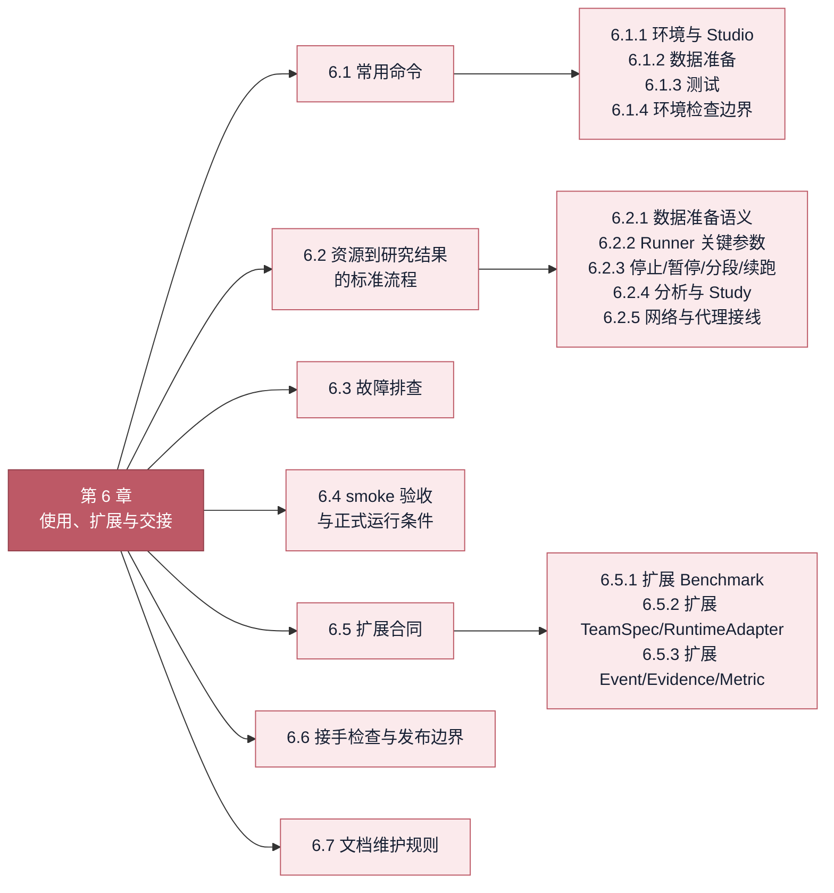
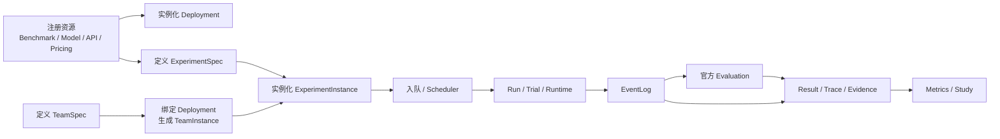

# 6. 使用、扩展与交接

[上一章：系统性评估研究方案](05-research-plan.md) · [返回总览](../EVAL_HANDOFF.md)

!!! abstract "本章回答什么"
    - 如何搭建环境、准备资源、启动 Studio、运行和续测实验？
    - 出现数据、部署、工具、网络、调度或评分问题时怎样定位？
    - 如何扩展 Benchmark、Team、Runtime、Event 和 Metric，并完成交接验收？

> **性质：当前合同。** 本章给出当前版本应遵循的操作和验收流程；具体运行批次和实时队列状态不在这里维护。

<!-- chapter-map:start -->
**第 6 章展开：运行、故障处理与扩展交接**


<!-- chapter-map:end -->

## 6.1 常用命令

### 6.1.1 环境与 Studio

首次按仓库 README 建立完整环境：

```bash
conda create -n LycheeMAS python=3.12 -y
conda activate LycheeMAS
uv venv .venv --python 3.12
source .venv/bin/activate
uv pip install -e ".[all]"
```

已有环境时直接启动：

```bash
cd /data/bk/LycheeMAS
source .venv/bin/activate
./serve_eval_studio.sh
```

不要在已有 CUDA 环境上随意追加 `--upgrade`，以免把可用的 torch/transformers/vLLM 替换成不匹配的轮子。只开发 Eval/Studio 时可以安装 `.[benchmark,studio]`，正式跨框架和本地推理验收以 README 的 `.[all]` 为准。

若服务监听服务器 `127.0.0.1:8010`，本机转发：

```bash
ssh -N -L 18010:127.0.0.1:8010 A800-31-files
```

浏览器访问 `http://127.0.0.1:18010/`。

### 6.1.2 数据准备

```bash
python scripts/prepare_benchmarks.py \
  --raw-root data/benchmarks/raw \
  --prepared-root data/benchmarks/prepared \
  --source auto \
  --all-full-benchmarks
```

### 6.1.3 测试

```bash
PYTHONPATH=src python -m ruff check src tests scripts
PYTHONPATH=src python -m pytest -q
npm --prefix apps/eval/web run build
```

`serve_eval_studio.sh` 的 `serve` 模式优先使用仓库 README 默认的 `.venv/bin/python`；通过
`LYCHEE_EVAL_PYTHON=/path/to/python` 可以显式选择其它环境。`build` 模式只运行 Web 构建，
不得为了生成静态文件而检查或修改 Python 环境。

测试按边界组织：

| 层级 | 代表文件 | 目的 |
|---|---|---|
| 纯策略单测 | `test_trial_admission.py`、`test_scheduler_pressure.py`、`test_scheduler_health.py` | 不启动服务即可验证准入和压力状态转移 |
| 注册表/目录合同 | `test_studio_catalog.py`、`test_studio_workspaces.py` | 验证缓存、去重和页面 payload 边界 |
| API/生命周期集成 | `test_eval_studio.py` | 验证真实 FastAPI、注册表、Job 和恢复流程 |
| 架构回归 | `test_eval_architecture.py` | 防止 I/O、FastAPI 和全量 bootstrap 回流到核心策略 |
| 前端静态验收 | TypeScript + Vite build | 验证类型、分包和产物构建 |

`test_eval_studio.py` 体积较大不代表里面的测试自动失效。新功能禁止继续无条件堆入该文件；修改某个旧领域时，将对应测试迁入领域文件，并保持迁移前后断言和总测试数可解释。

### 6.1.4 环境检查边界

默认环境以仓库 README 的 Python 3.12 `.venv` 安装方式为准。Studio 的环境检查验证 Python 可启动、核心包导入、Benchmark 注册、scorer、RuntimeAdapter 依赖，以及 AutoGen FileSurfer/WebSurfer/Magentic-One 所需 extras；浏览器检查会实际启动并关闭一次本机 Playwright Chromium，而不只检查 Python import。它不把“是否已有某个 Benchmark 数据”当成 Python 环境可用性的条件。Benchmark 数据、Docker 镜像、外部代理 endpoint、目标网站和 Deployment 分别在资源或实验预检中检查。

AutoGen 的完整 GAIA 工具链至少需要仓库 `pyproject.toml` 中 runtime/framework extras、`markitdown` 和与当前 Playwright Python 包匹配的 Chromium revision。仅存在旧 revision 缓存不算 ready。浏览器能启动也只证明本地 browser runtime 正常，不证明 Wikipedia、arXiv 或任意目标站在整个长实验期间持续可达。

Studio 不自动代装复杂环境，只生成与所选 profile 对应的安装/修补命令，避免半成功的 conda/uv/pip transaction 把环境状态弄得不可解释。环境、数据、模型、镜像、网络和模型服务是六种不同就绪条件，页面不得合成一个含义模糊的 `ready`。

## 6.2 从资源到研究结果的标准流程



推荐从 Studio 完成注册、实例化、排队和观察；CLI 是同一后端合同的可复现入口，不是另一条精简评测链。一个正式流程按以下顺序验收：

1. 环境和 Docker/网络预检；
2. Benchmark Raw 获取、完整性 manifest、Prepared 转换；
3. Model/API/Pricing 注册并实例化；
4. Deployment 最小调用和健康检查；
5. TeamSpec 校验、DeploymentInstance 绑定、BindingReport；
6. ExperimentSpec 定义全量范围，ExperimentInstance 设置执行段；
7. smoke 仅缩小 Case 范围，完成推理、官方评分、Event、Evidence、Metric 全链；
8. 同一配置扩展正式段，使用同一 Run/Instance 断点续跑；
9. 增量评分与运行并行，结束后执行幂等全量重评；
10. Study 只聚合明确列出的 Run/System，并保留失败分母。

### 6.2.1 数据准备语义

```text
data/benchmarks/raw/<benchmark>/<provider>/<owner--repo>/
data/benchmarks/prepared/<benchmark>/
```

Raw 保存下载渠道、发布者、原始文件和 manifest；Prepared 保存 loader-ready 数据。Prepared 被删除但 Raw manifest 完整时，使用 `--conversion-only` 重新转换，不重复下载。外部路径导入只登记真实路径，不复制、不创建 symlink；“解除引用”只删注册关系，“删除文件”才删除实际资产。

三个下载主渠道是 ModelScope、Hugging Face 和 GitHub；Benchmark 实现还可声明 `other_defaults()` 和 `fallback_specs()`。`auto` 只尝试经过该 Benchmark 明确注册且有对应 converter/validator 的来源，不盲猜同名仓库。不同来源即使名称相同，也必须分别经过来源适配和统一 Prepared 校验。

`prepare_benchmarks.py` 的主要参数：

| 参数 | 含义 |
|---|---|
| `--tasks` | 一个或多个 Prepare target/alias；不是 Runnable task 列表 |
| `--all-full-benchmarks` | 每个 Benchmark 选择一个完整/canonical target |
| `--raw-root` / `--prepared-root` | 本次命令覆盖 Raw/Prepared 根目录 |
| `--source auto\|modelscope\|huggingface\|github` | 下载渠道；auto 使用 Benchmark 自己的来源顺序 |
| `--force` | 重新下载目标；正常情况下 manifest 完整则复用 |
| `--conversion-only` | 仅从已有 Raw 或外部路径生成 Prepared，禁止联网 |
| `--manifest-hash-mode full\|metadata` | 用 SHA-256 或 size/mtime 记录完整性 |
| `--verify-manifests` | 只校验已存在 manifest，不下载 |
| `--docker-images auto\|always\|never` | 为目标 Benchmark 准备所需镜像 |
| `--force-docker-images` | 强制重建已存在镜像 |
| `--list-benchmark-sources` | 列 Benchmark 实现 ID |
| `--list-prepare-targets` | 列 `--tasks` 可接受的所有名字 |
| `--list-runnable-tasks` | 列 `run_mas.py --task` 可运行 task |
| `--list-benchmark-structure` | 展示 Benchmark → prepare target → runnable task → scorer 的逐行对应 |
| `--list-download-sources` | 展示三平台、其它默认与 fallback 来源 |

### 6.2.2 Runner 关键参数

Studio 会把下列设置写入 Experiment/Team/Deployment 快照并生成命令；手工 CLI 以 `scripts/run_mas.py --help` 为准。

| 层级 | 参数 | 精确含义 |
|---|---|---|
| 框架/任务 | `--runtime` | `autogen/langgraph/crewai` RuntimeAdapter |
| 框架/任务 | `--task` | Runnable task/loader ID |
| 团队 | `--team-spec`、`--deployment-config` | TeamInstance 与 Deployment 快照，不是只写团队名 |
| 通信实验 | `--method` | `none/nl_only/latent_only/both`；属于团队通信消融，不是 Benchmark 类型 |
| Case | `--n` | Case 数；`all/0` 表示 loader 全量 |
| Case | `--start-index`、`--case-selection`、`--case-strata-field` | head/uniform/stratified 抽样及分层字段 |
| Trial | `--trials-per-case` | 每个 Case 的独立 Trial 数 K；不是失败重试次数 |
| Trial | `--max-attempts-per-trial` | 同一 Trial 的基础设施 Attempt 总数 |
| Trial | `--on-trial-error` | 全部 Attempt 失败后继续其它 Trial或 fail-fast |
| 团队 | `--max-turns` | GroupChat 最大发言步数，可提前因完成条件停止 |
| 团队 | `--max-rounds` | 团队外层/完整轮次限制；固定团队可与 member 数联合约束 turn |
| Trial | `--max-model-calls-per-case` | 一个 Trial 所有 Node 的真实模型调用总上限，或 `unlimited` |
| 模型调用 | `--max-new-tokens` | 每次调用的配置输出上限，不代表一定生成满 |
| 模型调用 | `--max-input-tokens`、三种 reserve、safety margin | 上下文预算与 thinking/final 自适应平衡 |
| 采样 | `--do-sample`、temperature/top-p/top-k/min-p/penalty/seed | 真实生成策略；pass@K 通常需要采样 |
| 工具 | executor/image/timeout/work root/network proxy | 代码、文件、网页和容器环境 |
| 观测 | trace、vLLM metrics、EventLog 分片阈值 | 不改变模型语义，只控制控制台和服务遥测 |
| 输出 | `--runs-root` / `--run-dir` | 根目录或本次 Run 精确目录；Studio 优先使用精确目录 |
| 续跑 | `--resume` | 追加同一 EventLog，保留成功 Trial，重跑缺失/失败项 |
| 分段 | `--segment-case-limit` | 本次额外接纳多少个尚未完成 Case，不改变 ExperimentSpec 全量范围 |
| 并发 | `--trial-concurrency`、fixed/auto 参数 | 同一 runner 内 Trial 并发；与 vLLM 的 `max_num_seqs` 不同 |

一个 Trial 是一个 `(case_id, trial_index)` 工作单元。Case concurrency/Trial concurrency 为 1 只表示 runner 同时推进一个 Trial；一个多 Agent Trial 内仍会发生多次模型和工具调用，vLLM 的 GPU batch 还可能同时承载其它 ExperimentInstance 的请求。

### 6.2.3 停止、暂停、分段与续跑

- **优雅停止/draining**：停止接纳新 Trial，等待已启动 Trial terminal，再写 `run.stopped`；
- **暂停/paused**：达到本执行段 Case 数后写 `run.paused`，同一 Instance 以后可继续入队；
- **强制停止**：先发 `SIGTERM` 让 Runtime 进入 `finally` 清理浏览器、Docker 和工作区，超时后才升级 `SIGKILL`；
- **resume**：读取全部 Event 分片，为上次未闭合 Trial 写 `trial.interrupted`，跳过成功 Trial，重试失败或缺失 Trial；
- **下一执行段**：表示额外完成多少尚未完成 Case；在 draining 状态设置后，当前活动 Trial 收口，再执行新增段；
- **累计完成上限**：约束一个 ExperimentInstance 最多累计完成多少 Case，不把 smoke 建成另一套不可续跑实验。

`config_snapshot/` 在 Run 启动时就保存本次解析后的所有 Spec/Instance 与运行配置；不是等正常结束才写。即使中途停止，EventLog 和快照仍允许评分已经 terminal 的 Trial。`watch_benchmark_evaluation.py` 在运行中只增量消费新增 terminal Trial；结束后 `analyze_benchmark_run.py` 再做幂等全量核对。

当前 Run control protocol 为 v2；drain 能力按 `control_protocol_version >= 1` 判断，不能把新版协议误判为旧 Run。强制停止完成后，Scheduling Application Service 不自行解释 Run 状态，而是调用 Experiment Finalizer 的窄生命周期投影接口，从 Job 与 `run_status.json` 同步 `status/job_status/run_status`，并把离线评测标记为 `pending`。这样网页卡片、注册表和 Run 自有状态不会出现 `ExperimentInstance=stopped`、`run_status=running` 的分叉。

每次 resume 前，活动位置的旧 `run_finalization.json` 会原子移动到
`run_finalization_history/segment_<index>.json`。ExperimentInstance 同时重置为
`run_status=starting`、`evaluation_status=pending` 并清除旧 finalization 时间，防止网页在新执行段运行时继续展示上一段的 `paused/completed` 与旧评分结果。历史 receipt 不删除，仍可审计每个执行段。

### 6.2.4 分析与 Study

```bash
python scripts/analyze_benchmark_run.py --run-dir <run_dir>
```

常用分析选项：`--incremental` 只评尚无匹配 Evaluation、上次 Evaluation 失败或对应 Trial 已被新事件替换的成功/失败 Trial；`--no-write` 只计算不写 Event/产物；`--contamination-audit auto|on|off` 控制 GAIA 污染审计；`--external-evaluator auto|run|skip` 控制 HLE/SWE 官方外部 harness；`--evaluation-profile` 选择指标集合；skip 选项只用于诊断分析层，不可用于正式验收。

HLE/HLE-Verified 的 Judge 还会在 `<run_dir>/official_evaluation/` 下维护两个 JSONL：`hle_judge_responses.jsonl` 是按完整 Judge 请求 SHA-256 指纹索引的成功结果 cache，指纹覆盖 Case、Trial、模型、端点、thinking/output mode、输出上限和包含 Prediction 的完整 Prompt；任一项改变都不会误用旧评分。`hle_judge_attempts.jsonl` 无损记录每次实际尝试的 `output_text`、`reasoning_content`、`finish_reason`、解析错误、有效性、`prompt_variant`、`field_coercions` 和同一请求指纹。后者用于诊断长度截断、结构化输出和本地标量归一化，不能作为最终评分结果读取。某个请求耗尽重试后只给对应 Trial 写 `hle_judge_error/evaluation.failed`，不会中断其它 Trial 的评分；其余 Trial 的部分指标仍会物化，并用 `benchmark_evaluation_coverage` 与 `benchmark_evaluation_failed_trials` 显式声明覆盖缺口。正式报告必须同时披露 Judge 模型、`thinking_mode` 与 `output_mode`；本地 `local_json_object` 结果不得标记为官方 o3-mini Judge 成绩。

若模型推理已经 terminal，但评分器、Judge 或后处理代码后来修复，不应重新消耗整批推理资源。使用实例级重新评测入口：

```bash
python scripts/reanalyze_experiment_instances.py \
  <experiment_instance_id> [<experiment_instance_id> ...]
```

该命令只接受非活动 ExperimentInstance，复用该次 Launch 冻结的 `analyze.sh` 和 Run EventLog，重新生成 Evaluation Event、Evidence、Metric 与最终收据，然后把 ExperimentInstance 生命周期同步到新事实。成功时旧 `job.json` 先归档到 `job_history/before_reanalysis_<timestamp>.json`，再把原先由后处理失败造成的 Job 失败状态标记为已修复；完整输出写入 `reanalysis.log`。如果 Run 本身存在模型、工具或超时失败，它们仍按失败 Trial 保留，不能被重新评测伪装成成功。

跨 Run Study：

```bash
python scripts/aggregate_benchmark_study.py \
  --study-id <study_id> \
  --run <system_id>=<run_dir> \
  --run <system_id>=<run_dir> \
  --output-dir <study_dir>
```

输出逐 Trial、逐 Run、逐 System 和 pairwise 长表，以及 bootstrap CI 与 flip。`--bootstrap-samples` 是统计重采样次数，不是 Trial 数。

### 6.2.5 Run 过程与评分审计

Run 验收不能只读 `metrics.json` 的最终分数。至少按下面顺序审计：

0. **日志存在性**：Run 路径必须存在且至少包含一个可解析 RunEvent；空目录、错误路径和缺失事件分片直接判为 invalid，不能按“零问题”验收。
1. **Trial 生命周期**：每个计划内 `(case_id, trial_index)` 恰有一个最新 terminal Trial；started/completed/failed/interrupted 数量、失败类型和正式分母一致。
2. **操作配对**：逐 `operation_id` 检查 model/tool/browser/code executor 的 start 与 terminal Event；成对 Event 的 Case、Trial、Attempt 和 Worker 必须一致。
3. **终态边界**：Trial terminal 后不应再出现归属于该 Trial 的新操作；允许的只有明确标记为离线分析或 Evaluation 的事件。
4. **结果合同**：Prediction 来源 Node、输出类型、格式与 Benchmark-aware ResultContract 一致；不能从 thought、工具日志或未批准角色误提取答案。
5. **评分输入**：官方 checker/Judge 实际收到的 Prediction、gold、schema、版本和配置可追溯；Judge invalid output 的重试不改变 Prediction。
6. **评分覆盖**：对每个计划内 Trial 取最新 Evaluation，分别报告 runtime terminal coverage、scorer terminal coverage 与 official score；历史失败 Event 不覆盖后续成功重评。
7. **成本与过程指标**：只有以上不变量通过后，才聚合 token、延迟、工具错误、协调操作、成本和跨框架过程指标。发生事件串案的旧 Run 即使最终答案可评分，也不得用于这些聚合比较。

共享并发环境下，单看 start/end 数量相等仍不够：一个迟到线程可能把完整的一组新操作都写进下一 Trial。审计还应检查 `model_call.started` 与 matching terminal Event 的 Trial 身份、Trial terminal 后事件尾部、同一 worker 的相邻 Trial 时间重叠，以及 provider timeout 是否被 Trial deadline 截断。

AutoGen 还需特别检查清理边界：GroupChat 已完成不代表 Runtime 已完成；Agent、浏览器和代码执行器清理仍属于 Runtime 生命周期。若旧 Run 在这一阶段撞上 Trial deadline，可能看到 `group_chat.completed` 和 `trial.failed`，但缺少 `runtime.cancelled`。该历史 Trial 的最终超时口径可保留，Runtime 过程完整性必须标为 incomplete，不能事后伪造 terminal Event。

### 6.2.6 网络与代理接线

Eval 只使用代理，不负责安装、启动或管理服务器上的代理服务。Experiment 的 `network.targets` 明确同一个代理入口接到哪些消费者：

| Target | 实际接线 |
|---|---|
| `downloads` | prepare/run 子进程的 `HTTP_PROXY/HTTPS_PROXY/NO_PROXY`，用于 Git/HF 等下载 |
| `web_surfer` | 显式传给 Playwright/WebSurfer |
| `code_executor` | 通过宿主 Docker bridge relay 传入容器 |
| `model_backend` | 只传给远程 API/vLLM client；本机 endpoint 应由 `NO_PROXY` 直连 |

`mode=proxy` 在启动前做基础代理 probe，但 probe 成功不代表每个目标网站都可用。网页导航、截图、字体等待、DNS、站点封禁和 proxy reset 仍分别记录为 Web/Tool Event。SWE-bench 运行时的 case-local 仓库补取属于 downloads，不能假定 prepare 已完全物化所有仓库。

## 6.3 故障排查

先从状态到事实再到外部系统排查：

```text
run_status.json
  -> console_log.txt / launch.log
  -> Result Projection
  -> Execution Trace
  -> EventLog
  -> provider / vLLM / Docker / browser log
  -> Evidence / MetricObservation / Study
```

| 现象 | 先检查 | 正确处理 |
|---|---|---|
| Raw 有、Prepared 无 | manifest、source、converter | `--conversion-only`，不重复下载 |
| provider lock 等待 | 是否存在真实下载进程 | 等待；仅在确认 stale 后清理 lock |
| Docker 尝试公网 pull | image tag、prepare 记录、本地 images | 用 prepare 构建并验证正确本地镜像 |
| SWE-bench 跑久后根分区占满 | `docker system df`、Docker root、`runs/eval_studio/docker_cache/swe_bench_verified.json` | 保持默认 bounded cache；只清理 manifest 已登记的任务镜像，禁止共享服务器全局 `docker image prune` |
| WebSurfer 超时 | proxy、DNS、Playwright、目标站、browser Event | 分开归因 network/browser/site，不笼统记模型失败 |
| API `auth_required` | APIInstance credential reference | 配置环境变量或受控凭据；密钥不进入 Git/Event |
| Deployment `unreachable`/`starting` | endpoint、PID、launch log、最小 probe | probe 成功才转 running；周期健康检查可刷新陈旧状态 |
| 页面重开后丢进度 | job/instance/run status/EventLog | 从后端持久状态恢复，不依赖 React 内存 |
| 大量 API timeout | queue、TTFT、生成速度、requested output | 使用自适应 timeout，并检查服务饱和与异常长输出 |
| score 为空 | 是否只有 Trial terminal、无 Evaluation | 启动 watcher 或离线 analyze |
| Run 中途停止 | EventLog、快照、配置指纹 | 同一 Run 目录 `--resume` |
| 正确率异常低 | scorer、抽样、工具错误、输出截断、失败分母 | 先验证流程合同，再讨论模型能力 |
| 指标显示空 | Observation 状态 | 区分 N/A、missing、unsupported、evaluator error，不补 0 |

模型答错、工具失败、网络失败、scorer 失败和基础设施失败必须分开。某个 Trial 能正常 terminal 只说明运行链路完成，不等于 official score 正确；反过来，模型答错也不等于 Runtime 不可用。

SWE-bench 官方评分支持以下镜像缓存参数；smoke 与正式实验应使用相同缓存策略，区别仍只在 Trial 数量：

| 参数 | 默认值 | 含义 |
|---|---:|---|
| `--swebench-image-cache-mode` | `bounded` | `bounded`、`keep` 或 `remove_after_use` |
| `--swebench-image-cache-max-images` | `24` | bounded 模式最多保留的已管理任务镜像数 |
| `--swebench-image-cache-min-free-gib` | `12` | 低于该可用空间时触发磁盘水位回收 |
| `--swebench-image-cache-target-free-gib` | `20` | 触发后希望恢复到的可用空间 |

每个官方评分分批会写入 `docker_image_cache.<run_id>.json`，记录该批 lease、受保护镜像和前后两次回收报告；`aggregate.<run_id>.json` 汇总所有分批的 resolved/error 集合；全局 manifest 负责跨 Run 的 LRU 状态。删除任一报告文件都不会删除镜像本身，但删除全局 manifest 会丢失项目所有权证据，系统不会在没有证据时猜测并删除已有镜像。

## 6.4 smoke 验收与正式运行条件

门禁按当次研究计划的矩阵定义执行，不把某一批次的组合数量写成永久系统常量。矩阵、抽样和优先级属于 Experiment 配置；系统验收规则不依赖某个历史 `matrix_id`。

每个组合 smoke 通过条件：

1. BenchmarkInstance 和 TeamInstance 为 current/ready。
2. 对应原生框架对象成功构造。
3. 模型、工具、沙盒和网络按正式配置启动。
4. 每个 Trial 有开始和终止事件；错误 Trial 有明确异常事件。
5. Prediction 和官方 Evaluation 能关联。
6. Execution Trace、Result Projection 和 Evidence 可从 EventLog 生成。
7. 四类指标区分 measured、N/A、missing 和 error。
8. 续跑不重复已完成 Trial；分片 EventLog 顺序连续。
9. framework semantic delta 写入 BindingReport。
10. smoke 与正式配置的差异只有 case selection/数量。
11. `result_contract_valid` 可测；Text/Action/Patch collector 与对应 benchmark 类型一致。
12. ExperimentSpec 同时设置有限 `max_model_calls_per_case` 和 `max_case_wall_time_s`。

smoke 全部通过后：

- 创建 `cases=all` ExperimentSpec/Instance，并由研究计划决定首个执行段的 Case 数。
- 每个 Instance 直接使用全量累计 Case 目标；ExperimentSpec 与 smoke 的模型、工具、超时、团队、评分和观测合同完全相同。
- 优先级按 Benchmark 和团队实验设计显式写入实例，不由框架名称或运行时猜测。
- 入队并启动 Scheduler。
- 启动后不需要在本交付任务中等待全量完成；保留用户后续查看和分析。

验证器必须确认每个 smoke Trial 都有成功 Runtime、正式 Evaluation 和有效 ResultContract，并汇总真实 `failed_trials`，不能用“完成数减成功数”间接猜测失败。是否复用已完成 Trial 只由同一 ExperimentInstance 的 EventLog 断点状态决定，不能凭目录同名推断；网络预检成功也不能替代每次网页工具事件的错误记录。

## 6.5 扩展合同

### 6.5.1 扩展一个 Benchmark

1. 在 `src/lychee_mas/eval/benchmarks/<name>.py` 实现 `Benchmark`；
2. 声明基本描述、三平台来源、other/fallback、prepare target、Runnable task、scorer kind 和能力；
3. 为每个真实来源实现 Raw 获取、manifest 和来源适配，转换成统一 Prepared；
4. `load()` 返回统一 `BenchmarkCase`，不能把评分规则塞进 loader；
5. `score()` 调用官方逻辑或等价的 Benchmark-owned evaluator；
6. 有附件/工具时实现 workspace hook；有 judge/harness 时实现 evaluation preparation；
7. 注册后补 descriptor、prepare、load、score、Event/Evidence 和 smoke 测试；
8. smoke 与正式测试共享同一工具、沙盒和 scorer。

```bash
python scripts/prepare_benchmarks.py --list-benchmark-structure
python scripts/prepare_benchmarks.py --tasks <prepare_target> --source auto
PYTHONPATH=src python -m pytest -q tests/test_eval_benchmark_extensions.py
PYTHONPATH=src python -m ruff check src/lychee_mas/eval scripts/prepare_benchmarks.py scripts/analyze_benchmark_run.py
```

不要重新引入独立 `source_catalog.py/json` 作为第二事实源。Benchmark 的来源、转换、任务、scorer 和 descriptor 应由同一实现合同导出；BenchmarkSpec 只保留稳定身份、名称、类别等轻量注册信息，Studio 可以只读展示实现合同的丰富描述。

### 6.5.2 扩展 TeamSpec 或 RuntimeAdapter

新增团队能力时先判断它属于 Node、Relation、Coordination、Policy 还是 Completion；只有现有七个顶层职责无法表达且确有跨团队复用价值时，才扩 TeamSpec schema。新增字段必须同时完成：严格 validator、JSON round-trip、Studio 编辑/只读呈现、Spec 指纹、运行快照和至少一个 RuntimeAdapter 合同测试。

接入新框架时实现 RuntimeAdapter，而不是把框架条件分支散落到 Runner、Benchmark 或 TeamSpec：

1. 校验该框架能支持哪些 Node execution kind、Function、Relation type 与 contract 字段；
2. 将 TeamSpec + TeamDeploymentBindings 编译成框架原生对象；
3. 返回 `exact/composed/approximated/unsupported` BindingReport；
4. 由框架原生 lifecycle 运行团队，LycheeMAS 只负责统一输入、Event、停止和结果合同；
5. 把框架消息、模型、工具和错误映射为 RunEvent，同时保留原生 payload/provenance；
6. 用同一个逻辑 TeamSpec 做合同 smoke，并明确哪些组合不具备严格受控比较资格。

不能为了“支持更多框架”而在 LycheeMAS 内重写一个看似相同的群聊循环。框架原生行为无法表达某项语义时，应报告 delta 或拒绝实例化。

### 6.5.3 扩展 Event、Evidence 或 Metric

新增 Event type 前先确认它是新的不可变事实，而不是已有 Event 的展示字段。一个可配对 Operation 必须有 started 和 terminal（completed/failed/cancelled）语义，并沿用公共包络、`operation_id` 和因果父链；同时补 Event registry、序列化、分片、resume 和投影测试。

新增 Evidence type 时只做确定性规范化，保留来源 `event_id/seq`，不在 normalizer 中调用 Judge 或写研究结论。新增 Metric 时先登记 5.4 的完整 Metric Contract，再实现 evaluator；无所需 Evidence 时返回 `missing_evidence`，系统结构不适用时返回 `not_applicable`，不能用 0 代替。需要 LLM Judge 的指标还必须完成 5.7 的人工校准、冻结和有效性门槛，才能进入正式 Evaluation Profile。

## 6.6 接手检查与发布边界

关键入口：

| 文件/目录 | 作用 |
|---|---|
| `src/lychee_mas/eval/benchmarks/` | Benchmark 合同、来源、转换、loader 和 scorer |
| `src/lychee_mas/eval/teams/contracts.py` | TeamSpec v14 的 Node、Relation、SharedState、Lifecycle schema 与严格校验 |
| `src/lychee_mas/runtime/coordination/compiler.py` | 从 Node/Relation 生成框架无关 IR、三个 adapter 本地计划、消息策略与支持报告 |
| `src/lychee_mas/runtime/adapters/` | 三个 RuntimeAdapter 与模型 backend |
| `src/lychee_mas/runtime/events/store.py` | RunEvent 注册、包络、分片写入与读取 |
| `src/lychee_mas/eval/evaluation/projections.py` | Result Projection 与 Execution Trace |
| `src/lychee_mas/eval/evaluation/evidence/` | Evidence 与 coverage |
| `src/lychee_mas/eval/evaluation/metrics_registry/`、`evaluators/` | Metric Contract、applicability 和 Observation |
| `src/lychee_mas/eval/evaluation/studies/` | 跨 Run 聚合 |
| `src/lychee_mas/eval/application/` | Web、未来 TUI/CLI 共用的 command/query 用例编排 |
| `src/lychee_mas/eval/interfaces/http/` | FastAPI Router、HTTP 参数和错误翻译 |
| `src/lychee_mas/eval/scheduling/` | Admission、pressure、runner state、projection、RunSupervisor 和队列编排 |
| `src/lychee_mas/eval/experiments/registry.py`、`lifecycle.py` | ExperimentSpec/Instance 注册、终态收口与恢复 |
| `src/lychee_mas/eval/application/read_models/workspace_catalog.py` | 页面级只读投影 |
| `apps/eval/server/` | Eval HTTP Server 的启动与依赖装配组合根 |
| `apps/eval/web/` | Eval Studio React Web 客户端 |
| `scripts/run_mas.py` | 正式 Runner CLI/进程组合入口；Run/Trial 实现在 `src/lychee_mas/eval/runner/` |

最小发布验收：

```bash
python scripts/prepare_benchmarks.py --list-benchmark-structure
make selfcheck
make test
make lint
DISABLE_MKDOCS_2_WARNING=true mkdocs build --strict
./serve_eval_studio.sh build
```

真实发布前至少验证：纯文本 Benchmark、Docker 代码 Benchmark、网页/文件工具 Benchmark、一次优雅停止与 resume、一次离线 rescore、一次成本快照、一个跨框架 BindingReport，以及 EventLog 到投影、Evidence、MetricObservation 和 Study 的完整链。

提交不得包含 API key、SSH key、代理订阅、个人路径、`data/`、`models/`、`runs/`、workspace、provider cache 或与 Eval 无关的个人研究文档。遇到文档与代码不一致时，按“公共 dataclass/validator → Registry → CLI `--help` → 测试 → 本手册”的顺序判断，并在修复代码后同步本手册。

## 6.7 文档维护规则

- `docs/EVAL_HANDOFF.md` 总览与 `docs/eval_handoff/` 六章正文共同组成 Eval 的唯一主手册；不再维护 public/private 两个版本或平行 topology/research 说明。
- 当前事实、历史实验事实、研究假设和后续计划必须使用不同措辞。
- 完成的子项写入所属模块的“当前状态”，跨模块长程任务与技术债保留在 1.4，研究路线保留在 5.11；不要在多个章节维护重复待办。
- 外部论文或官网数据必须保留来源和检索/版本日期；未披露参数明确写“未知”，不补成猜测。
- exhaustive schema、事件字段、指标公式和命令参数放在所属章节，不另建附录。
- 大重构先更新依赖方向与合同，再改实现和测试，最后更新本手册与 Studio 文案。
- 总览只维护全局导图和分章入口，详细导图放在对应章节开头；修改章节结构时应同步更新两处导航。
